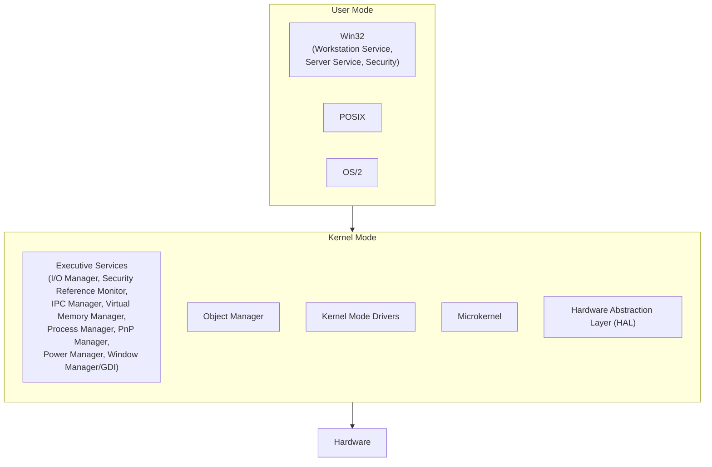
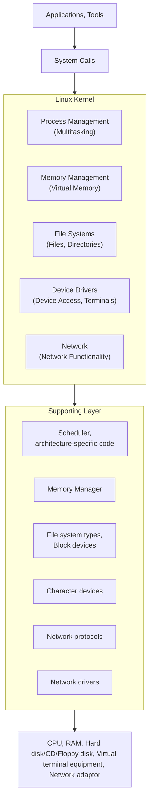

# Appendix A: Ethical Hacking Essential Concepts – I
## Part 1 — Operating System Concepts

[Back to README](README.md) | [Next: File Systems →](02-file-systems.md)

---

## Table of Contents

1. [Why This Appendix Exists](#why-this-appendix-exists)
2. [Windows Operating System](#windows-operating-system)
3. [UNIX Operating System](#unix-operating-system)
4. [Linux Operating System](#linux-operating-system)
5. [macOS](#macos)
6. [Quick-Reference Summary](#quick-reference-summary)

---

## Why This Appendix Exists

Appendix A is a foundations refresher — a step back from attack techniques to make sure the underlying computing concepts (operating systems, file systems, networking, virtualization, web technologies, databases) are solid before building further offensive and defensive skills on top of them. Every later module assumes fluency with the material covered here.

---

## Windows Operating System

Windows is developed by Microsoft and is the most widely deployed OS across both private and government organizations.

### Windows OS Family Tree

Windows traces two parallel lineages — the original MS-DOS-based line and the NT-kernel-based line that eventually absorbed it:

| MS-DOS-Based / 9x Windows | NT-Kernel PC Versions | NT-Kernel Server Versions |
|---|---|---|
| MS-DOS 1.0 | Windows NT 3.1 | Windows Server 2003 |
| MS-DOS 2.0 | Windows NT 3.51 | Windows Server 2003 R2 |
| MS-DOS 2.1x | Windows NT 4.0 | Windows Server 2006, Windows Home Server |
| MS-DOS 3.0 | Windows 2000 | Windows Server 2008 |
| MS-DOS 3.1x | Windows XP | Windows Server 2008 R2 |
| Windows 95 | Windows XP Professional x64 Edition | Windows Server 2012 |
| Windows 98 | Vista | Windows Server 2012 R2 |
| Windows 98 SE | Windows 7 | Windows Server 2016 |
| Windows ME | Windows 8 | Windows Server 2019 |
| | Windows 8.1 | Windows Server 2022 |
| | Windows 10 | |
| | Windows 11 | |

### Windows Architecture

Windows processors operate in **two distinct modes**:

- **User Mode** — a collection of sub-systems (Win32, POSIX, OS/2) with **limited access to resources**. Applications run here, isolated from direct hardware/system access.
- **Kernel Mode** — includes the HAL, kernel, and Executive Services, with **unrestricted access to system memory and external devices**. This is where Executive Services (I/O, security, IPC, virtual memory, process, plug-and-play, power, and window managers), the Object Manager, kernel-mode drivers, and the microkernel all sit, on top of the Hardware Abstraction Layer.

### Common Windows Commands

| Command | Meaning |
|---|---|
| `dir` | Displays a directory's file list and subdirectories |
| `format` | Formats the disk |
| `help` | Provides online information about system commands |

*(This is a small representative sample — Windows ships with a large built-in command set covering file operations, networking, system diagnostics, and more.)*

---

## UNIX Operating System

UNIX is built from **three main components**:

1. **Kernel** — the core of the OS that manages hardware resources, process scheduling, memory, and I/O.
2. **Shell** — the command interpreter that sits between the user and the kernel, taking input and returning kernel output.
3. **Programs (Utilities/Applications)** — the tools and applications that run on top of the shell and kernel.

### UNIX Directory Structure

UNIX organizes the filesystem as a single-rooted hierarchical tree, with standard top-level directories (`/bin`, `/etc`, `/dev`, `/usr`, `/home`, `/var`, and so on) each serving a defined purpose — a structure later formalized industry-wide as the [Filesystem Hierarchy Standard (FHS)](02-file-systems.md#the-filesystem-hierarchy-standard-fhs).

### UNIX Commands

UNIX provides a large built-in command set for file management, process control, text processing, and system administration — the direct ancestor of the command sets used in Linux and macOS today.

---

## Linux Operating System

Linux is an **open source** operating system widely used across enterprises and government bodies.

### Components of Linux OS

- **Hardware** — the physical devices: monitor, RAM, HDD, CPU.
- **Kernel** — the core component of the OS with complete control over system resources.
- **Shell** — an interface that takes input from users, sends it to the kernel, and returns the kernel's output.
- **Applications/Utilities** — programs that can be launched by running the shell; utilities provide most of the functionality an OS offers a user.
- **System Libraries** — special functions that don't require direct access rights to kernel modules to implement OS functionality.
- **Daemons** — background services that run to perform tasks like printing or scheduling.
- **Graphical Server** — the sub-system responsible for displaying graphics on the monitor, referred to as **X**.

### Linux System Architecture

### Linux Features

| Feature | Description |
|---|---|
| **Portability** | Linux kernel and applications can be installed on different hardware platforms |
| **Open Source** | Source code is available for free and is a community-based development project |
| **Multiuser** | Multiple users can access resources like RAM or memory at the same time |
| **Multiprogramming** | Multiple applications and programs can run at the same time |
| **Hierarchical File System** | Linux uses a standard hierarchical file structure for arranging user and system files |
| **Shell** | A special interpreter program used to execute programs or applications |
| **Security** | Provides security features like authentication, controlled access to files using passwords, and data encryption |

---

## macOS

macOS is Apple's operating system, built on a layered architecture:

- **Cocoa** — the application layer, providing the frameworks used to build macOS applications.
- **Media** — the graphics, audio, and video frameworks.
- **Core Services** — fundamental system services that applications rely on.
- **Kernel and Device Drivers Layer** — the lowest layer, managing hardware and core OS functions (built on the XNU kernel, a hybrid of Mach and BSD components).

### macOS File Systems

| File System | Description |
|---|---|
| **Hierarchical File System (HFS)** | Developed by Apple Computer to support the Mac operating system |
| **HFS Plus (HFS+)** | The successor to HFS; used as the **primary file system** in Macintosh systems for many years |
| **UNIX File System (UFS)** | Derived from the Berkeley Fast File System (FFS), originally developed at Bell Labs from the first version of UNIX FS. All BSD UNIX derivatives (FreeBSD, NetBSD, OpenBSD, NeXTStep) use a variant of UFS. Acts as a substitute for HFS in macOS |

---

## Quick-Reference Summary

- **Windows**: two parallel lineages (MS-DOS/9x vs. NT-kernel) converging into the modern NT line; runs in **User Mode** (limited access) and **Kernel Mode** (full system access, via the HAL/kernel/Executive Services)
- **UNIX**: 3 core components — Kernel, Shell, Programs — with a single-rooted hierarchical directory structure
- **Linux**: open-source, built from Hardware → Kernel → Shell → Applications/Utilities → System Libraries → Daemons → Graphical Server (X); defined by 7 key features (portability, open source, multiuser, multiprogramming, hierarchical FS, shell, security)
- **macOS**: 4-layer architecture (Cocoa → Media → Core Services → Kernel/Device Drivers); historically used **HFS/HFS+**, with **UFS** available as a BSD-derived alternative

---

*Part of the CEH Appendix A study series — continues in [Part 2: File Systems](02-file-systems.md).*
