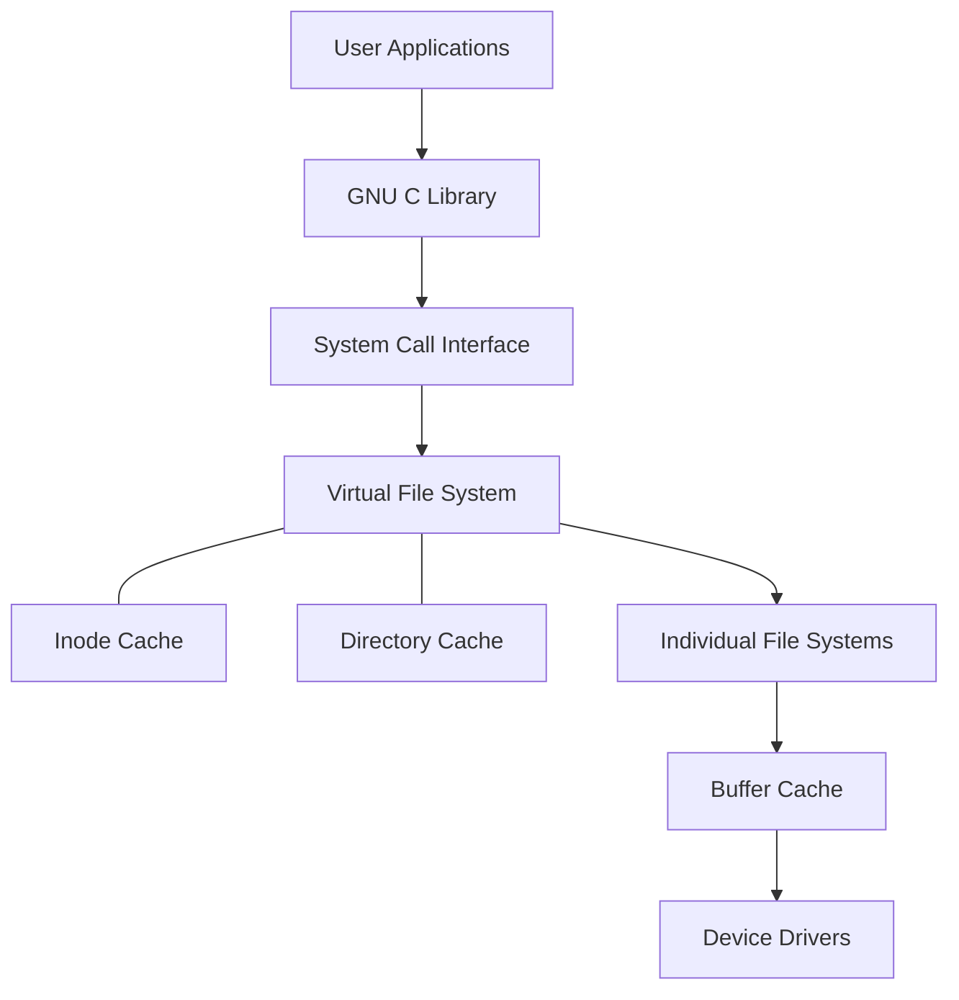

# Appendix A: Ethical Hacking Essential Concepts – I
## Part 2 — File Systems

[← Back to Part 1: Operating System Concepts](01-operating-system-concepts.md) | [Next: Computer Network Fundamentals (Part 1) →](03-network-fundamentals-part1.md)

---

## Table of Contents

1. [Understanding File Systems](#understanding-file-systems)
2. [Types of File Systems](#types-of-file-systems)
3. [Windows File Systems](#windows-file-systems)
4. [Linux File Systems](#linux-file-systems)
5. [The Filesystem Hierarchy Standard (FHS)](#the-filesystem-hierarchy-standard-fhs)
6. [macOS File Systems](#macos-file-systems-recap)
7. [Quick-Reference Summary](#quick-reference-summary)

---

## Understanding File Systems

A **file system** defines how data is stored, organized, named, and retrieved on a storage device. Every operating system relies on one (or several) file systems to manage how files and directories are physically laid out on disk, and different file systems trade off differently on performance, reliability, maximum size limits, and metadata support.

---

## Types of File Systems

| Type | Description |
|---|---|
| **Shared Disk File Systems** | A number of systems (servers) can access the same external disk subsystem |
| **Disk File Systems** | Designed for storing and recovering files on a storage device, usually a hard disk |
| **Network File Systems** | Created to access files on other computers connected by a network (see [Part 6: NFS](06-nfs.md)) |
| **Database File Systems** | Files are identified by their characteristics — type, topic, author, or similar metadata — rather than (or in addition to) hierarchical structure |
| **Flash File Systems** | Designed for storing and recovering files on flash memory devices |
| **Tape File Systems** | Designed for storing and recovering files on tape, in a self-describing form |
| **Special Purpose File Systems** | Files are arranged dynamically by software, intended for purposes like inter-process communication or temporary file space |

---

## Windows File Systems

### File Allocation Table (FAT)

FAT was the first file system used with the Windows OS, named for its method of organization — the **File Allocation Table** — placed at the beginning of the volume. FAT comes in three versions differing in the size of table entries:

| System | Bytes Per Cluster (in FAT) | Cluster Limit |
|---|---|---|
| **FAT12** | 1.5 | Fewer than 4,087 clusters |
| **FAT16** | 2 | Between 4,087 and 65,526 clusters, inclusive |
| **FAT32** | 4 | Between 65,526 and 268,435,456 clusters, inclusive |

### FAT32

FAT32 is derived from FAT and supports drives up to **2 terabytes** in size. It uses drive space efficiently via small clusters, and creates backups of the file allocation table instead of relying on the default copy.

**MBR Table of FAT32:**

| Offset | Description | Size |
|---|---|---|
| `000h` | Executable code (boots computer) | 446 bytes |
| `1BEh` | 1st position entry | 16 bytes |
| `1CEh` | 2nd position entry | 16 bytes |
| `1DEh` | 3rd position entry | 16 bytes |
| `1EEh` | 4th position entry | 16 bytes |
| `1FEh` | Boot record signature | 2 bytes |

### New Technology File System (NTFS)

NTFS is the **standard file system of Windows NT** and its descendants — Windows XP, Vista, 7, 8.1, 10, 11, and every Windows Server release from 2003 through 2022. It's been the default file system of the Windows NT family since Windows NT 3.1. NTFS improves on FAT with enhanced **metadata support**, advanced data structures for better performance/reliability/disk utilization, security access control lists, and file system journaling.

### Sparse Files (NTFS)

**Sparse files** save disk space by allowing the I/O subsystem to allocate disk clusters only for the *meaningful* (nonzero) data in a file — the non-defined data is represented as non-allocated space on disk rather than physically written out. If an NTFS file is marked sparse, a hard disk cluster is only assigned for the data actually defined by the application; e.g., a file with 10 GB of "sparse" (zero) data and 7 GB of meaningful data uses only 7 GB of real disk space, instead of the full 17 GB it would occupy without the sparse attribute set.

---

## Linux File Systems

### Linux File System Architecture



Everything above the System Call Interface sits in **User Space**; the Virtual File System down through Device Drivers sits in **Kernel Space**.

### Extended File System (EXT)

**EXT** was the first Linux file system, built to overcome the limitations of the Minix file system it replaced — Minix capped partitions at 64 MB and enforced short file names. EXT raised the maximum partition size to 2 GB and the maximum filename length to 255 characters. Its major limitation: no support for separate access, inode-modification, or data-modification timestamps. It was replaced by the **second extended file system**.

### Second Extended File System (EXT2)

A standard file system using improved algorithms for significantly better speed, plus additional timestamps. It maintains a special field in the superblock tracking whether the file system is "clean" or "dirty." Its major shortcoming: risk of file system corruption when writing, since it is **not a journaling file system**.

**Physical layout of the EXT2 file system:** a Block Group 0 through Block Group N structure, each containing a Super Block, Group Descriptor, Block Bit Map, Inode Bit Map, Inode Table, and Data Blocks.

### Third Extended File System (EXT3)

A **journaling** version of EXT2 — commonly used with Linux, and essentially an enhanced EXT2. It uses file system maintenance utilities (like `fsck`) for repair, and can be converted directly from EXT2:

```bash
/sbin/tune2fs -j <partition-name>
```

| EXT3 Feature | What It Provides |
|---|---|
| **Data Integrity** | Stronger data integrity for events like unexpected system shutdowns |
| **Speed** | Higher throughput than EXT2 in most cases, due to journaling |
| **Easy Transition** | Users can easily convert from EXT2 to EXT3 and increase system performance |

### Fourth Extended File System (EXT4)

EXT4 is a journaling file system built as the **replacement for EXT3**, with significant advantages in performance, scalability, and reliability over both EXT3 and EXT2. Supports Linux Kernel v2.6.19 onward.

**Key Features:**

- **File System Size** — supports a maximum individual file size of 16TB and an overall maximum EXT4 file system size of 1EB (exabyte)
- **Extents** — replaces the block-mapping scheme used by EXT2/EXT3, improving large-file performance and reducing fragmentation
- **Delayed allocation** — improves performance and reduces fragmentation by allocating larger amounts of data at once
- **Multi-block allocation** — allocates files contiguously on disk
- **fsck speed** — supports faster file system checking
- **Journal checksumming** — uses checksums in the journal to improve reliability
- **Persistent preallocation** — pre-allocates on-disk space for a file
- **Improved timestamps** — timestamps measured in nanoseconds
- **Backward compatibility** — EXT3 and EXT2 can be mounted as EXT4

---

## The Filesystem Hierarchy Standard (FHS)

The **FHS** defines the directory structure and its contents for Linux- and UNIX-like operating systems. Under the FHS, all files and directories exist under the root directory, represented as `/`.

| Directory | Description |
|---|---|
| `/bin` | Essential command binaries (e.g., `cat`, `ls`, `cp`) |
| `/boot` | Static files of the boot loader (e.g., kernels, initrd) |
| `/dev` | Essential device files (e.g., `/dev/null`) |
| `/etc` | Host-specific system configuration files |
| `/home` | Users' home directories, holding saved files, personal settings, etc. |
| `/lib` | Essential libraries for the binaries in `/bin` and `/sbin` |
| `/media` | Mount points for removable media |
| `/mnt` | Temporarily mounted filesystems |
| `/opt` | Add-on application software packages |
| `/root` | Home directory for the root user |
| `/proc` | Virtual file system providing process and kernel information as files |
| `/run` | Information about running processes since the last boot (e.g., running daemons, currently logged-in users) |
| `/sbin` | Contains the binary files required for system administration |
| `/tmp` | Temporary files |
| `/usr` | Secondary hierarchy for read-only user data |
| `/var` | Variable data (e.g., logs, spool files) |
| `/sys` | Contains information about connected devices |

---

## macOS File Systems (Recap)

Already introduced in [Part 1](01-operating-system-concepts.md#macos-file-systems): **HFS**, its successor **HFS+** (the long-standing primary file system on Macintosh), and **UFS** — the Berkeley Fast File System derivative shared across BSD UNIX variants, used in macOS as a substitute for HFS.

---

## Quick-Reference Summary

- **7 general categories** of file system: shared disk, disk, network, database, flash, tape, special purpose
- **Windows lineage**: FAT (FAT12/16/32) → NTFS (the modern standard, with journaling, ACLs, and sparse-file support)
- **Linux lineage**: EXT (original) → EXT2 (faster, non-journaling) → EXT3 (journaling EXT2) → EXT4 (modern standard: extents, delayed allocation, 16TB file / 1EB volume limits)
- **FHS** standardizes ~17 top-level directories (`/bin`, `/etc`, `/home`, `/var`, `/proc`, etc.) across Linux/UNIX systems
- **macOS**: HFS → HFS+ as the historical primary FS, with UFS available as a BSD-style alternative

---

*Part of the CEH Appendix A study series — continues in [Part 3: Computer Network Fundamentals (Part 1)](03-network-fundamentals-part1.md).*
