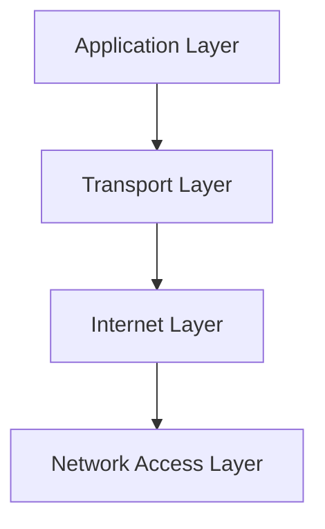
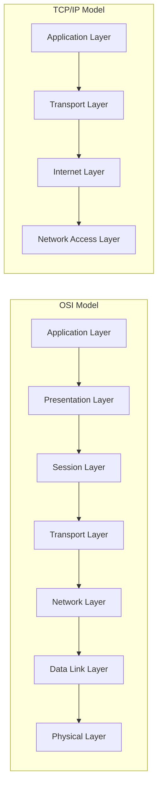
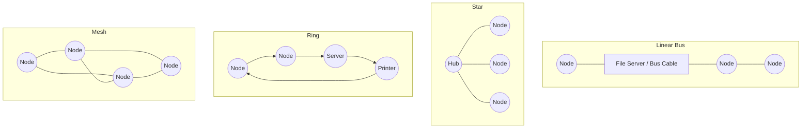

# Appendix A: Ethical Hacking Essential Concepts – I
## Part 3 — Computer Network Fundamentals (Part 1: Models, Types, Topologies & Hardware)

[← Back to Part 2: File Systems](02-file-systems.md) | [Next: Computer Network Fundamentals (Part 2) →](04-network-fundamentals-part2.md)

---

## Table of Contents

1. [Computer Networks](#computer-networks)
2. [The OSI Model](#the-osi-model)
3. [The TCP/IP Model](#the-tcpip-model)
4. [Comparing OSI and TCP/IP](#comparing-osi-and-tcpip)
5. [Types of Networks](#types-of-networks)
6. [Wireless Networks (WLAN)](#wireless-networks-wlan)
7. [Wireless Standards](#wireless-standards)
8. [Wireless Technologies](#wireless-technologies)
9. [Network Topologies](#network-topologies)
10. [Network Hardware Components](#network-hardware-components)
11. [Types of LAN Technology](#types-of-lan-technology)
12. [Types of Cables](#types-of-cables)
13. [Quick-Reference Summary](#quick-reference-summary)

---

## Computer Networks

A **computer network** is a group of computing systems connected together to allow electronic communication — letting users communicate and share resources (computers, mobile phones, printers, scanners, and more). The network model lays the foundation for successful communication between two computing systems, regardless of their underlying internal structure and technology. Two standard network models dominate: the **OSI Model** and the **TCP/IP Model**.

---

## The OSI Model

The **Open System Interconnection (OSI) Model** is the standard reference model for communication between two end users in a network. It comprises **seven layers** — the top four are used when a message transfers to or from a user, and the lower three are used as a message passes through intermediate host computers.

| | Data Unit | Layer | Function |
|---|---|---|---|
| **Host Layers** | Data | 7. Application | Network process to application |
| | Data | 6. Presentation | Data representation, encryption, and decryption; convert data to a machine-understandable format |
| | Data | 5. Session | Interhost communication, managing sessions between applications |
| | Segments | 4. Transport | End-to-end connections, reliability, and flow control |
| **Media Layers** | Packet/Datagram | 3. Network | Path determination and logical addressing |
| | Frame | 2. Data Link | Physical addressing |
| | Bit | 1. Physical | Media, signal, and binary transmission |

---

## The TCP/IP Model

The **TCP/IP Model** is a framework for the Internet Protocol suite of computer network protocols that defines communication in an IP-based network — the *practical implementation* of protocols around which the internet actually developed (as opposed to OSI, a generic, protocol-independent reference standard).

| Layer | Functions | Example Protocols |
|---|---|---|
| **Application Layer** | Handles high-level protocols, representation issues, encoding, and dialog control | File Transfer (TFTP, FTP), Email (SMTP), Remote Login (Telnet, rlogin), Network Management (SNMP), Name Management (DNS) |
| **Transport Layer** | Constitutes a logical connection between endpoints and provides transport services from source to destination host | Transmission Control Protocol (TCP), User Datagram Protocol (UDP) |
| **Internet Layer** | Selects the best path through the network for packets to travel | Internet Protocol (IP), Internet Control Message Protocol (ICMP), Address Resolution Protocol (ARP) |
| **Network Access Layer** | Defines how to transmit an IP datagram to other devices on a directly attached network | FDDI, Token Ring, CDP, VTP, PPP |

---

## Comparing OSI and TCP/IP

- **OSI** defines **services, interfaces, and protocols** as three distinct concepts; **TCP/IP** does not draw a clear distinction between these.
- OSI's top three layers (Application, Presentation, Session) map onto TCP/IP's single **Application Layer**; OSI's Data Link and Physical layers map onto TCP/IP's single **Network Access Layer**.
- Only **connection-oriented communication** applies at OSI's Network layer and above (down through Transport); TCP/IP's Internet and Transport layers support **both connectionless and connection-oriented communication**.

---

## Types of Networks

Networks are classified by physical location or geographical boundary:

| Type | Description |
|---|---|
| **LAN (Local Area Network)** | Usually possessed by private organizations; connects the nodes of a single organization or premises. Designed to facilitate resource sharing between PCs or workstations |
| **WAN (Wide Area Network)** | Provides transmission solutions for companies/groups needing to exchange information between multiple remote locations, possibly across different countries or continents. Trustworthy, quick, and secure communication between distant places, with short delays and low cost |
| **MAN (Metropolitan Area Network)** | Huge computer networks covering a whole city. Can be completely owned/monitored by a private organization, or provided as a service by a public organization such as a telecommunications company |
| **PAN (Personal Area Network)** | Wireless communication using both radio and optical signals. Covers an individual's work area or work group; also known as a "room-size network" |
| **CAN (Campus Area Network)** | Covers only a limited geographical area; applicable to a university campus |
| **GAN (Global Area Network)** | A combination of different interconnected computer networks, covering an unlimited geographical area. The internet is an example of a GAN |

---

## Wireless Networks (WLAN)

Wireless networks use **Radio Frequency (RF) signals** to connect wireless-enabled devices, following the IEEE 802.11 standard and using radio waves for communication.

| Advantages | Limitations |
|---|---|
| Easy installation, eliminates wiring | Wi-Fi security may not meet expectations |
| Access from anywhere within an access point's range | Bandwidth is impacted by the number of users on the network |
| Public places (airports, schools) can offer constant LAN connectivity | Wi-Fi standard changes may require replacing wireless components |
| | Some electronic equipment can interfere with the Wi-Fi network |

---

## Wireless Standards

| Protocol | Frequency (GHz) | Bandwidth (MHz) | Stream Data Rate (Mbit/s) | Modulation | Range Indoor (m) | Range Outdoor (m) |
|---|---|---|---|---|---|---|
| **802.11 (Wi-Fi)** | 2.4 | 22 | 1, 2 | DSSS, FHSS | 20 | 100 |
| **802.11a** | 5 / 3.7 | 20 | 6, 9, 12, 18, 24, 36, 48, 54 | OFDM | 35 / — | 120 / 5000 |
| **802.11ax** | 2.4 to 5 | 20, 40, 80, 160 | 2400 | 1024-QAM | 30–50 | 100–300 |
| **802.11b** | 2.4 | 22 | 1, 2, 5.5, 11 | DSSS | 35 | 140 |
| **802.11be** | 2.4, 5, 6 | 20, 40, 80, 160, 320 | 3000 | QAM | 30–50 | 100–300 |
| **802.11d** | An enhancement to 802.11a/b enabling global portability by allowing variation in frequencies, power levels, and bandwidth | | | | | |
| **802.11e** | Provides guidance for prioritization of data, voice, and video transmissions, enabling QoS | | | | | |
| **802.11g** | 2.4 | 20 | 6, 9, 12, 18, 24, 36, 48, 54 | OFDM | | |

---

## Wireless Technologies

### Cellular Generations

- **2G** — the second generation of mobile cellular networks, standardized under GSM, using digitally encrypted signals for mobile data transmission. Combined with **GPRS** it becomes **2.5G** (up to 114 Kbit/s download, 20 Kbit/s upload); further evolved with **EDGE** (2.75G) reaching 384 Kbit/s download, 60 Kbit/s upload.
- **3G** — launched as a **Universal Mobile Telecommunications Service (UMTS)** network. The first version, **HSPA** (combining HSDPA + HSUPA), offered 7.2 Mbit/s download / 2 Mbit/s upload. The evolved **HSPA+** (3.5G), introduced 2008, reached 337 Mbit/s download / 34 Mbit/s upload.
- **4G** — also known as **Long Term Evolution (LTE)**, a fourth-generation wireless technology characterized by capabilities defined by the ITU and IMT-Advanced, offering 100 Mbit/s for high-mobility communication and 1 Gbit/s for low-mobility communication.

### Other Wireless Technologies

- **TETRA (Terrestrial Trunked Radio)** — a European standard describing professional mobile radio communication infrastructure, standardizing Private Mobile Radio (PMR) and Public Access Mobile Radio (PAMR) for emergency users (police, military, ambulance, transport). Its low frequency covers large geographic areas with fewer transmitters, reducing infrastructure costs.
- **Bluetooth** — a short-range device-to-device data transmission technology for mobile devices, transmitting data between phones, computers, and other networked devices over distances up to 10 meters, at less than 1 Mbps, in the 2.4–2.485 GHz range. Falls under **IEEE 802.15** and uses frequency-hopping spread spectrum.
- **Optical Wireless Communication (OWC)** — a form of unguided transmission through optical carriers, using visible, infrared, and ultraviolet light ranges:
  - **Visible Light Communication (VLC)** — operates in the visible band (390–750 nm) using high-speed pulsing LEDs
  - **Point-to-point OWC (free-space optical) systems** — transmit at IR frequencies (750–1600 nm) using laser transmitters, up to 10 Gbit/s per wavelength
  - **Ultraviolet Communication (UVC)** — operates within the solar-blind UV spectrum (200–280 nm)

---

## Network Topologies

**Network topology** is a specification dealing with a network's overall design and the flow of its data.

- **Physical Topology** — the physical layout of nodes, workstations, and cables in the network
- **Logical Topology** — the information flow between different components

| Topology | Description |
|---|---|
| **Bus** | Devices connect to a central cable (the "bus") using interface connectors |
| **Star** | Devices connect to a central computer called a **hub**, which functions as a router |
| **Ring** | Devices connect in a closed loop; data travels node to node, with each node handling every packet along the way |
| **Mesh** | Devices connect such that every device has a point-to-point link with every other device on the network |
| **Tree** | A hybrid of bus and star topologies, where groups of star-configured networks connect to a linear bus backbone cable |
| **Hybrid** | A combination of any two or more different topologies — Star-Bus or Star-Ring are widely used |

---

## Network Hardware Components

| Component | Function |
|---|---|
| **Network Interface Card (NIC)** | Allows computers to connect and communicate with the network |
| **Repeater** | Increases the strength of an incoming signal in a network |
| **Hub** | Connects segments of a LAN; all LAN segments can see all the packets |
| **Switch** | Similar to a hub, but packets are not visible to any equipment in the LAN segment except the target node |
| **Router** | Receives data packets from one network segment and forwards them to another |
| **Bridges** | Combine two network segments and manage network traffic |
| **Gateways** | Enable communication between different types of environments and protocols |

---

## Types of LAN Technology

### Ethernet
The **physical layer** of LAN technology, maintaining a proper balance between speed, cost, and ease of installation. Describes the number of conductors required for a connection, sets performance thresholds, and provides the data-transmission framework. A standard Ethernet network sends data at up to **10 Mbps**. Governed by **IEEE 802.3**, which specifies configuration rules and element interaction.

### Fast Ethernet
**IEEE 802.3u** — transmits data at a minimum rate of **100 Mbit/s**. Three market variants: **100BASE-TX** (Level 5 UTP cable), **100BASE-FX** (fiber-optic cable), and **100BASE-T4** (extra two wires with Level 3 UTP cable).

### Specifications of LAN Technology

| Name | IEEE Standard | Data Rate | Media Type | Maximum Distance |
|---|---|---|---|---|
| **Ethernet** | 802.3 | 10 Mbps | 10Base-T | 100 meters |
| **Fast Ethernet / 100Base-T** | 802.3u | 100 Mbps | 100Base-TX, 100Base-FX | 100 meters, 2000 meters |
| **Gigabit Ethernet / GigE** | 802.3z | 1000 Mbps | 1000Base-T, 1000Base-SX, 1000Base-LX | 100 meters, 275/550 meters, 550/5000 meters |
| **10 Gigabit Ethernet** | IEEE 802.3ae | 10 Gbps | 10GBase-SR, 10GBase-LX4, 10GBase-LR/ER, 10GBase-SW/LW/EW | 300 meters, 300m MMF/10km SMF, 10km/40km, 300m/10km/40km |

---

## Types of Cables

### Fiber Optic Cable

Consists of the **core** (glass/plastic, higher refractive index — carries the signal), **cladding** (glass/plastic, lower refractive index than the core), **buffer** (protects the fiber from damage/moisture), and **jacket** (holds one or more fibers).

**Features:** lower cost, extremely wide bandwidth, lighter weight and smaller, more secure, resistant to corrosion, longer life and easy to maintain, eliminates cross-talk, immune to electrostatic interference.

### Coaxial Cable

A copper cable built with a metal shield and other components engineered to block signal interference. Consists of **two conductors** separated by a dielectric material, with the center and outer conductors forming a concentric cylinder sharing a common axis. **50-ohm** cable is used for digital transmission; **75-ohm** cable for analog transmission. Base data rate: 10 Mbps (increasable with a larger inner-conductor diameter).

**Advantages:** cheap installation cost, great channel capacity, good bandwidth, easily modifiable, cheap production cost.

### CAT5e and CAT6

| | CAT5e | CAT6 |
|---|---|---|
| **Also known as** | Category 5 cable, used to transmit high-speed data | Category 5 cable variant, transmits high-speed data |
| **Used in** | Fast Ethernet (100 Mbps), Gigabit Ethernet (1000 Mbps), 155 Mbps ATM | Gigabit Ethernet (1000 Mbps) and 10 Gig Ethernet (10000 Mbps) |
| **Bandwidth** | 350 MHz | 250 MHz |
| **Attenuation** | 24.0 dB | 19.8 dB |
| **Impedance** | 100 Ohms | 100 Ohms |

### 10/100/1000BaseT (UTP Ethernet)

An Ethernet connection method using **twisted pair cables**, operating at 10, 100, or 1000 Mbps. "BASE" denotes baseband transmission; "T" stands for twisted pair cabling.

| | 10Base-T | 100Base-T | 1000Base-T |
|---|---|---|---|
| **Transmission speed** | 10 Mbps (max cable length 100m) | 100 Mbps | 1000 Mbps |
| **IEEE standard** | 802.3i | 802.3u | 802.3ab |
| **Suitable cable** | Cat 3 and Cat 5 | Cat 5 | Cat 5e |
| **Wires used** | 4 wires (pins 1,2,3,6) | 4 wires (pins 1,2,3,6) | 8 wires (pins 1–8) |

---

## Quick-Reference Summary

- **OSI**: 7 layers (Application → Presentation → Session → Transport → Network → Data Link → Physical); **TCP/IP**: 4 layers (Application → Transport → Internet → Network Access) — TCP/IP is the practical internet implementation, OSI the generic reference model
- **6 network types by scope**: LAN, WAN, MAN, PAN, CAN, GAN
- **WLAN** runs on IEEE 802.11 (with variants a/b/g/d/e/ax/be each trading off frequency, bandwidth, and range)
- **Wireless tech spans**: cellular (2G→3G→4G), TETRA, Bluetooth (802.15), and optical wireless (VLC/free-space/UV)
- **6 topologies**: Bus, Star, Ring, Mesh, Tree, Hybrid
- **7 hardware components**: NIC, Repeater, Hub, Switch, Router, Bridges, Gateways
- **LAN technology tiers**: Ethernet (10 Mbps) → Fast Ethernet (100 Mbps) → Gigabit → 10 Gigabit, each with defined IEEE standards and max distances
- **2 cable families**: Fiber optic (core/cladding/buffer/jacket) and Coaxial (50-ohm digital / 75-ohm analog)

---

*Part of the CEH Appendix A study series — continues in [Part 4: Computer Network Fundamentals (Part 2)](04-network-fundamentals-part2.md).*
