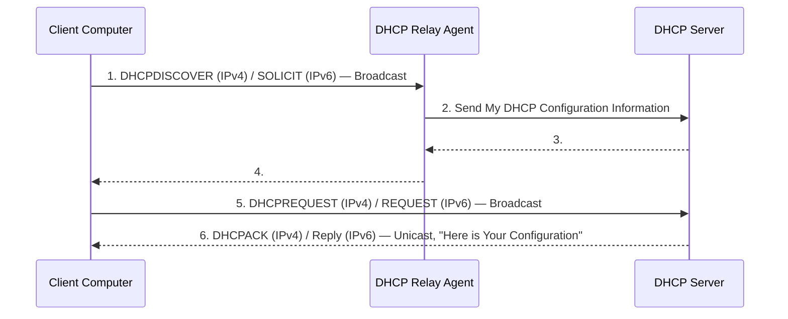
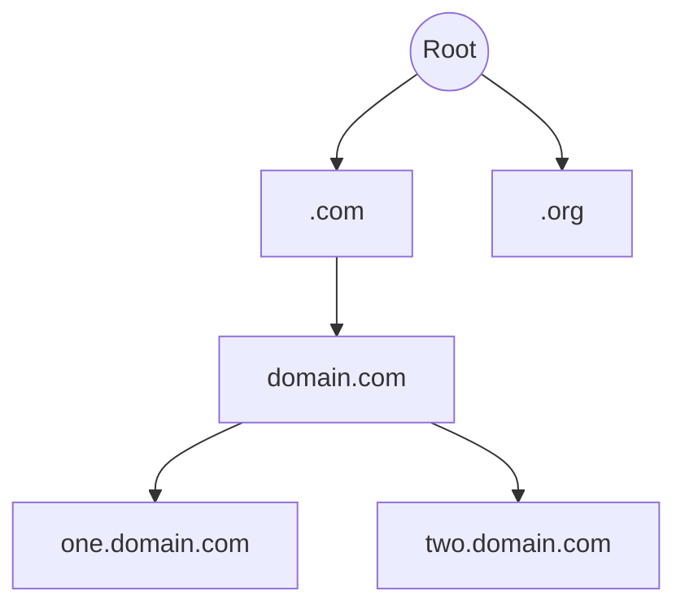

# Appendix A: Ethical Hacking Essential Concepts – I
## Part 4 — Computer Network Fundamentals (Part 2: Protocols, TCP/IP Internals & Addressing)

[← Back to Part 3: Network Fundamentals (Part 1)](03-network-fundamentals-part1.md) | [Next: Network Troubleshooting →](05-network-troubleshooting.md)

---

## Table of Contents

1. [The TCP/IP Protocol Suite at a Glance](#the-tcpip-protocol-suite-at-a-glance)
2. [Application Layer Protocols](#application-layer-protocols)
3. [Transport Layer: TCP](#transport-layer-tcp)
4. [Transport Layer: UDP](#transport-layer-udp)
5. [Internet Layer: IP, ICMP, and ARP](#internet-layer-ip-icmp-and-arp)
6. [IP Addressing](#ip-addressing)
7. [Subnetting and Supernetting](#subnetting-and-supernetting)
8. [Port Numbers](#port-numbers)
9. [Network Terminology: Routing, NAT, VLAN](#network-terminology-routing-nat-vlan)
10. [Shared vs. Switched Media Networks](#shared-vs-switched-media-networks)
11. [Quick-Reference Summary](#quick-reference-summary)

---

## The TCP/IP Protocol Suite at a Glance

| Application Layer | Transport Layer | Internet Layer | Link Layer |
|---|---|---|---|
| DHCP | TCP | IP | FDDI |
| DNS | UDP | IPv6 | Token Ring |
| DNSSEC | SSL | IPsec | WEP |
| HTTP | TLS | ICMP | WPA |
| S-HTTP | | ARP | WPA2 |
| HTTPS | | IGRP | TKIP |
| FTP | | OSPF | EAP |
| SFTP | | HSRP | LEAP |
| TFTP | | VRRP | PEAP |
| SMTP | | BGP | CDP |
| S/MIME | | | VTP |
| PGP | | | STP |
| Telnet | | | PPP |
| SSH | | | |
| SOAP | | | |
| SNMP | | | |
| NTP | | | |
| RPC | | | |
| SMB | | | |
| SIP | | | |
| RADIUS | | | |
| TACACS+ | | | |
| RIP | | | |

The rest of this file walks through the protocols most worth understanding in depth.

---

## Application Layer Protocols

### DHCP (Dynamic Host Configuration Protocol)

DHCP servers **distribute TCP/IP configuration** information to DHCP-enabled clients in the form of a lease offer.



A typical lease hands the client its IP address, subnet mask, default router(s), DNS servers, and a lease time (e.g., `IP: 10.0.0.20`, `Mask: 255.255.255.0`, `Router: 10.0.0.1`, `DNS: 192.168.168.2, 192.168.168.3`, `Lease: 2 days`).

### DNS (Domain Name System) and DNS Hierarchy

- **Root level domain** — the highest domain in the hierarchy; responds to requests and holds information about the global list of top-level domains (`.com`, `.org`, `.uk`, `.nz`)
- **Top level domains** — contain two types: organizational and geographical hierarchies
- **Second level domains** — the actual domain name, varying by owner, named per the owner's desire without restriction
- **Sub-domains** — parts of a split main domain (e.g., `about.mydomain.com`, `contact.mydomain.com`)
- **Host** — the device holding the DNS hierarchy domain names



### DNSSEC (DNS Security Extensions)

A suite from the IETF used to secure certain types of information provided by DNS, working by **digitally signing DNS lookup records** using public-key cryptography.

| DNSSEC Guarantees | DNSSEC Does NOT Guarantee |
|---|---|
| Authenticity | Confidentiality |
| Integrity | Protection against Denial of Service (DoS) |
| The non-existence of a domain name or type | |

**How it works:** Authenticity and integrity come from the signature of the RRSET (created with a private key); the public key verifies that RRSIG signature. Authenticity of a name's *non-existence* comes from NSEC, a canonically-ordered chain where each name points to the next in the zone. Delegated (child) zones sign their own RRSETs with their own private key, and the authenticity of *that* key is verified via the signature of the DS record in the parent zone (a hash of the public key — DNSKEY).

### HTTP (Hypertext Transfer Protocol)

Lays the **foundation for communication** on the World Wide Web — the standard application protocol on top of TCP/IP, handling web browser requests and server responses (audio, video, images, hypertext, plain text).

**Weaknesses:** vulnerable to man-in-the-middle attacks; lacks security since data sent via HTTP isn't encrypted; can be used with no encryption or digital certificates at all.

### S-HTTP (Secure HTTP)

An application-layer protocol that encrypts individual web communications carried over HTTP, ensuring secure transmission of individual messages (as distinct from SSL, which secures the entire connection). An alternate to HTTPS (SSL), generally used where the server requires user authentication. **Note:** not all browsers/servers support S-HTTP.

### HTTPS (Hypertext Transfer Protocol Secure)

Ensures secure communication between two computers over HTTP, with the connection encrypted using **TLS or SSL**. Commonly used for confidential online transactions and protects against man-in-the-middle attacks — though it can still be vulnerable to **DROWN** (Decrypting RSA with Obsolete and Weakened eNcryption) attacks.

### FTP (File Transfer Protocol)

A standard networking protocol for **sharing files** over TCP/IP, built on client-server architecture, using SSL/TLS and SSH encryption for data security. FTP servers provide access via a simple login mechanism, and use **two connections**:

- **Control connection** — transmits commands and their replies between client and server
- **Data connection** — transfers the actual data files

| Mode | How It Works |
|---|---|
| **Active Mode** | The control connection is made from the FTP client; all data connections are made from the FTP server to the FTP client |
| **Passive Mode** | Both the control and data connections are established from the FTP client to the FTP server (both connections inbound) |

### SFTP (Secure File Transfer Protocol)

A secure version of FTP, an extension of the SSH2 protocol, used for secure file transmission/access over a reliable data stream. Runs on **TCP port 22**.

### TFTP (Trivial File Transfer Protocol)

A **lockstep communication protocol** that transmits files in both directions of a client-server application, helping with node booting on a LAN when the OS or firmware images live on a file server. TFTP only reads and writes files — it can't list, delete, or rename files/directories, and has no user authentication. Generally used only on LANs; constitutes an independent exchange. **Weaknesses:** vulnerable to DoS and directory traversal attacks.

### SMTP (Simple Mail Transfer Protocol)

An application-layer protocol for **electronic mail transmission** — simple and text-based, communicating with the mail server over **TCP port 25**. Two types: **End-to-end** (between different organizations) and **Store-and-forward** (within an organization).

| Advantages | Disadvantages |
|---|---|
| Simplest form of communication through mail | Weakest security of the common mail protocols |
| Quick email delivery | Limited to 7-bit ASCII characters |
| Reliable for outgoing messages | Lacks the security protocols specified in X.400 |
| Easy to connect, flexible with existing applications | Usefulness limited by its own simplicity |
| Works across several platforms | |
| Low implementation/administration cost | |

### S/MIME (Secure/Multipurpose Internet Mail Extensions)

An application-layer protocol for sending **digitally signed and encrypted** email messages. Uses **RSA** for digital signatures and **DES** for message encryption. Administrators must explicitly enable S/MIME-based security on organizational mailboxes.

### PGP (Pretty Good Privacy)

An application-layer protocol providing **cryptographic privacy and authentication** for network communication — encrypting/decrypting email and authenticating messages with digital signatures, and encrypting stored files. A typical flow: a file is encrypted with a random key, which is itself encrypted with the recipient's public key and attached to the encrypted file; decryption reverses this using the recipient's private key.

### PGP vs. S/MIME

| Mandatory Feature | S/MIME v3 | OpenPGP |
|---|---|---|
| **Message Format** | Binary, based on CMS | Application/pkcs7-mime |
| **Certificate Format** | Binary, based on X.509v3 | Binary, based on previous PGP |
| **Symmetric Encryption Algorithm** | Triple DES (DES, EDE3, and CBC) | Triple DES (DES, EDE3, and Eccentric CFB) |
| **Signature Algorithm** | Diffie-Hellman (X9.42) with DSS or RSA | ElGamal with DSS |
| **Hash Algorithm** | SHA-1 | SHA-1 |
| **MIME Encapsulation of Signed Data** | Choice of Multipart/signed or CMS format | Multipart/signed ASCII armor |
| **MIME Encapsulation of Encrypted Data** | Application/pkcs7-mime | Multipart/Encrypted |

### Telnet

A TCP/IP protocol used on a LAN to let a user or administrator **access remote computers** over a network.

| Advantages | Weaknesses |
|---|---|
| Log onto and execute programs on a remote computer | Vulnerable to denial-of-service attacks |
| Control web servers remotely, enable communication with other network servers | Vulnerable to packet sniffing |
| Fast and efficient even under high network/system load | Not secure — passes all data in clear text |
| | Susceptible to eavesdropping attacks |

### SSH (Secure Shell)

A network management protocol used primarily in UNIX/Linux environments for **secure remote login**, building a secure, encrypted tunnel for exchanging information between network management software and devices.

**SSH Authentication Mechanisms:**

1. **Simple Authentication** — based on the user's password
2. **Key-based Authentication** — SSH allows key-based auth; a public/private key pair is generated (via `ssh-keygen -t rsa` or `ssh-keygen -t dsa`); the private key is used every time a connection is established; the public key must be saved in `~/.ssh/authorized_keys`
3. **Host-based Authentication** — if enabled on the target machine, a user on a trusted host can log in to the target using the same host-based authentication (enabled by setting the setuid bit on `/usr/lib/ssh/ssh-keysign` — 32-bit — or `/usr/lib64/ssh/ssh-keysign` — 64-bit)

### SOAP (Simple Object Access Protocol)

An **XML-based messaging protocol** for transmitting data between computers — provides data transport for web services, independent of platform and language. Three characteristics: extensibility, neutrality, independence. Equivalent to RPC, used in technologies like DCOM and CORBA.

**Weaknesses:** statelessness; heavy reliance on HTTP; slower than CORBA/RMI/IIOP due to lengthy XML parsing; depends on WSDL and has no standardized mechanism for dynamic service discovery.

### SNMP (Simple Network Management Protocol)

An application-layer protocol that **manages a TCP/IP-based network** on a client-server architecture — collecting and managing information about network devices (routers, hubs, modems, printers, bridges, switches, servers, workstations). **Common risks to Cisco IOS SNMP configurations:** DDoS attacks, SNMP remote code execution.

### NTP (Network Time Protocol)

Used to **synchronize computer clock times** across a network; the NTP client initiates a time-request exchange with the NTP server. Uses UTC as reference time, and is highly scalable. **Weaknesses:** vulnerable to DoS and DDoS amplification attacks; intruders can intercept packets between authentic client/server or replay packets.

### RPC (Remote Procedure Call)

Allows **inter-process communication** between two programs (client and server) without either needing to understand the network's details. Some RPC services on UNIX: Network Information Service, Network File System, Common Desktop Environment. Recent RPC vulnerabilities span both Windows and Linux, including named CVEs like **CVE-2024-20678** (RPC Runtime Remote Code Execution).

### SMB (Server Message Block) Protocol

An application-layer protocol providing **shared access** to files, printers, serial ports, and other resources between the nodes of a network — an authenticated inter-process communication mechanism widely used by Microsoft Windows. Client-server approach: the client makes specific requests, and the server makes file systems and other resources available accordingly. Most often used with **NetBIOS over TCP/IP (NBT)**. *(Note: the enhanced, internet-ready version of SMB is called CIFS — Common Internet File System.)*

### SIP (Session Initiation Protocol)

A communications protocol for **signaling and controlling real-time multimedia sessions** — voice, video, instant messaging. Works alongside SDP, RTP, SRTP, and TLS. Determines user attributes: location, availability, capability, session setup, and session management.

### RADIUS (Remote Authentication Dial-In User Service)

An authentication protocol providing **centralized AAA (authentication, authorization, accounting)** for remote access servers to communicate with a central server.

**Authentication steps:**
1. The client initiates the connection by sending an **Access-Request packet**
2. The server compares the credentials with those stored in its database; if they match, it sends an **Access-Accept message** (with an optional **Access-Challenge** for additional authentication); otherwise, an **Access-Reject**

**Accounting steps:**
3. The client sends an **Accounting-Request** specifying accounting information for a connection that was accepted
4. The server sends back an **Accounting-Response**, confirming successful establishment

### TACACS+ (Terminal Access Controller Access-Control System Plus)

A network security protocol for AAA of network devices (switches, routers, firewalls) through one or more centralized servers. Encrypts the *entire* communication between client and server (including accounting data — unlike RADIUS, which typically leaves accounting data in clear text). Uses a client-server model where a client requests connection to a device, and the server authenticates by examining credentials.

**Security Issues with TACACS+:** no integrity checking; vulnerable to replay attacks; accounting information sent in clear text (in some configurations); weak encryption.

### Routing Protocols: RIP, IGRP

- **RIP (Routing Information Protocol)** — a Distance-Vector routing protocol for smaller networks, using IP to exchange routing information. Sends periodic routing updates every 30 seconds, includes the full routing table each update, broadcasts updates to neighbors, and uses the Bellman-Ford algorithm to determine the finest path. Performs IP and IPX routing over **UDP port 520**; administrative distance of 120; maximum hop count of **15**.
- **IGRP (Interior Gateway Routing Protocol)** — a Distance-Vector protocol for transmitting routing data within the internet, distinct from RIP/IPX RIP. By default calculates its distance metric from Bandwidth and Delay (optionally also Reliability, Load, MTU). Sends periodic updates every 90 seconds, includes the full table after each periodic update, and also uses Bellman-Ford. IP-only routing; protocol number 9; administrative distance 100; default max hop count 100 (extendable to 255).

---

## Transport Layer: TCP

### TCP Header Format (20 bytes)

```
0                                            15 16                                        31
├───────────── Source Port No (16 bits) ──────┤├──────── Destination Port No (16 bits) ────┤
├──────────────────────── Sequence No (32 bits) ────────────────────────────────────────────┤
├──────────────────── Acknowledgement No (32 bits) ─────────────────────────────────────────┤
├─ Hdr Len (4) ─┤─ Reserved (6) ─┤─ Flags ─┤├──────────────── Window Size (16 bits) ────────┤
├──────────────────── TCP Checksum (16 bits) ─────┤├────────── Urgent Pointer (16 bits) ─────┤
├────────────────────────────────── Options ─────────────────────────────────────────────────┤
├─────────────────────────────────── Data (if any) ──────────────────────────────────────────┤
```

Fields include: Source Port (16 bits), Destination Port (16 bits), Sequence Number (32 bits), Acknowledgement Number (32 bits), Header Length (4 bits), Reserved (6 bits), Flags (URG/ACK/PSH/RST/SYN/FIN), Window Size (16 bits), TCP Checksum (16 bits), Urgent Pointer (16 bits), Options, and Data.

### TCP Services

| # | Service | Description |
|---|---|---|
| 1 | **Simplex** | Each flow has its own window size, sequence numbers, and acknowledgment numbers |
| 2 | **Half-duplex** | Allows sending information in both directions between two nodes, but only one direction can be used at a time |
| 3 | **Full-duplex** | Allows data flow in each direction independent of the other; each flow has its own window size, sequence, and acknowledgment numbers |

---

## Transport Layer: UDP

UDP is a **connectionless transport protocol** that exchanges datagrams without acknowledgments or guaranteed delivery. It doesn't use windowing or acknowledgments, so reliability (if needed) is left to application-layer protocols. Protocols that use UDP include **TFTP**, **SNMP**, and **DHCP**.

### UDP Segment Format

| Source Port (16 bits) | Destination Port (16 bits) | Length (16 bits) | Checksum (16 bits) | Data |
|---|---|---|---|---|

### UDP Operation

- Since UDP has no windowing/acknowledgments, application-layer protocols must handle their own error detection
- The **Source Port** field is optional — used only when information needs to be returned to the sending host
- When a *destination* router receives a routing update, it's not because the *source* router made a request — so nothing needs to be returned to the source
- For **RIP** updates specifically: **BGP** uses TCP; **IGRP** is sent directly over IP; **EIGRP** and **OSPF** are also sent directly over IP, each with its own reliability handling

---

## Internet Layer: IP, ICMP, and ARP

### IP Header: Protocol Field

The IP header includes a **Protocol field** that specifies whether the encapsulated segment is TCP (protocol number **6**) or UDP (protocol number **17**). Full IP header: 4-bit Version, 4-bit Header Length, 8-bit Type of Service (TOS), 16-bit Total Length, 16-bit Identification, 3-bit Flags, 13-bit Fragment Offset, 8-bit Time-to-Live (TTL), 8-bit Protocol, 16-bit Header Checksum, 32-bit Source IP Address, 32-bit Destination IP Address, Options (if any), and Data.

### IPv6 ("IPng" — Next Generation Protocol)

IPv6 provides a base for growth in IT development through:

- **Expandable address space** — large and diverse, with better routing capabilities
- **Scalable** to new users and services
- **Auto-configuration** ability (plug-n-play)
- **Mobility** — improved mobility model
- **End-to-end security** — high comfort factor, more security built in than IPv4
- **Extension headers** — enormous potential
- **Authentication and privacy**
- Support for **source-demand routing** protocols
- **Quality of Service (QoS)** support

### ICMP (Internet Control Message Protocol)

ICMP messages are encapsulated into the datagram; since delivery uses the same technique as any IP packet, ICMP messages are subject to the same delivery failures — creating a scenario where error reports could generate *more* error reports, increasing congestion in an already-ailing network. Errors created by ICMP messages don't generate their own ICMP messages, and a datagram delivery error is sometimes never reported back to the sender at all.

**Encapsulation:** `ICMP Header + Data` sits inside `IP Header + Data`, which sits inside `Frame Header + Frame Data + Frame Trailer`.

**Format of an ICMP Message:** `Type (8 bits) | Code (8 bits) | Checksum (16 bits) | Parameters | Data...`

**Selected ICMP Types:**

| Type | Name |
|---|---|
| 0 | Echo Reply |
| 3 | Destination Unreachable |
| 4 | Source Quench |
| 5 | Redirect |
| 8 | Echo |
| 9 | Router Advertisement |
| 10 | Router Solicitation |
| 11 | Time Exceeded |
| 12 | Parameter Problem |
| 13 | Timestamp |
| 14 | Timestamp Reply |
| 15 | Information Request |
| 17 | Address Mask Request |
| 18 | Address Mask Reply |

**Codes for Type 3 (Destination Unreachable):** 0 Net Unreachable, 1 Host Unreachable, 2 Protocol Unreachable, 3 Port Unreachable, 4 Fragmentation Needed and Don't Fragment was Set, 5 Source Route Failed, 6 Destination Network Unknown, 7 Destination Host Unknown, 8 Source Host Isolated, 9 Communication with Destination Network Administratively Prohibited, 10 Communication with Destination Host Administratively Prohibited, 11 Destination Network Unreachable for Type of Service, 12 Destination Host Unreachable for Type of Service, 13 Communication Administratively Prohibited, 14 Host Precedence Violation, 15 Precedence cutoff in effect.

### ARP (Address Resolution Protocol)

ARP resolves an IP address to a MAC address on a local network segment, using a **request/reply** exchange.

**ARP Request** (broadcast, null destination MAC): `Preamble and SFD (8 bytes) | Dest. Address (0x000000000000, 6 bytes) | Source Address (6 bytes) | Type (0x0806 for ARP, 2 bytes) | Data (28 bytes) | CRC (2 bytes)`

**ARP Reply** (unicast, with resolved destination MAC): `Preamble and SFD | Dest. Address | Source Address | Type (0x0806 for ARP) | Data | CRC (4 bytes)`

---

## IP Addressing

An **IP address** is a unique numeric value assigned to a node or network connection — a **32-bit binary number**, expressed as a set of four numbers (octets) ranging 0–255, separated by periods (**dotted-decimal notation**). Examples: `168.192.0.1`, `23.255.0.23`, `192.165.7.7`.

### Classful IP Addressing

IP addresses are divided into **5 major classes** (A, B, C, D, E) — the original addressing scheme of the internet. Every IP address breaks into two parts: a **network** portion and a **host** portion (the *Two-Level Internet Address Structure*: Network Number + Host Number, or equivalently Network Prefix + Host Number).

> **Note:** All hosts on a network share the same network prefix but must have a unique host number. Hosts on *different* networks can share the same host number but must have different network prefixes.

| Class | Leading Bits | Starts With (Binary) | Decimal Range | Network Prefix | Hosts Specified By |
|---|---|---|---|---|---|
| **A** | 0 | 0 | 1–126 | 8-bit (1st octet) | Remaining 24 bits |
| **B** | 10 | 10 | 128–191 | 16-bit (2 octets) | Remaining 16 bits |
| **C** | 110 | 110 | 192–223 | 24-bit (3 octets) | Remaining 8 bits |
| **D** | 1110 | 1110 | 224–239 | — (multicast) | — |
| **E** | 1111 | 1111 | 240–255 | — (experimental) | — |

### Address Classes — Full Detail

| Class | Leading Bits | Size of Network-ID Bit Field | Size of Host-ID Bit Field | Number of Networks | Addresses Per Network |
|---|---|---|---|---|---|
| **A** | 0 | 7 | 24 | 126 | 16,277,214 |
| **B** | 10 | 14 | 16 | 16,384 | 65,534 |
| **C** | 110 | 21 | 8 | 2,097,152 | 254 |
| **D (Multicast)** | 1110 | 20 | 8 | 1,048,576 | 254 |
| **E (Reserved)** | 1111 | 20 | 8 | 1,048,576 | 254 |

| IP Address Class | Fraction of Total IP Address Space | Intended Use |
|---|---|---|
| **A** | 1/2 | Unicast addressing for very large organizations |
| **B** | 1/4 | Unicast addressing for medium/large organizations |
| **C** | 1/8 | Unicast addressing for small organizations |
| **D** | 1/16 | IP multicasting |
| **E** | 1/16 | Reserved |

---

## Subnetting and Supernetting

### Subnet Masking

- A **subnet mask** divides the IP address of the host into **network** and **host** numbers
- A subnet allows dividing Class A/B/C network numbers into smaller segments
- **Variable Length Subnet Mask (VLSM)** allows two or more subnet masks to coexist within the **same network**
- VLSM makes effective use of a network's IP address space

**Default Subnet Masks:**

| IP Address Class | Total Bits for Net ID/Host ID | 1st Octet | 2nd Octet | 3rd Octet | 4th Octet |
|---|---|---|---|---|---|
| **Class A** | 8/24 | 11111111 | 00000000 | 00000000 | 00000000 |
| **Class B** | 16/16 | 11111111 | 11111111 | 00000000 | 00000000 |
| **Class C** | 24/8 | 11111111 | 11111111 | 11111111 | 00000000 |

### Subnetting

Subnetting allows dividing a Class A, B, or C network into different **logical subnets**, by borrowing bits from the host-ID portion to extend the natural mask.

```
Two-Level Classful Hierarchy:    | Network Prefix | Host Number |
Three-Level Subnet Hierarchy:    | Network Prefix | Subnet Number | Host Number |
```

**Worked example** — Class C address `192.168.1.12`:

```
IP Address:      11000000.10101000.00000001.00001010
Subnet Mask:      255.255.255.0
                  11111111.11111111.11111111.00000000
Subnetted Mask:    255.255.255.224
                  11111111.11111111.11111111.11100000
```

The three extra bits borrowed from the host-ID portion allow the creation of **eight subnets**.

---

## Port Numbers

Both **TCP and UDP** use port (socket) numbers to pass information to the upper layers, keeping track of simultaneous conversations crossing the network. Conversations not tied to a well-known port number are assigned **randomly-selected port numbers** within a specific range. Some ports are reserved in both TCP and UDP, even if the corresponding applications aren't written to actually support them. End systems use port numbers to select the correct application for handling communication.

| Range | Classification |
|---|---|
| Below 1024 | Well-known port numbers |
| Above 1024 | Dynamically assigned port numbers |
| Above 1024 (mostly) | Registered ports — reserved for vendor-specific applications |

---

## Network Terminology: Routing, NAT, VLAN

### Routing

- **Static Routing** — routes are manually configured by an administrator; doesn't adapt to network changes automatically.
- **Dynamic Routing** — routers exchange routing information automatically using routing protocols (RIP, IGRP, OSPF, BGP, etc.), adapting to topology changes.

### NAT (Network Address Translation)

Translates private (internal) IP addresses to public (external) ones, letting multiple devices on a private network share a single public IP — conserving public address space and adding a layer of obscurity to internal network structure.

### VLAN (Virtual LAN)

| Advantages | Disadvantages |
|---|---|
| Reduces the number of devices needed for a specific network topology | Relies on switches to "do the right thing" |
| Managing physical devices becomes less complex | Packets can leak from one VLAN to another |
| Increases security options through separation and specific frame delivery | Injected packets can be crafted for an attack |
| Improves performance and security | |
| Enables formation of virtual workgroups | |
| Simplifies administration | |

**Security implications of VLANs:**

- Keeps hosts separated by VLANs and limits the number of devices that can talk to those hosts
- Increases security options via separation and specific frame delivery
- Deploys VTP domain, VTP pruning, and password protections

---

## Shared vs. Switched Media Networks

### Shared Media Network

Every node **shares a single channel** and its bandwidth for communication; every message reaches every node.

| Advantages | Disadvantages |
|---|---|
| Cheap — low channel/hardware interference components | Fixed channel bandwidth |
| No switch, so no switch delay | Needs a router/gateway to go beyond each segment |
| Short response time | Limited distance span |
| Broadcasting/multicasting is easy | Traffic problems and network collisions |
| Simple design | Security issues, since all information transmits to all nodes |

Usable bandwidth in a shared media hub: roughly **1–4 Mbps per end-station**.

---

## Quick-Reference Summary

- **Protocol suite spans 4 layers**: Application (DHCP/DNS/HTTP(S)/FTP family/SMTP family/Telnet/SSH/SOAP/SNMP/NTP/RPC/SMB/SIP/RADIUS/TACACS+/RIP), Transport (TCP/UDP/SSL/TLS), Internet (IP/IPv6/IPsec/ICMP/ARP/IGRP/OSPF/HSRP/VRRP/BGP), Link (FDDI/Token Ring/WEP/WPA/WPA2/TKIP/EAP/LEAP/PEAP/CDP/VTP/STP/PPP)
- **TCP header** = 20 bytes, 3 services (simplex, half-duplex, full-duplex); **UDP** = connectionless, no windowing/ACKs, used by TFTP/SNMP/DHCP
- **IP header's Protocol field**: 6 = TCP, 17 = UDP
- **ICMP** delivers error/informational messages (echo, unreachable, redirect, time exceeded, etc.) with its own type/code structure
- **ARP** resolves IP → MAC via request/reply, with a null destination MAC on the request
- **Classful addressing**: A (1–126), B (128–191), C (192–223), D (224–239, multicast), E (240–255, experimental)
- **Subnetting** borrows host bits to build smaller logical networks; **VLSM** lets multiple subnet masks coexist on one network
- **Ports**: <1024 well-known, >1024 dynamic/registered
- **NAT** conserves public IPs and hides internal structure; **VLANs** segment broadcast domains for both performance and security

---

*Part of the CEH Appendix A study series — continues in [Part 5: Network Troubleshooting](05-network-troubleshooting.md).*
