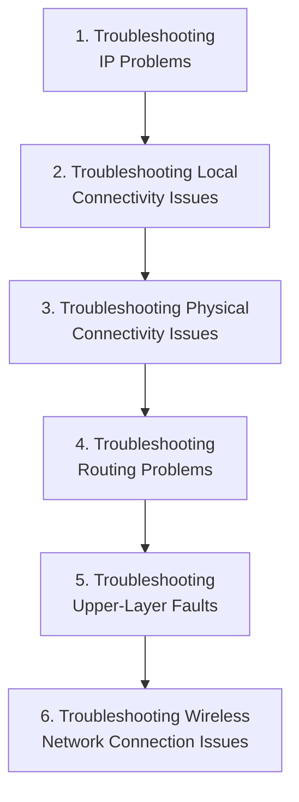

# Appendix A: Ethical Hacking Essential Concepts – I
## Part 5 — Basic Network Troubleshooting Techniques

[← Back to Part 4: Network Fundamentals (Part 2)](04-network-fundamentals-part2.md) | [Next: Virtualization Concepts →](06-virtualization.md)

---

## Table of Contents

1. [ICMP Messages Used in Troubleshooting](#icmp-messages-used-in-troubleshooting)
2. [The 6-Step Network Troubleshooting Framework](#the-6-step-network-troubleshooting-framework)
3. [Troubleshooting Upper-Layer Faults](#troubleshooting-upper-layer-faults)
4. [Network Troubleshooting Tools](#network-troubleshooting-tools)
5. [Quick-Reference Summary](#quick-reference-summary)

---

## ICMP Messages Used in Troubleshooting

Network troubleshooting leans heavily on the ICMP messages already introduced in [Part 4](04-network-fundamentals-part2.md#internet-layer-ip-icmp-and-arp). A few are worth understanding in more depth specifically for diagnostic purposes:

### Unreachable Networks

Network communication depends on a handful of basic conditions being met:

- Sending and receiving devices must have the **TCP/IP protocol stack** properly configured (correct IP address and subnet mask)
- If datagrams need to travel outside the local network, a **default gateway** must also be configured
- The **router** must have TCP/IP properly configured on its interfaces, and must use an appropriate routing protocol

If these conditions aren't met, network communication simply cannot take place. Common examples of what goes wrong: the sending device addresses the datagram to a non-existent IP address, the destination device isn't connected to its network, the router's connecting interface is down, or the router lacks the information needed to locate the destination network. An **ICMP destination unreachable message** is sent if the host or port is unreachable, or if the network itself is unreachable.

### Destination Unreachable Message

If a datagram can't be forwarded to its destination, ICMP sends a **destination unreachable** message back to the sender, indicating the datagram couldn't be properly forwarded. This can also fire when **packet fragmentation** is required to forward a packet: fragmentation is usually necessary when a datagram moves from a token-ring network to an Ethernet network; if the datagram doesn't allow fragmentation, the packet can't be forwarded, and a destination unreachable message is generated instead. Destination unreachable messages may also appear if IP-related services like FTP or web services are simply unavailable.

### ICMP Echo (Request) and Echo Reply

The classic connectivity test — **Echo = Type 8**, **Echo Reply = Type 0**. An echo request message is typically initiated using the `ping` command; the packet structure runs Ethernet Header (Layer 2) → IP Header (Layer 3, with Protocol Field = 1 for ICMP) → ICMP Message (Layer 3: Type, Code, Checksum, ID, Sequence Number, Data) → Ethernet Trailer.

### Time Exceeded Message

A **TTL (Time to Live)** value is defined in each IP packet. As each router processes the datagram, it decreases the TTL by one; when TTL reaches zero, the packet is discarded, and ICMP sends a **Time Exceeded message** (**Type 11**) to notify the source device that the datagram's TTL has been exceeded. This is the exact mechanism [traceroute](03-network-fundamentals-part1.md) exploits to map a route hop by hop.

### IP Parameter Problem

Devices that process datagrams may not be able to forward them due to some error in the header — errors unrelated to the state of the destination host or network, but which still prevent the datagram from being processed and delivered. An **ICMP type 12 parameter problem message** is sent back to the source of the datagram, containing the Internet Header plus the first 64 bits of the original datagram.

### ICMP Control Messages

Unlike error messages, **control messages** aren't the result of lost packets or transmission error conditions. Instead, they inform hosts about conditions like:

- Network congestion
- The existence of a better gateway to a remote network

---

## The 6-Step Network Troubleshooting Framework

The source material organizes network troubleshooting into six ordered steps:

### 1. Troubleshooting IP Problems

- Using tools, locate the devices that raised the issue along the path of communication
- Check the physical connections between source and destination
- LAN connectivity faults can raise network connectivity issues
- At each intermediate hop, check whether the router is working
- Ensure proper configuration settings on the devices

### 2. Troubleshooting Local Connectivity Issues

- Ping the destination if the source and destination share the same subnet mask
- Ping the router's gateway IP if source and destination are **not** on the same subnet mask
- If the ping fails, check that the route followed by the subnet mask is correctly defined in the routing table
- If everything checks out, verify the source can ping a hop/router in the network
- If the ping still fails, it could be a configuration issue or a repetitive IP issue
- Resolve repetitive IP issues by disconnecting the doubtful device and pinging again with other devices in the network
- If the disconnected device still responds to pings, that proves another device on the network is using the same IP — the IP needs to be reassigned

### 3. Troubleshooting Physical Connectivity Issues

**Check for cable connectivity issues:**
- Confirm suitable cables are used for the connections between devices
- Avoid loose connections
- If there are no obvious loose-connection issues, swap old cables for new ones before troubleshooting further
- If the problem persists, there may be a faulty port

**Check for a faulty port:**
- Check the ports where the link is established and confirm the indicator lights are on

**Check for traffic overload:**
- Cross-check device capacity against actual traffic flowing through it
- Exceeding the specified limit can interrupt communication between source and destination

### 4. Troubleshooting Routing Problems

- Use the **traceroute** tool to locate the hop or router responsible for the problem
- If the issue persists, investigate each hop/router to pinpoint where the problem occurred
- When the problematic hop/router is identified, log in to it via telnet and ping the destination and source
- If that ping fails and routes aren't defined, configure the routes between source and destination using a subnet mask
- Check for a routing loop by pinging again — if one exists, rectify it by tracing and reconfiguring
- If the problem still exists, check and change the routing protocol as needed

### 5. Troubleshooting Upper-Layer Faults

*(See [next section](#troubleshooting-upper-layer-faults) below.)*

### 6. Troubleshooting Wireless Network Connection Issues

- Check whether Wi-Fi is enabled on the device (**Settings → Network & Internet → Wi-Fi**)
- If the problem persists, check and change the SSID and access points allocating an IP to the requesting device
- Use the **Windows Network Diagnostics** tool — it detects the problem by downloading and installing available patches
- Restore the router to factory settings and restart it

---

## Troubleshooting Upper-Layer Faults

| Common Problem | Rectification Steps |
|---|---|
| **Firewall blocking incoming/outgoing traffic flow** | Move the host in the network to bypass the firewall that's blocking the traffic |
| **The server or a service is down** | Replace the downed server with a temporary server to continue services |
| **Authentication process issues** resulting in inability to access a service between host and server | Use software to deploy checks for authentication-related issues |
| **Software compatibility issues** between devices, such as version mismatches | Upgrade the devices to be compatible and run the same version |

---

## Network Troubleshooting Tools

| Tool | What It Does |
|---|---|
| **Ping** | Tests whether an IP address or website is reachable. `ping x.x.x.x` or `ping example.com`; a reply confirms packets are transferring; **"Request timed out"** means no connection exists, or the system can't reach the host |
| **Traceroute / Tracert** | Traces packets across a network to understand connections to a server, using ICMP echo request/reply. `tracert` on Windows takes a hostname and shows each hop with its domain and IP |
| **Ipconfig / Ifconfig** | Displays current TCP/IP network configuration (IP address, subnet mask, default gateway) for all adapters. `ipconfig` for basic info, `ipconfig /all` for full detail; `ifconfig` is the Linux equivalent |
| **NSlookup** | Looks up the specific IP address (or multiple IPs) associated with a domain name; used when a resource is reachable by IP but not by DNS name — helps fix DNS resolution issues. Run via the `nslookup` command; supports sub-commands for queries/options |
| **Netstat** | Displays incoming/outgoing TCP/IP traffic; determines the current state of active hosts on the network; identifies services associated with user-defined ports. Run with no parameters to list active connections; `netstat -e` shows protocol statistics |
| **PuTTY / TeraTerm** | **PuTTY** — used as an FTP/SFTP client; generates password hashes. **TeraTerm** — automates tasks for remote connections; supports Telnet and SSH |
| **Subnet and IP Calculators** | Find information about IPv4/IPv6 subnets and subnet class division; calculate broadcast ranges, network, and host ranges |
| **Speedtest.net** | Determines available bandwidth for a host at test time (upload/download speed, ping); actual values may differ from a provider's assigned values |
| **Pathping / mtr** | Gives detailed path-characteristic information from a specific host to a destination in a single picture — combining Ping and Traceroute/Tracert internally. Runs a 25-second test, collecting the rate at which data is lost at each router. `pathping -n` shows numeric IPs instead of DNS hostnames |
| **Route** | Shows the ongoing status of the routing table on a host — more useful with multiple IPs/hosts, displaying netmask, network destination, and gateways in the Active Routes section. `route [-p] command dest [mask subnet] gateway [-if interface]` adds, deletes, or changes a route entry |

---

## Quick-Reference Summary

- **Key ICMP diagnostic messages**: Destination Unreachable, Echo/Echo Reply (ping), Time Exceeded (TTL expiry — the basis of traceroute), Parameter Problem, and non-error Control Messages
- **6-step troubleshooting framework**: IP Problems → Local Connectivity → Physical Connectivity → Routing Problems → Upper-Layer Faults → Wireless Connection Issues
- **Upper-layer faults** commonly trace back to firewalls, downed servers, authentication issues, or version mismatches
- **10 core tools**: Ping, Tracert/Traceroute, Ipconfig/Ifconfig, NSlookup, Netstat, PuTTY/TeraTerm, Subnet/IP Calculators, Speedtest.net, Pathping/mtr, Route

---

*Part of the CEH Appendix A study series — continues in [Part 6: Virtualization Concepts](06-virtualization.md).*
