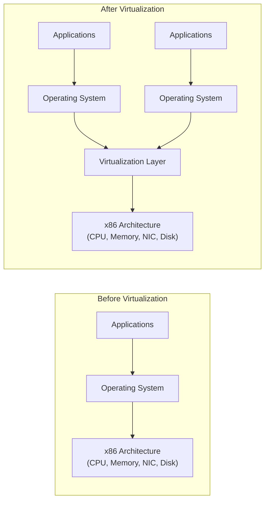

# Appendix A: Ethical Hacking Essential Concepts – I
## Part 6 — Virtualization Concepts

[← Back to Part 5: Network Troubleshooting](05-network-troubleshooting.md) | [Next: Network File System (NFS) →](07-nfs.md)

---

## Table of Contents

1. [Introduction to Virtualization](#introduction-to-virtualization)
2. [Characteristics of Virtualization](#characteristics-of-virtualization)
3. [Benefits of Virtualization](#benefits-of-virtualization)
4. [Common Virtualization Vendors](#common-virtualization-vendors)
5. [Virtualization Security and Concerns](#virtualization-security-and-concerns)
6. [Virtual Firewalls](#virtual-firewalls)
7. [Virtual Operating Systems](#virtual-operating-systems)
8. [Virtual Databases](#virtual-databases)
9. [Quick-Reference Summary](#quick-reference-summary)

---

## Introduction to Virtualization

**Virtualization** refers to the creation of a virtual version of hardware or software resources in a system.

**Before virtualization**, a hardware platform (host machine) runs a **single OS** and its applications. **After virtualization**, that same hardware platform runs **multiple operating systems and their applications** simultaneously, mediated by a virtualization layer sitting between the guest OSes and the physical hardware.

---

## Characteristics of Virtualization

| Characteristic | Description |
|---|---|
| **Partitioning** | The ability to run multiple operating systems and applications on a single physical system by virtually partitioning the hardware resources |
| **Isolation** | Each virtual machine is isolated from its physical host system and from other virtual machines |
| **Encapsulation** | A virtual machine represents a single file that can be easily identified based on the services it provides; encapsulation protects a VM from interference by other virtual machines |

---

## Benefits of Virtualization

| Benefit | Description |
|---|---|
| **Resource Efficiency** | Increases hardware utilization, which in turn increases Return-on-Investment (ROI) |
| **Increase in Uptime** | Increases the availability of redundant system resources and interconnections on a single physical system |
| **Reduced Disk Space Consumption** | Enables effective utilization of available disk space, minimizing consumption |
| **Increased Flexibility** | Provides greater flexibility in deployment and increases network resource multiplexing |
| **Business Continuity** | Helps achieve business continuity and disaster recovery |
| **Improved Quality of Services** | Provides better QoS by distributing network load between virtual machines |
| **Migration** | Provides the ability to move data, applications, operating systems, and other resources from one machine to another |
| **Environmental Benefits** | Means less CO2 emissions and power savings |

---

## Common Virtualization Vendors

| Vendor | What They Offer |
|---|---|
| **VMware** (vmware.com) | Virtualizes networking, storage, and security to create virtual data centers and simplify IT provisioning |
| **Citrix** (citrix.com) | Virtualizes and transforms Windows apps and desktops into a secure, on-demand service meeting the mobility, security, and performance needs of both IT professionals and end users |
| **Oracle** (oracle.com) | Offers complete, integrated virtualization from desktops to data centers, enabling virtualization and management of an organization's hardware and software stacks |
| **Microsoft** (microsoft.com) | Virtualization products ranging from the data center to the desktop, for managing both physical and virtual assets from a single platform |

---

## Virtualization Security and Concerns

**Virtualization security** is achieved using a set of security measures, procedures, and processes to protect the virtualization infrastructure and environment.

**Typical Virtualization Security Process:**
1. Securing the **Virtual Environment**
2. Securing each **Virtual Machine (VM)** at the system level
3. Securing the **Virtual network**

**Virtualization Security Concerns:**

- Due to the additional layer of infrastructure complexity, it's genuinely difficult to monitor unusual events and anomalies
- Offline VMs can be used as a **gateway** to gain access to a company's systems
- Because of the dynamic nature of virtual machines, workloads can easily move to a new virtual machine with a **lower level of security** than intended

---

## Virtual Firewalls

**Virtual firewalls** are software firewall programs that monitor and control the packets transmitted between VMs, running entirely within the virtual environment and filtering data packets according to security policies and rulesets.

| Mode | Description |
|---|---|
| **Bridge-mode** | The firewall resides at the inter-network virtual switch and filters traffic there |
| **Hypervisor-mode** | The virtual firewall resides at the virtual machine monitor and monitors all VM activity — hardware, software, storage, services, and memory |

---

## Virtual Operating Systems

**Virtual Operating Systems** refer to the logical installation of an OS in virtualization software on a pre-installed host OS — helping users run multiple operating systems on a single piece of hardware and switch between them based on usage.

| Advantages | Limitations |
|---|---|
| Additional hardware not required | Consumes significant host resources (CPU, memory) |
| Efficient usage of system resources | Virtual OS system calls must pass through the host OS's hardware, which minimizes performance |
| Replicates most major host OS services (backup, recovery, security management) | |

---

## Virtual Databases

A **virtual database** is a type of database management system that lets users query various databases simultaneously by treating them as a single entity.

| Advantages | Disadvantages |
|---|---|
| Allows sharing the overload burden of larger databases in a similar environment | Requires huge amounts of resources for different database-related tasks |
| Simplifies migration of databases from one server to another | Creates complexity for database administrators (DBAs), who must maintain the DBs alongside the virtualization technology |
| Allows dynamic, automated deployment of new system instances and resources when required | Difficult to resolve issues with a virtual database when the error originates in the VM or virtual system |
| Increases database availability by isolating virtual DBs and switching to another when one goes down | |

---

## Quick-Reference Summary

- **Virtualization** = creating a virtual version of hardware/software resources, letting one physical host run multiple OSes via a virtualization layer
- **3 characteristics**: Partitioning, Isolation, Encapsulation
- **8 benefits**: resource efficiency, uptime, reduced disk consumption, flexibility, business continuity, improved QoS, migration, environmental benefits
- **4 major vendors**: VMware, Citrix, Oracle, Microsoft
- **Security process**: secure the virtual environment → secure each VM → secure the virtual network — with real concerns around monitoring difficulty, offline VMs as an attack gateway, and workload migration to under-secured VMs
- **Virtual firewalls** run in bridge-mode (inter-network switch) or hypervisor-mode (VM monitor level)
- **Virtual OS** trades hardware savings for host-resource consumption and reduced performance
- **Virtual databases** trade query-simplicity and availability gains for added DBA complexity and troubleshooting difficulty

---

*Part of the CEH Appendix A study series — continues in [Part 7: Network File System (NFS)](07-nfs.md).*
