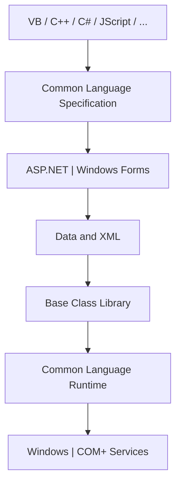

# Appendix A: Ethical Hacking Essential Concepts – I
## Part 8 — Web Markup and Programming Languages

[← Back to Part 7: Network File System (NFS)](07-nfs.md) | [Next: Application Development Frameworks and Vulnerabilities →](09-application-development-frameworks.md)

---

## Table of Contents

1. [HTML](#html)
2. [XML](#xml)
3. [Java](#java)
4. [.NET](#net)
5. [C#](#c-sharp)
6. [JSP (Java Server Pages)](#jsp-java-server-pages)
7. [ASP (Active Server Pages)](#asp-active-server-pages)
8. [PHP](#php)
9. [Perl](#perl)
10. [JavaScript](#javascript)
11. [Bash Scripting](#bash-scripting)
12. [PowerShell](#powershell)
13. [C and C++](#c-and-c)
14. [CGI (Common Gateway Interface)](#cgi-common-gateway-interface)
15. [Quick-Reference Summary](#quick-reference-summary)

---

## HTML

**HTML (Hyper Text Markup Language)** is the main markup language for creating web pages and other information displayed in a web browser. HTML uses tags and attributes to define the structure and layout of a web document.

```html
<html>
<body>
<p>Hello World! </p>
</body>
</html>
```

---

## XML

**XML (Extensible Markup Language)** is a markup language that defines a set of rules for **converting data** into a machine- and human-readable format. It's derived from SGML (Standard Generalized Markup Language) and designed to store and transport data.

**Characteristics:** extensible; carries but does not present the data; a public standard.

**Advantages:** exchanges information between organizations and systems; used for offloading and reloading databases; stores and arranges data in a way that's customizable to handling needs; merges easily with style sheets for almost any desired output.

An XML document follows rules built from an **XML Declaration**, **Tags & Elements**, **Attributes**, **Text**, and **References**, all governed by the document's syntax rules.

---

## Java

**Java** is an object-oriented application programming language developed by Sun Microsystems, designed for use in **distributed environments**. It can build a small application module (an **applet**) for use as part of a web page, and supports a large set of protocols, mechanisms, tools, APIs, and security algorithms that help secure the application code.

**Features:** platform-independent, multithreaded programming, built-in network support, automatic garbage collection, designed to securely execute code from remote sources, designed to handle exceptions, and portability.

### Java Security Platform

The Java security platform is formed from two parts:

- **Core Java 2 Security Architecture** — Byte Code Verifier, Security Manager, Class Loader, Access Controller, Access Rights, Policy Description Tools
- **Java Cryptography Architecture** — Digital Signatures (RSA, DSA), Standard Algorithms (AES, Triple DES, SHA, RC2/RC4, PKCS#5), Key Generators and Key Factories, Message Authentication Codes

Both sit on top of the **Java Virtual Machine (JVM)** and its **Sandbox**. Java Extensions include **JCE** (Java Cryptography Extension), **JSSE** (Java Secure Socket Extension), and **JAAS** (Java Authentication and Authorization Service).

---

## .NET

Microsoft's **.NET** is a software programming architecture for building internet-enabled and web-based applications, made up of several technologies for building internet-based distributed systems.

**.NET implementation includes:** C#, VB.NET, ASP.NET, ADO.NET.

### .NET Framework Architecture

Built on **CLR, FCL, and JIT** technology:

- **Common Language Runtime (CLR)** — an execution environment that manages running code and provides services for existing code/systems, making software development easier
- **Class Libraries** — the .NET Framework class library is a collection of reusable classes, interfaces, and value types providing access to system functionality
- **Assembly** — the building blocks of .NET applications, used for deployment, versioning, and security



---

## C# {#c-sharp}

**C#** (pronounced "C sharp") is an object-oriented, type-safe programming language that may feel familiar to C/C++ programmers. It combines the productivity of Rapid Application Development (RAD) languages with the power of C++.

```csharp
// Hello1.cs
public class Hello1
{
    public static void Main()
    {
        System.Console.WriteLine("Hello, World!");
    }
}
```

---

## JSP (Java Server Pages)

**JSP** is a Java-based technology for developing **dynamic web pages**, running in a server-side component called a **JSP container**. Similar to ASP and PHP, but uses the Java programming language.

**Fundamental tags:** `<%...%>` Scriptlets, `<%!...%>` Declarative, `<%@...%>` Directive, `<%=...%>` Expression.

**Advantages:** supports HTML and Java code; supports standard web development tools; easy language and tags.

**Disadvantages:** difficult to debug (JSP pages are converted into servlets, then compiled); database connectivity isn't as easy as expected; extremely difficult to choose the appropriate servlet engine.

The **JSP Model 2 architecture** follows MVC: a Web Browser sends requests to a Servlet/Filter (Controller), which coordinates JSP pages (Views) and a JavaBeans Model, both drawing from Data Sources/Databases on the server.

---

## ASP (Active Server Pages)

**ASP** is Microsoft's development framework for building **dynamic web pages**.

**Advantages:** 3-tier architecture; compatible with about 55 languages; consistent programming model; provides direct security support.

**Disadvantages:** limited ability for client event control; interpreted and loosely-typed code; mixes layout (HTML) and logic (scripting code); limited development/debugging tools; no real state management.

**Processing of an ASP page:** Browser → Request → Web Server → (Processing) → HTML File / Memory-ASP File → back to Browser.

---

## PHP

**PHP (Hypertext Preprocessor)** is an open-source **server-side scripting language** for developing dynamic and interactive web pages.

**Advantages:** easy to use; fast performance; open source with powerful library support; stable; both procedural and object-oriented; built-in database connection module.

**Disadvantages:** security (open source means anyone can see source code); not well-suited for large-scale applications since it isn't modular.

```php
<html>
  <head>
    <title>Hello World</title>
  </head>
  <body>
    <?php echo "Hello, world!"; ?>
  </body>
</html>
```

---

## Perl

**Perl (Practical Extraction and Report Language)** is a high-level, script, general-purpose, interpreted, cross-platform, **dynamic programming language** — designed for text editing and most popularly used in web development. Can also be used for **image creation and manipulation**.

**Features:** works with HTML, XML, and other markup languages; supports Unicode; Y2K compliant; supports both procedural and object-oriented programming; interfaces with external C/C++ libraries through XS or SWIG; extensible.

**Advantages:** the most powerful language for text handling and parsing; no need to compile a Perl script, so it takes less time to execute; simple and easy to understand; object oriented; widely used in web development, especially for payment gateways.

**Disadvantages:** minimal GUI support compared to other languages; understanding complex patterns requires real experience.

---

## JavaScript

**JavaScript** is a dynamic computer programming scripting language that works in all major browsers (Internet Explorer, Mozilla, Firefox, Netscape, Opera). Used to improve design, validate forms, detect browsers, and create cookies, among other tasks, in web pages.

**Advantages:** less server interaction; immediate feedback for visitors; increased interactivity; richer interfaces.

**Disadvantages:** lacks multithreading or multiprocessor capabilities; cannot be used for networking applications.

---

## Bash Scripting

The **Bash shell** is a scripting environment that ships with Linux distributions and is generally very useful for **automating certain actions during penetration testing**. It's essential for a penetration tester to be familiar with the bash script environment to speed up testing work.

**Creating a bash file:** create a text file with any text editor and give it the `.sh` extension.

```bash
#!/bin/bash
for ip in $(cat www.certifiedhacker.com-subs.txt); do whois $ip; done
```

```bash
#!/bin/bash
nmap certifiedhacker.com
```

---

## PowerShell

**PowerShell** is an object-oriented command-line shell and scripting language developed by Microsoft to help system administrators configure systems and automate administrative tasks. Built on the **.NET Framework** common language runtime — PowerShell doesn't just accept and return text, but also **.NET Framework Objects**. It includes **cmdlets** (command-lets) that perform single functions.

**PowerShell executes 4 types of commands:**
1. PowerShell functions
2. Executable programs
3. Cmdlets
4. PowerShell scripts

---

## C and C++ {#c-and-c}

### C

A **procedure-oriented programming language** for writing computer programs, giving total control and efficiency for reading/writing code across different platforms — scientific systems, OSs, and microcontrollers. A **middle-level language**, combining elements of high-level languages with the functionality of assembly languages.

```c
#include <stdio.h>
int main(void)
{
    printf("Example program in C");
    return 0;
}
```

**Key Features:** low-level features (easy to write assembly-adjacent code, closely related to low-level languages), portability (runs on any compiler with little/no modification), powerful (wide variety of data types, useful control/loop statements), bit manipulation (wide variety of bit-manipulation operators), high-level features (more user-friendly), modular programming (code written in reusable routines/functions), efficient use of pointers/dynamic memory allocation/graphic programming, and a rich library of routines for string manipulation, I/O, mathematical functions, and more.

### C++

An **object-oriented programming language** providing better abstraction through classes and objects. A superset of C, supporting both static and dynamic polymorphism.

```cpp
#include <iostream>
using namespace std;
int main()
{
    cout << "First program in C++";
    return 0;
}
```

**Key Features:** classes (user-defined data types), inheritance, data abstraction, encapsulation, polymorphism, dynamic binding, message passing, function overloading, operator overloading, plus try-catch-throw exception handling, stricter type checking, and more versatile data access.

---

## CGI (Common Gateway Interface)

**CGI** is the standard way for a **web server** to connect to external applications — it gathers information sent from a web browser to a web server, makes it available to an external program, and forwards the output received from that program back to the web browser.

**How a CGI request is processed:**

1. The user fills out a form in the browser
2. The form is submitted over the internet
3. The server sends the data to the CGI application
4. The CGI application processes the data and generates the HTML page
5. The server sends the page back to the browser

CGI is supported by many web servers and is language-independent — widely used with Perl, C, and C++.

---

## Quick-Reference Summary

- **Markup**: HTML (page structure), XML (data interchange, SGML-derived)
- **Java**: platform-independent, distributed-systems-oriented, with a dedicated 2-part security architecture (Core Security + Cryptography Architecture) plus JCE/JSSE/JAAS extensions
- **.NET**: Microsoft's internet-app architecture (C#, VB.NET, ASP.NET, ADO.NET), built on CLR + Class Libraries + Assemblies
- **Server-side dynamic page tech**: JSP (Java-based, MVC via Model 2), ASP (Microsoft, 3-tier), PHP (open-source, easy but less scalable)
- **Scripting**: Perl (text-processing powerhouse), JavaScript (client-side browser interactivity), Bash (Linux automation — genuinely useful for pentesters), PowerShell (Windows/.NET object-oriented automation)
- **Systems languages**: C (procedural, low-level control) and C++ (OOP superset of C)
- **CGI**: the original standard bridging web servers to external programs, language-independent

---

*Part of the CEH Appendix A study series — continues in [Part 9: Application Development Frameworks and Vulnerabilities](09-application-development-frameworks.md).*
