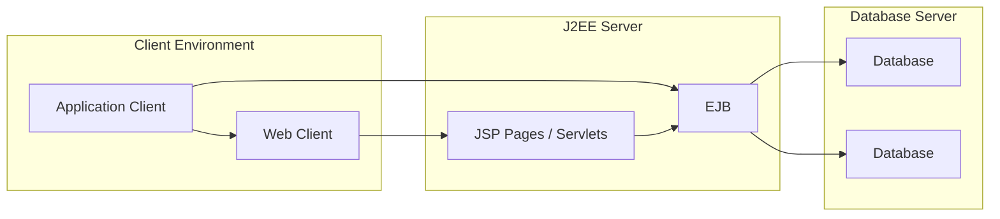
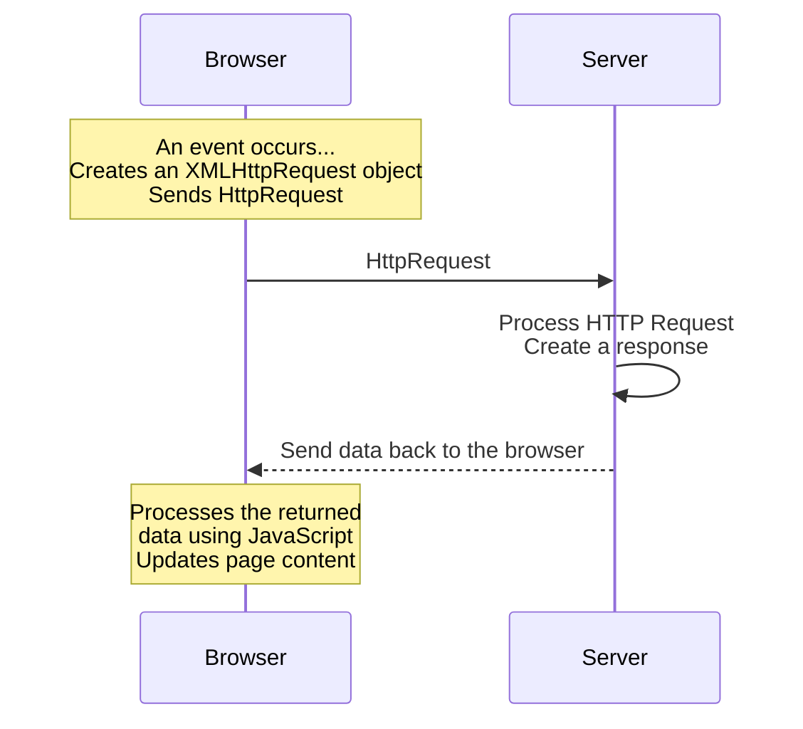

# Appendix A: Ethical Hacking Essential Concepts – I
## Part 9 — Application Development Frameworks and Their Vulnerabilities

[← Back to Part 8: Web Markup and Programming Languages](08-web-markup-and-programming-languages.md) | [Next: Web Subcomponents →](10-web-subcomponents.md)

---

## Table of Contents

1. [.NET Framework](#net-framework)
2. [J2EE Framework](#j2ee-framework)
3. [ColdFusion](#coldfusion)
4. [Ruby on Rails](#ruby-on-rails)
5. [AJAX](#ajax)
6. [Quick-Reference Summary](#quick-reference-summary)

---

## .NET Framework

Characteristics of the .NET Framework architecture, built on **CLR, FCL, and JIT** technology: **multi-language** and **cross-platform**.

### .NET Framework Vulnerabilities

| Vulnerability | Description |
|---|---|
| **Remote Code Execution** | Allows execution of code remotely via a malicious document or application |
| **Denial of Service (DoS)** | Allows submitting malicious input by sending crafted web requests; these requests deny legitimate user access to the .NET application service |
| **Feature Bypass** | Allows bypassing Enhanced Security Usage taggings on the presentation of an invalid certificate for a specific use |
| **Modifying the Framework Core (.NET Assembly Tampering)** | The framework DLLs can be tampered with to modify the implementation |

### .NET Framework Architecture (Recap)

`VB / C++ / C# / JScript / ...` → **Common Language Specification** → `ASP.NET / Windows Forms` → **Data and XML** → **Base Class Library** → **Common Language Runtime** → `Windows / COM+ Services` (all sitting under the umbrella of Visual Studio .NET).

---

## J2EE Framework

**J2EE (Java 2 Platform, Enterprise Edition)** is a platform-independent environment for designing and developing Java-based web applications, built on a **multi-tiered, distributed application model**.

### J2EE Components

Tiers: **Client Tier** (Application Client, Web Client) → **Web Tier / Business Tier** (JSP Pages/Servlets, EJB) → **EIS Tier** (Database).

### Some J2EE Framework Vulnerabilities

- **Bypass Cross-Site Scripting (XSS) protections** — allows bypassing XSS protections for J2EE applications using a request with non-canonical, "overlong Unicode" in place of blacklisted characters (a `%00`, encoded null byte)
- **Execute arbitrary programs** — the PointBase 4.6 database component in the J2EE 1.4 reference implementation (J2EE/RI) allows remote attackers to execute arbitrary programs using SQL statements
- **Denial of service** — the same PointBase 4.6 component allows remote attackers to execute arbitrary programs using SQL statements
- **Sensitive information disclosure** — again via the PointBase 4.6 component, allowing remote attackers to execute arbitrary programs using SQL statements

---

## ColdFusion

**ColdFusion** is a rapid web application development platform, built on Java and using the **Apache Tomcat J2EE container**.

### Some ColdFusion Framework Vulnerabilities

- **Directory Traversal**
- **Unvalidated Browser Input**
- **ColdFusion CSRF Vulnerability**
- **CFFILE, CFFTP, and CFPOP Vulnerability**
- **ColdFusion DoS Attack Vulnerability**

---

## Ruby on Rails

**Ruby on Rails** is a server-side web application framework implementing the **Model–View–Controller (MVC)** pattern.

| Component | Role |
|---|---|
| **Model (ActiveRecord)** | Maintains the relationship between objects and the database |
| **View (ActionView)** | Responsible for presentation of the data via script-based template systems (JSP, ASP, PHP) |
| **Controller (ActionController)** | Directs traffic by querying models for specific data and organizing that data for the view |

Rail application architecture: **Views** → User Interface Components and Views; **Controller** → Controller Methods; both connect to **Active Records** and the underlying **Database**.

### Ruby on Rails Framework Vulnerabilities

| Vulnerability | Description |
|---|---|
| **Remote Code Execution** | Any Rails application with the XML parser enabled is vulnerable to Remote Code Execution — facilitating database retrieval when executing vulnerable code |
| **Authentication Bypass** | The basic authentication process in Rails doesn't use a constant-time algorithm for verifying credentials, enabling bypass by measuring timing differences |
| **Denial of Service Attack** | Involves superfluous caching and memory consumption by leveraging an application's use of a wildcard controller route. Improperly restricted use of the MIME type cache causes denial of service (memory consumption) using a crafted HTTP Accept header |
| **Directory Traversal Vulnerability** | ActionView allows reading arbitrary files by leveraging an application's unrestricted use of the render method and providing a `..` (dot dot) in a pathname |
| **Cross-Site Scripting (XSS) Vulnerability** | ActionView allows injecting arbitrary web scripts or HTML via text declared as "HTML safe" and used as attribute values in tag handlers |

---

## AJAX

**AJAX (Asynchronous JavaScript and XML)** frameworks are used for creating web applications with a **dynamic link between the client and the server**.

### Technologies AJAX Uses

- **HTML/XHTML, CSS** — presentation
- **Document Object Model (DOM)** — dynamic display and interaction with data
- **JSON, XML** — interchange of data
- **XSLT** — manipulation
- **XMLHttpRequest object** — asynchronous communication
- **JavaScript** — integration for using all these technologies together

### Some AJAX Framework Vulnerabilities

- **Increased Attack Surface** — more hidden calls mean more security threats; multiple scattered endpoints and hidden calls
- **Browser-based attacks** — the browser security model isn't sufficient to deal with the AJAX model; JavaScript, the foundation of AJAX, is vulnerable to browser-based attacks
- **Cross-site Scripting** — dynamic building of the DOM; dynamic script construction and execution of JavaScript results in untrusted responses; user-controlled data ends up in more places; self-propagating XSS attack code; stream contents (JSON, XML, etc.) may be malicious
- **Mashup and Widget Hacks** — a mashup is essentially a self-inflicted XSS attack; mashups lack clear security boundaries; widgets get the same rights as the sites running them; 3rd-party APIs are designed for ease of use, not security; GET requests retrieving JSON information are vulnerable
- **CSRF Attack** — the cross-domain access workaround results in crafting an AJAX-based Dynamic CSRF attack vector
- **XML and JSON-based Attacks** — malicious SWF files injected; malware served as JavaScript; injections can occur in JSON, XML, SOAP, and other streams
- **SQL Injection** — injecting malicious SWF files; injecting malware serving JavaScript; injections occurring in JSON, XML, SOAP, and other streams
- **XPATH Injection** — a related injection vector targeting XML data queried via XPath

---

## Quick-Reference Summary

- **.NET Framework**: 4 vulnerability classes — remote code execution, DoS, feature bypass, assembly tampering
- **J2EE**: multi-tier Java enterprise platform (Client → Web/Business → EIS tiers); vulnerabilities largely trace back to the PointBase 4.6 reference database component and Unicode-based XSS-filter bypasses
- **ColdFusion**: rapid Java-based web dev platform on Apache Tomcat; 5 named vulnerability classes (directory traversal, unvalidated input, CSRF, CFFILE/CFFTP/CFPOP, DoS)
- **Ruby on Rails**: classic MVC framework (ActiveRecord/ActionView/ActionController); 5 vulnerability classes (RCE, auth bypass via timing, DoS via cache/MIME abuse, directory traversal, XSS)
- **AJAX**: dynamic client-server framework built on HTML/CSS + DOM + JSON/XML + XSLT + XMLHttpRequest + JavaScript; its dynamic, multi-endpoint nature drives a wide vulnerability surface — increased attack surface, browser-based attacks, XSS, mashup/widget hacks, CSRF, XML/JSON injection, SQL injection, and XPath injection

---

*Part of the CEH Appendix A study series — continues in [Part 10: Web Subcomponents](10-web-subcomponents.md).*
