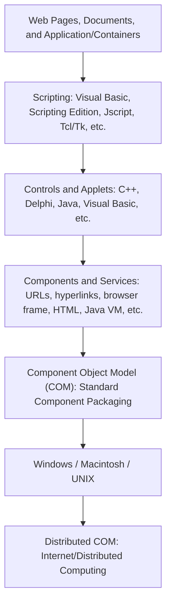

# Appendix A: Ethical Hacking Essential Concepts – I
## Part 10 — Web Subcomponents

[← Back to Part 9: Application Development Frameworks](09-application-development-frameworks.md) | [Next: Database Connectivity →](11-database-connectivity.md)

---

## Table of Contents

1. [The Three Primary Web Application Components](#the-three-primary-web-application-components)
2. [Thick and Thin Clients](#thick-and-thin-clients)
3. [Applet](#applet)
4. [Servlet](#servlet)
5. [ActiveX](#activex)
6. [Flash Application](#flash-application)
7. [Quick-Reference Summary](#quick-reference-summary)

---

## The Three Primary Web Application Components

Every web application is built from three primary components:

| Component | Role |
|---|---|
| **Web Browser (or Client)** | The user interface for interacting with the application; handles the presentation logic; validates user-provided input |
| **Web Application Server** | Retrieves and processes the requested file and renders the output to the web browser |
| **Database Server** | Stores data for the database-driven web application; provides business logic (stored procedures) |

---

## Thick and Thin Clients

In a **Client/Server architecture**, the **client** is an application that runs on a client machine and depends on the server to perform operations.

| | Thin Client | Thick Client | Smart Clients (Rich Clients) |
|---|---|---|---|
| **Deployment** | Software deployed on a central server location | Independent of a central processing server | Web-service-based communication |
| **Hardware/software needs** | Minimal hardware and software installation | Processing done on the client machine | Can execute without using the internet (offline) |
| **Basic requirement** | An input device (keyboard) and viewing device (display) | Customizable; provides more features (GUI and graphics) | Designed to run on multiple platforms and languages |
| **Management** | All end-users' systems are centrally managed | Server primarily stores data | Requires devices with internet connectivity (desktops, workstations, notebooks, tablet PCs, PDAs, mobile phones) |
| **Best suited for** | Applications where the same information is accessed by all clients; public environments (hotels, airports) | Not suited for public environments; requires OS-specific applications; more robust local computing environment | Offers rich GUIs |

---

## Applet

An **Applet** is a Java program embedded in a webpage — it runs inside the browser and works on the client side. An applet contains the entire **Java API**.

**Advantages:** fast performance (runs client-side); secure; can execute on multiple platforms (Linux, Windows, Mac).

**Disadvantages:** a plugin is required for the client browser to execute the applet.

### Life Cycle of an Applet

| Method | Purpose |
|---|---|
| `init()` | Used to initialize the applet |
| `start()` | Automatically called after the browser calls `init` |
| `stop()` | Automatically called on exiting the applet page |
| `destroy()` | Called when the browser shuts down normally |
| `paint()` | Invoked immediately after the `start()` method |

---

## Servlet

A **Servlet** is a Java program deployed on the server that responds to client requests and dynamically generates responses. Servlets are robust and scalable.

**Advantages:** allows creation of a dynamic web page; inherits all features of Java; portable across web servers; enables servlet-and-server communication.

**Disadvantages:** designing a servlet is difficult; performance is reduced when an application implements complex servlets; difficult to build complex business logic; requires the Java Runtime Environment on the server to execute servlets.

### Life Cycle of a Servlet

| Method | Purpose |
|---|---|
| `init()` | Initializes the servlet instance |
| `service()` | Invoked after every service request |
| `destroy()` | Removes the servlet from service |

---

## ActiveX

**ActiveX** is a set of technologies and services based on the **Component Object Model (COM)**, which makes it easy to integrate and reuse any component — bringing component-based development to the internet. **COM/DCOM** lets ActiveX components run anywhere.

- **ActiveX Controls** — controls that can be manipulated visually by GUI tools; Java VM and Java Components are ActiveX Components
- **ActiveX Scripting** — supports any scripting language, such as VBScript, JScript, Perl, PowerShell, and Tcl/Tk

### Elements of ActiveX

---

## Flash Application

Most websites use Flash components to provide rich functionality — appearing as animations, rich internet applications, desktop applications, mobile applications, mobile games, and embedded web browser video players.

| Advantages | Disadvantages |
|---|---|
| Allows interactivity | Takes more time to load |
| Compatible with all browsers | Needs Flash Player installed to watch Flash movies |
| | Difficult to optimize for search engines |

- **Tools to design Flash applications/video games:** Adobe Animate, Adobe Flash Builder, Adobe Director, FlashDevelop, Powerflasher FDT, Adobe AIR, Flash Catalyst, Apache Flex SDK (with any text editor)
- **Tools to view Flash applications:** Flash Player (web browsers), AIR (desktop/mobile apps), or third-party players like Scaleform (video games)
- **Language used to develop Flash applications:** ActionScript

---

## Quick-Reference Summary

- **3 web app components**: Browser (presentation/input validation), Web Application Server (request processing), Database Server (data + business logic)
- **Client types**: Thin (centrally managed, minimal local processing) vs. Thick (local processing, customizable, robust) vs. Smart/Rich (offline-capable, multi-platform, web-service based)
- **Applet**: Java program embedded in a page, client-side, 5-stage lifecycle (init → start → stop → destroy, with paint invoked after start)
- **Servlet**: Java program on the server, 3-stage lifecycle (init → service → destroy)
- **ActiveX**: COM/DCOM-based component reuse across the internet, layered from web pages/containers down through scripting, controls/applets, components/services, COM itself, and cross-platform distributed COM
- **Flash**: rich interactivity via ActionScript, but with real SEO and load-time trade-offs, requiring a dedicated player

---

*Part of the CEH Appendix A study series — continues in [Part 11: Database Connectivity](11-database-connectivity.md).*
