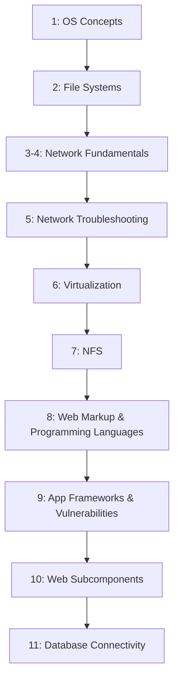

# CEH Appendix A: Ethical Hacking Essential Concepts – I

Personal study notes covering Appendix A of the CEH v13 curriculum — rewritten and organized into a structured reference repo, rather than reproduced verbatim from any copyrighted source material.

> These notes are written in original language for personal study and reference. They summarize and explain the concepts covered in Appendix A; they are not a copy of any textbook, courseware, or slide deck.

---

## What This Appendix Is

Unlike Modules 1 and 2, Appendix A isn't about attack techniques — it's a **foundations refresher**. It steps back to make sure the core computing concepts that every later module assumes fluency in are solid: operating systems, file systems, networking, virtualization, and web/database technologies.

---

## Learning Objectives

- [x] Explain Operating System Concepts
- [x] Explain Different Types of File Systems
- [x] Explain Computer Network Fundamental Concepts
- [x] Summarize the Basic Network Troubleshooting Techniques
- [x] Explain Virtualization Concepts
- [x] Explain Network File System (NFS)
- [x] Explain Various Web Markup and Programming Languages
- [x] Summarize Application Development Frameworks and Their Vulnerabilities
- [x] Explain Different Web Subcomponents
- [x] Explain Database Connectivity

**Appendix A is complete.** ✅

---

## Repo Structure

| # | File | Covers |
|---|---|---|
| 1 | [`01-operating-system-concepts.md`](01-operating-system-concepts.md) | Windows (family tree, User/Kernel Mode architecture), UNIX (3 components), Linux (architecture, 7 features), macOS (4-layer architecture) |
| 2 | [`02-file-systems.md`](02-file-systems.md) | 7 file system types, FAT/FAT32/NTFS/sparse files, Linux EXT→EXT2→EXT3→EXT4, the Filesystem Hierarchy Standard (FHS) |
| 3 | [`03-network-fundamentals-part1.md`](03-network-fundamentals-part1.md) | OSI & TCP/IP models, 6 network types, wireless standards/technologies, 6 topologies, hardware components, LAN technology, cabling |
| 4 | [`04-network-fundamentals-part2.md`](04-network-fundamentals-part2.md) | Application-layer protocols (DHCP/DNS/HTTP family/FTP family/SMTP family/PGP/Telnet/SSH/SOAP/SNMP/NTP/RPC/SMB/SIP/RADIUS/TACACS+/RIP), TCP/UDP internals, IP/ICMP/ARP, IP addressing & subnetting, ports, routing/NAT/VLAN |
| 5 | [`05-network-troubleshooting.md`](05-network-troubleshooting.md) | Diagnostic ICMP messages, the 6-step troubleshooting framework, upper-layer fault table, 10 troubleshooting tools |
| 6 | [`06-virtualization.md`](06-virtualization.md) | Virtualization characteristics/benefits, major vendors, security concerns, virtual firewalls/OS/databases |
| 7 | [`07-nfs.md`](07-nfs.md) | NFS security (host/file level), root squashing, nosuid, noexec |
| 8 | [`08-web-markup-and-programming-languages.md`](08-web-markup-and-programming-languages.md) | HTML, XML, Java, .NET, C#, JSP, ASP, PHP, Perl, JavaScript, Bash, PowerShell, C/C++, CGI |
| 9 | [`09-application-development-frameworks.md`](09-application-development-frameworks.md) | .NET/J2EE/ColdFusion/Ruby on Rails/AJAX and their named vulnerability classes |
| 10 | [`10-web-subcomponents.md`](10-web-subcomponents.md) | Thick/thin/smart clients, Applets, Servlets, ActiveX, Flash |
| 11 | [`11-database-connectivity.md`](11-database-connectivity.md) | Web app connectivity to SQL Server, MS Access, MySQL, and Oracle |

---

## Suggested Reading Order

Each file is self-contained with its own table of contents and a quick-reference summary at the bottom, so you can also jump straight to whichever topic you need.

---

## Relationship to the Rest of the Repo

Appendix A sits alongside the main module sequence as background material:

- [`../CEH-Module-01-Introduction-to-Ethical-Hacking/`](../CEH-Module-01-Introduction-to-Ethical-Hacking/README.md) — foundational security concepts, hacking/ethical hacking concepts, methodologies, controls, laws
- [`../CEH-Module-02-Footprinting-and-Reconnaissance/`](../CEH-Module-02-Footprinting-and-Reconnaissance/README.md) — the first attack-methodology phase: reconnaissance
- **This appendix** — the IT/CS fundamentals (OS, file systems, networking, virtualization, web/database tech) that the modules above assume familiarity with

---

## About This Repo

Compiled as part of an ongoing CEH v13 study track, alongside parallel work in CTF challenges and web security (SSRF and related topics). Structured for easy GitHub browsing — each part links to the next, diagrams render natively via Mermaid, and comparison tables are used wherever they make scanning faster than prose.
