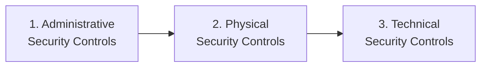
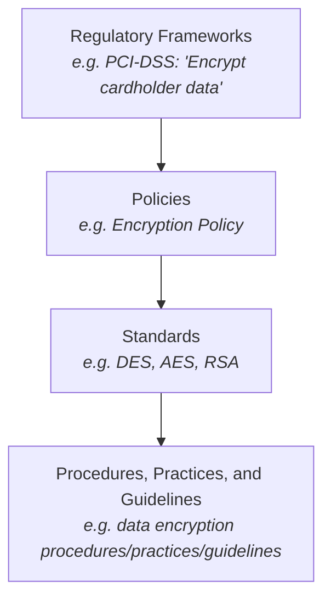

# Appendix B: Ethical Hacking Essential Concepts – II
## Part 1 — Information Security Controls

[Back to README](README.md) | [Next: Network Segmentation Concepts →](02-network-segmentation.md)

---

## Table of Contents

1. [Information Security Management Program](#information-security-management-program)
2. [Enterprise Information Security Architecture (EISA)](#enterprise-information-security-architecture-eisa)
3. [The Three Categories of Information Security Controls](#the-three-categories-of-information-security-controls)
4. [Administrative Security Controls](#administrative-security-controls)
5. [Regulatory Frameworks Compliance](#regulatory-frameworks-compliance)
6. [Information Security Policies](#information-security-policies)
7. [Privacy Policies at the Workplace](#privacy-policies-at-the-workplace)
8. [Steps to Create and Implement Security Policies](#steps-to-create-and-implement-security-policies)
9. [HR and Legal Implications of Security Policy Enforcement](#hr-and-legal-implications-of-security-policy-enforcement)
10. [Security Awareness and Training](#security-awareness-and-training)
11. [Separation of Duties and Principle of Least Privilege](#separation-of-duties-and-principle-of-least-privilege)
12. [Physical Security Controls](#physical-security-controls)
13. [Technical Security Controls](#technical-security-controls)
14. [Access Control](#access-control)
15. [Identity and Access Management (IAM)](#identity-and-access-management-iam)
16. [Authentication Types](#authentication-types)
17. [Authorization Types](#authorization-types)
18. [Accounting](#accounting)
19. [Quick-Reference Summary](#quick-reference-summary)

---

## Information Security Management Program

Information security management programs are **designed to enable a business to operate in a state of reduced risk**, encompassing all organizational and operational processes and participants relevant to information security.

The **Information Security Management Framework** is a combination of well-defined policies, processes, procedures, standards, and guidelines used to establish the required level of information security. It spans:

- **Security Policy**
- **Roles & Responsibilities**
- **Security Guidelines & Frameworks**
- **Risk Management**, **Technical Security Architecture**, **Asset Classification**, **Security Management and Operations**
- **Business Resilience** — Business Continuity Management, Disaster Recovery
- **Training & Awareness**
- **Security Metrics & Reporting**

...all sitting under the umbrella of organizational **Governance** and **Compliance**.

---

## Enterprise Information Security Architecture (EISA)

**EISA** is a set of requirements, processes, principles, and models that determines the structure and behavior of an organization's information systems.

### EISA Goals

1. Helps to **monitor and detect** network behaviors in real time, acting upon internal and external security risks
2. Helps an organization **detect and recover** from security breaches
3. Helps to **prioritize resources** and **monitor various threats**
4. **Benefits an organization's budget** from a cost perspective when incorporated into incident response, disaster recovery, event correlation, and other security provisions
5. Helps analyze the procedure needed for the IT department to function properly and **identify assets**
6. Helps to **perform risk assessment** of an organization's IT assets with the cooperation of IT staff

---

## The Three Categories of Information Security Controls

The rest of this file walks through all three in depth.

---

## Administrative Security Controls

**Administrative security controls** are the administrative access controls implemented by management to ensure the safety of the organization.

### Examples of Administrative Security Controls

1. Regulatory Framework Compliance
2. Information Security Policy
3. Employee Monitoring and Supervising
4. Information Classification
5. Separation of Duties
6. Principle of Least Privileges
7. Security Awareness and Training

---

## Regulatory Frameworks Compliance

Complying with regulatory frameworks is a **collaborative effort** between governments and private bodies to encourage voluntary improvements to cybersecurity. The role of regulatory compliance in an organization's administrative security follows a layered structure:

---

## Information Security Policies

Security policies are the **foundation of security infrastructure**. An information security policy defines the basic security requirements and rules to be implemented to protect and secure an organization's information systems.

### Goals of Security Policies

1. Maintain an outline for the management and administration of network security
2. Protect an organization's computing resources
3. Eliminate legal liabilities arising from employees or third parties
4. Prevent waste of the company's computing resources
5. Prevent unauthorized modifications of data
6. Reduce risks caused by illegal use of system resources
7. Differentiate the users' access rights
8. Protect confidential, proprietary information from theft, misuse, and unauthorized disclosure

### Types of Security Policies

| Policy | Description |
|---|---|
| **Promiscuous Policy** | No restrictions on usage of system resources |
| **Permissive Policy** | Policy begins wide open — only known dangerous services, attacks, and behaviors are blocked. Should be updated regularly to stay effective |
| **Prudent Policy** | Provides maximum security while allowing known but necessary dangers. Blocks all services; only safe or necessary services are individually enabled; everything is logged |
| **Paranoid Policy** | Forbids everything — either severely limited internet usage or no internet connection at all |

### Examples of Security Policies

| Policy | What It Defines |
|---|---|
| **Access-control Policy** | The resources being protected and the rules that control access to them |
| **Remote-access Policy** | Who can have remote access, and the access medium and remote-access security controls |
| **Firewall-management Policy** | Access, management, and monitoring of the organization's firewalls |
| **Network-connection Policy** | Who can install new resources on the network, approve installation of new devices, document network changes, and other tasks |
| **Passwords Policy** | Guidelines for using strong password protection for the organization's resources |
| **User-account Policy** | The user-account creation process, account authority, and rights/responsibilities |
| **Information-protection Policy** | The sensitivity levels of information, who may have access, how it's stored/transmitted, and how it should be deleted from storage media |
| **Special-access Policy** | The terms and conditions for granting special access to system resources |
| **Email-security Policy** | Created to govern the proper usage of corporate email |
| **Acceptable-use Policy** | The acceptable use of system resources |

---

## Privacy Policies at the Workplace

Employers have access to employees' personal information — some of it confidential and something employees wish to keep private.

### Basic Rules for Privacy Policies at the Workplace

- **Intimate employees** about what information you collect, why, and what you will do with it
- Keep employees' personal information **accurate, complete, and up-to-date**
- **Limit the collection** of information and collect it through fair and lawful means
- Provide employees with **access to their personal information**
- Inform employees about the **potential collection**, use, and disclosure of personal information
- Keep employees' personal information **secure**

> **Note:** Employee privacy rules in workplaces may differ from country to country.

---

## Steps to Create and Implement Security Policies

1. Perform a **risk assessment** to identify risks to the organization's assets
2. Learn from **standard guidelines** and other organizations
3. Include **senior management** and all other staff in policy development
4. **Set clear penalties** and enforce them
5. Make the **final version** available to all staff in the organization
6. Ensure every member of your staff **reads, signs, and understands** the policy
7. Deploy tools to **enforce policies**
8. **Train employees** and educate them about the policy
9. Regularly **review and update** the policy

The **security policy development team** in an organization generally consists of: the Information Security Team (IST), Technical Writer(s), Technical Personnel, Legal Counsel, Human Resources, Audit and Compliance Team, and User Groups.

---

## HR and Legal Implications of Security Policy Enforcement

| HR Implications | Legal Implications |
|---|---|
| The HR department is responsible for **making employees aware of security policies** and training them in the policy's best practices | Enterprise information policies should be **developed in consultation with legal experts** and must comply with relevant local laws |
| The HR department works with management to **monitor policy implementation** and address any policy violation issues | Enforcement of a security policy that may **violate users' rights** in contravention of local laws may result in lawsuits against the organization |

---

## Security Awareness and Training

Employees are one of the primary assets of an organization and can also be part of its attack surface. Organizations need to provide **formal security awareness training** to employees when hiring and periodically thereafter, so employees:

- Know how to defend themselves and the organization against threats
- Follow security policies and procedures for working with IT
- Know whom to contact if they discover a security threat
- Are able to identify the nature of data based on data classification
- Protect the physical and informational assets of the organization

To comply with certain regulatory frameworks, organizations should also provide security awareness training that meets regulatory requirements. **Different training methods:** classroom-style training, online training, round table discussions, security awareness websites, hints, short films, seminars.

### Security Policy Training

Teaches employees how to perform their duties and comply with security policy. Organizations should train new employees before granting network access, or provide only limited access until training is complete.

**Advantages:** effective implementation of security policy; creates awareness of compliance issues; helps enhance network security.

### Physical Security Training

Should include: how to minimize breaches; how to identify the elements most prone to hardware theft; how to assess risks when handling sensitive data; how to ensure physical security at the workplace.

### Social Engineering Training

| Area of Risk | Attack Technique | Train Employee or Help Desk On |
|---|---|---|
| **Phone** | Impersonation | Not providing any confidential information |
| **Dumpsters** | Dumpster Diving | Not throwing sensitive documents in the trash; shredding documents before disposal; erasing magnetic data before throwing out |
| **Email** | Phishing or Malicious Attachments | Differentiating between legitimate emails and a targeted phishing email; not downloading malicious attachments |

### Data Classification Training

| Area of Risk | Attack Technique | Train Employee or Help Desk On |
|---|---|---|
| **Office** | Stealing sensitive information | How to classify and mark document-based classification levels, and keep sensitive documents in a secure place |

**Typical information classification levels:** Top Secret (TS), Secret, Confidential, Restricted, Official, Unclassified, Clearance, Compartmented information.

Security labels are used to mark the security-level requirements for information assets and to control access to them; organizations use these labels to manage access clearance to their information assets.

---

## Separation of Duties and Principle of Least Privilege

| Separation of Duties (SoD) | Principle of Least Privileges (POLP) |
|---|---|
| **Conflicting responsibilities** create unwanted risks such as security breaches, information theft, and circumvention of security controls | Believes in providing employees with the **minimum necessary** access they need — no more, no less |
| A successful security breach sometimes requires the collusion of two or more parties; separation of duties works well to reduce the likelihood of crime | Helps the organization protect against malicious behavior and achieve better system stability and security |
| Regulations such as **GDPR** insist on paying attention to the roles and duties of your security team | |

---

## Physical Security Controls

**Physical security** is the **first layer of protection** in any organization, involving the protection of organizational assets from environmental and man-made threats.

### Why Physical Security?

- To prevent any unauthorized access to the system's resources
- To prevent the tampering or stealing of data from computer systems
- To safeguard against espionage, sabotage, damage, and theft
- To protect personnel and prevent social engineering attacks

### Physical Security Threats

- **Environmental threats** — floods and earthquakes, fire, dust
- **Man-made threats** — terrorism, wars, explosion, dumpster diving and theft, vandalism

### Examples of Physical Access Controls

Locks, Fences, Badge systems, Security guards, Mantrap doors, Biometric systems, Lighting, Motion detectors, Closed-circuit TVs, Alarms.

### Types of Physical Security Controls

| Control Type | Description |
|---|---|
| **Preventive Controls** | Prevent security violations and enforce various access control mechanisms (door locks, security guards, and other measures) |
| **Detective Controls** | Detect security violations and record any intrusion attempts (motion detectors, alarm systems and sensors, video surveillance, and other methods) |
| **Deterrent Controls** | Discourage attackers and send warning messages to discourage intrusion attempts (various types of warning signs) |
| **Recovery Controls** | Recover from a security violation and restore information/systems to a persistent state (disaster recovery, business continuity plans, backup systems, and other processes) |
| **Compensating Controls** | An alternative control used when the intended controls fail or cannot be used (hot sites, backup power systems, and other means) |

### Physical Security Controls by Area

| Area | Controls |
|---|---|
| **Premises and company surroundings** | Fences, gates, walls, guards, alarms, CCTV cameras, intruder systems, panic buttons, burglar alarms, windows and door locks, deadlocks, and other methods |
| **Reception area** | Lock up important files and documents; lock equipment when not in use |
| **Server and workstation area** | Lock systems when not in use, disable or avoid removable media and DVD-ROM drives, CCTV cameras, workstation layout design |
| **Other equipment (fax, modem, removable media)** | Lock fax machines when not in use, file received faxes properly, disable modems' auto-answer mode, do not place removable media in public places, physically destroy corrupted removable media |
| **Access control** | Separate work areas; implement biometric access controls (fingerprinting, retinal scanning, iris scanning, vein structure recognition, facial recognition, voice recognition), entry cards, man traps, faculty sign-in procedures, identification badges, and other means |
| **Computer equipment maintenance** | Appoint a person to look after computer equipment maintenance |
| **Wiretapping** | Routinely inspect all wires carrying data, protect wires using shielded cables, never leave wires exposed |
| **Environmental control** | Humidity and air conditioning, HVAC, fire suppression, EMI shielding, hot and cold aisles |

---

## Technical Security Controls

A set of security measures taken to protect data and systems from unauthorized personnel.

### Examples of Technical Security Controls

Access Controls, Authentication, Authorization, Auditing, Security Protocols, Network Security Devices.

---

## Access Control

**Access control** is the selective restriction of access to a place or other system/network resource — it protects information assets by determining who can and cannot access them, and involves user identification, authentication, authorization, and accountability.

### Access Control Terminology

| Term | Description |
|---|---|
| **Subject** | A particular user or process which wants to access the resource |
| **Object** | A specific resource that the user wants to access, such as a file or any hardware device |
| **Reference Monitor** | Checks the access control rule for specific restrictions |
| **Operation** | Represents the action taken by the subject on the object |

### Types of Access Control

| Type | Description |
|---|---|
| **Discretionary Access Control (DAC)** | Permits the user who is granted access to information to decide how to protect that information and determine the desired level of sharing. Access to files is restricted to users and groups based on their identity and the groups to which the users belong |
| **Mandatory Access Control (MAC)** | Does not permit the end user to decide who can access the information, and does not permit the user to pass privileges on to other users — system access could then be circumvented |
| **Role-based Access** | Users are assigned access to systems and fields on a one-by-one basis, whereby access is granted to the user for a particular file or system. Simplifies the assignment of privileges and ensures individuals have all the privileges necessary to perform their duties |

---

## Identity and Access Management (IAM)

**IAM** is a framework of users, procedures, and software used to manage user digital identities and access to an organization's resources. It ensures that "the right users obtain access to the right information at the right time."

The services provided by IAM are classified into **four distinct components**:

1. **Authentication**
2. **Authorization**
3. **User Management**
4. **Enterprise Directory Services** (Central User Repository)

### IAM Framework (as structured in the source)

- **Authentication** — Single Sign-on, Session Management, Password Services, Strong Authentication, Multi-Factor Authentication
- **Authorization** — Role-based Authorization, Attribute-based Authorization, Rule-based Authorization, Remote Authorization
- **Enterprise Directory Service** — Directory Services, Data Synchronization, Meta Directory, Virtual Directory
- **User Management** — Delegated Administration, User & Role Management, Provisioning, Password Management, Self Service, Compliance Auditing

All of this sits between **Access Management** (top) and **Identity Management** (bottom) in the overall IAM structure.

### User Identification, Authentication, Authorization, and Accounting

| Term | Description |
|---|---|
| **Identification** | A method to ensure an individual holds a valid identity (e.g., username, account number, or other identifying data) |
| **Authentication** | Involves validating the identity of an individual (e.g., password, PIN, or other method) |
| **Authorization** | Involves controlling an individual's access to information (e.g., a user can read a file but cannot overwrite or delete it) |
| **Accounting** | A method of keeping track of user actions on the network — the who, when, and how of network access. Helps identify authorized and unauthorized actions |

---

## Authentication Types

### Password Authentication

Uses a combination of username and password to authenticate network users. The password is checked against a database and access is allowed if it matches. Password authentication can be vulnerable to password-cracking attacks such as brute force or dictionary attacks.

### Two-Factor Authentication

Uses two different authentication factors out of a possible three (a **knowledge factor**, a **possession factor**, and an **inherence factor**) to verify identity and enhance security.

- **Common combinations:** password + smartcard/token, password + biometrics, password + OTP, smartcard/token + biometrics, or other combinations
- **Inherence factor (biometric authentication)** is considered the best companion for two-factor authentication, since it's the hardest to forge or spoof
- **Most widely used physical/behavioral characteristics:** fingerprints, palm pattern, voice or face pattern, iris features, keyboard dynamics, and signature dynamics

### Biometric Authentication

Refers to identifying individuals based on their physical characteristics.

| Technique | Description |
|---|---|
| **Fingerprinting** | Ridges and furrows on the surface of the fingertip, individually unique |
| **Retinal Scanning** | Analyzes the layer of blood vessels at the back of the eyes |
| **Iris Scanning** | Analyzes the colored part of the eye |
| **Vein Structure Recognition** | Analyzes the thickness and location of veins |
| **Face Recognition** | Analyzes the pattern of facial features |
| **Voice Recognition** | Analyzes an individual's vocal pattern |

### Smart Card Authentication

A smartcard is a small computer chip device that holds the personal information required to authenticate the user. Users insert their smartcard into a reader and enter their PIN to complete authentication. A cryptography-based authentication method that provides stronger security than password authentication alone.

### Single Sign-On (SSO)

Allows a user to authenticate themselves to multiple servers on a network with a single password, without re-entering it every time.

**Advantages:** users don't need to remember passwords for multiple applications/systems; reduces time needed for entering credentials; reduces network traffic to the centralized server; users only need to enter credentials once for multiple applications (e.g., a single authentication reaching an App Server, Email Server, and DB Server all at once).

---

## Authorization Types

Authorization involves controlling an individual's access to information.

| Type | Description |
|---|---|
| **Centralized Authorization** | Authorization for network access is done through a single centralized authorization unit; maintains a single database for authorizing all network resources/applications; an easy and inexpensive approach |
| **Decentralized Authorization** | Each network resource maintains its own authorization unit and performs authorization locally; maintains its own database for authorization |
| **Implicit Authorization** | Users can access the requested resource on behalf of others; the access request goes through a primary resource to access the requested resource |
| **Explicit Authorization** | Unlike implicit authorization, requires separate authorization for each requested resource; explicitly maintains authorization for each requested object |

---

## Accounting

**Accounting** is a method of keeping track of user actions on the network — the who, when, and how of network access. It helps identify authorized and unauthorized actions, and the resulting account data can be used for trend analysis, data breach detection, forensics investigations, and other purposes.

**Accountability flow:** Identity → Authentication ("Who are you?") → Authorization ("What rights you have") → Object (the resource being accessed).

---

## Quick-Reference Summary

- **3 categories of information security controls**: Administrative → Physical → Technical
- **Administrative controls**: regulatory compliance, security policy, employee monitoring, information classification, SoD, POLP, security awareness/training
- **4 policy types by strictness**: Promiscuous (none) → Permissive (block known-bad) → Prudent (allow known-necessary) → Paranoid (block everything)
- **10 named example policies**: access-control, remote-access, firewall-management, network-connection, passwords, user-account, information-protection, special-access, email-security, acceptable-use
- **9-step policy creation process**: risk assessment → learn standards → include stakeholders → set penalties → finalize → get sign-off → enforce with tools → train → review/update
- **Physical security**: 5 control types (preventive, detective, deterrent, recovery, compensating), covering 8 distinct physical areas
- **Access control**: 3 types — DAC (owner decides), MAC (system-enforced, no user override), RBAC (role-based)
- **IAM**: 4 components — Authentication, Authorization, User Management, Enterprise Directory Services
- **Authentication types**: password, two-factor (knowledge + possession + inherence), biometric (6 techniques), smart card, SSO
- **Authorization types**: centralized, decentralized, implicit, explicit
- **Accounting** = the audit trail that ties identity, authentication, and authorization together

---

*Part of the CEH Appendix B study series — continues in [Part 2: Network Segmentation Concepts](02-network-segmentation.md).*
