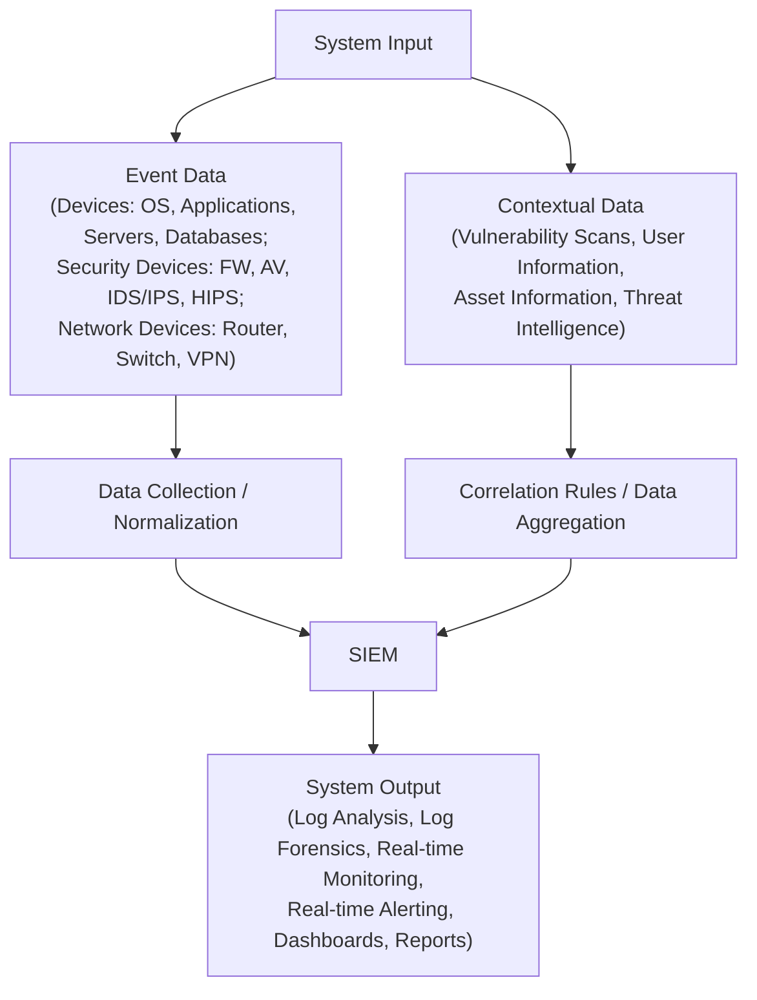

# Appendix B: Ethical Hacking Essential Concepts – II
## Part 3 — Network Security Solutions

[← Back to Part 2: Network Segmentation Concepts](02-network-segmentation.md) | [Next: Data Leakage Concepts →](04-data-leakage.md)

---

## Table of Contents

1. [Security Incident and Event Management (SIEM)](#security-incident-and-event-management-siem)
2. [SIEM Architecture](#siem-architecture)
3. [User Behavior Analytics (UBA)](#user-behavior-analytics-uba)
4. [Unified Threat Management (UTM)](#unified-threat-management-utm)
5. [Load Balancer](#load-balancer)
6. [Network Access Control (NAC)](#network-access-control-nac)
7. [Virtual Private Network (VPN)](#virtual-private-network-vpn)
8. [Secure Router Configuration](#secure-router-configuration)
9. [Quick-Reference Summary](#quick-reference-summary)

---

## Security Incident and Event Management (SIEM)

**SIEM** performs real-time **SOC (Security Operations Center)** functions like identifying, monitoring, recording, auditing, and analyzing security incidents. It provides security by **tracking suspicious end-user behavior** within a real-time IT environment.

SIEM combines two capabilities:

- **Security Information Management (SIM)** — supports permanent storage, analysis, and reporting of log data
- **Security Event Management (SEM)** — deals with real-time monitoring, correlation of events, notifications, and console views

SIEM protects an organization's IT assets from **data breaches** due to both internal and external threats.

### SIEM Functions

Log Collection, Log Analysis, Event Correlation, Log Forensics, IT Compliance and Reporting, Application Log Monitoring, Object Access Auditing, Data Aggregation, Real-time Alerting, User Activity Monitoring, Dashboards, File Integrity Monitoring, System and Device Log Monitoring, Log Retention.

---

## SIEM Architecture

---

## User Behavior Analytics (UBA)

**UBA** is the process of tracking user behavior to detect malicious attacks, potential threats, and financial fraud. It provides advanced threat detection by monitoring specific behavioral characteristics of employees. UBA technologies are designed to identify variations in traffic patterns caused by user behaviors, which can trace back to either disgruntled employees or malicious attackers.

### Why UBA Is Effective

- Analyzes different patterns of human behavior across large volumes of user data
- Monitors geolocation for each login attempt
- Detects malicious behavior and reduces risk
- Monitors privileged accounts and gives real-time alerts for suspicious behavior
- Provides insights to security teams
- Produces results soon after deployment

---

## Unified Threat Management (UTM)

**UTM** is a network security management solution that lets administrators monitor and manage the organization's network security through a **centralized management console**. It provides firewall, intrusion detection, antimalware, spam filter, load balancing, content filtering, data loss prevention, and VPN capabilities using a **single UTM appliance**.

| Advantages | Disadvantages |
|---|---|
| Reduced complexity | Single point of failure |
| Simplicity | Single point of compromise |
| Easy management | |

**UTM solutions typically bundle:** Load Balancer, Content Filter, VPN, Network Firewall, Anti-Virus and Anti-Spam, IDS/IPS.

---

## Load Balancer

A **load balancer** is a device responsible for distributing network traffic across a number of servers in a distributed system. It can control the number of requests and protect against rate-based attacks like DoS or DDoS.

A typical deployment sits between an **external firewall** (facing the internet) and an **internal firewall** (facing the intranet), with the load balancer distributing traffic across DMZ servers positioned between the two firewalls.

---

## Network Access Control (NAC)

**NAC**, also known as **Network Admission Control**, refers to appliances or solutions that attempt to protect the network by restricting the connection of an end user to the network based on a security policy. A pre-installed software agent may inspect several items before admitting the device, and may restrict where the device is allowed to connect.

### What NAC Does

- Authenticate users connected to network resources
- Identify devices, platforms, and operating systems
- Define a connection point for network devices
- Develop and apply security policies

---

## Virtual Private Network (VPN)

VPNs are used to **securely communicate** with different computers over insecure channels. A VPN uses the internet and ensures secure communication to distant offices or users within the enterprise's network.

### VPN Architecture

A typical enterprise VPN architecture connects a **Head Office** (with a VPN concentrator and router with VPN module) to remote endpoints — a **telecommuter/traveling person** (via 3G/CDMA/HSDPA mobile broadband, laptop with VPN client), a **home office** (via broadband modem, PC with VPN client), and a **branch office** (via router with VPN module and VPN concentrator) — all connected across the internet via VPN connectivity.

### How VPN Works

1. A client willing to connect to a company's network first connects to the internet
2. The client initiates a **VPN connection** with the company's server
3. Before establishing a connection, endpoints must be **authenticated** through passwords, biometrics, personal data, or any combination of these
4. Once the connection is established, the client can securely access the company's network

A firewall with VPN capability mediates between unauthorized hosts (blocked) and authorized hosts running VPN client software (which handles authorization and encryption) before reaching the internal network.

### VPN Components

- **VPN client**
- **Network Access Server (NAS)**
- **Tunnel Terminating Device** (or VPN server)
- **VPN protocol**

A typical path: VPN Client → PSTN/ISP → Network Access Server (Layer 3 Protocol) → Internet → ISP → VPN Server (Layer 3 Protocol) → Corporate Network.

### VPN Concentrators

A **VPN Concentrator** is a network device used to create secure VPN connections. It acts as a VPN router, generally used to create a **remote access** or **site-to-site** VPN. It uses tunneling protocols to negotiate security parameters, create and manage tunnels, and encapsulate/transmit/receive packets through the tunnel.

A typical deployment separates the **Public Segment (Untrusted)** — low-speed remote users via modem, high-speed remote users via cable, routed through the internet — from the **Firewall Segment** (FTP Server, Firewall, Cisco VPN 3000 Concentrator) and the **Private Segment (Trusted)** (File Server, Mail Server, Intranet Server, Authentication Server).

### Functions of a VPN Concentrator

A VPN Concentrator functions as a **bi-directional tunnel endpoint**:

1. Encrypts and decrypts data
2. Authenticates users
3. Manages data transfer across the tunnel
4. Negotiates tunnel parameters
5. Manages security keys
6. Establishes tunnels
7. Assigns user addresses
8. Manages inbound and outbound data transfers as a tunnel endpoint or router

---

## Secure Router Configuration

Routers are the main gateway to the network and are **not designed to be security devices**. Routers are vulnerable to different attacks from inside and outside the network — an administrator needs to configure a router securely, since a misconfigured router is a prime target for mounting attacks.

### Hardening a Router Prevents Attackers From

- Gaining information about the network
- Disabling routers and disrupting the network
- Reconfiguring routers
- Using routers to perform internal attacks
- Using routers to perform external attacks
- Rerouting network traffic

### Router Security Measures

1. Implement a written, approved, and distributed router policy
2. Returned IOS version should be checked and up-to-date
3. Configure users and passwords
4. Enable password encryption
5. Implement access restriction on the console
6. Disable unnecessary services
7. Properly configure necessary services such as DNS
8. Shut down unnecessary interfaces
9. Identify and check the ports and protocols in use
10. Implement ACLs to limit traffic to the required ports and protocols
11. Implement ACLs to block reserved and inappropriate addresses
12. Enable logging
13. Use NTP to set the router's time of day accurately
14. Logs checked, reviewed, and archived as per defined policy

### Router Security Policy Should Consist Of

Password Policy, Authentication Policy, Remote Access Policy, Filtering Policy, Backup Policy, Redundancy Policy, Documentation Policy, Physical Access Policy, Monitoring Policy, Update Policy.

---

## Quick-Reference Summary

- **SIEM** = real-time SOC functions combining SIM (storage/analysis/reporting) + SEM (real-time monitoring/correlation)
- **UBA** tracks behavioral patterns to catch both malicious insiders and external attackers
- **UTM** bundles firewall + IDS + antimalware + spam filter + load balancing + content filtering + DLP + VPN into one appliance — simple, but a single point of failure/compromise
- **Load balancers** distribute traffic and help absorb DoS/DDoS load
- **NAC** gatekeeps network admission based on policy, authenticating users and identifying devices/platforms before granting access
- **VPN**: 4 components (client, NAS, tunnel-terminating device/server, protocol); **VPN Concentrators** act as bi-directional tunnel endpoints with 8 core functions
- **Router hardening**: 14 concrete security measures plus a 10-part router security policy, since routers are gateways, not security devices, by design

---

*Part of the CEH Appendix B study series — continues in [Part 4: Data Leakage Concepts](04-data-leakage.md).*
