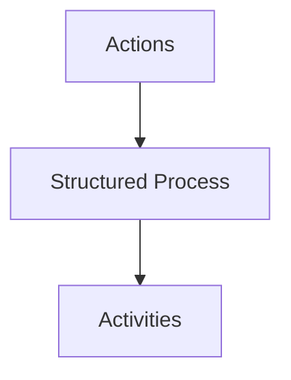
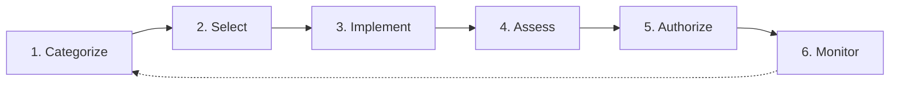

# Appendix B: Ethical Hacking Essential Concepts – II
## Part 6 — Risk Management Concepts and Frameworks

[← Back to Part 5: Data Backup Process](05-data-backup.md) | [Next: Business Continuity and Disaster Recovery →](07-business-continuity-and-disaster-recovery.md)

---

## Table of Contents

1. [Risk Management](#risk-management)
2. [Risk Management Framework: Enterprise Risk Management (ERM)](#risk-management-framework-enterprise-risk-management-erm)
3. [Risk Management Framework: NIST RMF](#risk-management-framework-nist-rmf)
4. [Risk Management Framework: COSO ERM](#risk-management-framework-coso-erm)
5. [Risk Management Framework: COBIT](#risk-management-framework-cobit)
6. [Enterprise Network Risk Management Policy](#enterprise-network-risk-management-policy)
7. [Risk Mitigation](#risk-mitigation)
8. [Control the Risks](#control-the-risks)
9. [Risk Calculation Formulas](#risk-calculation-formulas)
10. [Quantitative Risk vs. Qualitative Risk](#quantitative-risk-vs-qualitative-risk)
11. [Quick-Reference Summary](#quick-reference-summary)

---

## Risk Management

**Risk management** is the process of reducing and maintaining risk at an **acceptable level** by means of a well-defined and actively employed security program. It involves identifying, assessing, and responding to risks by implementing controls to help the organization manage potential effects, and has a **prominent place** throughout the system's security life-cycle.

### Risk Management Benefits

- Focuses on potential risk impact areas
- Addresses risks according to the risk level
- Improves the risk-handling process
- Allows security officers to act effectively in adverse situations
- Enables the effective use of risk-handling resources
- Minimizes the effect of risk on the organization's revenue
- Identifies suitable controls for security

---

## Risk Management Framework: Enterprise Risk Management (ERM)

**ERM** defines the implementation activities specific to how an organization handles risk. It provides a structured process that integrates information security and risk management activities, built across three layers:

The framework helps the organization **identify, analyze, and perform** the following actions:

- **Risk avoidance** — aborting actions that lead to risk
- **Risk reduction** — minimizing the likelihood or impact of risk
- Providing risk management process standards

### Goals of the ERM Framework

1. Integrate enterprise risk management with the organization's performance management
2. Communicate the benefits of risk management
3. Define the roles and responsibilities for managing risk in the organization
4. Standardize risk reporting and the escalating process
5. Set a standard approach to manage risks in the organization
6. Assist resources in managing risks
7. Set the scope for and application of risk management in the organization
8. Mandate periodic review and verification for improvement to the ERM

---

## Risk Management Framework: NIST RMF

*Source: csrc.nist.gov*

The **NIST Risk Management Framework** is a structured and continuous process that integrates information security and risk management activities into the system development life cycle (SDLC).

1. **Categorize** — define the criticality/sensitivity of an information system according to the potential worst-case adverse impact to the mission or business
2. **Select** — select baseline security controls; apply tailoring guidance and supplement controls as needed based on risk assessment
3. **Implement** — implement security controls within enterprise architecture using sound systems engineering practices; apply security configuration changes
4. **Assess** — determine security control effectiveness (i.e., that controls are implemented correctly, operating as intended, and meeting security requirements for the information system)
5. **Authorize** — determine risk to organizational operations and assets, individuals, other organizations, and the nation; if acceptable, authorize operation
6. **Monitor** — continuously track changes to the information system that may affect security controls, and reassess control effectiveness

---

## Risk Management Framework: COSO ERM

*Source: coso.org*

The **COSO ERM Framework** defines essential components, suggests a common language, and provides clear direction and guidance for enterprise risk management. It emphasizes that ERM involves the elements of the management process that enable management to make **genuine risk-based decisions**.

Its flow runs from **Mission, Vision, and Core Values** → **Strategy Development** → **Business Objective Formulation** → **Implementation and Performance** → **Enhanced Value**, underpinned by 5 supporting components: Governance and Culture, Strategy and Objective-Setting, Performance, Review and Revision, Information/Communication/Reporting.

---

## Risk Management Framework: COBIT

*Source: isaca.org*

**COBIT** is an IT governance framework and supporting toolset that helps managers bridge the gap between control requirements, technical issues, and business risks. It emphasizes regulatory compliance, helps organizations increase the value attained from IT, and simplifies implementation of the enterprise's IT governance and control framework.

The COBIT model is structured as three concentric rings:

- **Outer Ring** — Program Management
- **Middle Ring** — Change Enablement
- **Inner Ring** — Continual Improvement Lifecycle

Around the wheel sit 7 guiding questions covering drivers, current/target states, what needs to be done, how to plan the journey, executing the plan, sustaining momentum, and reviewing effectiveness — cycling continuously through Establish Desire to Change, Form an Effective Team, Communicate Desired Vision, Empower Role Players, Enable Operation and Use, Embed New Approaches, and Monitor and Evaluate.

---

## Enterprise Network Risk Management Policy

A **Risk Management Policy** assists in developing and establishing essential processes and procedures to address and minimize information security risk. It outlines different aspects of risk and identifies people to manage the risk in the organization.

### Objectives

- Equip the organization with the required skills to identify and treat risks
- Provide a consistent risk management framework
- Provide the overall direction and purpose for performing risk management
- Manage risks with adequate risk mitigation techniques
- Combat existing and emerging risks
- Integrate operational risks into the risk management process
- Accomplish the strategic and operational goals of the organization
- Facilitate assistance in taking strategic management decisions
- Meet legal and regulatory requirements

---

## Risk Mitigation

**Risk mitigation** includes all possible solutions for reducing the **probability of risk** and limiting its impact if it occurs. It should identify mitigation strategies for risks falling outside the department's **risk tolerance**, and provide an understanding of risk levels alongside controls and treatments. It identifies the priority order in which individual risks should be mitigated, monitored, and reviewed.

### Risk Mitigation Strategies

1. Risk Assumption
2. Risk Avoidance
3. Risk Limitation
4. Risk Planning
5. Research and Acknowledgment
6. Risk Transference

---

## Control the Risks

- Identify all existing security controls that can help organizations reduce security risks
- Recommend any new security controls the organization must implement
- Use the results of vulnerability and threat assessments to minimize risks, since risks are directly proportionate to them

### Security Controls That Help Reduce Risks

1. Impart security awareness to employees
2. Place up-to-date hardware and software security solutions such as IDS, firewall, honeypot, and DMZ
3. Strengthen network, account, application, device, and physical security across the organization
4. Implement strict access controls and security policies
5. Deploy encryption for all data transfers
6. Implement an appropriate incident-handling and response plan

---

## Risk Calculation Formulas

Many types of risk calculations exist — not every risk can be invested in equally; risk treatments should be commensurate with the value of the assets at risk. Risk formulas allow security professionals to dimension risk.

| Term | Definition |
|---|---|
| **Asset Value (AV)** | The value you have determined an asset to be worth |
| **Exposure Factor (EF)** | The estimated percentage of damage or impact that a realized threat would have on the asset |
| **Single Loss Expectancy (SLE)** | The projected loss of a single event on an asset (`SLE = AV × EF`) |
| **Annual Rate of Occurrence (ARO)** | The estimated number of times over a period the threat is likely to occur |
| **Annualized Loss Expectancy (ALE)** | The projected loss to the asset based on an annual estimate (`ALE = ARO × SLE`) |

---

## Quantitative Risk vs. Qualitative Risk

| Qualitative | Quantitative |
|---|---|
| **A subjective assessment** | **A numeric assessment** |
| Focuses on mapping the perceived impact of a specific event occurring to a risk rating agreed upon by the organization | Focuses on mapping the probability of a specific event occurring to the perceived cost of the event |
| Most methodologies use interrelated elements such as threats, vulnerabilities, and controls | Employs two fundamental elements: the probability of an event occurring, and the likely loss should it occur |

**Core formula:** `Annual Rate of Occurrence (ARO) × Single Loss Expectancy (SLE) = Annualized Loss Expectancy (ALE)`

---

## Quick-Reference Summary

- **Risk management** = reducing/maintaining risk at an acceptable level via a structured, actively-employed security program
- **4 frameworks covered**: ERM (Actions → Structured Process → Activities, 8 goals), **NIST RMF** (6-step cycle: Categorize → Select → Implement → Assess → Authorize → Monitor), **COSO ERM** (mission/vision → strategy → objectives → implementation → enhanced value), **COBIT** (3 concentric rings: Program Management, Change Enablement, Continual Improvement)
- **6 risk mitigation strategies**: assumption, avoidance, limitation, planning, research/acknowledgment, transference
- **Risk formulas**: `SLE = AV × EF`; `ALE = ARO × SLE`
- **Qualitative risk** = subjective rating; **Quantitative risk** = numeric, formula-driven assessment

---

*Part of the CEH Appendix B study series — continues in [Part 7: Business Continuity and Disaster Recovery](07-business-continuity-and-disaster-recovery.md).*
