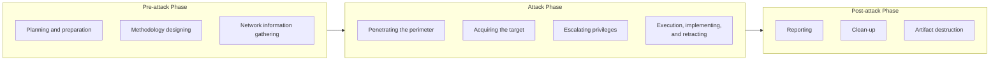

# Appendix B: Ethical Hacking Essential Concepts – II
## Part 10 — Different Types of Penetration Testing and Its Phases

[← Back to Part 9: Threat Modeling Methodology](09-threat-modeling-methodology.md) | [Next: Security Operations Concepts →](11-security-operations.md)

---

## Table of Contents

1. [Penetration Testing](#penetration-testing)
2. [Why Do Penetration Testing?](#why-do-penetration-testing)
3. [Comparing Security Audit, Vulnerability Assessment, and Penetration Testing](#comparing-security-audit-vulnerability-assessment-and-penetration-testing)
4. [Blue and Red Teaming](#blue-and-red-teaming)
5. [Types of Penetration Testing](#types-of-penetration-testing)
6. [Phases of Penetration Testing](#phases-of-penetration-testing)
7. [Security Testing Methodology](#security-testing-methodology)
8. [Risks Associated with Penetration Testing](#risks-associated-with-penetration-testing)
9. [Types of Risks Arising During Penetration Testing](#types-of-risks-arising-during-penetration-testing)
10. [Pre-Engagement Activities](#pre-engagement-activities)
11. [Listing the Goals of Penetration Testing](#listing-the-goals-of-penetration-testing)
12. [Rules of Engagement (ROE)](#rules-of-engagement-roe)
13. [Quick-Reference Summary](#quick-reference-summary)

---

## Penetration Testing

**Penetration testing** is a method of evaluating the security of an information system or network by **simulating an attack to find vulnerabilities** that an attacker could exploit. Security measures are actively analyzed for design weaknesses, technical flaws, and vulnerabilities. It doesn't just point out vulnerabilities — it also **documents** how those weaknesses can be exploited, with results delivered to executive management and technical audiences in a comprehensive report.

---

## Why Do Penetration Testing?

- Identify the threats facing an organization's information assets
- Reduce an organization's IT security expenditure and enhance Return On Security Investment (ROSI) by identifying and remediating vulnerabilities/weaknesses
- Provide assurance through a comprehensive assessment of organizational security — policy, procedure, design, and implementation
- Gain and maintain industry-regulated certification (BS7799, HIPAA, or other regulations)
- Adopt best practices in compliance with legal and industry regulations
- Test and validate the efficacy of security protections and controls
- Change or upgrade existing infrastructure of software, hardware, or network design
- Focus on high-severity vulnerabilities and emphasize application-level security issues to development teams and management
- Provide a comprehensive approach of preparation steps that can be taken to prevent future exploitation
- Evaluate the efficacy of network security devices such as firewalls, routers, and web servers

---

## Comparing Security Audit, Vulnerability Assessment, and Penetration Testing

| Activity | Description |
|---|---|
| **Security Audit** | Checks whether the organization is following a set of standard security policies and procedures |
| **Vulnerability Assessment** | Focuses on discovering the vulnerabilities in the information system, but provides no indication of whether the vulnerabilities can actually be exploited or the amount of damage that could result from successful exploitation |
| **Penetration Testing** | A methodological approach to security assessment that **encompasses both** the security audit and vulnerability assessment, and demonstrates whether the vulnerabilities in the system can actually be successfully exploited by attackers |

---

## Blue and Red Teaming

| Blue Teaming | Red Teaming |
|---|---|
| An approach where a set of **security responders** perform an analysis of an information system to assess the adequacy and efficiency of its security controls | An approach where a team of ethical hackers performs a penetration test on an information system with **no or very limited access** to the organization's internal resources |
| The blue team has **access to all** organizational resources and information | The penetration test may be conducted **with or without warning** |
| Their primary role is to detect and mitigate the red team's (attackers') activities, and to anticipate how surprise attacks might occur | The goal is to detect network and system vulnerabilities and check security from an attacker's perspective of the network, system, or information accessibility |

---

## Types of Penetration Testing

| Type | Description |
|---|---|
| **Black-box** | No prior knowledge of the infrastructure to be tested (includes Blind Testing and Double-Blind Testing) |
| **White-box** | Complete knowledge of the infrastructure to be tested |
| **Grey-box** | Limited knowledge of the infrastructure to be tested |

---

## Phases of Penetration Testing

---

## Security Testing Methodology

A **security (or pen testing) methodology** refers to a methodological approach to discovering and verifying vulnerabilities in the security mechanisms of an information system — enabling administrators to apply appropriate security controls to protect critical data and business functions.

| Methodology | Description |
|---|---|
| **OWASP** | An open-source application security project that assists organizations in purchasing, developing, and maintaining software tools, software applications, and knowledge-based documentation for web application security |
| **OSSTMM** | A peer-reviewed methodology for performing high-quality security tests — methodology tests spanning data controls, fraud and social engineering control levels, computer networks, wireless devices, mobile devices, physical security access controls, and various security processes |
| **ISSAF** | An open-source project aimed at providing security assistance for professionals. Its mission is to "research, develop, publish, and promote a complete and practical, generally accepted information systems security assessment framework" |
| **EC-Council LPT Methodology** | The LPT (Licensed Penetration Tester) Methodology is an industry-accepted and comprehensive information system security auditing framework |

---

## Risks Associated with Penetration Testing

Careful engagement, planning, and execution is required to avoid the risks organizations may face when conducting a penetration test.

### Some Risks Arising From Penetration Testing

- Testers can gain access to protected or sensitive data after a successful penetration test attempt
- Testers can obtain information about the vulnerabilities existing in the organizational infrastructure
- DoS penetration testing can bring the organization's services down
- Using certain pretexts in social engineering, a penetration attempt can make employees feel uneasy

Organizations can avoid such risks by signing NDAs and other legal documents that spell out details of what is and is not allowed for the penetration testing team.

---

## Types of Risks Arising During Penetration Testing

During a penetration test, activities may pose risks causing unwanted situations such as denial-of-service conditions, locked-out critical accounts, or crashing critical servers/applications.

| Risk Type | Description | Examples |
|---|---|---|
| **Technical Risks** | Arise directly from targets in the production environment | Failure of the target, disruption of service, loss or exposure of sensitive data |
| **Organizational Risks** | Can come as a side effect of penetration testing | A repetitive/unwanted trigger in the organization's incident-handling processes; negligence toward monitoring and responding to incidents during/after a pen test; a disruption in business continuity; loss of reputation |
| **Legal Risks** | Arise from legal obligations | Violation of laws, or clauses in the ROE |

---

## Pre-Engagement Activities

**Pre-engagement activities** set the foundation for managing and successfully executing a penetration testing engagement.

- One of the important components in penetration testing that a pen tester or client **should not overlook**
- If the client or pen tester fails to properly follow pre-engagement activities, they may face issues in their engagement such as **scope creeping**, **unsatisfied customers**, or even **legal issues**
- Starts with determining the **goal of the test**

---

## Listing the Goals of Penetration Testing

- Identify the organization's goal from the **Purpose** section of the RFP and Preliminary Information Request Document
- Identify **what** the target organization wants to be tested
- Identify the **primary** as well as the **secondary** goals of the organization
- Primary goals are **business-risk-driven**; secondary goals are **compliance-driven**

### Sample Goals (each mapped as Primary or Secondary)

- Protecting the stakeholder's data
- Reducing financial liability for noncompliance with regulation (e.g., GDPR)
- Protecting the company's intellectual property
- Ensuring a high level of trust with regard to customers
- Reducing the likelihood of a breach to protect brand reputation
- Safeguarding the organization from failure
- Preventing financial loss through fraud
- Identifying the key vulnerabilities
- Improving the security of the technical systems

---

## Rules of Engagement (ROE)

| Element | Description |
|---|---|
| **ROE** | Formal permission to conduct penetration testing |
| **Top-level Guidance** | Provides "top-level" guidance for conducting the penetration testing |
| **ROE's Assistance** | Helps testers overcome legal and policy-related restrictions on using different penetration testing tools and techniques |

---

## Quick-Reference Summary

- **Pen testing** = simulated attack + documentation of exploitability + reported findings — a superset of both security audits and vulnerability assessments
- **Blue team** (full access, defends) vs. **Red team** (limited/no access, attacks) — both feed into overall security assurance
- **3 testing types by knowledge level**: Black-box (none), Grey-box (limited), White-box (complete)
- **3-phase structure**: Pre-attack (plan/design/gather) → Attack (penetrate/acquire/escalate/execute) → Post-attack (report/clean-up/destroy artifacts)
- **4 named methodologies**: OWASP, OSSTMM, ISSAF, EC-Council LPT
- **3 risk categories**: Technical (target-side failures), Organizational (side effects like false incident triggers), Legal (ROE/law violations)
- **Pre-engagement** sets the foundation — skipping it risks scope creep, unhappy clients, or legal exposure; goals split into business-risk-driven (primary) and compliance-driven (secondary)
- **ROE** = the formal permission document and top-level guidance that lets testers legally use their tools and techniques

---

*Part of the CEH Appendix B study series — continues in [Part 11: Security Operations Concepts](11-security-operations.md).*
