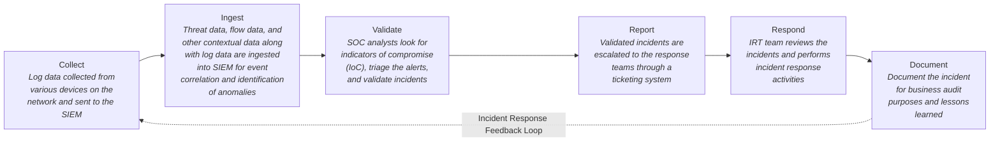

# Appendix B: Ethical Hacking Essential Concepts – II
## Part 11 — Security Operations Concepts

[← Back to Part 10: Penetration Testing](10-penetration-testing.md) | [Next: Computer Forensic Investigation →](12-computer-forensics.md)

---

## Table of Contents

1. [Security Operations](#security-operations)
2. [Security Operations Center (SOC)](#security-operations-center-soc)
3. [SOC Architecture](#soc-architecture)
4. [SOC Operations](#soc-operations)
5. [SOC Workflow](#soc-workflow)
6. [Quick-Reference Summary](#quick-reference-summary)

---

## Security Operations

**Security operations** is the continuous operational practice for maintaining and managing a secure IT environment through the implementation and execution of certain services and processes — a predefined set of processes and services followed during daily security operation tasks, based on the organization's security baselines.

In recent security operations, organizations have incorporated a **third aspect** of security operations — **situational awareness** — alongside the two traditional aspects:

- **Situational Awareness** — threat intelligence plays a vital role in creating situational awareness, enabling informed security decisions and shaping cyber defenses accordingly
- **Security Monitoring** — collecting, storing, and analyzing logs and data from different security devices to identify security incidents
- **Security Incident Management** — resolving security incidents with minimal adverse impact

A dedicated unit, known as the **Security Operation Center (SOC)**, is established by organizations to handle and manage their security operations.

---

## Security Operations Center (SOC)

**SOC** is a centralized unit that continuously monitors and analyzes ongoing activities in an organization's information systems — networks, servers, endpoints, databases, applications, and websites.

- Provides a **single point of view** through which an organization's assets are monitored, assessed, and defended from threats
- Evaluates an organization's security posture for any anomalies in its assets or information systems
- Facilitates situational awareness and real-time alerts if an intrusion or attack is detected

---

## SOC Architecture

```mermaid
flowchart LR
    subgraph Sources["Data Types / Data Sources"]
        direction TB
        FW["Firewall"]
        DB["Database"]
        EP["Endpoint"]
        WWW["WWW"]
        FS["File server"]
        EM["Email"]
        MS["Management Server"]
        RT["Routers"]
        SW["Switches"]
        IPS["IPS/IDS"]
    end
    Sources --> DIP1["Data Ingestion Process"]
    DIP1 --> Pipeline["Collection → Normalization →<br/>Indexing → Database → Correlation"]
    Pipeline --> DIP2["Data Ingestion Process"]
    DIP2 --> Modules["Modules:<br/>Alerting, Reporting, Query,<br/>Archiving, Workflow"]
    Modules --> Views["Views"]
    Views --> Analyst["Security Operations<br/>Center (SOC) Analyst"]
```

---

## SOC Operations

### Log Collection
Logs are collected from the various devices on a network that can have an impact on the organization's security.

### Log Retention and Archival
Collected logs are recovered and stored centrally. They can be used to perform forensics as well as threat control and prevention.

### Log Analysis
Logs are analyzed through SOC technology to extract important information, such as relevant metrics, from the raw data.

### Monitoring of Security Environments for Security Events
Information received via log analysis is transferred to the SOC team for monitoring purposes, so it can be used to identify the current security posture of an organization.

### Event Correlation
Events from various sources are **correlated and contextualized** based on a set of predefined correlation rules.

### Incident Management
A process of efficiently utilizing SOC resources, performed by prioritizing incidents as per predefined rules and objectives.

### Threat Identification
The process of determining threats and vulnerabilities correctly and in real time, and determining proactive measures through research.

### Threat Reaction
An SOC reacts either **reactively** or **proactively** to threats:

- If the threat reaction is **reactive**, immediate action should be applied to remediate it
- If the threat reaction is **proactive**, the SOC tries to find the weakness in the infrastructure or processes and remove it before an attacker utilizes it

### Reporting
SOC generates clients' detailed security reports, including different types of requests ranging from real-time management to audit requirements.

---

## SOC Workflow

The SOC workflow feeds data through the SIEM at the Collect/Ingest stages, then moves through human/process-driven Validate, Report, Respond, and Document stages — with a feedback loop running from Document back to Collect, so lessons learned continuously improve the process.

---

## Quick-Reference Summary

- **Security operations** = continuous practice covering situational awareness, security monitoring, and security incident management
- **SOC** = the centralized unit providing a single point of view for monitoring, assessing, and defending an organization's assets
- **SOC architecture** ingests data from 10 source types (firewall, database, endpoint, WWW, file server, email, management server, routers, switches, IPS/IDS) through a Collection → Normalization → Indexing → Database → Correlation pipeline, feeding 5 modules (Alerting, Reporting, Query, Archiving, Workflow)
- **9 SOC operations**: log collection, retention/archival, analysis, environment monitoring, event correlation, incident management, threat identification, threat reaction (reactive/proactive), reporting
- **SOC workflow**: Collect → Ingest → Validate → Report → Respond → Document, with a feedback loop back to Collect

---

*Part of the CEH Appendix B study series — continues in [Part 12: Computer Forensic Investigation](12-computer-forensics.md).*
