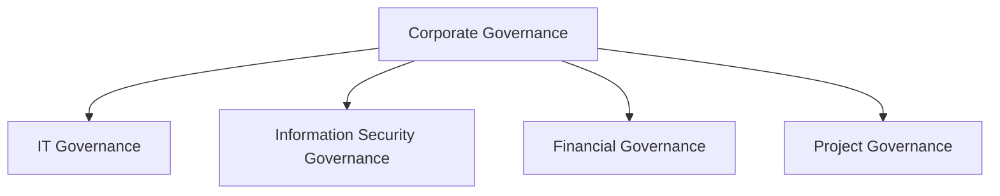

# Appendix B: Ethical Hacking Essential Concepts – II
## Part 14 — Security Governance Principles

[← Back to Part 13: Software Development Security](13-software-development-security.md) | [Next: Asset Management Process →](15-asset-management.md)

---

## Table of Contents

1. [Corporate Governance Activities](#corporate-governance-activities)
2. [Information Security Governance Activities](#information-security-governance-activities)
3. [The Three Areas of Information Security Governance](#the-three-areas-of-information-security-governance)
4. [Corporate Governance and Security Responsibilities](#corporate-governance-and-security-responsibilities)
5. [Quick-Reference Summary](#quick-reference-summary)

---

## Corporate Governance Activities

**Corporate governance** defines the framework of rules and practices by which a board of directors ensures accountability, fairness, and transparency in an organization's relationship with all its stakeholders.

### Effectiveness in the Following Areas Is Critical for Success

- Risk Oversight
- Enterprise Architecture
- Asset Management
- Change Management
- Business Continuity Management

---

## Information Security Governance Activities

**Information Security Governance Activities** are a **subset of corporate governance** that establishes the order and structure of activities supporting information security and risk management practices within an organization. They require active involvement from the **Board of Directors** or the highest level of leadership in the organization.

### The National Association of Corporate Directors (NACD) Defines 4 Essential Information Security Governance Practices

1. Place information security on the board's agenda
2. Identify information security leaders, hold them accountable, and ensure support for them
3. Ensure the effectiveness of the corporation's information security policy through review and approval
4. Assign information security to a key committee and ensure adequate support for that committee

---

## The Three Areas of Information Security Governance

Information security governance activities occur in three distinct areas:

### Program Management

Program management is a broad activity that focuses on different areas depending on its goal:

- Formal Documentation
- Education, Training, and Awareness
- Information Security Steering Committee
- Metrics and Reporting

### Security Engineering

Security engineering formalizes the process for **defining the protection strategy** for the organization and its activities. It incorporates security principles into the design, development, and operation of the software, systems, solutions, and controls used by an organization.

### Security Operations

Security operations defines an organization's capability to **detect security events** and provide a **timely response**. The capability to detect events and respond in a timely way depends on three pillars:

- **People**
- **Processes**
- **Technology**

*(These three pillars support the security operations program covered in more detail in [Part 11: Security Operations Concepts](11-security-operations.md).)*

---

## Corporate Governance and Security Responsibilities

Every person and every role has responsibilities related to information security. Organizations should define the information security expectations that relate to each role.

| Role | Responsibility |
|---|---|
| **Board of Directors** | Must have a clear understanding of the organization's needs in terms of the IT system's role in the overall success of the business |
| **Chief Executive Officer (CEO)** | Must support information security initiatives, ensure funding, and hold the business's information security policies and procedures accountable to compliance |
| **Chief Information Officer (CIO)** | Responsible for IT governance and IT service delivery, which supports the business processes that drive the organization |
| **Chief Risk Officer (CRO)** | Responsible for enterprise risk management, including information security and operational, financial, strategic, reputational, and strategic risks |
| **Chief Technology Officer (CTO)** | Responsible for system administrators and provides the direct link between information security policies and the network, systems, and data |
| **Enterprise Architect** | Has a broad and deep understanding of the organization's overall business strategy and the general IT trends and directions |
| **Enterprise Administrators** | Play an important part in the protection of the organization's assets |
| **Database Administrators** | Manage and maintain database repositories for proper use by authorized individuals |

---

## Quick-Reference Summary

- **Corporate governance** = the board-level framework ensuring accountability, fairness, transparency — spanning IT, information security, financial, and project governance, with 5 critical success areas (risk oversight, enterprise architecture, asset management, change management, BCM)
- **Information security governance** = a subset of corporate governance requiring active board involvement, guided by NACD's 4 essential practices
- **3 areas of information security governance**: Program Management (documentation, training, steering committee, metrics), Security Engineering (protection strategy formalized into design/development/operations), Security Operations (people + processes + technology for detection and response)
- **8 named roles** each carry defined information security responsibilities, from the Board of Directors down to Database Administrators

---

*Part of the CEH Appendix B study series — continues in [Part 15: Asset Management Process](15-asset-management.md).*
