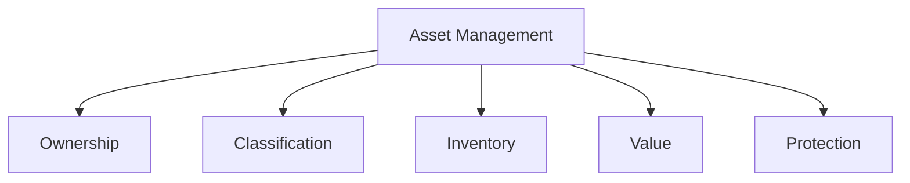

# Appendix B: Ethical Hacking Essential Concepts – II
## Part 15 — Asset Management Process

[← Back to Part 14: Security Governance Principles](14-security-governance.md) | [Back to README](README.md)

---

## Table of Contents

1. [Asset Management](#asset-management)
2. [Asset Ownership](#asset-ownership)
3. [Asset Classification](#asset-classification)
4. [Asset Inventory](#asset-inventory)
5. [Asset Value](#asset-value)
6. [Protection Strategy and Governance](#protection-strategy-and-governance)
7. [Quick-Reference Summary](#quick-reference-summary)
8. [Appendix B Complete](#appendix-b-complete)

---

## Asset Management

**Asset Management** defines the policies and procedures for managing assets within an organization. An **asset** is any item of value to the organization; an **information asset** is an item of value that contains information.

---

## Asset Ownership

Effective asset management requires the assignment of an **active and engaged asset owner** to support asset classification, inventory management, valuation, and protection.

- An asset owner should be a **business unit leader** who directs the work or manages the day-to-day support of the business process that relies on the technology or information constituting the asset
- The asset owner must select and **implement a protection strategy** from the options recommended by security professionals
- The asset owner must **accept responsibility** for compromises if the strategy is ignored or ineffective

---

## Asset Classification

**Classification** provides a process to categorize assets based on attributes defined by the organization. Classification maps a defined set of expectations and activities to a particular category.

### Asset Classification by Category and Severity/Impact

| Category | High | Moderate | Low |
|---|---|---|---|
| **Defense** | Top-Secret | Secret | Confidential |
| **Qualitative** | High | Moderate | Low |
| **Corporate** | Restricted | Confidential | Public |

---

## Asset Inventory

**Asset Inventory** provides a repository to **document and track assets** within the organization. It documents important information about an organization's assets:

- What exists?
- Where does it exist?
- How important is it?
- Who is responsible (ownership)?

---

## Asset Value

The value of an asset is important for defining how important an item is, and to what extent the item must be protected.

| Asset Type | Valuation Approach |
|---|---|
| **Tangible Assets** | A straightforward process, since the organization can map a monetary value to the procurement cost of the asset |
| **Intangible Assets** | Difficult, since there's no direct mapping — it's necessary to consider the cost if a compromise occurs or the data is lost |

---

## Protection Strategy and Governance

Corporate governance and information security governance work together to define the protection of an organization's assets.

| Corporate Governance | Security Governance |
|---|---|
| Defines the expectations and protection measures for assets **in advance** | Provides recommendations based on feedback and information from the asset owner |
| Codifies the desired approach in organizational policies | Documents accepted and rejected recommendations |

---

## Quick-Reference Summary

- **Asset management** = policies/procedures spanning 5 pillars: ownership, classification, inventory, value, protection
- **Asset ownership** rests with an engaged business-unit leader, who selects a protection strategy and accepts responsibility if it fails
- **Asset classification** maps category (Defense/Qualitative/Corporate) against severity (High/Moderate/Low) — e.g., Defense-High = Top-Secret, Corporate-Low = Public
- **Asset inventory** answers 4 questions: what exists, where, how important, who owns it
- **Asset value**: tangible assets map directly to procurement cost; intangible assets require estimating loss/compromise cost instead
- **Protection strategy** = corporate governance sets expectations in advance; security governance documents and refines based on asset-owner feedback

---

## Appendix B Complete

That closes out **Appendix B: Ethical Hacking Essential Concepts – II** — a 15-part deep dive into governance, risk, and blue-team fundamentals:

- **[Part 1](01-information-security-controls.md)** — Information Security Controls (administrative, physical, technical; IAM; access control)
- **[Part 2](02-network-segmentation.md)** — Network Segmentation Concepts (DMZ, zoning, virtualization, VLANs)
- **[Part 3](03-network-security-solutions.md)** — Network Security Solutions (SIEM, UTM, load balancers, NAC, VPN, router hardening)
- **[Part 4](04-data-leakage.md)** — Data Leakage Concepts
- **[Part 5](05-data-backup.md)** — Data Backup Process (RAID levels, backup methods/locations)
- **[Part 6](06-risk-management.md)** — Risk Management Concepts and Frameworks (ERM, NIST RMF, COSO, COBIT)
- **[Part 7](07-business-continuity-and-disaster-recovery.md)** — Business Continuity and Disaster Recovery (BIA, RTO/RPO, BCP/DRP)
- **[Part 8](08-cyber-threat-intelligence.md)** — Cyber Threat Intelligence (sources, IoCs, reports, dissemination)
- **[Part 9](09-threat-modeling-methodology.md)** — Threat Modeling Methodology (STRIDE, PASTA, TRIKE, VAST, DREAD, OCTAVE)
- **[Part 10](10-penetration-testing.md)** — Penetration Testing Types and Phases
- **[Part 11](11-security-operations.md)** — Security Operations Concepts (SOC architecture and workflow)
- **[Part 12](12-computer-forensics.md)** — Computer Forensic Investigation Phases
- **[Part 13](13-software-development-security.md)** — Software Development Security (secure SDLC, design principles)
- **[Part 14](14-security-governance.md)** — Security Governance Principles
- **[Part 15](15-asset-management.md)** — Asset Management Process (this file)

Between Appendix A (technical foundations) and Appendix B (governance/risk/blue-team foundations), the CEH curriculum's supporting material is now fully covered — clearing the ground for the module sequence to continue with **Module 3: Scanning Networks**.

---

*Part of the CEH Appendix B study series. [Return to the README](README.md) for the full index.*
