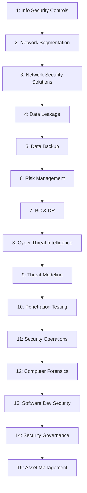

# CEH Appendix B: Ethical Hacking Essential Concepts – II

Personal study notes covering Appendix B of the CEH v13 curriculum — rewritten and organized into a structured reference repo, rather than reproduced verbatim from any copyrighted source material.

> These notes are written in original language for personal study and reference. They summarize and explain the concepts covered in Appendix B; they are not a copy of any textbook, courseware, or slide deck.

---

## What This Appendix Is

Where [Appendix A](../CEH-Appendix-A-Essential-Concepts-I/README.md) covered technical IT/CS foundations (OS, networking, web tech), **Appendix B** covers the **governance, risk, compliance, and blue-team** foundations that sit underneath every later CEH module — information security controls, network defenses, risk frameworks, business continuity, threat intelligence, penetration testing, forensics, secure development, and organizational security governance.

---

## Learning Objectives

- [x] Explain Different Information Security Controls
- [x] Summarize Network Segmentation Concepts
- [x] Use Network Security Solutions
- [x] Explain Data Leakage Concepts
- [x] Summarize Data Backup Process
- [x] Explain Risk Management Concepts and Frameworks
- [x] Summarize Business Continuity and Disaster Recovery Process
- [x] Explain Cyber Threat Intelligence
- [x] Explain Threat Modeling Methodology
- [x] Explain Different Types of Penetration Testing and Its Phases
- [x] Summarize Security Operations Concepts
- [x] Explain Different Phases of Computer Forensic Investigation
- [x] Explain Software Development Security
- [x] Summarize Security Governance Principles
- [x] Explain Asset Management Process

**Appendix B is complete.** ✅ (All 15 objectives.)

---

## Repo Structure

| # | File | Covers |
|---|---|---|
| 1 | [`01-information-security-controls.md`](01-information-security-controls.md) | Admin/physical/technical controls, security policies, HR/legal implications, security awareness training, physical security, access control (DAC/MAC/RBAC), IAM, authentication/authorization/accounting |
| 2 | [`02-network-segmentation.md`](02-network-segmentation.md) | Network segmentation, security zoning, DMZ, network virtualization, virtual networks, VLANs |
| 3 | [`03-network-security-solutions.md`](03-network-security-solutions.md) | SIEM (+ architecture), UBA, UTM, load balancers, NAC, VPN (architecture, components, concentrators), secure router configuration |
| 4 | [`04-data-leakage.md`](04-data-leakage.md) | Data leakage risks, insider/external threats, Data Loss Prevention (DLP) |
| 5 | [`05-data-backup.md`](05-data-backup.md) | RAID technology (levels 0/1/3/5/10/50), backup methods (hot/cold/warm), backup locations, data recovery |
| 6 | [`06-risk-management.md`](06-risk-management.md) | ERM, NIST RMF, COSO ERM, COBIT frameworks; risk mitigation; risk calculation formulas (SLE/ALE); qualitative vs. quantitative risk |
| 7 | [`07-business-continuity-and-disaster-recovery.md`](07-business-continuity-and-disaster-recovery.md) | BC vs. DR, BIA, RTO, RPO, BCP, DRP |
| 8 | [`08-cyber-threat-intelligence.md`](08-cyber-threat-intelligence.md) | CIF, 15 intelligence source types (OSINT/HUMINT/SIGINT/etc.), data reliability, IoCs, knowledge repositories, threat intel reports and dissemination |
| 9 | [`09-threat-modeling-methodology.md`](09-threat-modeling-methodology.md) | STRIDE, PASTA, TRIKE, VAST, DREAD, OCTAVE, threat profiling/attribution |
| 10 | [`10-penetration-testing.md`](10-penetration-testing.md) | Pentest vs. audit vs. VA, blue/red teaming, black/grey/white-box testing, 3-phase pentest structure, security testing methodologies, pentest risks, ROE |
| 11 | [`11-security-operations.md`](11-security-operations.md) | SOC definition, architecture, operations (log collection through reporting), SOC workflow |
| 12 | [`12-computer-forensics.md`](12-computer-forensics.md) | Computer forensics objectives, pre-investigation/investigation/post-investigation phases |
| 13 | [`13-software-development-security.md`](13-software-development-security.md) | Secure SDLC, functional vs. security activities, security requirements gathering, secure design principles, 3-tier secure architecture |
| 14 | [`14-security-governance.md`](14-security-governance.md) | Corporate governance, information security governance (program mgmt/security engineering/security operations), governance roles and responsibilities |
| 15 | [`15-asset-management.md`](15-asset-management.md) | Asset ownership, classification, inventory, value, protection strategy and governance |

---

## Suggested Reading Order

Each file is self-contained with its own table of contents and a quick-reference summary at the bottom, so you can also jump straight to whichever topic you need.

---

## Relationship to the Rest of the Repo

- [`../Module-01-Introduction-to-Ethical-Hacking/`](../CEH-Module-01-Introduction-to-Ethical-Hacking/README.md) — foundational security concepts, hacking/ethical hacking concepts, methodologies, controls, laws
- [`../Module-02-Footprinting-and-Reconnaissance/`](../CEH-Module-02-Footprinting-and-Reconnaissance/README.md) — the first attack-methodology phase: reconnaissance
- [`../Appendix-A-Essential-Concepts-I/`](../CEH-Appendix-A-Essential-Concepts-I/README.md) — technical IT/CS foundations (OS, networking, virtualization, web/database tech)
- **This appendix** — governance, risk, compliance, and blue-team foundations (controls, network defense, risk/BC/DR, threat intel, pentesting, forensics, secure dev, governance, asset management)

Note: Part 1 of this appendix revisits information security controls and Part 8 revisits cyber threat intelligence at a level of detail that goes well beyond [Module 1's equivalent sections](../Module-01-Introduction-to-Ethical-Hacking/07-information-security-controls.md) — this is intentional expansion, not duplication, and reflects how the source curriculum itself layers foundational and advanced treatments of the same topics.

---

## About This Repo

Compiled as part of an ongoing CEH v13 study track, alongside parallel work in CTF challenges and web security (SSRF and related topics). Structured for easy GitHub browsing — each part links to the next, diagrams render natively via Mermaid, and comparison tables are used wherever they make scanning faster than prose.
