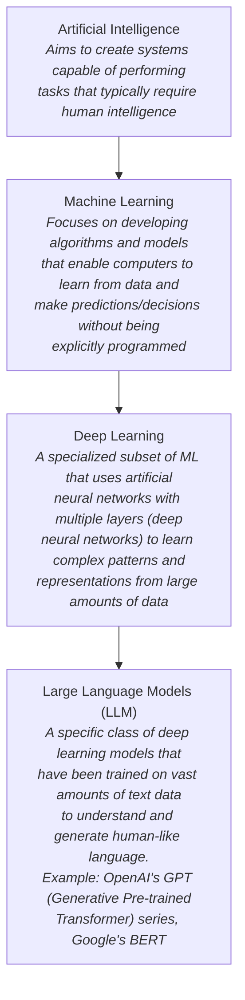

# Appendix C: Hacking AI Technologies
## Part 1 — How AI Works

[Back to README](README.md) | [Next: LLM Integrated Applications →](02-llm-integrated-applications.md)

---

## Table of Contents

1. [Introduction to Artificial Intelligence](#introduction-to-artificial-intelligence)
2. [Applications of Artificial Intelligence](#applications-of-artificial-intelligence)
3. [Artificial Intelligence Challenges](#artificial-intelligence-challenges)
4. [How AI, ML, Deep Learning, and LLM Are Interrelated](#how-ai-ml-deep-learning-and-llm-are-interrelated)
5. [How LLM Works](#how-llm-works)
6. [Applications of LLM](#applications-of-llm)
7. [Quick-Reference Summary](#quick-reference-summary)

---

## Introduction to Artificial Intelligence

**Artificial Intelligence (AI)** refers to the simulation of human intelligence in machines, enabling them to perform tasks that typically require human intelligence. AI technologies encompass a wide range of capabilities, including machine learning, natural language processing, computer vision, and robotics.

### AI Technologies

| Technology | Description |
|---|---|
| **Cognitive Computing** | Simulation of human thought processes in a computerized model. Cognitive computing systems are designed to mimic human cognitive functions such as perception, reasoning, decision-making, problem-solving, and learning |
| **Computer Vision** | Allows machines to interpret visual information, recognize patterns, and extract meaningful insights from images or video data |
| **Machine Learning** | Allows computers to automatically learn and improve from experience without being explicitly programmed for every task |
| **Deep Learning** | Specialized machine learning that teaches intricate patterns and representations from large and complex datasets. Performs human-like tasks such as recognizing speech, identifying images, or making predictions |
| **Neural Networks** | A fundamental component of deep learning, focused on learning hierarchical representations of data |
| **Natural Language** | Communication between humans and machines using human languages |

---

## Applications of Artificial Intelligence

AI applications continue to evolve and are utilized across various sectors:

| Sector | Application |
|---|---|
| **Autonomous Vehicles** | Combines AI techniques such as computer vision, machine learning, and sensor fusion to navigate roads autonomously |
| **Image and Facial Recognition** | Enhances security and safety — e.g., face authentication ensures appropriate personnel can access sensitive information |
| **Medical Diagnosis** | AI algorithms help with accurate diagnostics, early detection of diseases, and personalized treatment plans |
| **Customer Service** | AI chatbots act as virtual assistants that extend 24x7 customer support, answer questions, provide support, and complete tasks |
| **Manufacturing** | AI algorithms predict equipment failures, allowing for preventive maintenance and minimizing downtime |
| **Content Recommendation Systems** | AI recommends content on streaming platforms, and apps suggesting best routes help people stay informed |
| **Cyber Security** | Detects and mitigates security threats by analyzing network traffic, identifying anomalies, and predicting potential attacks. AI-powered cybersecurity tools enhance threat detection and response capabilities |

A voice assistant is a good example spanning several of these applications at once — it takes voice commands and performs tasks accordingly.

---

## Artificial Intelligence Challenges

1. **Computing Power** — the massive amount of power required by AI algorithms delays development due to the cost of supercomputers and cloud computing
2. **Trust Deficit** — lack of transparency in how AI models arrive at their outputs makes it difficult for people to trust them
3. **Limited Knowledge** — there's a general lack of understanding about AI's potential and limitations among the broader population
4. **Human-level Performance** — matching human-level accuracy consistently remains a challenge for AI, requiring vast datasets and fine-tuned algorithms
5. **Data Privacy and Security** — the massive datasets used to train AI raise concerns about data security and potential misuse of personal information
6. **Lack of Understanding** — misconceptions and unrealistic expectations about AI capabilities hinder its effective adoption
7. **Unreliable Results** — biases in data and complex real-world scenarios can lead to inaccurate AI outputs
8. **Implementation Strategy** — developing a successful AI implementation strategy requires careful planning, infrastructure readiness, and stakeholder engagement
9. **The Bias Problem** — AI systems can inherit biases from the data they're trained on, leading to discriminatory outcomes
10. **Data Scarcity** — limited access to data due to privacy concerns and regulations can hinder AI development and lead to biased models

---

## How AI, ML, Deep Learning, and LLM Are Interrelated

AI, ML, deep learning, and LLM form a **hierarchy of specialization**: ML is a subset of AI, deep learning is a subset of ML, and LLMs are a specific application of deep learning techniques.

---

## How LLM Works

LLMs utilize a **transformer neural network architecture** with extensive parameters for processing and understanding human languages or text.

### Working of LLM

1. **Training Data** — LLMs are trained on vast amounts of text data from the internet, books, articles, websites, etc. This data teaches the model about language patterns, grammar rules, semantics, and contextual understanding
2. **Tokenization** — the user input/prompt/query is broken down into smaller units called tokens, such as words or sub-words, which the model can understand
3. **Contextual Understanding** — the LLM analyzes the sequence of tokens and uses attention mechanisms to weigh the importance of each token based on its relevance to the overall context
4. **Language Generation** — the LLM generates responses or outputs by predicting the most likely continuation or completion of the input, based on its training data
5. **Fine-Tuning** — LLMs can be fine-tuned through further training on a smaller dataset related to a specific task at hand, allowing specialization in areas such as code generation, translation, summarization, etc.
6. **Feedback Loop** — LLMs can improve their performance over time through a feedback loop. They learn from user interactions and corrections, which helps refine their language understanding and generation abilities

**Pipeline:** Prompts/Inputs → Tokenization of Inputs → Embedding Representations/Mathematical Representations/Context Vector → Output (articles, images, songs, lyrics, code, etc.)

---

## Applications of LLM

1. Language translation
2. Content creation
3. Summarization
4. Question answering
5. Healthcare
6. Sentiment analysis
7. Virtual assistants
8. Code generation
9. AI analytics
10. Marketing
11. Search engine
12. Chatbots
13. Classification
14. Natural language processing
15. Rewrite
16. Fraud detection
17. Optimization efforts
18. Text generation

---

## Quick-Reference Summary

- **AI** = simulation of human intelligence, spanning 6 named technologies (cognitive computing, computer vision, ML, deep learning, neural networks, natural language)
- **7 application sectors**: autonomous vehicles, image/facial recognition, medical diagnosis, customer service, manufacturing, content recommendation, cybersecurity
- **10 AI challenges**: computing power, trust deficit, limited knowledge, human-level performance, data privacy/security, lack of understanding, unreliable results, implementation strategy, bias, data scarcity
- **The hierarchy**: AI ⊃ ML ⊃ Deep Learning ⊃ LLM — each narrower term is a specialized subset of the one before it
- **LLM mechanics**: transformer architecture; 6-step pipeline (training data → tokenization → contextual understanding → language generation → fine-tuning → feedback loop)
- **18 named LLM applications**, from translation and code generation to fraud detection and search

---

*Part of the CEH Appendix C study series — continues in [Part 2: LLM Integrated Applications](02-llm-integrated-applications.md).*
