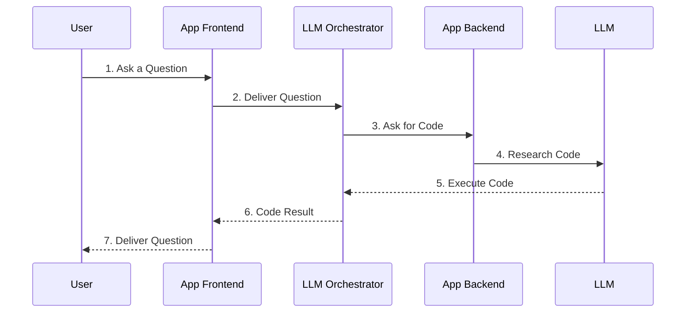

# Appendix C: Hacking AI Technologies
## Part 2 — LLM Integrated Applications

[← Back to Part 1: How AI Works](01-how-ai-works.md) | [Next: Attacks on LLM Integrated Applications →](03-attacks-on-llm-applications.md)

---

## Table of Contents

1. [LLM Integrated Applications](#llm-integrated-applications)
2. [Real Life LLM Applications](#real-life-llm-applications)
3. [Quick-Reference Summary](#quick-reference-summary)

---

## LLM Integrated Applications

Large language models (LLMs) are integrated into various applications across various domains and industries to improve natural language processing, understanding, and generation capabilities.

Organizations are rushing to integrate LLMs into such apps as a way to significantly enhance user experience by providing intuitive interfaces capable of understanding and responding to natural language queries.

These apps streamline customer service operations, enabling efficient handling of inquiries and support requests. At the same time, this integration exposes the organization to various **web LLM attacks** that take advantage of the model's access to data, APIs, or information that an attacker cannot access directly.

### LLM-Integrated Application Architecture

A typical LLM-integrated application connects a **User** to an **App Frontend**, which relays the interaction to an **LLM Orchestrator**, which in turn coordinates with the **App Backend** and the underlying **LLM** itself:

This layered architecture — user, frontend, orchestrator, backend, and the LLM itself — is exactly what creates the expanded **attack surface** covered in [Part 3](03-attacks-on-llm-applications.md): each hop between these components is a potential point where an attacker can attempt to inject, hijack, or manipulate the flow of instructions and data.

---

## Real Life LLM Applications

| Category | Application | Description |
|---|---|---|
| Content generation | **Claude** | An AI assistant developed by Anthropic |
| Content generation | **ChatGPT** | Assists users in generating text-based output on received prompts |
| Translation and localization | **Falcon LLM** | An AI model that excels in reasoning, programming, skill assessments, and knowledge evaluations |
| Translation and localization | **NLLB-200** | Translates across 200 different languages, incorporating various translation tools |
| Search and recommendation | **Gemini** | An AI model chatbot developed by Google |
| Virtual assistants | **Alexa** | Amazon's voice-controlled virtual assistant, featuring voice interaction, setting alarms, streaming podcasts, and music playback. Controls smart home devices |
| Virtual assistants | **Google Assistant** | A virtual assistant developed by Google; found in mobile and home automation devices. Can send texts, play music, or provide weather updates. Used to control smart home appliances |
| Code development | **Codex** | Trained on code from various sources; can generate code snippets, provide explanations, and assist developers in writing and understanding code |
| Sentiment analysis | **Grammarly** | A typing-assistance tool with grammar and spell checking, punctuation, clarity, and mistakes in English texts. Detects plagiarism and suggests replacements for identified issues |
| Question answering | **LLaMA** | A Large Language Model by Meta. Predicts and generates text and helps understand context, providing accurate and relevant information |
| Market research | **Brandwatch** | A digital consumer intelligence platform that can analyze online conversations and provide views on market research |
| Market research | **Talkwalker** | A market research tool for real-time responses to critical management questions; used for conducting product listing and customer product feedback |

---

## Quick-Reference Summary

- **LLM-integrated apps** streamline user experience via natural-language interfaces, but expose new attack surface — the model's access to data/APIs/information an attacker can't reach directly is exactly what attackers try to exploit
- **Architecture flow**: User → App Frontend → LLM Orchestrator → App Backend → LLM, and back — 7 discrete hops, each a potential attack point
- **12 real-world LLM applications** spanning content generation (Claude, ChatGPT), translation (Falcon LLM, NLLB-200), search (Gemini), virtual assistants (Alexa, Google Assistant), code development (Codex), sentiment analysis (Grammarly), question answering (LLaMA), and market research (Brandwatch, Talkwalker)

---

*Part of the CEH Appendix C study series — continues in [Part 3: Attacks on LLM Integrated Applications](03-attacks-on-llm-applications.md).*
