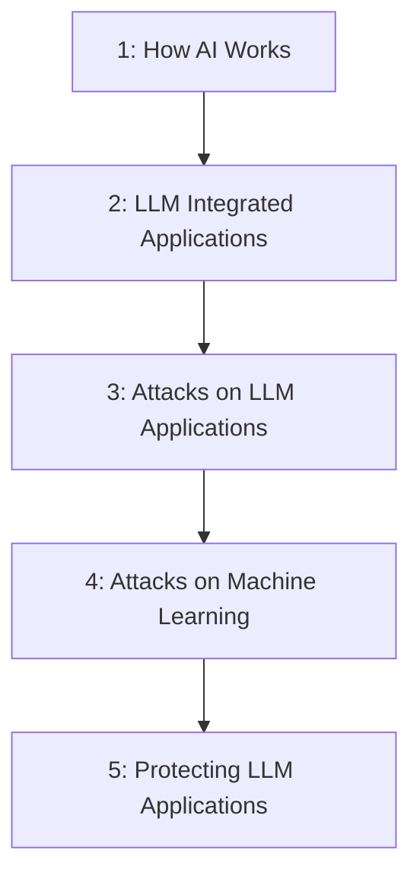

# CEH Appendix C: Hacking AI Technologies

Personal study notes covering Appendix C of the CEH v13 curriculum — rewritten and organized into a structured reference repo, rather than reproduced verbatim from any copyrighted source material.

> These notes are written in original language for personal study and reference. They summarize and explain the concepts covered in Appendix C; they are not a copy of any textbook, courseware, or slide deck.

---

## What This Appendix Is

Appendix C is the newest addition to the CEH curriculum's supporting material — a focused treatment of **AI and LLM security**, covering how AI/ML/LLM systems work, how LLM-integrated applications get attacked, how the underlying ML models themselves get attacked, and how to defend both. It applies the same OWASP-style "Top 10" structure used elsewhere in application security directly to large language models and machine learning systems.

---

## Learning Objectives

- [x] How AI Works
- [x] Understand LLM Integrated Applications
- [x] Understand Attacks on LLM Integrated Applications
- [x] Understand Attacks on Machine Learning
- [x] Learn to Protect LLM Applications

**Appendix C is complete.** ✅ (All 5 objectives.)

---

## Repo Structure

| # | File | Covers |
|---|---|---|
| 1 | [`01-how-ai-works.md`](01-how-ai-works.md) | AI technologies (cognitive computing, computer vision, ML, deep learning, neural networks, NLP), AI applications, 10 AI challenges, the AI ⊃ ML ⊃ Deep Learning ⊃ LLM hierarchy, how LLMs work (transformer architecture, tokenization, training), 18 LLM applications |
| 2 | [`02-llm-integrated-applications.md`](02-llm-integrated-applications.md) | LLM-integrated application architecture (user → frontend → orchestrator → backend → LLM), 12 real-world LLM applications (Claude, ChatGPT, Gemini, Alexa, Codex, and more) |
| 3 | [`03-attacks-on-llm-applications.md`](03-attacks-on-llm-applications.md) | The full OWASP Top 10 for LLM Applications — prompt injection (direct/indirect), insecure output handling, training data poisoning, model DoS, supply chain vulnerabilities, sensitive information disclosure, insecure plugin design, excessive agency, overreliance, model theft |
| 4 | [`04-attacks-on-machine-learning.md`](04-attacks-on-machine-learning.md) | The full OWASP Machine Learning Security Top Ten — input manipulation, data poisoning, model inversion, membership inference, model theft, AI supply chain attacks, transfer learning attacks, model skewing, output integrity attacks, model poisoning |
| 5 | [`05-protecting-llm-applications.md`](05-protecting-llm-applications.md) | Mitigations mapped to every attack in Parts 3–4, plus real LLM security tools (Lakera, LLM Guard, Rebuff, Garak, and more) and the module summary |

---

## Suggested Reading Order

Each file is self-contained with its own table of contents and a quick-reference summary at the bottom, so you can also jump straight to whichever topic you need. Part 5's mitigation sections are organized to map directly onto the attack sections in Parts 3 and 4, so you can also read attack ↔ defense pairs side by side.

---

## A Note on Scope and Framing

This appendix covers **attack categories and their defensive mitigations at a conceptual level** — matching how OWASP itself publishes the LLM Top 10 and ML Security Top Ten publicly for defensive purposes. Where the source material referenced specific historical incidents (e.g., early ChatGPT jailbreak prompts, the "grandma exploit," the ChatGPT/Redis-py supply chain incident), this repo describes them as historical, publicly documented, and — where applicable — since-patched examples, rather than reproducing exact exploit text. The goal throughout is the same as the source curriculum's: understanding how these attacks work well enough to defend against them, not providing a ready-to-use attack toolkit.

---

## Relationship to the Rest of the Repo

- [`../CEH-Module-01-Introduction-to-Ethical-Hacking/`](../CEH-Module-01-Introduction-to-Ethical-Hacking/README.md) — foundational security concepts, hacking/ethical hacking concepts, methodologies, controls, laws
- [`../CEH-Module-02-Footprinting-and-Reconnaissance/`](../CEH-Module-02-Footprinting-and-Reconnaissance/README.md) — the first attack-methodology phase: reconnaissance
- [`../CEH-Appendix-A-Essential-Concepts-I/`](../CEH-Appendix-A-Essential-Concepts-I/README.md) — technical IT/CS foundations (OS, networking, virtualization, web/database tech)
- [`../CEH-Appendix-B-Essential-Concepts-II/`](../CEH-Appendix-B-Essential-Concepts-II/README.md) — governance, risk, compliance, and blue-team foundations
- **This appendix** — AI/LLM-specific security: how these systems work, how they get attacked, and how to defend them

---

## About This Repo

Compiled as part of an ongoing CEH v13 study track, alongside parallel work in CTF challenges and web security (SSRF and related topics). Structured for easy GitHub browsing — each part links to the next, diagrams render natively via Mermaid, and comparison tables are used wherever they make scanning faster than prose.
