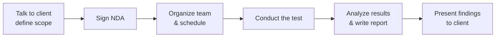

# Module 1: Introduction to Ethical Hacking
## Part C — Ethical Hacking Concepts, Scope, and Skills

[← Back to Part B: Hacking Concepts and Hacker Classes](02-hacking-concepts-and-hacker-classes.md) | [Next: AI-Driven Ethical Hacking →](04-ai-driven-ethical-hacking.md)

---

## Table of Contents

1. [What Is Ethical Hacking?](#what-is-ethical-hacking)
2. [Hacker vs. Cracker vs. Attacker — Getting the Terms Straight](#hacker-vs-cracker-vs-attacker--getting-the-terms-straight)
3. [Why Ethical Hacking Is Necessary](#why-ethical-hacking-is-necessary)
4. [Three Questions Every Ethical Hacker Has to Ask](#three-questions-every-ethical-hacker-has-to-ask)
5. [Scope and Limitations of Ethical Hacking](#scope-and-limitations-of-ethical-hacking)
6. [A Practical Framework for Running a Security Audit](#a-practical-framework-for-running-a-security-audit)
7. [Skills of an Ethical Hacker](#skills-of-an-ethical-hacker)
8. [Quick-Reference Summary](#quick-reference-summary)

---

## What Is Ethical Hacking?

**Ethical hacking** is the authorized use of hacking tools, tricks, and techniques to find vulnerabilities in a system and confirm that they're genuinely exploitable — done specifically to help an organization improve its security, not to cause harm. The people who do this are usually called **White Hats**, or more simply, ethical hackers or security analysts.

The core difference between ethical hacking and the "hacking" most people picture is **permission**. Organizations of every kind — private companies, universities, government agencies — increasingly hire White Hats specifically to probe their own defenses. The ethical hacker operates with the system owner's knowledge and consent, has no intention of causing harm, and reports every vulnerability they find back to the owner so it can actually get fixed.

It's worth being precise about the vocabulary here, because "hacker" carries a lot of baggage:

- **Hacker** (noun) — someone who enjoys deeply understanding computer systems and pushing them past their obvious limits.
- **To hack** (verb) — rapidly building new programs, or reverse-engineering existing software to make it faster, better, or more efficient in creative ways.
- **Cracker** / **Attacker** — someone who uses those same hacking skills for offensive, unauthorized purposes.

## Hacker vs. Cracker vs. Attacker — Getting the Terms Straight

The single distinguishing factor between an ethical hacker and a cracker is **consent**. A cracker tries to gain access without authorization. An ethical hacker is transparent from the start about exactly what they're doing and how — which is precisely what makes ethical hacking legal, as long as it's carried out under a proper agreement or contract with the organization involved. The authorization is the whole thing; identical technical actions are a crime on one side of that line and a paid professional service on the other.

---

## Why Ethical Hacking Is Necessary

The guiding principle is simple: **to beat a hacker, you have to learn to think like one.** Ethical hacking exists to let organizations counter malicious hackers by anticipating the exact methods those hackers would use to break in — catching and fixing vulnerabilities before an outside attacker ever gets the chance to exploit them.

Because hacking inherently involves creative, adversarial thinking, vulnerability scans and security audits alone aren't enough to guarantee a network is actually secure. This is why organizations lean on a **defense-in-depth** strategy — actively penetrating their own networks to find and expose weaknesses rather than only checking boxes on a compliance list.

### Reasons organizations recruit ethical hackers

- To prevent hackers from gaining unauthorized access to information systems
- To uncover vulnerabilities and understand their real-world risk potential
- To analyze and strengthen the organization's overall security posture — policies, network protections, and end-user practices alike
- To put adequate preventive measures in place ahead of a breach
- To help safeguard customer data specifically
- To raise security awareness at every level of the business, not just in IT

---

## Three Questions Every Ethical Hacker Has to Ask

A useful way to frame the ethical hacking process is as three linked questions, each mapped to specific phases of an attack:

1. **What can an attacker see on the target system?**
   Routine administrative security checks often miss real vulnerabilities. An ethical hacker has to actively think about what an attacker would uncover during the reconnaissance and scanning phases — not just what a checklist says should be secure.

2. **What can an intruder do with that information?**
   The ethical hacker needs to understand an attacker's likely intent well enough to design the right countermeasures — staying one step ahead during the gaining-access and maintaining-access phases specifically.

3. **Are the attacker's attempts being noticed on the target systems?**
   Real attackers sometimes probe a system for days, weeks, or months before doing anything visibly damaging, deliberately taking their time to assess how they can best use what they've found. The ethical hacker's job during the reconnaissance and covering-tracks phases is to make sure that activity actually gets noticed and stopped.

After an attack, real hackers typically try to erase their footprints — modifying logs, planting backdoors, deploying trojans. Ethical hackers need to check whether that kind of activity has actually been logged and what preventive measures are already in place. Doing this well tells you two things at once: how capable a real attacker would need to be to succeed, and how good the organization's existing defenses actually are.

That whole process — testing, then patching what you find — comes down to a handful of grounding questions:

- What is the organization actually trying to protect?
- Who or what are they protecting it *from*?
- Are all the components of the information system properly protected, updated, and patched?
- How much time, effort, and budget is the client actually willing to commit to real protection?
- Do the existing security measures meet relevant industry and legal standards?

Sometimes a client will want to stop testing the moment the first vulnerability turns up, either to save resources or to limit further exposure — which is exactly why the ethical hacker and the client need to agree on a testing framework *before* work begins. The ethical hacker's job includes making the stakes concrete enough that the client understands what's actually being tested and why, while being honest that no system can ever be made completely un-hackable — only continuously improved.

---

## Scope and Limitations of Ethical Hacking

Security professionals generally split computer crime into two buckets: crimes where a computer is the **tool** used to commit the crime, and crimes where a computer is the **target** of the crime itself.

Ethical hacking is a structured, organized form of security assessment — usually delivered as a penetration test or a formal security audit — and it plays a real role in risk assessment, auditing, fraud prevention, and general information-systems best practice. Beyond finding risks, it also helps organizations cut ICT costs over time simply by closing the vulnerabilities that would otherwise turn into expensive incidents.

The scope of any given engagement is set by the client's specific security concerns. Ethical hackers frequently work as part of a **Tiger Team** — a group that runs a full-scale test covering every angle of the target: network, physical security, and system intrusion all together.

Two things every ethical hacker has to take seriously going in:

- **Authorization comes first, always.** No ethical hacking activity tied to a penetration test or security audit should ever begin before a signed legal document is in place, explicitly granting permission to carry out the agreed-upon hacking activities. Ethical hackers need to understand the real penalties for unauthorized hacking and use their skills judiciously.
- **Confidentiality and agreed boundaries matter just as much as the testing itself.**
  - **Maintain confidentiality** under a signed Non-Disclosure Agreement (NDA). Testing surfaces sensitive information almost by definition, and none of it — nor details of the test itself — should ever reach a third party.
  - **Stay inside the agreed-upon limits.** A DoS attack, for instance, should only ever be attempted if the client explicitly signed off on it beforehand — going beyond agreed limits can cause real revenue loss, reputational damage, and worse if a client's servers or applications go down because of the test.

### Limitations

Ethical hacking isn't a silver bullet. If a business doesn't have a clear sense of what it's actually looking for — or why it's bringing in an outside vendor to hack its own systems — there often isn't much real value to extract from the exercise. An ethical hacker can help an organization *understand* its security posture far better, but implementing the right safeguards on the network afterward is still squarely the organization's own responsibility.

---

## A Practical Framework for Running a Security Audit

To keep an engagement organized, efficient, and genuinely ethical, most security audits follow roughly this sequence:

1. **Talk to the client** and pin down exactly what needs to be addressed during testing
2. **Prepare and sign NDA documents** with the client
3. **Organize the ethical hacking team** and set the testing schedule
4. **Conduct the test**
5. **Analyze the results** and prepare a report
6. **Present the findings** to the client

---

## Skills of an Ethical Hacker

Becoming a genuinely good ethical hacker means building real expertise — and then applying it in a strictly lawful way. The required skill set splits naturally into two categories:

### Technical Skills

- In-depth knowledge of major operating environments — Windows, Unix, Linux, and macOS
- In-depth knowledge of networking concepts, technologies, and the hardware/software behind them
- Genuine technical depth as a computer expert, not just surface familiarity
- Solid working knowledge of security domains and the issues tied to them
- High enough technical skill to actually understand and replicate sophisticated attack techniques

### Non-Technical Skills

- The ability to learn and adapt to new technologies quickly — the field moves fast
- A strong work ethic paired with real problem-solving and communication skills
- Genuine commitment to the organization's security policies, not just going through the motions
- Awareness of the local legal standards and laws that govern the work

---

## Quick-Reference Summary

- **Ethical hacking** = authorized hacking, done to find and report vulnerabilities, not exploit them
- **Consent is the entire dividing line** between an ethical hacker and a cracker/attacker
- **Guiding principle**: think like an attacker to defeat an attacker; defense-in-depth beats pure compliance-checking
- **Three grounding questions**: what can an attacker see → what can they do with it → would we even notice?
- **Authorization is non-negotiable** — signed legal permission before any testing begins, plus an NDA and agreed-upon limits
- **Audit framework**: scope → NDA → team & schedule → test → analyze/report → present
- **Skills split**: technical depth (OS, networking, security) + non-technical maturity (ethics, communication, legal awareness)

---

*Part of the CEH Module 1 study series — continues in [Part D: AI-Driven Ethical Hacking](04-ai-driven-ethical-hacking.md).*
