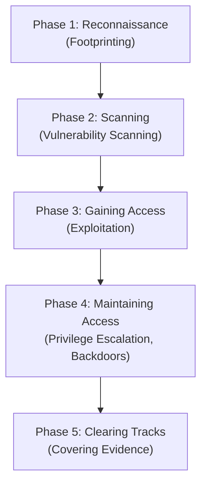
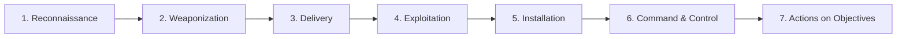

# Module 1: Introduction to Ethical Hacking
## Part E — Hacking Methodologies and Frameworks

[← Back to Part D: AI-Driven Ethical Hacking](04-ai-driven-ethical-hacking.md) | [Back to README](README.md)

---

## Table of Contents

1. [Why Methodologies Matter](#why-methodologies-matter)
2. [The CEH Ethical Hacking Framework](#the-ceh-ethical-hacking-framework)
3. [The Cyber Kill Chain Methodology](#the-cyber-kill-chain-methodology)
4. [Tactics, Techniques, and Procedures — Revisited](#tactics-techniques-and-procedures--revisited)
5. [Quick-Reference Summary](#quick-reference-summary)
6. [A Note on Scope](#a-note-on-scope)

---

## Why Methodologies Matter

Learning established hacking methodologies and frameworks gives ethical hackers a structured way to understand the phases a real attack moves through, along with the tactics, techniques, and procedures (TTPs) genuine attackers rely on at each stage. That structure is what actually lets a defender strengthen an organization's security in a targeted way, rather than patching things at random.

---

## The CEH Ethical Hacking Framework

The CEH framework mirrors the process a real attacker follows step for step — the only meaningful differences are the *goal* (defense, not exploitation) and the *authorization* behind it. Understanding this framework means understanding the tools and tactics attackers use at every phase, which is exactly what lets ethical hackers anticipate and out-maneuver them.

### Phase 1: Reconnaissance

Reconnaissance is about gathering as much information on the target as possible *before* ever attacking it — building a profile that includes things like IP address ranges, namespace, and employee details. This phase matters because it's often what quietly reveals the vulnerabilities that make system hacking possible later on. A company website listing employee bios or an org chart, for instance, can hand a hacker exactly what they need for a social-engineering attack. A simple Whois query can also surface network and domain information tied to the target.

Reconnaissance splits into two broad categories:

- **Passive reconnaissance** — no direct interaction with the target at all. The attacker relies entirely on publicly available information, news releases, and other no-contact sources.
- **Active reconnaissance** — direct interaction with the target system, using tools to detect open ports, accessible hosts, router locations, network topology, and details about the operating systems and applications in use.

*(Footprinting techniques specifically are covered in depth in Module 02: Footprinting and Reconnaissance.)*

### Phase 2: Scanning

Scanning picks up where reconnaissance leaves off, using the information already gathered to identify active hosts, open ports, and unnecessary services running on specific hosts. It's really a logical extension of active reconnaissance — some experts don't even draw a hard line between the two — but scanning generally involves deeper, more targeted probing. In practice, these two phases often overlap enough that separating them cleanly isn't always possible.

*(Scanning techniques specifically are covered in Module 03: Scanning Networks.)*

### Phase 3: Gaining Access

This is the exploitation phase — where the attacker actually turns discovered vulnerabilities into real access. What's achievable here depends heavily on the target's system configuration, the attacker's own skill level, and how much initial access they've already secured. Once in, attackers typically try to escalate their privileges to gain full control, often compromising any intermediate systems connected along the way.

**Escalating Privileges**, specifically, is the sub-step where an attacker who gained access through a low-privilege account tries to work their way up to administrator-level access — usually by exploiting known system vulnerabilities — so they can move on to executing whatever they actually came to do.

### Phase 4: Maintaining Access

Once an attacker has admin- or root-level control, they effectively "own" the system and can use it and its resources however they want. From here, they generally do one of two things: use the compromised system as a launchpad to scan and exploit further systems, or keep a low profile and continue quietly exploiting the one they already have. Both paths can cause serious damage.

At this stage, attackers can upload, download, or manipulate data and configurations at will, and may deploy malicious software to exfiltrate usernames, passwords, and other stored information. They'll often try to close off the vulnerabilities they used to get in — not to help the organization, but to keep other hackers (and rescuers) out of "their" system.

### Phase 5: Clearing Tracks

To avoid detection, attackers work to erase evidence of the compromise — commonly by modifying or deleting system logs using dedicated log-wiping utilities, removing traces of their activity.

*(The full system-hacking process — gaining access, maintaining access, and clearing tracks — is covered in depth in Module 06: System Hacking.)*

---

## The Cyber Kill Chain Methodology

Developed by **Lockheed Martin**, the Cyber Kill Chain is a component of *intelligence-driven defense* — a model for identifying and stopping malicious intrusions by breaking an attack down into seven distinct phases. Understanding it gives defenders real insight into how attacks unfold stage by stage, which means security controls can be layered in at multiple points rather than relying on a single line of defense.

### 1. Reconnaissance
The adversary gathers everything they can about the target before attacking — publicly available information, network details, system information, and organizational context. This might include network blocks, specific IP addresses, and employee details, often pulled together using automated tools that also surface open ports, services, application vulnerabilities, and exposed credentials.

Typical activities:
- Searching the internet and using social engineering to gather organizational information
- Analyzing online activity and publicly available data
- Mining social networking sites and web services
- Tracking which websites the target visits
- Monitoring and analyzing the target's website
- Running Whois, DNS, and general network footprinting
- Scanning to identify open ports and services

### 2. Weaponization
The adversary builds an actual attack "weapon" — malware, a malicious document, an exploit — tailored to the specific network devices, operating systems, endpoints, or even individual people at the target organization. A classic example: crafting a phishing email containing a malicious attachment that installs a backdoor the moment it's opened.

Typical activities:
- Identifying the right malware payload based on prior analysis
- Creating a new payload, or selecting/reusing/modifying an existing one to match a known vulnerability
- Building a phishing email campaign
- Leveraging existing exploit kits and botnets

### 3. Delivery
The weapon built in the previous phase gets transmitted to the target — as an email attachment, a malicious link, through a vulnerable web application, or via a USB drive. This phase is the real test of an organization's existing defenses: how well they hold up here determines whether the attack even gets a foothold.

Typical activities:
- Sending phishing emails to employees
- Distributing USB drives loaded with malicious payloads
- Running watering-hole attacks via a compromised website
- Deploying hacking tools against target operating systems, applications, and servers

### 4. Exploitation
Once delivered, the malicious code actually triggers, exploiting a vulnerability in the target's OS, application, or server. This is where organizations start facing concrete threats — authentication/authorization attacks, arbitrary code execution, physical security issues, and security misconfigurations all become live risks.

Typical activity:
- Exploiting a software or hardware vulnerability to gain remote access to the target system

### 5. Installation
The adversary installs additional malicious software to lock in longer-term access to the network.

Typical activities:
- Downloading and installing malicious tools such as backdoors
- Gaining remote access to the target system
- Using various methods to keep the backdoor hidden and running
- Maintaining ongoing access to the system

### 6. Command and Control (C2)
The adversary sets up a two-way communication channel between the compromised system and an adversary-controlled server, allowing data to move back and forth. Encryption and other obfuscation techniques are commonly used to hide that this channel even exists. From here, the adversary can perform remote exploitation of the target system or network at will.

Typical activities:
- Establishing two-way communication between the victim's system and the adversary's server
- Leveraging channels like web traffic, email, and DNS messages to communicate covertly
- Applying privilege escalation techniques
- Hiding evidence of compromise (e.g., via encryption)

### 7. Actions on Objectives
The final phase — the adversary now has remote control of the victim's system and moves to actually accomplish whatever their original goal was: exfiltrating confidential data, disrupting services or the network, or destroying operational capability outright. From here, the compromised system might also become a launching point for further attacks elsewhere.

---

## Tactics, Techniques, and Procedures — Revisited

Within the context of methodologies like the Cyber Kill Chain, understanding an adversary's TTPs is what lets an organization actually stop an attack at its earliest stage, before it can cause serious damage:

- **Tactics** describe *how* a threat actor operates across the different phases of an attack — the overall approach used to gather initial information, escalate privileges, move laterally, and ultimately achieve their objective.
- **Techniques** and **Procedures** (as covered in [Part A](01-information-security-concepts.md#tactics-techniques-and-procedures-ttps)) fill in the *how exactly* and the *step-by-step sequence* behind those tactics.

Organizations that understand TTPs at this level of granularity are far better positioned to recognize an attack pattern in progress — rather than only reacting after the damage is already done.

---

## Quick-Reference Summary

- **CEH Framework (5 phases)**: Reconnaissance → Scanning → Gaining Access → Maintaining Access → Clearing Tracks
- **Cyber Kill Chain (7 phases, Lockheed Martin)**: Reconnaissance → Weaponization → Delivery → Exploitation → Installation → Command & Control → Actions on Objectives
- Both models exist to give defenders a **staged map of an attack**, so security controls can be layered at multiple points rather than relying on one line of defense
- **TTPs** remain the connective tissue across both frameworks — understanding an adversary's tactics, techniques, and procedures is what turns a generic methodology into an actionable defense strategy

---

## A Note on Scope

This section of the source material also names the **MITRE ATT&CK Framework** and the **Diamond Model of Intrusion Analysis** as topics covered under "Hacking Methodologies and Frameworks," but the source video for this write-up ends partway through the TTPs discussion (at page 53) before reaching either of those frameworks in detail. Rather than invent content for topics the video didn't actually cover, this file sticks strictly to what was shown — the CEH Ethical Hacking Framework and the Cyber Kill Chain Methodology. Happy to add a Part F covering MITRE ATT&CK and the Diamond Model whenever that portion of the material is available.

---

*Part of the CEH Module 1 study series. [Return to the README](README.md) for the full repo index.*
