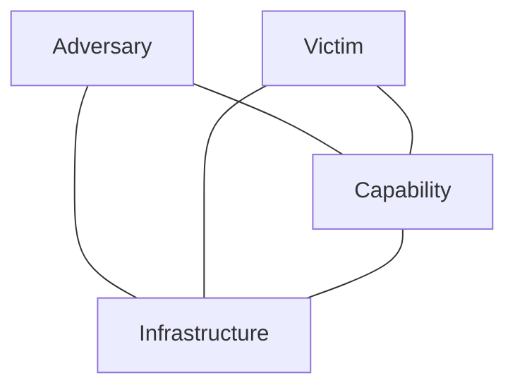

# Module 1: Introduction to Ethical Hacking
## Part F — Adversary Behavior, MITRE ATT&CK, and the Diamond Model

[← Back to Part E: Hacking Methodologies and Frameworks](05-hacking-methodologies-and-frameworks.md) | [Next: Information Security Controls →](07-information-security-controls.md)

---

## Table of Contents

1. [Profiling Threat Actors Through TTPs](#profiling-threat-actors-through-ttps)
2. [Adversary Behavioral Identification](#adversary-behavioral-identification)
3. [Indicators of Compromise (IoCs)](#indicators-of-compromise-iocs)
4. [The MITRE ATT&CK Framework](#the-mitre-attck-framework)
5. [The Diamond Model of Intrusion Analysis](#the-diamond-model-of-intrusion-analysis)
6. [Quick-Reference Summary](#quick-reference-summary)

---

## Profiling Threat Actors Through TTPs

Picking up directly from the TTP discussion in [Part E](05-hacking-methodologies-and-frameworks.md#tactics-techniques-and-procedures--revisited): organizations can actually build a working profile of a threat actor by carefully analyzing the tactics, techniques, and procedures they favor at each stage of an attack.

**Tactics** — profiling by tactics means looking at *how* a threat actor gathers information, what methods they use for initial compromise, and how many entry points they typically attempt. Some actors rely purely on open-source information; others lean on social engineering or exploit relationships with intermediate organizations. Once they've gathered something like employee email addresses, some approach targets individually while others go after a group all at once. Because attackers may deliberately vary their approach depending on the specific target, tactics from the *early* stages of an attack need continuous re-analysis rather than a one-time profile.

A related angle: examining the **infrastructure and tooling** an actor relies on. A more sophisticated threat actor might burn multiple zero-days with custom obfuscation; a less sophisticated one usually leans on publicly known vulnerabilities and off-the-shelf open-source tools. That gap in sophistication is itself a useful fingerprint. Tactics used in the *final* stages of an attack — particularly how an actor covers their tracks — are equally revealing, since those cleanup methods tend to be fairly consistent within a given group.

**Techniques** — these are the specific execution methods used across a campaign: initial exploitation, setting up and maintaining C2 channels, moving through the target's infrastructure, and covering tracks during exfiltration. Techniques vary attack to attack but tend to cluster into recognizable patterns per threat actor, which is what makes them useful for profiling. Early-stage techniques often lean non-technical (a well-crafted phone call to extract credentials, for instance); mid-stage techniques tend to be technical (privilege escalation, lateral movement, exploiting configuration flaws); late-stage techniques mix both — technical exfiltration methods (encryption, C2 channels) paired with technical cleanup (automated log-wiping tools).

**Procedures** — the detailed, step-by-step sequence an actor follows, often including things like extensive social-media reconnaissance on specific individuals, spear-phishing execution, and precisely how malware decrypts and establishes persistence once it runs. Because different threat actors can implement the exact same procedural "signature" in their malware, this level of detail is often what actually nails down attribution in a forensic investigation. Early-stage procedures are hard to observe directly; later-stage procedures tend to leave more usable trails.

---

## Adversary Behavioral Identification

Beyond TTPs in the abstract, security professionals watch for a specific set of **behaviors** that show up again and again across real intrusions — recognizing these early is what actually lets a team get ahead of a threat rather than just cleaning up after it:

- **Unspecified Proxy Activity** — adversaries often point multiple domains at the same underlying host, letting them hop between domains quickly to dodge detection. Security teams can catch this by examining the data feeds those domains generate, looking for malicious downloads or unsolicited outbound communication.
- **Use of the Command-Line Interface** — once inside a system, an adversary frequently uses the CLI directly to browse and modify files, create new accounts, connect to remote systems, and pull down further malicious code. This tends to leave traces: odd process IDs, arbitrary-looking process names, files clearly downloaded from the internet.
- **HTTP User Agent Anomalies** — unusual or spoofed user-agent strings, cross-referenced with the requesting IP, can help flag hosts that are quietly exfiltrating data.
- **Command and Control (C2) Server Activity** — adversaries rely on C2 servers to run an encrypted remote session with a compromised system, using that channel to steal data, delete data, and launch further attacks. Defenders can spot this through outbound connection attempts, unexpected open ports, and other network-traffic anomalies.
- **DNS Tunneling** — hiding malicious traffic inside what looks like ordinary DNS traffic, letting an adversary reach a C2 server, sidestep security controls, and exfiltrate data. Detectable by analyzing DNS payloads, suspicious requests, and unusual destination domains.
- **Use of a Web Shell** — planting a shell inside a website itself, which hands the adversary remote access to whatever functionality that web server exposes.
- **Data Staging** — before exfiltrating or destroying anything, adversaries typically stage the data first — sensitive employee/customer records, business strategy documents, financial data, network infrastructure details. Catchable through network-traffic monitoring, file-integrity monitoring, and event-log analysis.

---

## Indicators of Compromise (IoCs)

Because attacker TTPs are always evolving to match a target's specific weaknesses, security teams need continuous monitoring of **Indicators of Compromise (IoCs)** — the clues, artifacts, and forensic data left behind on a network or system that point to a potential intrusion.

One important distinction worth internalizing: **IoCs are not intelligence by themselves.** They're data points that feed *into* the intelligence process. It's the actionable threat intelligence built *from* IoCs that actually improves incident handling. Groups like STIX and TAXII have built standardized reporting formats specifically so organizations can share condensed IoC data with each other and strengthen collective response.

An IoC is generally one of three types — **atomic**, **computed**, or **behavioral** — and in practice, IoCs get grouped into four categories:

| Category | What It Captures | Examples |
|---|---|---|
| **Email Indicators** | Signals from socially-engineered email — still a favorite delivery method for its ease of use and relative anonymity | Sender address, subject line, attachments/links |
| **Network Indicators** | Signals useful for spotting C2 traffic, malware delivery, and system fingerprinting | URLs, domain names, IP addresses |
| **Host-Based Indicators** | Found by analyzing an already-infected system directly | Filenames, file hashes, registry keys, DLLs, mutexes |
| **Behavioral Indicators** | Patterns of *activity* rather than static artifacts — catches things signature-matching misses | A document spawning a PowerShell process, unexpected remote command execution |

### Key IoCs Worth Watching

- Unusual outbound network traffic
- Unusual activity through a privileged user account
- Geographical anomalies (logins from unexpected locations)
- Multiple login failures
- Increased database read volume
- Unusual DNS requests
- Unexpected patching of systems
- Signs of DDoS activity
- Data bundles showing up in the wrong places
- Web traffic exhibiting "superhuman" behavior (too fast, too regular to be a real user)

---

## The MITRE ATT&CK Framework

**MITRE ATT&CK** is a globally accessible knowledge base of adversary tactics and techniques, built from real-world observed intrusions rather than theoretical possibilities. That real-world grounding is exactly why it's become a foundational reference for building threat models and methodologies across the private sector, government, and the broader cybersecurity product and service community.

ATT&CK is organized into matrices — **PRE-ATT&CK** and **Enterprise ATT&CK** are the two the source material calls out specifically (a Mobile matrix also exists in the broader framework). The Enterprise matrix contains **14 tactic categories**, derived from the later stages (exploit, control, maintain, execute) of the seven-stage Cyber Kill Chain — giving a much finer-grained picture of what actually happens during an intrusion than the Kill Chain alone provides.

The tactics in ATT&CK for Enterprise include:

- Reconnaissance
- Resource Development
- Initial Access
- Execution
- Persistence
- Privilege Escalation
- Defense Evasion
- Credential Access
- Discovery
- Lateral Movement
- Collection
- Command and Control
- Exfiltration
- Impact

### Practical Use Cases for MITRE ATT&CK

- Prioritizing development and acquisition efforts for network-defense capabilities
- Running comparative analyses between different defense capabilities
- Determining the actual "coverage" of a given set of defenses
- Describing an intrusion as a chain of events, technique by technique, using a shared reference vocabulary
- Identifying commonalities — and meaningful differences — across different adversaries' tradecraft
- Connecting mitigations, weaknesses, and specific adversaries into a single coherent picture

---

## The Diamond Model of Intrusion Analysis

The **Diamond Model** offers a different but complementary lens: it's a framework and set of procedures for recognizing correlated clusters of events across an organization's systems. It defines the essential atomic unit of any intrusion as a **Diamond event**, and gives analysts a structured way to link individual events into full activity threads — reconstructing how and what actually happened, and even identifying what data is *missing* just by noticing gaps in the pattern.

Using the model well leads to more advanced, more efficient mitigation — cutting costs for the defender while driving costs up for the adversary. It's called the "Diamond" Model specifically because when its four core features are arranged according to how they relate to one another, they form a diamond shape. The approach looks simple on its face, but tracing an actual attack flow through it takes genuine skill and expertise.

### The Four Core Features of a Diamond Event

- **Adversary** — the opponent or hacker responsible for the event. Adversaries use a capability against a victim, typically for financial gain or to damage the victim's reputation, and can range from insiders to a rival organization.
- **Victim** — the target that was exploited, or the environment the attack occurred in. Can be any person, organization, institution, or even specific network assets — IP addresses, domain names, email addresses, or personal information.
- **Capability** — the strategies, methods, and procedures behind the attack, including any malware or tool used. Spans everything from simple techniques like brute-forcing to complex ones like ransomware.
- **Infrastructure** — the hardware or software the adversary used to actually reach the victim; the answer to "what did they use to get here." A compromised email server storing employee details, for instance, could serve as infrastructure for targeting a specific employee — and exploiting that infrastructure is often what leads directly to data leakage and exfiltration.

### Additional Event Meta-Features

Beyond the four core features, a Diamond event carries meta-features that add useful context — time, source, and other details that make it easier and faster for analysts to link related events together:

- **Direction** — how the attack was routed: victim → infrastructure, adversary → infrastructure, infrastructure → infrastructure, or bidirectional. Particularly useful for describing network-based and host-based events.
- **Methodology** — the overall class of technique used (spear-phishing email, DDoS, content-delivery attack, drive-by-compromise, etc.).
- **Resources** — the external tools or technology the adversary drew on: hardware, software, access, knowledge, data.

### The Extended Diamond Model

An extended version of the model adds two further meta-features:

- **Socio-Political meta-feature** — describes the relationship between adversary and victim, helping pin down *motive* — financial gain, corporate espionage, hacktivism, and so on.
- **Technology meta-feature** — describes the relationship between infrastructure and capability: how technology enables both the delivery mechanism and the attack itself, and can help analysts spot malicious activity by examining the technology an organization actually runs.

---

## Quick-Reference Summary

- **TTP profiling** works differently at each stage: early-stage tactics reveal *how* an actor gathers information, mid-stage techniques reveal *tooling and sophistication*, late-stage procedures often nail down *attribution*
- **8 adversary behaviors to watch for**: unspecified proxy activity, CLI misuse, HTTP user-agent anomalies, C2 server activity, DNS tunneling, web shells, and data staging
- **IoCs ≠ intelligence** — they're raw data points across 4 categories (email, network, host-based, behavioral) that *become* intelligence once analyzed
- **MITRE ATT&CK** — a real-world-grounded, 14-tactic knowledge base for Enterprise environments, derived from the later stages of the Cyber Kill Chain
- **Diamond Model** — 4 core features (Adversary, Victim, Capability, Infrastructure) arranged in a diamond, extended with direction, methodology, resource, socio-political, and technology meta-features

---

*Part of the CEH Module 1 study series — continues in [Part G: Information Security Controls](07-information-security-controls.md).*
