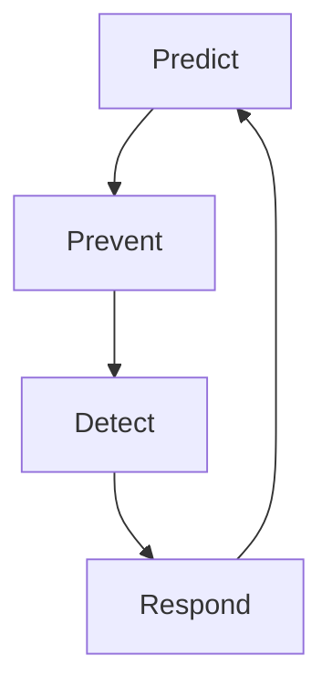
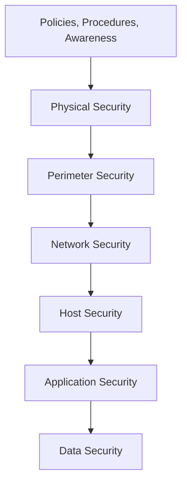
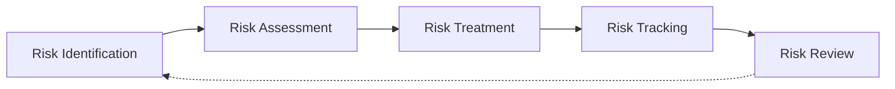
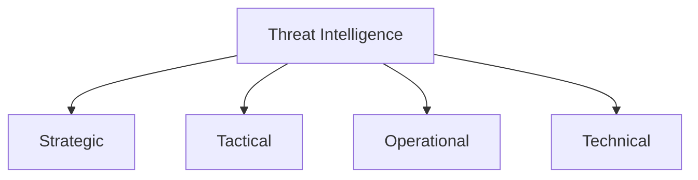
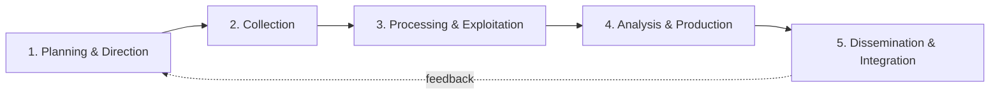
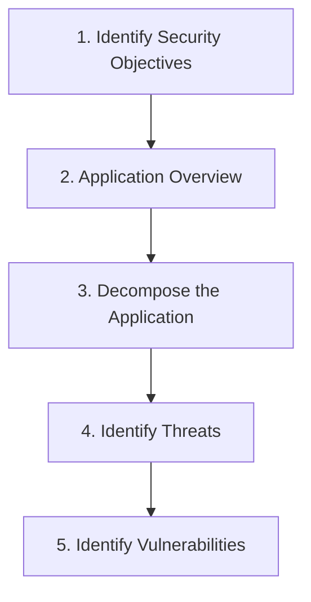
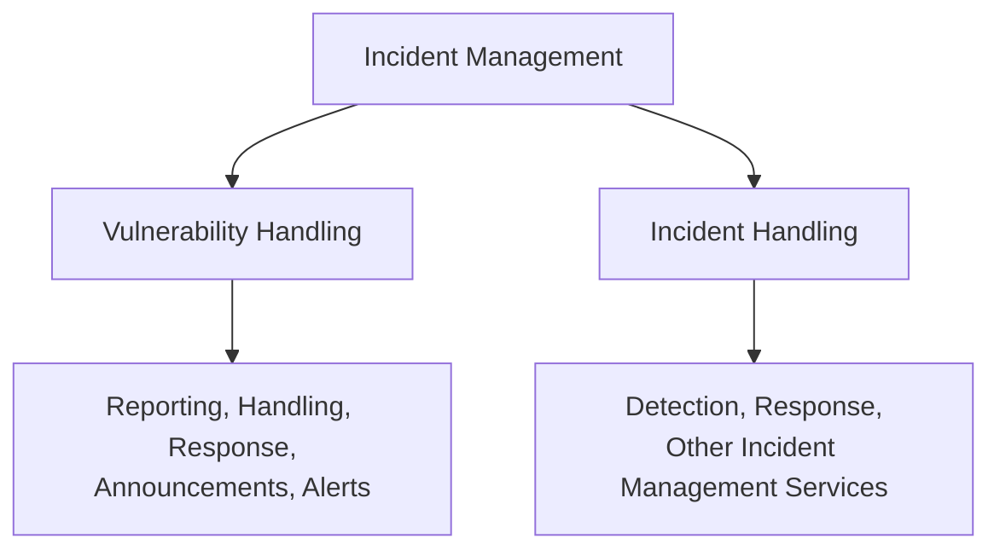
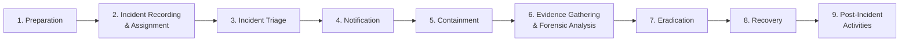
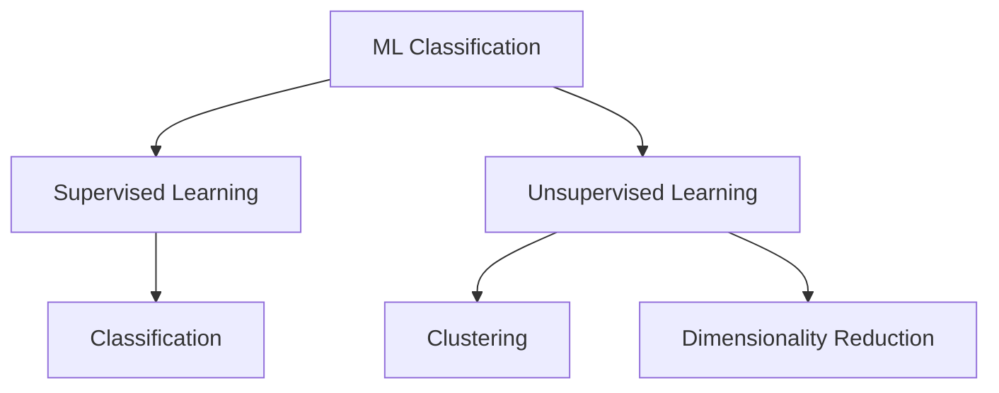

# Module 1: Introduction to Ethical Hacking
## Part G — Information Security Controls

[← Back to Part F: MITRE ATT&CK and the Diamond Model](06-mitre-attck-and-diamond-model.md) | [Next: Information Security Laws and Standards →](08-information-security-laws-and-standards.md)

---

## Table of Contents

1. [Information Assurance (IA)](#information-assurance-ia)
2. [Continual / Adaptive Security Strategy](#continual--adaptive-security-strategy)
3. [Defense-in-Depth](#defense-in-depth)
4. [Risk Management](#risk-management)
5. [Cyber Threat Intelligence (CTI)](#cyber-threat-intelligence-cti)
6. [Threat Modeling](#threat-modeling)
7. [Incident Management](#incident-management)
8. [The Role of AI and ML in Cybersecurity](#the-role-of-ai-and-ml-in-cybersecurity)
9. [Quick-Reference Summary](#quick-reference-summary)

---

## Information Assurance (IA)

**Information Assurance** is about guaranteeing the integrity, availability, confidentiality, and authenticity of information and information systems throughout their entire lifecycle — while they're being used, processed, stored, and transmitted. Security teams achieve this through a mix of physical, technical, and administrative controls. IA, paired with Information Risk Management (IRM), exists to ensure only authorized personnel can access and use information — which is ultimately what makes both information security and business continuity possible.

Processes that help achieve real information assurance include:

- **Developing local policy, process, and guidance** in a way that keeps information systems at an optimal security level
- **Designing network and user authentication strategy** — a secure network design protects the privacy of user records, and a solid authentication strategy protects the data itself
- **Identifying network vulnerabilities and threats** — vulnerability assessments map out the network's actual security posture, which is what lets an organization take the right corrective measures

---

## Continual / Adaptive Security Strategy

Rather than treating security as a one-time setup, organizations should adopt an **adaptive security strategy** — one that folds in all four core security approaches at once, continuously.



- **Predict** — risk and vulnerability assessment, attack surface analysis, threat intelligence
- **Prevent (Protect)** — the defense-in-depth security strategy: protecting endpoints, protecting the network, protecting data
- **Detect** — continuous threat monitoring
- **Respond** — incident response

**Protection**, specifically, means the set of prior countermeasures aimed at eliminating as many possible vulnerabilities as possible before they're ever exploited — security policies, physical security, host security, firewalls, and IDS all fall under this umbrella.

The core idea behind the adaptive model is that prediction, prevention, detection, and response aren't sequential one-off steps — they're continuous, looping activities that together add up to comprehensive network defense.

---

## Defense-in-Depth

**Defense-in-depth** is a security strategy built on layering multiple protection mechanisms throughout an information system. It borrows directly from a military principle: a complex, multi-layered defense is far harder for an enemy to defeat than a single barrier. In practice, this means a break in one layer only pushes an attacker into the *next* layer, rather than handing them the whole system.

If a hacker does get through, defense-in-depth limits the blast radius and — just as importantly — buys administrators and engineers real time to deploy new or updated countermeasures before the same intrusion can happen again.



---

## Risk Management

### What Is Risk?

**Risk** is the degree of uncertainty — or the expectation of potential damage — that an adverse event could cause to a system or its resources under specific conditions. A few equivalent ways to define it:

- The probability that a threat or event will damage, cause loss to, or otherwise negatively impact the organization, whether from internal or external liabilities
- The possibility of a threat acting on an internal or external vulnerability and causing harm
- The product of the likelihood an event occurs and the impact it would have on an IT asset

The relationship between risk, threats, vulnerabilities, and impact is expressed as:

```
RISK = Threats × Vulnerabilities × Impact
```

Since an event's impact on an asset is itself the product of the asset's vulnerability and its value to stakeholders, this expands further to:

```
RISK = Threat × Vulnerability × Asset Value
```

### Risk Level

**Risk level** is an assessment of an event's resulting impact on the network, generally worked out as:

```
Level of Risk = Consequence × Likelihood
```

Risks typically fall into four levels — **extreme, high, medium,** and **low** — though control measures reduce a risk's level without necessarily eliminating it entirely.

| Risk Level | Consequence | Required Action |
|---|---|---|
| **Extreme/High** | Serious or imminent danger | Immediate measures required to combat the risk |
| **High** | Serious danger | Identify and impose controls to reduce risk to a reasonably low level |
| **Medium** | Moderate danger | Immediate action not required, but action should be implemented quickly |
| **Low** | Negligible danger | Take preventive steps to mitigate the effects of the risk |

### The Risk Matrix

A **risk matrix** is a graphical way to scale the likelihood of a risk occurring against its consequences — a simple but genuinely useful tool for visualizing risk severity and how well existing controls mitigate it. It's one of the more effective tools for giving management real visibility into risk for decision-making. There's no single universal risk matrix — organizations need to build their own around their specific business context.

| Likelihood ↓ / Consequence → | Insignificant | Minor | Moderate | Major | Severe |
|---|---|---|---|---|---|
| **Very High (81–100%)** | Low | Low | Medium | High | Extreme |
| **High (61–80%)** | Low | Low | Medium | High | Extreme |
| **Equal (41–60%)** | Low | Low | Medium | Medium | High |
| **Low (21–40%)** | Low | Low | Medium | Medium | High |
| **Very Low (1–20%)** | Low | Low | Medium | Medium | High |

- **Likelihood**: the chance of the risk actually occurring
- **Consequence**: how severe the risk event is if it does occur

### Risk Management Phases

**Risk management** is the ongoing process of identifying, assessing, responding to, and controlling how an organization manages the potential effects of risk. It's a continuous, ever-more-complex process that sits throughout the entire security lifecycle. While the specific risks vary by organization, having a risk management plan at all is universal.



- **Risk Identification** — identifies the sources, causes, and consequences of the internal and external risks affecting the organization's security.
- **Risk Assessment** — an ongoing, iterative process that estimates the likelihood and impact of identified risks and assigns priorities for mitigation. Organizations generally run this when they've spotted a hazard they can't immediately control.
- **Risk Treatment** — selecting and implementing the appropriate controls for identified risks, based directly on assessment results. This step identifies which risks need treatment, in what priority order, and how they'll be monitored going forward. Before treating a risk, you need to know the appropriate method of treatment and who's responsible for carrying it out.
- **Risk Tracking (and Review)** — ensures the right controls are actually in place for known risks and estimates the likelihood of new risks emerging. Regular inspection of policies and standards helps surface opportunities for improvement, while ongoing monitoring confirms that procedures are understood and actually being followed.
- **Risk Review** — evaluates how well the implemented risk management strategies are actually performing.

### Risk Management Objectives

- Identify potential risks — the central objective of the whole process
- Identify the impact of those risks to build better management strategies and plans
- Prioritize risks by impact/severity, using established methods, tools, and techniques
- Understand, analyze, and report identified risk events
- Control the risk and mitigate its effect
- Build security-staff awareness and develop lasting risk management strategies

---

## Cyber Threat Intelligence (CTI)

A **threat**, per the Oxford definition, is "the possibility of a malicious attempt to damage or disrupt a computer network or system" — a potential occurrence that, left unaddressed, can genuinely damage an organization's integrity and availability. Threats can be accidental, intentional, or simply a side effect of some other action.

**Cyber Threat Intelligence (CTI)** is the collection and analysis of information about threats and adversaries, drawing patterns from that data to support well-informed decisions on preparedness, prevention, and response. Put simply, its whole purpose is converting *unknown* threats into *known* ones — spotting emerging risks early enough to build a genuinely proactive security posture rather than a reactive one.

### Types of Threat Intelligence

Threat intelligence is generally divided into four types based on who consumes it and what they use it for:



| Type | What It Covers | Consumed By |
|---|---|---|
| **Strategic** | High-level info on shifting cyber risk, financial impact of cyber activity, attribution for intrusions/breaches, long-term trends | C-level executives and management (e.g., CISO) |
| **Tactical** | Information on attacker TTPs; drives day-to-day detection/mitigation, patching, and security-product updates | IT service and SOC managers, administrators, architects |
| **Operational** | Context on specific incoming attacks — attacker methodology, intent, capability, and opportunity | Security managers, incident-response leads, network defenders, forensics/fraud teams |
| **Technical** | Specific indicators of compromise — C2 channels, tools, IPs, domains, phishing headers, malware hashes | SOC staff and IR teams |

Strategic intelligence is typically delivered as a report focused on high-level business strategy, drawing on sources like OSINT, CTI vendors, ISAOs, and ISACs, and generally requires highly skilled analysts to extract properly. Tactical intelligence draws on campaign reports, malware analysis, incident reports, and human intelligence — often technical papers or purchased third-party data. Operational intelligence, in many cases, can only be collected by government-level organizations. Technical intelligence has the shortest shelf life of the four and is fed directly into defensive systems (IDS/IPS, firewalls, endpoint security) in digital format to catch inbound and outbound malicious traffic.

### The Threat Intelligence Lifecycle



1. **Planning and Direction** — defines the entire intelligence program end to end: what's actually required, which intelligence gets priority, what data-collection methods to use. Requirements here are set so that genuinely useful data can be gathered efficiently from OSINT and other sources, both internal and external.

2. **Collection** — actively gathering the intelligence defined in phase one, through technical or human means, openly or covertly depending on sensitivity. Common sources include HUMINT (human intelligence), IMINT (imagery intelligence), MASINT (measurement and signature intelligence), SIGINT (signal intelligence), OSINT (open source intelligence), and IoCs pulled from critical applications and network/security infrastructure.

3. **Processing and Exploitation** — raw data at this stage isn't yet usable. Trained professionals convert it into a structured, meaningful format using appropriate tools — decryption, translation, parsing, filtering, correlation, and aggregation are all part of this step.

4. **Analysis and Production** — the processed data gets analyzed to produce genuinely refined intelligence: facts, findings, and forecasts that let the organization anticipate future attacks. Good analysis here needs to be objective, timely, accurate, and actionable, typically drawing on four reasoning techniques — deduction, induction, abduction, and confidence-based scientific method. This is also the phase where information officially becomes "intelligence" once it provides enough context to identify a real threat.

5. **Dissemination and Integration** — the finished intelligence gets delivered to its intended consumers (automated or manual), tailored to whichever of the four intelligence types it is and who's meant to consume it. This phase also loops feedback back into planning and direction, restarting the cycle with sharper requirements.

---

## Threat Modeling

**Threat modeling** is a risk-assessment approach for analyzing an application's security by capturing, organizing, and analyzing everything that affects it. It rests on three building blocks: understanding the adversary's perspective, characterizing the system's security, and determining actual threats. Every application should have a living, documented threat model that gets revisited as the application evolves.

Threat modeling helps to:

- Identify threats relevant to a specific application scenario
- Identify key vulnerabilities in an application's design
- Improve the overall security design

A few practical tips when doing this work: don't get too rigid about specific steps — focus on the underlying approach, and if a step becomes genuinely impassable, jump to the "Identify Threats" step and work the problem from there. Use realistic scenarios to scope the activity, lean on existing design documentation (use cases, architecture diagrams, data-flow diagrams), and start with a whiteboard before committing anything to a formal document.

### The 5-Step Threat Modeling Process



1. **Identify Security Objectives** — the goals and constraints tied to the application's confidentiality, integrity, and availability. Guiding questions: What data needs protecting? Are there compliance requirements? Any quality-of-service requirements? Any intangible assets to protect?

2. **Application Overview** — mapping out components, data flows, and trust boundaries, typically starting with a rough whiteboard diagram covering: end-to-end deployment topology, logical layers, key components and services, communication ports/protocols, identities, and external dependencies. This step also covers identifying **roles** (who can read/update/delete data, which groups have elevated privilege) and the underlying **technology stack** (presentation/business/data-access layer technologies, development languages) — knowing the stack helps focus on technology-specific threats. It also covers identifying existing **application security mechanisms**: input/data validation, authorization and authentication, sensitive-data handling, configuration management, session management, parameter handling, cryptography, exception management, and auditing/logging.

3. **Decompose the Application** — breaking the application down to identify access-control points (where extra privilege or role membership is required) and trust boundaries from a data-flow perspective. This includes:
   - **Identify Data Flows** — tracing input from entry to exit, paying particular attention to data crossing trust boundaries and validation at those boundary entry points. Best approach: start at the highest level, then work down through subsystems.
   - **Identify Entry Points** — every place a user (or attacker) can interact with the application. Internal entry points, hidden inside subcomponents, matter too — focus extra attention on entry points that reach critical functionality.
   - **Identify Exit Points** — where the application sends data out to a client or external system, prioritizing exit points that write client-supplied or otherwise untrusted data (e.g., to a shared database).

4. **Identify Threats** — using everything gathered so far, bring the development and test teams together to identify threats relevant to the specific context, generally starting from a list of common threats grouped by vulnerability category, using a question-driven approach.

5. **Identify Vulnerabilities** — a vulnerability here is a weakness in the deployed application that allows exploitation and leads to a security breach. This step means matching known vulnerability categories against the threats already identified, and fixing them proactively before an intruder ever gets the chance.

---

## Incident Management

**Incident management** is a set of defined processes for identifying, analyzing, prioritizing, and resolving security incidents — with the goal of restoring normal operations as fast as possible and preventing the same incident from recurring. It's broader than just reacting: it also covers triggering alerts to head off potential risks before they materialize, and identifying exploitable software before someone else finds it first.



Incident management includes:

- Vulnerability analysis
- Artifact analysis
- Security awareness training
- Intrusion detection
- Public/technology monitoring

The incident management process exists to:

- Improve overall service quality
- Resolve problems proactively rather than reactively
- Reduce the impact of incidents on the organization and its business
- Meet service-availability requirements
- Increase staff efficiency and productivity
- Improve user and customer satisfaction
- Better equip the organization for future incidents

It's worth being precise about the relationship between three closely related terms: **incident response** is one specific function performed within **incident handling**, and incident handling is, in turn, one of the services delivered as part of the broader **incident management** program.

### Incident Handling and Response (IH&R)

**IH&R** is the process of taking organized, deliberate steps in response to a security incident or cyberattack — covering preparation, detection, containment, eradication, and recovery, all aimed at restoring normal business operations as quickly as possible with minimal impact.



1. **Preparation** — auditing resources and assets, defining the rules/policies/procedures that will drive the whole process, building and training an incident response team, and making sure employees know how to secure their own systems and accounts.
2. **Incident Recording and Assignment** — the initial reporting and logging of the incident, including defined communication plans (informing IT support, filing the right ticket).
3. **Incident Triage** — analyzing, validating, categorizing, and prioritizing the incident; digging into the compromised device to establish attack type, severity, target, impact, propagation method, and exploited vulnerabilities.
4. **Notification** — informing relevant stakeholders — management, third-party vendors, clients — about the incident.
5. **Containment** — stopping the infection from spreading to other organizational assets and preventing further damage.
6. **Evidence Gathering and Forensic Analysis** — collecting all available evidence and handing it to the forensic team, who work out the attack method, exploited vulnerabilities, evaded security mechanisms, and which devices/applications were affected.
7. **Eradication** — removing the root cause of the incident entirely and closing off the attack vectors that made it possible, to prevent a repeat.
8. **Recovery** — restoring affected systems, services, resources, and data, with the incident response team responsible for making sure this causes minimal further disruption to the business.
9. **Post-Incident Activities** — a final review before formally closing the matter, covering incident documentation, impact assessment, policy review/revision, closing the investigation, and incident disclosure.

---

## The Role of AI and ML in Cybersecurity

Machine learning (ML) and artificial intelligence (AI) have become widely used across virtually every industry, driven by growing computing power and data-collection capacity. But that same technological growth has a dark mirror — a corresponding rise in ransomware, botnets, malware, and phishing. AI and ML in cybersecurity are largely a direct response: they help identify new exploits and weaknesses that can then be analyzed and mitigated, while taking real pressure off human security teams by alerting them only when action is actually needed.

**AI**, in this context, is often the only realistic way to defend against attacks that traditional antivirus scanning simply can't catch — feeding a huge volume of collected data into a system that processes and analyzes it for meaningful trends. **ML** is a branch of AI that gives systems the ability to self-learn without being explicitly programmed for every case — defining what "normal" looks like for a given network and its devices, then flagging real-time deviations from that baseline.

### ML Classification Techniques



- **Supervised Learning** — algorithms trained on a labeled dataset, learning the actual differences between classes from those labels.
- **Unsupervised Learning** — algorithms trained on unlabeled data, left to deduce categories on their own. This splits further into:
  - **Clustering** — grouping data into clusters based on similarity, without reference to predefined classes
  - **Dimensionality Reduction** — reducing the number of attributes/dimensions in a dataset while preserving what matters

### How AI and ML Actually Prevent Cyberattacks

- **Password Protection and Authentication** — AI improves biometric validation and facial recognition by tracking subtle correlations and patterns, hardening these systems against the credential breaches that can slip past older, more traditional approaches.
- **Phishing Detection and Prevention** — AI/ML can scan and identify phishing emails, and distinguish malicious from legitimate websites, far faster than a human reviewer could manage manually.
- **Threat Detection** — ML continuously analyzes incoming data and applies deep learning to flag cyberattacks *before* systems are actually compromised, keeping admins notified of imminent threats.
- **Behavioral Analytics** — AI/ML builds a baseline of each user's normal behavior patterns, then flags suspicious activity or deviation from that baseline — genuinely useful against attackers who've stolen legitimate credentials and would otherwise blend in.
- **Network Security** — automates two normally time-consuming tasks: generating comprehensive security policies and mapping an enterprise's network topology, including traffic analysis and default policy recommendations.
- **AI-Based Antivirus** — traditional antivirus relies on signature matching, which requires constant updates to catch new threats. AI-based antivirus instead uses anomaly detection to flag suspicious *behavior*, sidestepping the lag inherent in signature-based updates.
- **Fraud Detection** — AI/ML runs anomaly detection across transactions to catch payment inconsistencies and fraud automatically, reliably telling authentic transactions apart from illegitimate ones and blocking the latter.

---

## Quick-Reference Summary

- **Information Assurance** = protecting the CIA + authenticity of information across its entire lifecycle, via physical/technical/administrative controls
- **Adaptive security** = Predict → Prevent → Detect → Respond, run continuously rather than as a one-time setup
- **Defense-in-depth** = layered security so one breached layer doesn't mean total compromise
- **Risk** = Threat × Vulnerability × Impact (or Asset Value); risk management runs Identify → Assess → Treat → Track → Review, continuously
- **CTI** has 4 types (Strategic, Tactical, Operational, Technical) and a 5-phase lifecycle (Plan → Collect → Process → Analyze → Disseminate, with feedback looping back)
- **Threat modeling** = a 5-step process (Objectives → Overview → Decompose → Threats → Vulnerabilities) for analyzing an application's security design
- **Incident management** > incident handling > incident response — a 9-step IH&R process runs Preparation through Post-Incident Activities
- **AI/ML in security** = a genuine force multiplier across authentication, phishing detection, threat detection, behavioral analytics, network security, antivirus, and fraud detection

---

*Part of the CEH Module 1 study series — continues in [Part H: Information Security Laws and Standards](08-information-security-laws-and-standards.md).*
