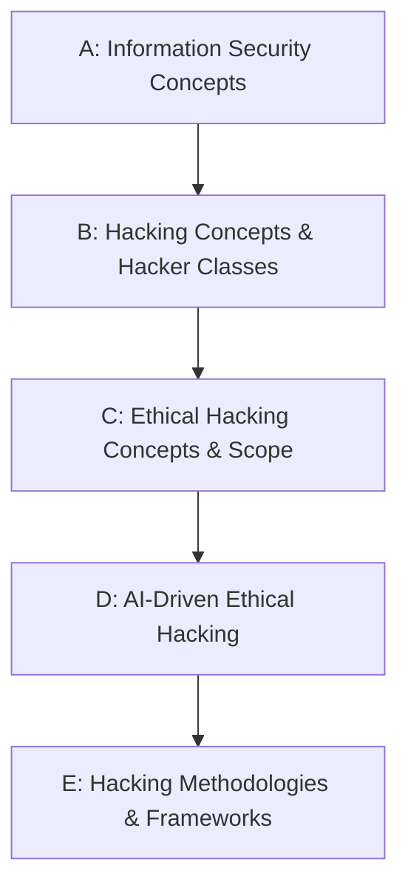

# CEH Module 1: Introduction to Ethical Hacking

Personal study notes covering Module 1 of the CEH curriculum — rewritten and organized into a structured reference repo, rather than reproduced verbatim from any copyrighted source material.

> These notes are written in original language for personal study and reference. They summarize and explain the concepts covered in Module 1; they are not a copy of any textbook, courseware, or slide deck.

---

## Learning Objectives

By the end of this module, the goal is to be able to:

- [x] Explain Information Security Concepts
- [x] Explain Hacking Concepts and Different Hacker Classes
- [x] Explain Ethical Hacking Concepts and Scope
- [x] Explain AI-Driven Ethical Hacking
- [x] Explain Hacking Methodologies and Frameworks *(partial — see [Part E](05-hacking-methodologies-and-frameworks.md#a-note-on-scope))*
- [ ] Summarize the Techniques Used in Information Security Controls
- [ ] Explain the Importance of Applicable Security Laws and Standards

The last two objectives (Information Security Controls, and Security Laws & Standards) aren't yet covered in this repo — add them as Parts F and G once that material is available.

---

## Repo Structure

| # | File | Covers |
|---|---|---|
| A | [`01-information-security-concepts.md`](01-information-security-concepts.md) | The 5 pillars of infosec (CIA + Authenticity + Non-repudiation), the attack formula (Motive + Method + Vulnerability), TTPs, vulnerability root causes, the IATF's 5 attack classes, and Libicki's 7 categories of information warfare |
| B | [`02-hacking-concepts-and-hacker-classes.md`](02-hacking-concepts-and-hacker-classes.md) | What hacking is, who a hacker is, hacker motivations, and all 15 hacker classes (White/Black/Gray/Blue/Red/Green Hat, Hacktivists, State-Sponsored, Cyber Terrorists, Corporate Spies, Suicide Hackers, Insiders, Criminal Syndicates, Organized Hackers, Script Kiddies) |
| C | [`03-ethical-hacking-concepts-and-scope.md`](03-ethical-hacking-concepts-and-scope.md) | What ethical hacking is, why it's necessary, the 3 key questions ethical hackers ask, scope/limitations, the security-audit framework, and the technical/non-technical skills required |
| D | [`04-ai-driven-ethical-hacking.md`](04-ai-driven-ethical-hacking.md) | AI's role in modern ethical hacking — benefits, applications, the "AI will replace hackers" myth, and a survey of ChatGPT-powered hacking-assistant tools |
| E | [`05-hacking-methodologies-and-frameworks.md`](05-hacking-methodologies-and-frameworks.md) | The 5-phase CEH Ethical Hacking Framework and the 7-phase Cyber Kill Chain Methodology, each with Mermaid diagrams |

---

## Suggested Reading Order

Each file is self-contained with its own table of contents and a quick-reference summary at the bottom, so you can also jump straight to whichever topic you need.

---

## About This Repo

Compiled as part of an ongoing CEH v13 study track, alongside parallel work in CTF challenges and web security (SSRF and related topics). Structured for easy GitHub browsing — each part links to the next, diagrams render natively via Mermaid, and comparison tables are used wherever they make scanning faster than prose.
