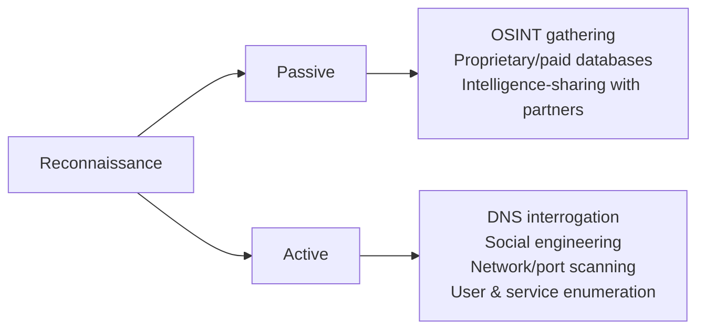
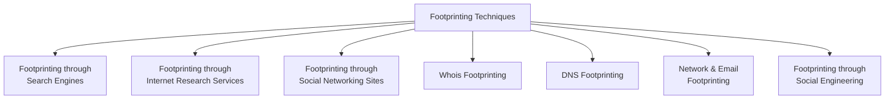

# Module 2: Footprinting and Reconnaissance
## Part A — Footprinting Concepts

[Back to README](README.md) | [Next: Footprinting Through Search Engines →](02-footprinting-through-search-engines.md)

---

## Table of Contents

1. [What Is Footprinting?](#what-is-footprinting)
2. [Passive vs. Active Reconnaissance](#passive-vs-active-reconnaissance)
3. [Information Obtained Through Footprinting](#information-obtained-through-footprinting)
4. [Objectives of Footprinting](#objectives-of-footprinting)
5. [Footprinting Threats](#footprinting-threats)
6. [The Footprinting Methodology](#the-footprinting-methodology)
7. [Quick-Reference Summary](#quick-reference-summary)

---

## What Is Footprinting?

**Footprinting** — also called **reconnaissance** — is the preparatory phase of an attack (or, on the defensive side, of a penetration test). It's where an attacker gathers as much information as possible about a target before ever touching it directly. Done well, it produces a **blueprint** — a unique security profile of the target organization — that reveals opportunities to penetrate and assess the network later on.

There's no single "correct" methodology for footprinting, since information can be traced down in dozens of different ways. What matters is that it's done in an organized, methodical manner — the information gathered here is what later uncovers exploitable vulnerabilities and the different ways to exploit them. Footprinting is genuinely the **first step** in evaluating an organization's overall IT security posture.

---

## Passive vs. Active Reconnaissance

Footprinting splits cleanly into two approaches:

| | Passive Reconnaissance | Active Reconnaissance |
|---|---|---|
| **Interaction with target** | None — no direct contact | Direct interaction with the target system |
| **Detectability** | Technically difficult to perform well, but very hard for the target to detect | Easier to perform, but carries real risk of detection |
| **Typical methods** | Open-Source Intelligence (OSINT) gathering, proprietary/paid databases, intelligence-sharing with partner organizations or industry groups | DNS interrogation, social engineering, network/port scanning, user and service enumeration |

**Passive footprinting** gathers information about the target with zero direct interaction — most useful precisely when you don't want the information-gathering itself to be detected. It's technically harder to execute well specifically *because* active reconnaissance techniques tend to be more straightforward and revealing by comparison.

**Active footprinting** means directly engaging the target system — using tools to detect open ports, accessible hosts, router locations, network mapping, and details of the operating systems and applications in use.

---

## Information Obtained Through Footprinting

The core objectives of footprinting are collecting **network information**, **system information**, and **organizational information** about the target. Gathering this across different network levels can hand an attacker network blocks, specific IP addresses, employee details, and far more — all of which can be leveraged to gain access to sensitive data or launch further attacks.

### Organizational Information

Available largely from the target's own website, and enriched further by querying its domain name against a Whois database:

- Employee details (names, contact info, designations, work experience)
- Telephone numbers
- Branch and location details
- Background on the organization
- Web technologies in use
- News articles, press releases, and related documents

Attackers use this to identify key personnel and launch social engineering attacks aimed at extracting further sensitive data.

### Network Information

Gathered through Whois database analysis, trace-routing, and similar techniques:

- Domain and sub-domains
- Network blocks
- Network topology, trusted routers, and firewalls
- IP addresses of reachable systems
- Whois records
- DNS records and related information

### System Information

Gathered through network footprinting, DNS footprinting, website footprinting, and email footprinting:

- Web server operating system
- Location of web servers
- Publicly available email addresses
- Usernames and passwords

---

## Objectives of Footprinting

To build a working hacking strategy, attackers need enough information about a target's network to identify the *easiest* way through its security perimeter. Footprinting is what makes this possible — it maps out the security posture (firewall placement, proxies, other controls in play), which attackers then analyze for loopholes to build a targeted attack plan around.

Using a combination of tools and techniques, an attacker can take an unknown entity — "XYZ Organization" — and progressively reduce it down to a specific range of domain names, network blocks, and individual internet-facing IP addresses, alongside further detail on its overall security posture. A sufficiently detailed footprint gives an attacker enough to identify real vulnerabilities and select the right exploits — effectively letting them build their own internal database of the target's security weaknesses, which then reveals the weakest link in the whole perimeter.

---

## Footprinting Threats

Footprinting isn't a neutral information-gathering exercise from the target's perspective — it's the reconnaissance stage of real threats:

- **Information Leakage** — sensitive information falling into an attacker's hands can be used directly to mount an attack, or sold on for monetary gain.
- **Privacy Loss** — footprinting can let a hacker escalate access all the way to admin-level privileges, resulting in a real loss of privacy both organization-wide and for individual staff.
- **Corporate Espionage** — competitors can use footprinting techniques to acquire sensitive data, then use it to launch similar products, undercut pricing, or otherwise undermine a target's market position.
- **Business Loss** — footprinting-enabled attacks disproportionately hurt online businesses, e-commerce sites, and banking/finance organizations — collectively, billions of dollars are lost every year to attacks that started with reconnaissance.

---

## The Footprinting Methodology

The footprinting methodology is the overall procedure for collecting information about a target from every available source — URLs, physical locations, establishment details, employee counts, domain-name ranges, contact information, and more — typically pulled from publicly accessible sources like search engines, social networking sites, and Whois databases.

This repo folder covers the first three branches in detail — **Search Engines**, **Internet Research Services**, and **Social Networking Sites** — matching the source material through page 212. Whois, DNS, Network/Email footprinting, and Footprinting through Social Engineering are named in the full methodology but land later in Module 2 (from page 212 onward) and aren't covered yet here — they'll be added as later parts once that material is available.

---

## Quick-Reference Summary

- **Footprinting/reconnaissance** = the preparatory information-gathering phase before an attack or a pentest; the output is a "blueprint" of the target's security profile
- **Passive** = zero direct contact, hard to detect, relies on OSINT; **Active** = direct interaction, more revealing, higher detection risk
- **3 categories of information gathered**: organizational, network, system
- **4 major footprinting threats**: information leakage, privacy loss, corporate espionage, business loss
- **Full methodology** spans 6 branches — this folder covers Search Engines, Internet Research Services, and Social Networking Sites

---

*Part of the CEH Module 2 study series — continues in [Part B: Footprinting Through Search Engines](02-footprinting-through-search-engines.md).*
