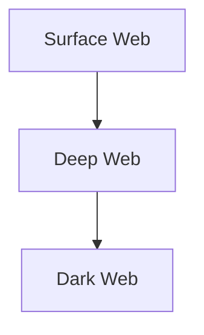

# Module 2: Footprinting and Reconnaissance
## Part C — Footprinting Through Internet Research Services

[← Back to Part B: Footprinting Through Search Engines](02-footprinting-through-search-engines.md) | [Next: Footprinting Through Social Networking Sites →](04-footprinting-through-social-networking-sites.md)

---

## Table of Contents

1. [People Search Services](#people-search-services)
2. [Job Sites](#job-sites)
3. [Dark Web Footprinting](#dark-web-footprinting)
4. [Network & OS Fingerprinting Tools](#network--os-fingerprinting-tools)
5. [Competitive Intelligence Gathering](#competitive-intelligence-gathering)
6. [Information Resource Sites](#information-resource-sites)
7. [Other Internet Research Techniques](#other-internet-research-techniques)
8. [Quick-Reference Summary](#quick-reference-summary)

---

## People Search Services

Internet research services extend well beyond search engines — dedicated **people search services** aggregate publicly available records into a single lookup, and can hand an attacker sensitive personal information about a target's employees without ever touching the target's own systems. A tool like **Spokeo**, for instance, lets an attacker search for people affiliated with a specific organization and pull together whatever public records exist on them.

## Job Sites

Job postings are an underrated reconnaissance source. A single listing can reveal the specific technologies, software versions, and internal tools an organization uses (since postings often list required skills verbatim), along with organizational structure, team names, and sometimes even internal jargon — all useful context for both technical attacks and social engineering.

---

## Dark Web Footprinting

To understand dark web footprinting, it helps to be precise about the three layers of the web:

- **Surface Web** — the outer layer of the internet, reachable through ordinary browsers (Chrome, Firefox, Opera) and indexed by standard search-engine crawlers.
- **Deep Web** — content that's hidden or simply unindexed — not locatable through traditional browsers or search engines. Its actual size is incalculable and, in practice, makes up almost the entire web; standard crawlers can't reach it at all.
- **Dark Web** — a subset of the deep web specifically built to allow anonymous navigation without being traced.

### Tor Browser

*Source: torproject.org*

**Tor Browser** is the standard tool for accessing the dark web — it acts as a built-in VPN of sorts, bouncing a user's network traffic through multiple relay servers before it ever reaches its destination. Attackers use Tor specifically to reach hidden content, unindexed sites, and encrypted databases that live on the dark web, often turning up more detailed and sensitive information about a target than the surface web ever would.

### Searching the Dark Web with Advanced Parameters

Just like on the surface web, attackers apply advanced search parameters on the dark web — filtering by file type, restricting by domain, and so on — to zero in on specific sensitive data such as financial records or login credentials.

| Type of Information | Example Query Pattern | What It Finds |
|---|---|---|
| Sensitive PDFs | `filetype:pdf site:onion confidential` | PDFs explicitly marked confidential on .onion sites |
| Passwords in Config Files | `inurl:config filetype:txt password` | Config-URL text files containing passwords |
| Financial Documents | `filetype:xlsx site:onion financial` | Excel files with financial data on .onion sites |
| Database Dumps | `filetype:sql site:onion dump` | SQL database dump files |
| Email Lists | `filetype:csv site:onion email` | CSV files containing email address lists |
| Login Credentials | `intitle:"login credentials" filetype:docx` | Word docs with credentials referenced in the title |
| Configurations | `filetype:xml inurl:config server` | Server configuration files |
| Private Keys | `filetype:key site:onion private` | Exposed private key files |
| Medical Records | `filetype:pdf site:onion "medical records"` | PDFs containing medical records |
| Business Plans | `filetype:ppt site:onion "business plan"` | PowerPoint business plan files |
| Source Code | `filetype:py site:onion "def "` | Exposed Python source files |
| Legal Documents | `filetype:docx site:onion "legal document"` | Word docs on legal matters |
| Bank Statements | `filetype:pdf site:onion "bank statement"` | PDF bank statements |
| Intellectual Property | `filetype:pdf inurl:patent confidential` | Patent documents marked confidential |
| Security Vulnerabilities | `filetype:txt inurl:exploit "security vulnerability"` | Text files detailing exploits/vulnerabilities |

*(As with the earlier Google dork tables, these are illustrative of the query pattern — the underlying technique of combining `filetype:`, `site:`, and keyword restrictions is the actual reusable skill here.)*

---

## Network & OS Fingerprinting Tools

**Netcraft** is used to identify all the sites associated with a target domain, along with technical details about the target network's operating system.

**Shodan** — already covered in [Part B](02-footprinting-through-search-engines.md#footprinting-through-the-shodan-search-engine) as a device-search engine — also plays a role here: it lets attackers keep continuous track of every device on a target network that's directly reachable from the internet.

**Censys** monitors infrastructure at scale and helps discover unknown, internet-facing assets anywhere on a target's network — useful for finding shadow IT or forgotten systems the organization itself may not know are exposed.

---

## Competitive Intelligence Gathering

**Competitive intelligence** is the practice of gathering information about competitors — legally and through publicly available channels — either by dedicating internal staff to the task or by hiring dedicated competitive-intelligence professionals. While framed as a business practice, the exact same sources are directly usable by an attacker building a target profile.

### Sources of Competitive Intelligence

- Company websites and employment ads
- Support threads and product reviews
- Social media postings
- Press releases and annual reports
- Product catalogs and retail outlets
- Analyst and regulatory reports
- Customer and vendor interviews
- Online job postings
- Financial filings
- Intellectual property analysis (patents, trademarks)

Competitive intelligence also naturally surfaces a company's physical locations. Attackers fold all of this into a broader hacking strategy the same way a legitimate competitive-intelligence analyst would fold it into a market strategy — the information itself is neutral; what differs is the intent behind collecting it.

---

## Information Resource Sites

A number of dedicated platforms exist specifically to support competitive-intelligence and financial research — and each is just as usable for adversarial reconnaissance:

| Site | What It Offers |
|---|---|
| **EDGAR Database** | SEC filings and financial disclosures for public companies |
| **LexisNexis** | Legal, regulatory, and news research aggregation |
| **Business Wire** | Corporate press releases and announcements |
| **MarketWatch** | Financial news and market data |
| **The Wall Street Transcript** | Analyst and executive commentary/transcripts |
| **SimilarWeb** | Website traffic and engagement analytics |
| **SERanking** | Competitor SEO/search-ranking analysis |
| **The Search Monitor** | Brand and trademark monitoring across search/ad platforms |

Between them, these sites give an attacker (or a legitimate analyst) expert-level opinions and hard financial data about a target without ever directly contacting anyone at the organization.

---

## Other Internet Research Techniques

A handful of further techniques round out this branch of footprinting:

- **Geographical location tools** — services that let you find and explore a target's physical locations in detail (site layouts, nearby infrastructure, satellite imagery).
- **Financial services information gathering** — attackers seeking personal or financial information often specifically target the financial-services sector, where the payoff from a successful breach tends to be highest.
- **Corporate website mining** — pulling license, registration, and other official information directly from a target's own corporate site is a necessary, low-effort step in almost any footprinting effort.
- **Monitoring targets using alerts** — setting up alert services (e.g., Google Alerts) against a target's name lets an attacker passively track new mentions, news, and content over time without any active querying at all.
- **Online Reputation Management (ORM) tracking tools** — the same tools companies use to track what's being said about them online double as a way for an attacker to see what public sentiment, complaints, or leaked information is already circulating about a target.
- **Source code repositories** — developers frequently (and sometimes accidentally) publish source code related to a target's web presence in public repositories, which can expose internal logic, credentials, or infrastructure details never meant to be public.

---

## Quick-Reference Summary

- **People search services** (e.g., Spokeo) and **job postings** both leak organizational and technical detail without touching the target's systems
- **Surface web → Deep web → Dark web**: each layer requires progressively more specialized tools to reach, with **Tor Browser** as the standard gateway to the dark web
- Dark web footprinting reuses the same `filetype:`/`site:`/keyword dork pattern as surface-web Google hacking, just scoped to `.onion` sites
- **Netcraft, Shodan, and Censys** all support network/OS fingerprinting and asset discovery
- **Competitive intelligence** sources (press releases, financial filings, job ads, IP filings) are dual-use — legitimate for business analysts, equally useful for attackers
- **Information resource sites** (EDGAR, LexisNexis, MarketWatch, SimilarWeb, and others) centralize financial and analyst-grade data on a target
- Rounding it out: geographical location tools, financial-sector targeting, alerts/monitoring, ORM tracking, and public source-code repositories

---

*Part of the CEH Module 2 study series — continues in [Part D: Footprinting Through Social Networking Sites](04-footprinting-through-social-networking-sites.md).*
