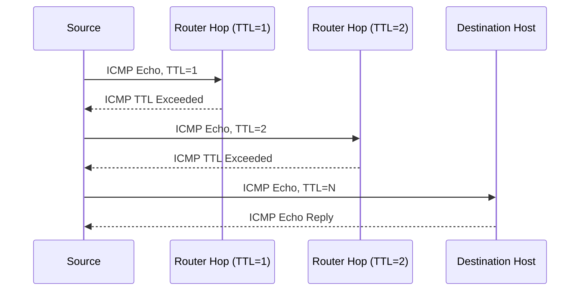

# Module 2: Footprinting and Reconnaissance
## Part F — Network and Email Footprinting

[← Back to Part E: Whois, IP Geolocation, and DNS Footprinting](05-whois-and-dns-footprinting.md) | [Next: Footprinting Through Social Engineering →](07-footprinting-through-social-engineering.md)

---

## Table of Contents

1. [Locating the Network Range](#locating-the-network-range)
2. [Traceroute](#traceroute)
3. [Traceroute with AI](#traceroute-with-ai)
4. [Traceroute Analysis](#traceroute-analysis)
5. [Traceroute Tools](#traceroute-tools)
6. [Tracking Email Communications](#tracking-email-communications)
7. [Collecting Information from Email Headers](#collecting-information-from-email-headers)
8. [Email Tracking Tools](#email-tracking-tools)
9. [Quick-Reference Summary](#quick-reference-summary)

---

## Locating the Network Range

After DNS information is in hand, the next step is gathering **network-related information** and tracking email communications. To perform network footprinting, an attacker first needs basic context: what the organization does, who works there, and what kind of work it does — answers that reveal the internal structure of the target network.

From there, an attacker can determine the target's **network range**. Detailed information about IP allocation is available through the appropriate regional registry database, and the subnet mask of the domain — along with the route between the attacker's system and the target — can be traced using tools like **NetScanTools Pro** and **PingPlotter**.

### Private IP Address Space (IANA-Reserved)

Obtaining private IP addresses can still be useful to an attacker. IANA has reserved three blocks of address space for private internets:

| Block | Prefix |
|---|---|
| `10.0.0.0 – 10.255.255.255` | 10/8 |
| `172.16.0.0 – 172.31.255.255` | 172.16/12 |
| `192.168.0.0 – 192.168.255.255` | 192.168/16 |

Using the network range, an attacker learns how the network is structured and which machines are alive — plus the network topology, access control devices, and OS in use. To find a network range, the server's IP address (already gathered during Whois footprinting) gets entered into the appropriate RIR's Whois search tool.

### Example: ARIN Whois Search

Visiting ARIN (arin.net) and entering a server's IP into the **Search Site or Whois** box returns the network range for that target. Improperly configured DNS servers can hand an attacker a full list of internal machines this way, and if an attacker successfully traces a route to a machine, they may even obtain the internal IP address of the gateway.

A resulting ARIN record (a "Network Whois Record") typically shows: the net range, CIDR, network name, handle, parent, net type, origin AS, registration/last-changed dates, and related entity details (organization name, address, roles, registration dates). Attackers typically combine results from **more than one tool**, since no single source provides everything needed.

---

## Traceroute

Finding the route to a target host matters for detecting man-in-the-middle attacks and similar threats. Most operating systems ship with a built-in traceroute utility for exactly this purpose.

**Traceroute** works by exploiting the **Time to Live (TTL)** field in the IP header. Each router that handles a packet decrements the TTL count by one; when the count reaches zero, that router discards the packet and sends back an ICMP error message to the originator. By sending a sequence of packets with progressively increasing TTL values (1, 2, 3...), traceroute forces each router along the path to reveal itself via that error message — recording the IP address and DNS name of the router at each hop, and the round-trip time to reach it, until the packet finally reaches the destination and a normal ICMP reply comes back.



### ICMP Traceroute (Windows)

Windows uses ICMP traceroute by default via the `tracert` command:

```
C:\>tracert 216.239.36.10
```

### TCP Traceroute (Layer 4 Traceroute)

Many networks are configured to block ICMP traceroute traffic outright. In that case, attackers fall back to **TCP or UDP traceroute** — also known as Layer 4 traceroute — on Linux:

```bash
sudo tcptraceroute www.google.com
```

### UDP Traceroute

Linux also ships a built-in traceroute utility that uses the UDP protocol by default:

```bash
traceroute www.google.com
```

---

## Traceroute with AI

As with DNS lookups, attackers can offload traceroute setup to an AI assistant. A prompt to ChatGPT (or a similar tool) such as *"Perform network traceroute to discover the routers on the path to a target host www.certifiedhacker.com"* gets translated into a working `traceroute www.certifiedhacker.com` command, executed automatically, with the router-by-router output (IP, hop hostname, round-trip times) returned directly — skipping the manual step of remembering syntax or flags.

---

## Traceroute Analysis

Running **several traceroutes** and comparing the results lets an attacker pinpoint the location of specific hops — routers, firewalls, bastion hosts — inside the target's network. For example, given results like:

- `traceroute 1.10.10.20`, second-to-last hop is `1.10.10.1`
- `traceroute 1.10.20.10`, third-to-last hop is `1.10.10.1`
- `traceroute 1.10.20.10`, second-to-last hop is `1.10.10.50`
- `traceroute 1.10.20.15`, third-to-last hop is `1.10.10.1`
- `traceroute 1.10.20.15`, second-to-last hop is `1.10.10.50`

By compiling and cross-referencing results like these, an attacker can reconstruct which intermediate devices sit where — for instance, identifying `1.10.10.1` as a router, `1.10.10.50` as a firewall guarding a DMZ zone, and mapping out a bastion host, web server, and mail server sitting behind it.

---

## Traceroute Tools

Traceroute tools help extract the geographical location of routers, servers, and IP devices in a network — tracing, identifying, and monitoring network activity, sometimes visualized on a world map.

**Common features across these tools:**
- Hop-by-hop traceroutes
- Reverse tracing
- Historical analysis
- Packet loss reporting
- Reverse DNS
- Ping plotting
- Port probing
- Detect network problems
- Performance metrics analysis
- Network performance monitoring

### NetScanTools Pro
*Source: netscantools.com*

Traces the route packets take from the attacker's machine to a target device — locally or across the internet — offering ICMP, UDP, and TCP traceroute methods, identifying intermediate devices along the route, and locating the country assigned to each IPv4 address per hop. Results are viewable as a formatted report.

### PingPlotter
*Source: pingplotter.com*

Collects traceroute data for target hosts using ICMP, UDP, and TCP packets, automatically discovering network hops and tracking latency and packet loss over time — visualized as readable graphs. Useful for identifying bandwidth bottlenecks, WiFi interference, or hardware faults along the path.

---

## Tracking Email Communications

**Email tracking** monitors the delivery of an email to its intended recipient, using digitally time-stamped records that reveal exactly when a target receives and opens a specific message. Attackers use it to gather IP addresses, geolocation, mail servers, browser/OS details, and other information that feeds directly into a hacking strategy or a social engineering attempt.

### What Email Tracking Tools Reveal

- **Recipient's System IP Address** — tracks the recipient's IP directly
- **Geolocation** — estimates and maps the recipient's location, sometimes calculating distance from the attacker
- **Email Received and Read** — notifies the attacker the moment the email is opened
- **Read Duration** — how long the recipient actually spent reading the message
- **Proxy Detection** — reveals the type of server the recipient is using
- **Links** — confirms whether links sent in the email were clicked
- **Operating System and Browser Information** — used to find loopholes in that specific OS/browser version for further attacks
- **Forward Email** — determines whether the email was forwarded to someone else
- **Device Type** — desktop, mobile, or laptop
- **Path Travelled** — the route the email took via email transfer agents, from source to destination

---

## Collecting Information from Email Headers

An **email header** contains the sender's details, routing information, addressing scheme, date, subject, and recipient — a genuinely useful source for tracing the routing path an email took before delivery. Note that the process for actually *viewing* the header varies by email client.

### Commonly Used Email Programs

eM Client · Mailbird · Hiri · Mozilla Thunderbird · Spike · Claws Mail · SmarterMail Webmail · Outlook · Apple Mail · ProtonMail · AOL Mail · Tuta

### Information Contained in an Email Header

- Sender's mail server
- Date and time of receipt by the originator's email servers
- Authentication system used by the sender's mail server
- Date and time the message was sent
- A unique message ID (e.g., one assigned by mx.google.com)
- Sender's full name
- Sender's IP address and the address from which the message was sent

An attacker who performs a detailed analysis of the full email header can trace and collect all of the above.

---

## Email Tracking Tools

- **eMailTrackerPro** (emailtrackerpro.com) — analyzes email headers to extract the sender's geographical location, IP address, and related details, and lets an attacker save and review past traces over time.
- **IP2Location's Email Header Tracer** (ip2location.com) — a free service for tracing the email path from sender to recipient's mail server using the IP addresses embedded in the header (offering a limited number of free lookups per day for unregistered users).
- **MxToolbox**, **Holehe**, **Social Catfish** — additional tools used to track an email and extract sender identity, mail server, IP address, and location.

---

## Quick-Reference Summary

- **Network range discovery** starts from a Whois-obtained server IP, cross-referenced against the appropriate RIR (e.g., ARIN)
- **3 IANA-reserved private IP blocks**: `10/8`, `172.16/12`, `192.168/16`
- **Traceroute exploits IP TTL** to map hop-by-hop routes; variants include ICMP (`tracert`, Windows default), TCP (`tcptraceroute`), and UDP (`traceroute`, Linux default)
- **Traceroute analysis** = running multiple traceroutes and cross-referencing hop data to reconstruct internal network topology (routers, firewalls, DMZ boundaries)
- **Traceroute tools**: NetScanTools Pro, PingPlotter
- **Email tracking** reveals IP, geolocation, read status/duration, proxy use, links clicked, OS/browser, forwarding, device type, and routing path
- **Email header** = sender's mail server, receipt timestamps, auth system, message ID, sender name, and sender IP — all traceable by an attacker
- **Email tracking tools**: eMailTrackerPro, IP2Location's Email Header Tracer, MxToolbox, Holehe, Social Catfish

---

*Part of the CEH Module 2 study series — continues in [Part G: Footprinting Through Social Engineering](07-footprinting-through-social-engineering.md).*
