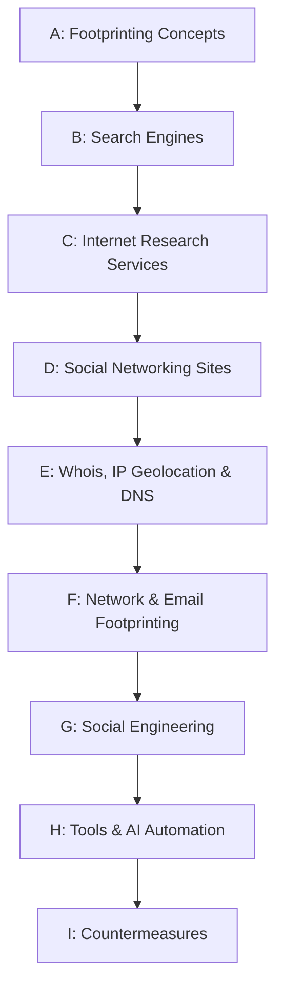

# Module 2: Footprinting and Reconnaissance
## Part I — Footprinting Countermeasures and Module Summary

[← Back to Part H: Footprinting Tools and AI-Powered Automation](08-footprinting-tools-and-ai-automation.md) | [Back to README](README.md)

---

## Table of Contents

1. [Why Countermeasures Matter](#why-countermeasures-matter)
2. [The Full Footprinting Countermeasures Checklist](#the-full-footprinting-countermeasures-checklist)
3. [Module 2 Summary](#module-2-summary)
4. [What's Next](#whats-next)

---

## Why Countermeasures Matter

Every technique covered across this module — search engines, internet research services, social networking sites, Whois, DNS, network, email, and social engineering footprinting — exists on a spectrum from "mildly useful to an attacker" to "genuinely dangerous if left unaddressed." **Footprinting countermeasures** are the practical, defensive flip side of everything in Parts A through H: the concrete actions an organization takes to prevent or offset the information disclosure that makes footprinting effective in the first place.

None of these controls work in isolation — they're most effective layered together, which is exactly the [defense-in-depth](../CEH-Module-01-Introduction-to-Ethical-Hacking/07-information-security-controls.md#defense-in-depth) principle introduced back in Module 1.

---

## The Full Footprinting Countermeasures Checklist

### Access and Policy Controls

- Restrict employees' access to social networking sites from the organization's network
- Develop and enforce security policies — such as information security and password policies — to regulate what employees can reveal to third parties
- Implement multi-factor authentication mechanisms to strengthen the security of organizational systems and resources
- Disable or delete the accounts of employees who have left the organization
- Train employees to thwart social engineering techniques and attacks
- Conduct security awareness training periodically so employees understand social engineering tricks and risks

### Information Exposure Controls

- Configure web servers to avoid information leakage
- Educate employees to use pseudonyms on blogs, groups, and forums
- Do not reveal critical information in press releases, annual reports, product catalogs, etc.
- Limit the amount of information published on a website or the internet
- Place critical documents — business plans, proprietary documents — offline to prevent exploitation
- Ensure no critical information (strategic plans, product info, sales projections) is displayed on notice boards or walls
- Keep the domain name profile private

### Proactive Self-Assessment

- Use footprinting techniques yourself to discover and remove any sensitive information that's already publicly available

### Search Engine and Web Presence Controls

- Prevent search engines from caching a web page, and use anonymous registration services
- Request archive.org to delete the historical record of the website from its archive database

### DNS and Network Controls

- Set apart internal and external DNS, or use split DNS, and restrict zone transfer to authorized servers only
- Disable directory listings on web servers
- Always use TCP/IP and IPsec filters for defense in depth
- Do not enable protocols that aren't actually required
- Configure Internet Information Services (IIS) to avoid information disclosure through banner grabbing
- Hide the IP address and related information by implementing a VPN or keeping the server behind a secure proxy
- Configure mail servers to ignore mail from anonymous senders
- Deploy honeypots or honeynets within the network to attract and detect attackers, diverting potential footprinters away from critical systems

### Third-Party and Registrar Controls

- Opt for privacy services on a Whois lookup database
- Avoid domain-level cross-linking for critical assets
- Sanitize the details provided to internet registrars to hide the organization's direct contact information
- Encrypt and password-protect sensitive information
- Implement CAPTCHAs and rate limiting on public-facing services to prevent automated tools from harvesting information at scale

### Physical and Personal Exposure Controls

- Disable geo-tagging functionality on cameras to prevent geolocation tracking
- Avoid revealing one's location or travel plans on social networking sites
- Turn off geolocation access on all mobile devices when not required

---

## Module 2 Summary

This module presented footprinting concepts along with the objectives of footprinting. It covered the various techniques used for footprinting: through search engines, through internet research services, and through social networking sites. It also explained Whois and DNS footprinting in detail. It described network footprinting alongside traceroute analysis, discussed email footprinting techniques, and explained footprinting through social engineering. Finally, it surveyed the important footprinting tools — including a growing set of AI-powered ones — and closed with a detailed look at how organizations can defend themselves against footprinting and reconnaissance activity.

### What This Module Covered, End to End

---

## What's Next

The next module examines in detail how attackers, ethical hackers, and pen testers alike perform **network scanning** — collecting information about a target for evaluation before an attack or an audit. That's a natural continuation of the [CEH Ethical Hacking Framework](../CEH-Module-01-Introduction-to-Ethical-Hacking/05-hacking-methodologies-and-frameworks.md#phase-2-scanning) introduced back in Module 1: reconnaissance (this module) feeds directly into scanning (next).

---

*Part of the CEH Module 2 study series. [Return to the README](README.md) for the full index.*
