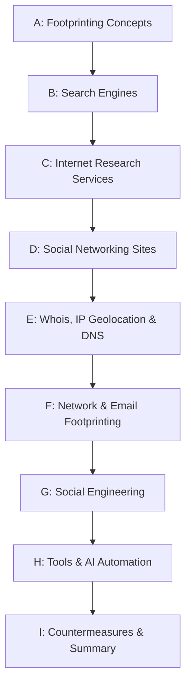

# CEH Module 2: Footprinting and Reconnaissance

Personal study notes covering the entirety of Module 2 of the CEH curriculum — rewritten and organized into a structured reference repo, rather than reproduced verbatim from any copyrighted source material.

> These notes are written in original language for personal study and reference. They summarize and explain the concepts covered in Module 2; they are not a copy of any textbook, courseware, or slide deck.

---

## Learning Objectives

By the end of this module, the goal is to be able to:

- [x] Describe footprinting concepts
- [x] Perform footprinting through search engines and using advanced Google hacking techniques
- [x] Perform footprinting through Internet research services and social networking sites
- [x] Perform Whois, DNS, network, and email footprinting
- [x] Perform footprinting through social engineering
- [x] Understand footprinting tools and countermeasures, including AI-powered automation

**Module 2 is now complete.** ✅

---

## Repo Structure

| # | File | Covers |
|---|---|---|
| A | [`01-footprinting-concepts.md`](01-footprinting-concepts.md) | What footprinting is, passive vs. active reconnaissance, the 3 categories of information gathered, footprinting objectives and threats, and the overall footprinting methodology |
| B | [`02-footprinting-through-search-engines.md`](02-footprinting-through-search-engines.md) | The 14 advanced Google search operators, the Google Hacking Database (GHDB), AI-assisted Google hacking, Shodan, and other search-engine techniques (image, video, meta, FTP, and IoT search engines) |
| C | [`03-footprinting-through-internet-research-services.md`](03-footprinting-through-internet-research-services.md) | People search services, job sites, dark web footprinting (surface/deep/dark web, Tor Browser, .onion search dorks), Netcraft/Shodan/Censys, competitive intelligence gathering, and information resource sites |
| D | [`04-footprinting-through-social-networking-sites.md`](04-footprinting-through-social-networking-sites.md) | People search on social media, LinkedIn harvesting, AI-assisted email harvesting, social-media presence analysis, and dedicated tools (Sherlock, Social Searcher) |
| E | [`05-whois-and-dns-footprinting.md`](05-whois-and-dns-footprinting.md) | Whois lookup (3 data models, 5 RIRs), Whois tools, IP geolocation, DNS record types, DNS interrogation tools (SecurityTrails, Fierce), AI-assisted DNS lookup, and reverse DNS lookup |
| F | [`06-network-and-email-footprinting.md`](06-network-and-email-footprinting.md) | Locating network ranges, private IP blocks, Traceroute (ICMP/TCP/UDP + AI-assisted), traceroute analysis, traceroute tools, email tracking, email headers, and email tracking tools |
| G | [`07-footprinting-through-social-engineering.md`](07-footprinting-through-social-engineering.md) | Social engineering fundamentals, what's targeted, the 4 core techniques (eavesdropping, shoulder surfing, dumpster diving, impersonation), and social engineering specifically on social networking sites |
| H | [`08-footprinting-tools-and-ai-automation.md`](08-footprinting-tools-and-ai-automation.md) | Maltego, Recon-ng, FOCA, subfinder, OSINT Framework, Recon-Dog, BillCipher, and 12+ AI-powered OSINT tools, plus AI-generated custom footprinting scripts |
| I | [`09-footprinting-countermeasures-and-summary.md`](09-footprinting-countermeasures-and-summary.md) | The full footprinting countermeasures checklist, organized by category, plus the module summary |

---

## Suggested Reading Order

Each file is self-contained with its own table of contents and a quick-reference summary at the bottom, so you can also jump straight to whichever topic you need.

---

## Relationship to Module 1

This folder picks up directly where [`../CEH-Module-01-Introduction-to-Ethical-Hacking/`](../Module-01-Introduction-to-Ethical-Hacking/README.md) leaves off. Module 1 covers the foundational concepts (information security, hacking/ethical hacking concepts, methodologies, controls, and laws); Module 2 moves into the first real phase of the [CEH Ethical Hacking Framework](../CEH-Module-01-Introduction-to-Ethical-Hacking/05-hacking-methodologies-and-frameworks.md#phase-1-reconnaissance) — reconnaissance — and covers it in full technical depth, from search-engine dorking all the way through countermeasures.

## What's Next

Module 3 — **Scanning Networks** — is the natural next step, continuing into [Phase 2 of the CEH framework](../CEH-Module-01-Introduction-to-Ethical-Hacking/05-hacking-methodologies-and-frameworks.md#phase-2-scanning).

---

## About This Repo

Compiled as part of an ongoing CEH v13 study track, alongside parallel work in CTF challenges and web security (SSRF and related topics). Structured for easy GitHub browsing — each part links to the next, diagrams render natively via Mermaid, and comparison tables are used wherever they make scanning faster than prose.
