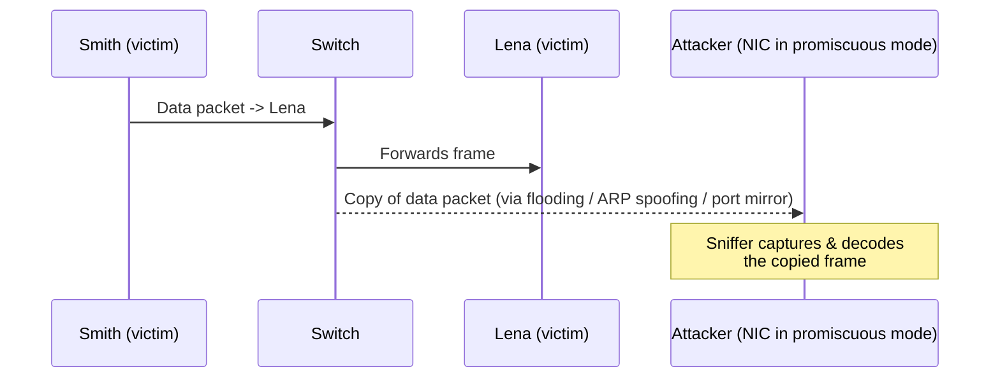
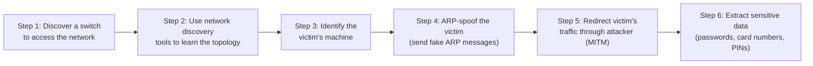
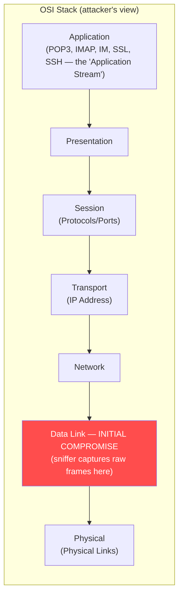
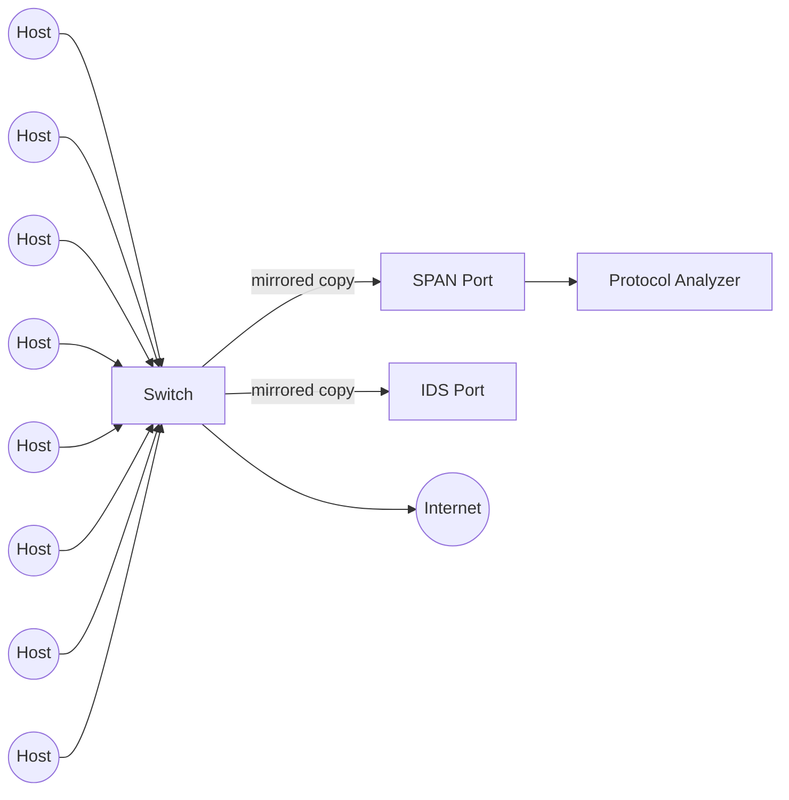
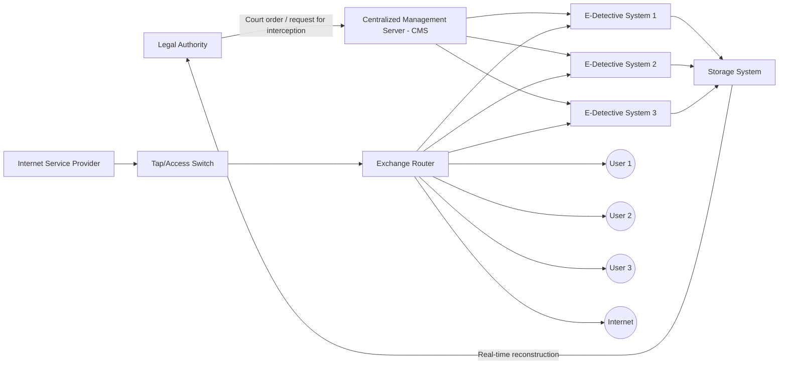

# 01 — Sniffing Concepts

## Table of Contents
- [What Is Network Sniffing](#what-is-network-sniffing)
- [How a Sniffer Works](#how-a-sniffer-works)
- [Passive vs. Active Sniffing](#passive-vs-active-sniffing)
- [How an Attacker Hacks a Network Using Sniffers](#how-an-attacker-hacks-a-network-using-sniffers)
- [Protocols Vulnerable to Sniffing](#protocols-vulnerable-to-sniffing)
- [Sniffing at the Data Link Layer of the OSI Model](#sniffing-at-the-data-link-layer-of-the-osi-model)
- [Hardware Protocol Analyzers](#hardware-protocol-analyzers)
- [SPAN Ports](#span-ports)
- [Wiretapping and Lawful Interception](#wiretapping-and-lawful-interception)

---

## What Is Network Sniffing

**Packet sniffing** is the process of monitoring and capturing every packet that crosses a given network segment, using either a software application (a "sniffer") or a dedicated hardware device. A sniffer placed on the right point of a network can observe the *entire* flow of traffic that passes through that point — not just traffic addressed to the sniffing host.

What a sniffer can typically pull out of raw traffic:

- Cleartext passwords and authentication material
- Emails, chat/session content
- Credit-card and financial data
- Telnet/rlogin sessions, SMTP, POP, IMAP, HTTP Basic auth
- SQL database traffic, SMB traffic, NFS traffic, FTP credentials, DNS queries

Historically, sniffing was trivial on **hub-based** networks because a hub is a pure Layer-1 repeater — it electrically broadcasts every incoming frame out of every other port, so any host on the hub sees all traffic on the segment. Modern networks are switched, and a switch is an intelligent Layer-2 device that (in normal operation) forwards a frame only out of the port where the destination MAC address lives — so, in theory, a host only sees its own traffic. In practice, several well-known techniques let an attacker defeat this isolation on a switched network (MAC flooding, ARP spoofing, switch port stealing, etc. — covered in the following chapters), which is why switches alone are **not** sufficient sniffing protection.

Attackers don't need physical access to install a sniffer — a laptop plugged into any open switch port on the LAN, or malware that turns a compromised host's NIC into a listening device, is enough. Because many enterprise switch ports are left open/unused, this is a very low barrier to entry.

---

## How a Sniffer Works

Every device on an Ethernet LAN has two addresses that matter here:

- A **MAC address** — burned into (or spoofed on) the NIC, used at Layer 2
- An **IP address** — used at Layer 3

The data-link layer builds Ethernet frames addressed to a *destination MAC address*. Under normal circumstances, a NIC only accepts frames whose destination MAC matches its own (or is a broadcast/multicast it's subscribed to) and silently discards everything else at the hardware level — the OS never even sees the discarded frames. A sniffer defeats this by switching the NIC into **promiscuous mode**, which disables that hardware filter so *every* frame that reaches the physical interface — regardless of destination MAC — is handed up to the sniffing application.

There are two fundamentally different Ethernet environments, and a sniffer behaves differently in each:

- **Shared Ethernet** — A single bus/collision domain connects all hosts (classic hub). All machines receive every packet; every NIC compares the frame's destination MAC to its own and discards non-matches. A NIC in promiscuous mode simply skips that discard step, so sniffing here is passive, silent, and effective.
- **Switched Ethernet** — The switch maintains a table (the **CAM table**, covered in [02 — MAC Attacks](02-mac-attacks.md)) mapping each MAC address to the physical port it's connected on, and forwards each frame only to that port. Putting a NIC into promiscuous mode on a switched network, by itself, does **nothing** — you still only receive what the switch forwards to your port. This is why people assume switched networks are "safe" from sniffing. They are not: MAC flooding, ARP spoofing, and switch port stealing are all techniques specifically designed to force a switch to send you traffic that isn't meant for you.

---

## Passive vs. Active Sniffing

| | Passive Sniffing | Active Sniffing |
|---|---|---|
| **Network type** | Hub-based / shared collision domain | Switched network |
| **Traffic sent by attacker** | None — attacker only listens | Attacker actively injects traffic (e.g., forged ARP packets) to manipulate the switch/CAM table |
| **Stealth** | Very stealthy, hard to detect (no packets sent) | Easier to detect — generates abnormal traffic (flooded MACs, gratuitous ARP, etc.) |
| **Typical techniques** | Simply capturing on a hub segment | MAC flooding, DNS poisoning, ARP poisoning, DHCP attacks, switch port stealing, spoofing attacks |

**Passive sniffing** involves sending no packets at all — the sniffer simply captures and monitors traffic that is already flowing past it. Since almost no modern network still uses hubs, passive sniffing is rare in the wild today, but it remains a useful mental baseline: it's what active-sniffing techniques are ultimately trying to *recreate* on a switched network.

**Active sniffing** searches for traffic on a switched LAN by actively injecting something into it — most commonly forged ARP traffic — to trick the switch or the hosts into sending the attacker traffic that wouldn't otherwise reach them. Because switches maintain their own CAM table to bind MAC addresses to ports, an attacker cannot simply listen; they must interact with the network to redirect traffic toward themselves.

**Active sniffing techniques covered in this module:**
- MAC flooding
- DNS poisoning
- ARP poisoning
- DHCP attacks
- Switch port stealing
- Spoofing attacks (MAC spoofing, IRDP spoofing, VLAN hopping, STP attacks)

**Passive sniffing methods to gain control over a target network:**
- **Compromising physical security** — an attacker who gains physical access to a facility can plug directly into the LAN and capture data with no need for active manipulation.
- **Using a Trojan horse** — many Trojans include built-in sniffing capability; once a victim machine is compromised, the attacker can install a packet sniffer and passively harvest traffic from that vantage point.

> **Note:** Passive sniffing offers significant stealth advantages over active sniffing precisely because it generates zero additional traffic — there's nothing for an IDS to flag.

---

## How an Attacker Hacks a Network Using Sniffers

The typical sniffing-based attack chain against a target network:

1. **Discover a switch to access the network** — the attacker connects a system or laptop to any available port on a switch.
2. **Use network discovery tools to learn the topology** — once on the network, the attacker maps hosts, routes, and topology.
3. **Identify the victim's machine** — by analyzing the topology, the attacker picks a specific target to attack.
4. **Send fake ARP messages (ARP spoofing)** — the attacker uses ARP spoofing techniques to inject forged Address Resolution Protocol messages.
5. **Redirect traffic to the attacker's machine** — the previous step diverts the victim's traffic through the attacker's system, establishing a classic **man-in-the-middle (MITM)** position.
6. **Extract sensitive information** — with all of the victim's sent/received packets now flowing through the attacker, the attacker can extract passwords, credit-card numbers, usernames, and PINs directly from the traffic.

---

## Protocols Vulnerable to Sniffing

The common thread across all of these protocols is that they were designed before encryption was the default assumption, and transmit either credentials or full session content in **cleartext**:

| Protocol | Port(s) | Why It's Vulnerable |
|---|---|---|
| **Telnet / rlogin** | TCP 23 (Telnet) | Remote command-line access with zero encryption — usernames, passwords, and full session keystrokes travel in plaintext. `rlogin` similarly allows remote login over an unencrypted TCP session. |
| **HTTP** | TCP 80 | Default (non-TLS) HTTP transfers user data, including submitted credentials, in cleartext. |
| **SNMP (v1/v2)** | UDP 161/162 | SNMPv1 and SNMPv2 do not provide strong security; community strings and management data are sent in cleartext, letting an attacker recover passwords/credentials used for device management. |
| **SMTP** | TCP 25 | Most SMTP implementations transmit mail in cleartext, exposing message content and, in some configurations, credentials. |
| **NNTP** | TCP 119 | Distributes/retrieves Usenet news articles without encrypting the data stream. |
| **POP** | TCP 110 | Workstations retrieve mail from a POP server; because the protocol lacks strong security by default, credentials and mail content are exposed in cleartext. |
| **FTP** | TCP 20/21 | File transfer with no built-in encryption; credentials can be captured by any sniffer (and cracked/replayed with tools like `hashcat` if hashed elsewhere). |
| **IMAP** | TCP 143 | Similar to POP — inadequate default security exposes both credentials and message content. |
| **TFTP** | UDP 69 | A minimal file-transfer protocol built on UDP with **no authentication and no encryption mechanism at all**, making any data transferred trivially accessible to anyone on the same network segment. |

The practical implication: any environment still relying on these protocols in cleartext form (instead of their encrypted equivalents — SSH instead of Telnet, HTTPS instead of HTTP, SNMPv3 instead of v1/v2, IMAPS/POP3S, FTPS/SFTP) is handing a passive or active sniffer everything it needs.

---

## Sniffing at the Data Link Layer of the OSI Model

The OSI model describes seven layers of network function, each providing services to the layer above and consuming services from the layer below. Sniffers specifically target **Layer 2 — the Data Link layer** — because that's where raw frames (and everything encapsulated inside them: IP addresses, TCP/UDP ports, and ultimately the application-layer payload — POP3, IMAP, IM, SSL session data, etc.) are physically observable on the wire/segment.

A critical design property of the OSI model is that each layer operates **independently** of the others. That independence is exactly what makes Layer 2 sniffing so dangerous: if a sniffer compromises the data-link layer, **none of the upper layers are aware that anything has been compromised** — encryption applied at higher layers (e.g., TLS at the session layer) can still protect payload confidentiality, but everything below that — and any protocol that doesn't encrypt — is fully exposed.

Because sniffing begins at Layer 2, it's layer-agnostic to what's riding on top of it — Telnet, POP3, IMAP, instant messaging, and even SSL-negotiation metadata are all visible as raw bytes to a data-link-layer sniffer; only the *payload* of properly-implemented encrypted protocols remains unreadable.

---

## Hardware Protocol Analyzers

A **hardware protocol analyzer** is a physical device that intercepts and analyzes traffic passing over a network **without altering the traffic itself**. Compared to software sniffers, hardware analyzers:

- Capture more data with fewer packet drops under load (no dependency on host OS scheduling/interrupts)
- Support a wide range of connection types: LAN, WAN, and even circuit-level telco lines
- Can decode low-level physical-layer events — bit-level (K/J) chirps, high-speed negotiation, transmission errors, retransmissions
- Provide accurate timestamps of captured traffic
- Are generally more expensive and are typically out of reach for individual developers, hobbyists, and ordinary hackers — they're used by network engineers, telecom carriers, and dedicated red teams with the budget for them

**Example hardware protocol analyzers:**

| Product | Vendor | Notes |
|---|---|---|
| Xgig 1000 32/128 G FC & 25/50/100 GE Analyzer | [viavisolutions.com](https://www.viavisolutions.com) | Addresses 8G/16G/32G/128G Fibre Channel and 10/25/50/100G Ethernet; portable, reconfigurable; industry-first true analog pass-through adapter while preserving the linear nature of signal-over-copper connections; supports auto-negotiation, link training, forward error correction (FEC) |
| SierraNet M1288 | [teledynelecroy.com](https://www.teledynelecroy.com) | Ethernet + Fibre Channel test platform; best-in-class analysis, jamming, and generation for up to 256GB of Ethernet/FC traffic at full wire rates; 128G/256G recording buffers, dynamic memory allocation, Fibre Channel fabrics (64/128GFC PAM4), 1/2/4 Ethernet lanes |
| PTW60 | [globalspec.com](https://www.globalspec.com) | — |
| P5551A PCIe 5.0 Protocol Exerciser | [keysight.com](https://www.keysight.com) | — |
| Voyager M4x | [teledynelecroy.com](https://www.teledynelecroy.com) | — |
| N2X N5540A Agilent Protocol Analyzer | [valuetronics.com](https://www.valuetronics.com) | — |
| Xgig 16-Lane PCI Express 4.0 Chassis | [viavisolutions.com](https://www.viavisolutions.com) | — |

---

## SPAN Ports

**SPAN (Switched Port Analyzer)** — sometimes called "port mirroring" — is a Cisco switch feature that configures a port to receive a copy of every packet passing through one or more *source* ports (or an entire VLAN). It is the legitimate, vendor-supported way to monitor traffic on a switched network, typically feeding a protocol analyzer or an IDS.

Key points:
- There can be one or more **source** ports (the ports being monitored/mirrored) but there should generally be only one **destination** port on the switch.
- Source ports can span multiple ports simultaneously, including all the ports of a specific VLAN.
- If an attacker manages to connect to (or compromise) the SPAN destination port, they compromise visibility into the **entire mirrored network segment** at once — which is exactly why SPAN port access itself needs to be tightly controlled.

---

## Wiretapping and Lawful Interception

**Wiretapping** (telephone tapping) is the monitoring of telephone or internet conversations by a third party with covert intent. To wiretap, the attacker identifies a target person/host and connects a listening device (hardware, software, or a combination) to the circuit carrying information between the two target phones/hosts — tapping the small amount of electrical signal the conversation generates.

**Wiretapping methods:**
- Official tapping of telephone lines
- Unofficial tapping of telephone lines
- Recording the conversation
- Direct line wiretap
- Radio wiretap

**Types of wiretapping:**

| Type | Description |
|---|---|
| **Active wiretapping** | An MITM attack — the attacker can monitor, record, **and alter** the traffic/data flow in the communication |
| **Passive wiretapping** | Snooping/eavesdropping only — the attacker monitors or records traffic without altering it, listening for passwords or other information |

> **Note:** Wiretapping without a warrant or the consent of the parties involved is a criminal offense in most countries and is punishable depending on local law.

**Lawful Interception (LI)** refers to the *legal* interception of data communication between two endpoints for surveillance purposes on traditional telecommunications, VoIP, data, and multiservice networks, obtained for analysis or evidence. This is used in infrastructure management/protection and cybersecurity-related work, and is carried out by law enforcement agencies (LEAs) under legal sanction from the network operator/service provider — necessary only to monitor messages exchanged over channels where users are suspected of engaging in illegal activity. Countries worldwide are standardizing this type of procedure.

**Telco/ISP lawful interception architecture** (as implemented by decision-support/monitoring vendors):

The tap/access switch collects traffic from the ISP network, sorts it by IP domain, and serves it to E-Detective (ED) systems that decode and reconstruct the intercepted traffic into its original format using supporting protocols such as POP3, IMAP, SMTP, P2P, and Telnet. A **Centralized Management Server (CMS)** manages all the ED systems, and law-enforcement agencies can access intercepted data whenever legally required.

---

**Next:** [02 — MAC Attacks →](02-mac-attacks.md)
