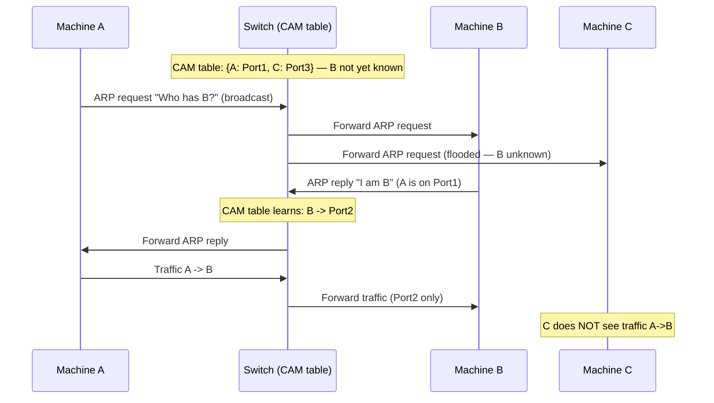
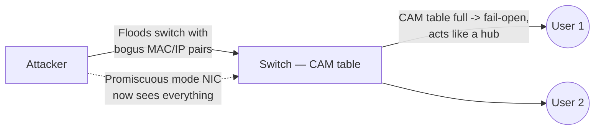
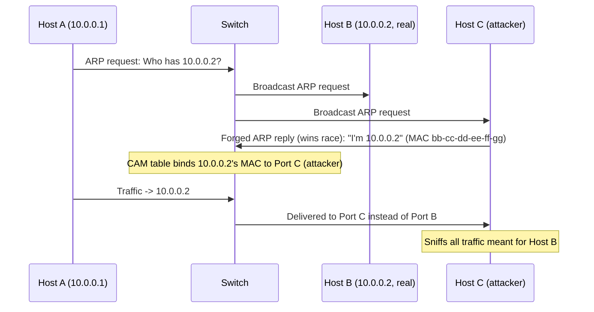

# 02 — MAC Attacks

## Table of Contents
- [MAC Address Structure](#mac-address-structure)
- [The CAM Table](#the-cam-table)
- [How CAM Works](#how-cam-works)
- [What Happens When a CAM Table Is Full](#what-happens-when-a-cam-table-is-full)
- [MAC Flooding](#mac-flooding)
- [MAC Flooding with `macof`](#mac-flooding-with-macof)
- [Switch Port Stealing](#switch-port-stealing)
- [Defending Against MAC Attacks](#defending-against-mac-attacks)

---

## MAC Address Structure

A **MAC address** uniquely identifies a node on a network and is tied to a physical port on a network switch, making it possible to pin down a specific device's location topologically. MAC addresses are used as network addresses for most IEEE 802 network technologies, including Ethernet, and (logically) belong to the data-link layer of the OSI model.

A MAC address is **48 bits**, split into two 24-bit sections:

```
 3 Bytes (24 bits)                3 Bytes (24 bits)
┌─────────────────────────────┐  ┌─────────────────────────────┐
│ Organizationally Unique      │  │ Network Interface Controller │
│ Identifier (OUI)             │  │ (NIC) Specific                │
└─────────────────────────────┘  └─────────────────────────────┘
   a8  a7  a6  a5  a4  a3  a2  a1   <- bit numbering of the first octet
```

- The **first six hex digits** (OUI) identify the manufacturer of the adapter.
- The **next six hex digits** (NIC-specific) are the serial number assigned to that adapter by the manufacturer.

**Worked example:** `D4-BE-D9-14-C8-29`
- `D4-BE-D9` → OUI → identifies the manufacturer as **Dell, Inc.**
- `14-C8-29` → NIC-specific serial number of that particular adapter

Two special bits inside the first octet of a MAC address carry extra meaning:
- Bit `a1` (the low-order bit of the first octet): `0` = **Unicast**, `1` = **Multicast**
- Bit `a2`: `0` = **Globally unique** (vendor-assigned), `1` = **Locally administered** (manually/software-assigned, as when spoofing)

---

## The CAM Table

The **CAM (Content Addressable Memory) table** is a fixed-size dynamic table maintained by every Ethernet switch. It stores every MAC address the switch has learned, the physical port that address lives on, and the VLAN it belongs to. When a switch receives a frame, it looks up the frame's destination MAC in the CAM table and forwards the frame *only* out of the matching port — this is what makes a switched network more secure than a hub, where every frame goes to every port.

**Example CAM table** (as it appears in the official courseware — note the sample MAC values below are illustrative placeholders used for teaching, not valid hexadecimal):

| VLAN | MAC Address | Type | Learn | Age | Ports |
|---|---|---|---|---|---|
| 255 | `00:d3:ad:34:12:3g` | Dynamic | Yes | 0 | Gi5/2 |
| 5 | `as:23:df:45:45:t6` | Dynamic | Yes | 0 | Gi2/5 |
| 5 | `er:23:23:er:t5:e3` | Dynamic | Yes | 0 | Gi1/6 |

Because a CAM table is **fixed-size**, it can only hold a limited number of MAC-to-port bindings at once — and that hard limit is the entire basis of the MAC flooding attack described below.

---

## How CAM Works

Consider three machines: **Machine A**, **Machine B**, and **Machine C**, holding MAC addresses `A`, `B`, and `C` respectively. Machine A wants to talk to Machine B for the first time.



**Step-by-step:**

1. **Machine A broadcasts an ARP request** to the switch, containing the source MAC/IP (Machine A) and the target IP (Machine B). Since the switch's CAM table has no entry for B yet, it floods this ARP request out to *all* hosts on the network and waits for a reply.
2. **Machine B (holding the target IP) sends an ARP reply** containing its MAC address. The CAM table stores this MAC along with the port it arrived on, i.e., it *learns* that B is reachable via Port 2.
3. **The connection is established**, and the switch now forwards traffic between A and B directly through their respective learned ports — Machine C, on Port 3, never sees this unicast traffic.

This is precisely the mechanism attackers must defeat to sniff on a switched network: as long as the CAM table correctly maps the victim's MAC to the victim's port, an attacker sitting on a different port sees nothing.

---

## What Happens When a CAM Table Is Full

Because a CAM table has a **fixed maximum size**, flooding it with a large volume of bogus source MAC addresses fills every available slot. Once full, further legitimate ARP/learning requests can no longer be recorded — this changes the switch's fundamental behavior:

- The switch is forced back into its **learning-mode fallback behavior**: since it can no longer bind new (or even existing, once entries age out) MAC addresses to specific ports with confidence, it starts **broadcasting unmatched frames out of every port**, just like a hub.
- This also affects the CAM tables of **adjacent switches**, since the flood of bogus source MACs propagates through any trunked/uplinked switches too.

The practical consequence for an attacker: once the CAM table is saturated, they can see traffic from every other host on that switch — including traffic between two machines they were never a MITM relay for — because the switch is no longer forwarding selectively.

---

## MAC Flooding

**MAC flooding** is the technique used to exhaust a switch's CAM table on purpose so that the switch reverts to hub-like flooding behavior, letting an attacker sniff traffic they otherwise couldn't see.

Mechanics:
1. The switch's CAM table is fixed in size and can only store a limited number of MAC-to-port bindings.
2. The attacker bombards the switch with an enormous number of frames carrying **fake, randomized source MAC addresses** (and corresponding fake IPs) — none of which correspond to real hosts.
3. The switch dutifully attempts to learn each new "host," filling the table until no room is left.
4. When the CAM table is completely full, the switch enters **fail-open mode**: it can no longer make forwarding decisions with confidence, so it starts behaving like a hub and broadcasts all incoming frames out of every port.
5. The attacker sets their own NIC to promiscuous mode, and can now passively capture all traffic entering the switch — including traffic between two victim hosts who were never targeted directly.



---

## MAC Flooding with `macof`

**`macof`** is a Unix/Linux tool from the classic **`dsniff`** collection, purpose-built to flood a switch's CAM table with fake MAC/IP pairs.

- **Source:** [monkey.org](https://www.monkey.org) (`dsniff` suite)
- **Capability:** Floods a local network switch with random MAC and IP addresses — capable of generating **131,000 bogus MAC entries per minute** by sending forged MAC entries fast enough to overwhelm the CAM table, causing the switch to fail open and broadcast traffic to every port.

**Syntax used in the lab demonstration (Parrot OS terminal):**

```bash
macof -i eth0 -n 10
```

- `-i eth0` — the network interface to flood on
- `-n 10` — number of packets to send (in a real attack this is typically left unbounded, or set to a very large number, to keep the CAM table continuously saturated)

**Example captured output** (each line is one forged Ethernet frame with a random source/destination MAC and a bogus TCP SYN):

```
[root@parrot]-[/home/attacker]
#macof -i eth0 -n 10
e8:c:7a:9:32:9 69:4a:7f:2:2:db 0.0.0.0.54830 > 0.0.0.0.49299: S 2083231648:2083231648(0) win 512
33:5e:78:12:3c:ed c3:69:e1:7e:6:26 0.0.0.0.34794 > 0.0.0.0.45492: S 122304791:122304791(0) win 512
e3:56:8f:7b:e9:a5 40:4e:7f:1a:5e:7a 0.0.0.0.14802 > 0.0.0.0.39800: S 291509932:291509932(0) win 512
30:6c:c9:43:6e:3e 34:f9:59:5e:e1:fc 0.0.0.0.53854 > 0.0.0.0.28576: S 323117728:323117728(0) win 512
6f:89:98:4c:8d:e6 cf:31:98:21:ac:3e 0.0.0.0.8922 > 0.0.0.0.5247: S 35186630:35186630(0) win 512
97:9b:91:5:51:bc 5f:5e:c5:2a:e8:9 0.0.0.0.38447 > 0.0.0.0.28801: S 1891407220:1891407220(0) win 512
52:23:8b:1b:2a:36 80:7d:29:7f:6c:96 0.0.0.0.19387 > 0.0.0.0.1388: S 1857296135:1857296135(0) win 512
8c:ef:9:7c:c2:db d:0:1e:28:fd:3e 0.0.0.0.63270 > 0.0.0.0.48456: S 616146053:616146053(0) win 512
```

Each line: `<random-src-MAC> <random-dst-MAC> 0.0.0.0.<random-src-port> > 0.0.0.0.<random-dst-port>: S <seq>:<seq>(0) win 512` — a forged TCP SYN packet used purely as a vehicle to inject a novel source MAC into the CAM table. Sending enough of these in a short window is what exhausts the table.

---

## Switch Port Stealing

**Switch port stealing** uses MAC flooding techniques with **forged gratuitous ARP packets** — the attacker floods the switch with ARP packets that use the *target's* MAC address as the source, and the attacker's own MAC address as the destination. This deliberately creates a **race condition**: the switch's CAM table constantly flips the port binding for the target host's MAC address back and forth between the real target port and the attacker's port.

If the attacker is fast enough, they can manage to bind the target host's switch-port entry to their own port, intercepting packets meant for the target's host IP before the legitimate binding is restored.

### Worked example

Three machines on a network: **Host A**, the target **Host B**, and the attacker's **Host C**.

**Table 8.2 — Details of three hosts:**

| Machine | MAC Address | IP Address | Ports |
|---|---|---|---|
| Host A | `aa-bb-cc-dd-ee-ff` | 10.0.0.1 | Port A |
| Host B | `bb-cc-dd-ee-ff-gg` | 10.0.0.2 | Port B |
| Host C (attacker) | `cc-dd-ee-ff-gg-hh` | 10.0.0.3 | Port C |

**Table 8.3 — Switch's initial MAC table** (columns as printed in the source: `Vlan | MAC Address(=host label) | Type(=actual MAC) | Learn(=IP) | Age | Ports`):

| Vlan | MAC Address | Type | Learn | Age | Ports |
|---|---|---|---|---|---|
| 255 | Host A | `aa-bb-cc-dd-ee-ff` | 10.0.0.1 | 0 | Port A |
| 5 | Host B | `bb-cc-dd-ee-ff-gg` | 10.0.0.2 | 0 | Port B |
| 5 | Host C | `cc-dd-ee-ff-gg-hh` | 10.0.0.3 | 0 | Port C |

**Table 8.4 — ARP cache table:**

| IP | MAC |
|---|---|
| 10.0.0.1 | `aa-bb-cc-dd-ee-ff` |
| 10.0.0.2 | `bb-cc-dd-ee-ff-gg` |
| 10.0.0.3 | `cc-dd-ee-ff-gg-hh` |

**Attack steps:**

1. Switch port stealing is a technique used by an attacker (Host C) who spoofs **both** the IP address and the MAC address of the target machine (Host B).
2. The attacker's machine runs a sniffer that turns its NIC adapter into promiscuous mode.
3. Host A, associated with IP `10.0.0.1`, wants to communicate with Host B at `10.0.0.2` — Host A sends an ARP request: *"I want to communicate with 10.0.0.2. What is the MAC address of 10.0.0.2?"*
4. The switch broadcasts this ARP request to all machines in the network.
5. **Before Host B (the real target) can respond** to the ARP request, the attacker responds first with an ARP reply containing the **spoofed MAC and IP addresses**: *"I am 10.0.0.2, and my MAC address is `bb-cc-dd-ee-ff-gg`."* The attacker can help ensure they win this race by first flooding/slowing Host B, e.g. via a denial-of-service (DoS) attack against Host B.
6. The ARP cache in the switch now records the spoofed MAC and IP pairing:

**Table 8.6 — ARP cache updated with a spoofed entry:**

| IP | MAC |
|---|---|
| 10.0.0.1 | `aa-bb-cc-dd-ee-ff` |
| 10.0.0.2 | `bb-cc-dd-ee-ff-gg` |
| **10.0.0.2** | **`cc-dd-ee-ff-gg` (spoofed, in red in original)** |

7. The spoofed MAC address of the target Host B is now bound to the attacker's port (Port C), and the switch's CAM table is updated accordingly:

**Table 8.7 — MAC table updated with a spoofed entry:**

| Vlan | MAC Address | Type | Learn | Age | Ports |
|---|---|---|---|---|---|
| 255 | Host A | `aa-bb-cc-dd-ee-ff` | 10.0.0.1 | 0 | Port A |
| 5 | Host B | `bb-cc-dd-ee-ff-gg` | 10.0.0.2 | 0 | Port B |
| **5** | **Host C** | **`bb-cc-dd-ee-ff-gg` (spoofed)** | **10.0.0.2** | **0** | **Port C ← stolen** |

8. **Now the system forwards all packets directed to Host B to Host C (the attacker's machine) through Port C.** The attacker can sniff all traffic intended for Host B.



---

## Defending Against MAC Attacks

### Concept: Port Security

**Port security** is a switch feature that identifies and limits which MAC addresses are allowed to access a given port. If you assign one or more secure MAC addresses to a port, that port will forward *only* frames whose source address is inside the defined group — anything else triggers a security violation.

A security violation occurs when:
- A port is configured as a secure port and the **maximum number of secure MAC addresses** has already been reached, **or**
- The MAC address of a machine attempting to access the port does not match any of the identified secure addresses

Once the maximum is set, secure MAC addresses can be populated in any of three ways:
1. Configure all secure MAC addresses manually via the `switchport port-security mac-address` interface configuration command.
2. Allow the port to **dynamically** learn secure MAC addresses from whatever devices are actually connected.
3. Configure a fixed number of static addresses and let the rest be learned dynamically.

Port security directly limits MAC flooding attacks and locks down ports, optionally sending an SNMP trap when a violation occurs.

### Configuring Port Security on a Cisco Switch

**Source:** [cisco.com](https://www.cisco.com)

Full configuration sequence to restrict traffic through a port by limiting/identifying the MAC addresses allowed to access it:

```cisco
! 1. Enter interface configuration mode for the physical interface to configure
interface interface_id
! example: interface gigabitethernet 3/1

! 2. Set the interface mode to access (port security requires access mode —
!    an interface in the default "dynamic desirable" mode cannot be a secure port)
switchport mode access

! 3. Enable port security on the interface
switchport port-security

! 4. Set the maximum number of secure MAC addresses for the interface (range 1–3072, default 1)
switchport port-security maximum value

! 5. Set the violation mode — the action to take when a security violation is detected
switchport port-security violation {restrict | shutdown}

! 6. Set the rate limit for bad packets
switchport port-security limit rate invalid-source-mac

! 7. Enter a secure MAC address for the interface — can be repeated to build a static list,
!    and also used to cap the maximum number of secure MAC addresses
switchport port-security mac-address mac_address

!    Enable "sticky learning" — the switch dynamically learns the first MAC address(es)
!    seen on the port and automatically converts them into secure, saved MAC addresses
switchport port-security mac-address sticky

! 8. Return to privileged EXEC mode
end

! 9. Verify your configuration
show port-security address
! or, scoped to one interface:
show port-security address interface interface_id
```

**Additional Cisco port-security commands** worth knowing individually:

| Command | Effect |
|---|---|
| `switchport port-security maximum {1-3072}` | Sets the maximum number of secure MAC addresses for the interface (range 1–3072; default is 1) |
| `switchport port-security aging time 2` | Sets the aging time for the secure port (here, 2 minutes) |
| `switchport port-security aging type inactivity` | Sets the secure MAC address aging type to *inactivity* (age out only if the address hasn't been seen, rather than a hard timer) |
| `snmp-server enable traps port-security trap-rate 5` | Controls the rate at which SNMP traps are generated for port-security violations |

### What this actually stops

In the courseware example: if a switch is configured with `switchport port-security maximum 1` on a user-facing port, then even if an attacker floods that port with 132,000 bogus source MAC addresses (`macof`-style), the switch will not learn any of them beyond the single allowed MAC — the port instead locks down and (depending on the configured violation mode) drops the offending traffic and/or shuts the port, and sends an SNMP trap. This is a direct, effective control against both **MAC flooding** and **switch port stealing**, since both attacks fundamentally depend on the switch accepting large numbers of new source MAC bindings.

---

**Previous:** [← 01 — Sniffing Concepts](01-sniffing-concepts.md) · **Next:** [03 — DHCP Attacks →](03-dhcp-attacks.md)
