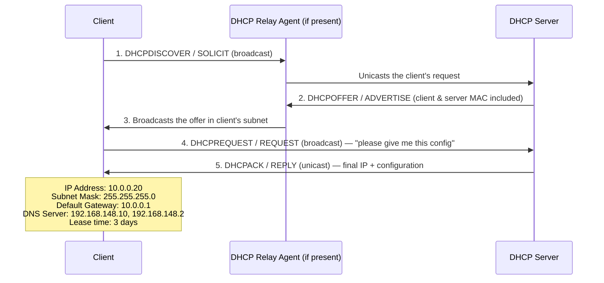
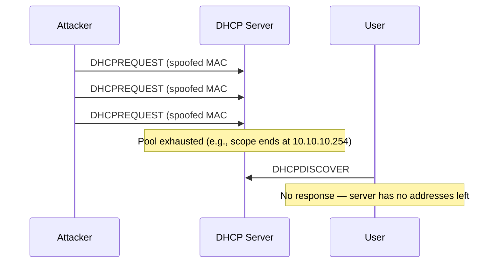
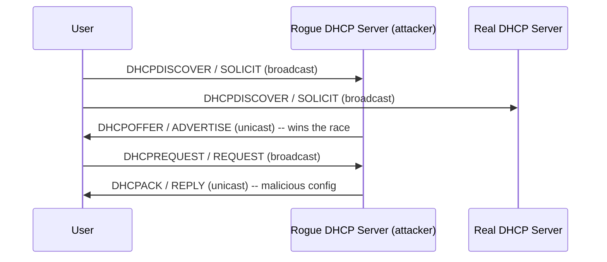

# 03 — DHCP Attacks

## Table of Contents
- [How DHCP Works](#how-dhcp-works)
- [DHCP Message Types](#dhcp-message-types)
- [IPv4 DHCP Packet Format](#ipv4-dhcp-packet-format)
- [DHCP Starvation Attack](#dhcp-starvation-attack)
- [Rogue DHCP Server Attack](#rogue-dhcp-server-attack)
- [Additional DHCP Attack Tools](#additional-dhcp-attack-tools)
- [Defending Against DHCP Starvation and Rogue Server Attacks](#defending-against-dhcp-starvation-and-rogue-server-attacks)

---

## How DHCP Works

**DHCP (Dynamic Host Configuration Protocol)** is a client–server protocol that automatically assigns an IP address, along with other configuration information (default gateway, subnet mask, DNS servers, lease duration), to a host joining a network. DHCP maintains backward compatibility with **BOOTP** relay agents, which is why DHCP messages share BOOTP's packet format — this eliminates the need to change a BOOTP client's initialization software just to interoperate with DHCP servers.

**The DORA process** (Discover → Offer → Request → Acknowledge):



1. The client broadcasts a `DHCPDISCOVER`/`SOLICIT` request asking for DHCP configuration information.
2. A DHCP relay agent (if one exists on the segment) captures the client's request and unicasts it to the DHCP servers available on the network.
3. A DHCP server unicasts `DHCPOFFER`/`ADVERTISE`, which contains both the client's and server's MAC addresses.
4. The relay agent broadcasts the `DHCPOFFER`/`ADVERTISE` back into the client's subnet.
5. The client broadcasts `DHCPREQUEST`/`REQUEST`, formally asking the DHCP server to provide the offered configuration.
6. The DHCP server sends a unicast `DHCPACK`/`REPLY` message to the client with the final IP configuration and information.

### DHCP Request/Reply (renew) messages

A device that already has an IP address can use a simpler request/reply exchange to *refresh* its DHCP-provided settings. When a DHCP client boots up, it participates in traffic broadcasting; devices already using an IP obtained via DHCP can still use its other configuration capabilities. A client can broadcast a `DHCPINFORM` to request any additional parameters it needs, using its current IP and/or default parameters for network usage. DHCP servers respond with the requested/default parameters via `DHCPACK`. If a DHCP request comes from a hardware address that is in the server's reserved pool and the request is not for the IP address that the server previously offered, the server's offer is invalid, and it can put that IP back into the pool and offer it to another client.

---

## DHCP Message Types

| DHCPv4 Message | DHCPv6 Message | Description |
|---|---|---|
| `DHCPDiscover` | `Solicit` | Client broadcast to locate available DHCP servers |
| `DHCPOffer` | `Advertise` | Server-to-client response to `DHCPDiscover`, offering configuration parameters |
| `DHCPRequest` | `Request`, `Confirm`, `Renew`, `Rebind` | Client to server(s), either (a) requesting offered parameters, (b) confirming the correctness of a previously allocated address, or (c) extending the lease period |
| `DHCPAck` | `Reply` | Server to client with committed configuration parameters, including the committed network address |
| `DHCPRelease` | `Release` | Client to server, relinquishing the network address and cancelling the remaining lease |
| `DHCPDecline` | `Decline` | Client to server indicating that the offered network address is already in use |
| N/A | `Reconfigure` | Server to client indicating the server has new/updated configuration settings; the client then sends either a renew/reply or an information-request/reply transaction to fetch the update |
| `DHCPInform` | `Information Request` | Client to server, asking only for local configuration parameters; the client already has an externally configured network address |
| N/A | `Relay-Forward` | A relay agent sends a relay-forward message to relay messages to servers, either directly or through another relay agent |
| N/A | `Relay-Reply` | A server sends a relay-reply message to a relay agent containing a message that the relay agent delivers to a client |
| `DHCPNAK` | N/A | Server to client indicating that the client's notion of its network address is incorrect (e.g., the client moved to a new subnet), or that the client's lease has expired |

---

## IPv4 DHCP Packet Format

```
┌─────────┬───────────────┬────────────────┬────────┐
│ OP Code │ Hardware Type │ Hardware Length│  HOPS  │
├─────────┴───────────────┴────────────────┴────────┤
│               Transaction ID (XID)                 │
├───────────────────────┬────────────────────────────┤
│        Seconds        │           Flags            │
├─────────────────────────────────────────────────────┤
│           Client IP Address (CIADDR)                │
├─────────────────────────────────────────────────────┤
│            Your IP Address (YIADDR)                 │
├─────────────────────────────────────────────────────┤
│           Server IP Address (SIADDR)                 │
├─────────────────────────────────────────────────────┤
│          Gateway IP Address (GIADDR)                 │
├─────────────────────────────────────────────────────┤
│   Client Hardware Address (CHADDR) — 16 bytes        │
├─────────────────────────────────────────────────────┤
│        Server Name (SNAME) — 64 bytes                │
├─────────────────────────────────────────────────────┤
│         Filename — 128 bytes                          │
├─────────────────────────────────────────────────────┤
│              DHCP Options                             │
└─────────────────────────────────────────────────────┘
```

**Field-by-field reference:**

| Field | Octets | Description |
|---|---|---|
| **Opcode** | 1 | Message opcode/type: `1` = message sent by the client, `2` = response sent by the server |
| **Hardware Address Type** | 1 | Hardware address type defined by IANA (e.g., `1` = 10 Mb Ethernet) |
| **Hardware Address Length** | 1 | Hardware address length, in octets |
| **Hops** | 1 | Generally set to `0` by clients; optionally used to count the number of relay agents that forwarded the message |
| **Transaction ID (XID)** | 4 | Random number chosen by the client to associate request messages with responses between a client and a server |
| **Seconds** | 2 | Seconds elapsed since the client began the address acquisition/renewal process |
| **Flags** | 2 | Flags set by the client; e.g., if the client cannot receive a unicast IP datagram, the broadcast flag is set |
| **Client IP Address (CIADDR)** | 4 | Used when the client already has an IP address and can respond to ARP requests |
| **Your IP Address (YIADDR)** | 4 | The address assigned by the DHCP server to the DHCP client |
| **Server IP Address (SIADDR)** | 4 | The server's IP address |
| **Gateway IP Address (GIADDR)** | 4 | The IP address of the DHCP relay agent |
| **Client Hardware Address (CHADDR)** | 16 | The hardware (MAC) address of the client |
| **Server Name (SNAME)** | 64 | Optional server hostname |
| **File Name** | 128 | Name of the file containing the BOOTP client's boot image |
| **DHCP Options** | Variable | Additional DHCP option fields |

---

## DHCP Starvation Attack

In a **DHCP starvation attack**, the attacker floods the DHCP server with a very large number of DHCP requests, using **spoofed source MAC addresses**, until the server exhausts every IP address it's configured to hand out. Once the address pool is drained, legitimate clients on the network can no longer obtain (or renew) a valid IP address — a straightforward denial-of-service condition. This is frequently a setup step for a follow-on **rogue DHCP server** attack (below): once the real server can't answer new clients, a rogue server the attacker controls becomes the only one that *can*.



### DHCP Starvation Tool: Yersinia

- **Source:** [sourceforge.net](https://sourceforge.net)
- Yersinia is a network tool designed specifically to exploit weaknesses in Layer-2 protocols, including DHCP. It's built to be a solid framework for analyzing and testing deployed networks and systems.

**Example capture from the courseware (`yersinia -I` DHCP mode, Parrot Terminal):**

The tool's live view (`yersinia -I`, DHCP mode) shows a continuous stream of `DISCOVER` message rows — source IP `0.0.0.0`, destination `255.255.255.255`, one per spoofed client — and a running tally at the bottom:

```
Total Packets: 3306566     DHCP Packets: 3306566     MAC Spoofing [X]
```

...with a DHCP Fields pane decoding the most recent packet:

```
Source MAC 02:48:33:66:02:51   Destination MAC FF:FF:FF:FF:FF:FF
SIP 000.000.000.000   DIP 255.255.255.255   SPort 00068   DPort 00067
Op 01   Htype 01   HLEN 06   Hops 00   Xid 643C9869   Secs 0000   Flags 8000
CI 000.000.000.000   YI 000.000.000.000   SI 000.000.000.000   GI 000.000.000.000
CH 02:48:33:66:02:51   Extra
```

### DHCP Starvation Attack Tools

| Tool | Source |
|---|---|
| `dhcpStarv.py` | [github.com](https://github.com) |
| Metasploit | [metasploit.com](https://www.metasploit.com) |
| Hyenae | [sourceforge.net](https://sourceforge.net) |
| DHCPig | [github.com](https://github.com) |

---

## Rogue DHCP Server Attack

Beyond outright starvation, an attacker who succeeds in exhausting the real DHCP server's address pool can stand up a **rogue DHCP server** on the network — one that is not under the network administrator's control. Both the rogue and the real DHCP server will respond to a client's `DHCPDISCOVER`, but **whichever server's offer arrives first wins**: the client accepts whatever response reaches it first, so if the rogue server answers before the legitimate one, the client becomes a victim.



The rogue server's response can hand the client:

- **Wrong Default Gateway** → the attacker becomes the gateway, positioning themselves as an MITM for all of the victim's outbound traffic
- **Wrong DNS server** → the attacker becomes the DNS resolver, enabling DNS-based attacks (see [06 — DNS Poisoning](06-dns-poisoning.md))
- **Wrong IP address** → causes a denial-of-service via a spoofed/duplicate IP

Because the client believes everything is functioning correctly, this attack can go undetected for long periods. Sometimes the rogue server directs the client toward fake websites to harvest credentials.

**To mitigate a rogue DHCP server**, configure the interface facing the untrusted/rogue server as **untrusted** — this blocks all incoming DHCP *server* messages from that interface (this is exactly what DHCP snooping's trusted/untrusted port model does; see below).

---

## Additional DHCP Attack Tools

| Tool | Source |
|---|---|
| mitm6 | [github.com](https://github.com) |
| Ettercap | [ettercap-project.org](https://www.ettercap-project.org) |
| Gobbler | [sourceforge.net](https://sourceforge.net) |

---

## Defending Against DHCP Starvation and Rogue Server Attacks

### Defend Against DHCP Starvation — Port Security

Enable port security to limit the maximum number of MAC addresses allowed on a switch port. Once the limit is exceeded, the switch drops subsequent MAC-address requests (packets) from external sources, safeguarding the DHCP server's pool.

**Cisco IOS switch commands** (interface-level):

```cisco
switchport port-security
switchport port-security maximum 1
switchport port-security violation restrict
switchport port-security aging time 2
switchport port-security aging type inactivity
switchport port-security mac-address sticky
```

| Command | What It Does |
|---|---|
| `switchport port-security` | Enables port security on the interface |
| `switchport port-security maximum 1` | Configures the maximum number of secure MAC addresses for the port as **1** |
| `switchport port-security violation restrict` | Sets the violation mode to *restrict*: the interface drops packets with unknown source addresses and increments the SecurityViolation counter, sending an SNMP trap notification |
| `switchport port-security aging time 2` | Sets the secure MAC address aging time on the port (here, **2 minutes**) |
| `switchport port-security aging type inactivity` | Sets the secure MAC address aging type as **inactivity** |
| `switchport port-security mac-address sticky` | Enables sticky learning — the interface dynamically learns the first MAC address seen and adds all secure MACs learned to the running configuration, converting them into sticky secure MAC addresses |

### Defend Against Rogue DHCP Servers — DHCP Snooping

**DHCP snooping** is the switch feature that mitigates rogue DHCP servers. It's configured on the port where the *valid* DHCP server is connected (marking that port **trusted**). Once configured, DHCP snooping will not allow other (untrusted) ports on the switch to respond to `DHCPDiscover` packets from clients — so even an attacker who stands up a rogue server on any other port cannot get a response back to the victim.

```mermaid
flowchart LR
    DHCPSrv[Real DHCP Server] -->|Trusted port| SW[Switch — DHCP Snooping Enabled]
    SW -->|Untrusted port| User((User))
    SW -->|Untrusted port| Attacker[Attacker / Rogue DHCP Server]
    Attacker -.->|DHCP server messages BLOCKED\n(untrusted port)| SW
```

**IOS global commands** (from the courseware):

```cisco
ip dhcp snooping                    ! this turns on DHCP snooping
ip dhcp snooping vlan 4,104         ! this configures which VLANs to snoop
ip dhcp snooping trust              ! this configures an interface as trusted
```

> **Note:** All ports in the VLAN are **untrusted by default** once DHCP snooping is enabled — you must explicitly mark the uplink/server-facing port(s) as trusted.

**Full step-by-step DHCP snooping configuration (Cisco IOS):**

```cisco
! 1. Enable DHCP snooping globally
ip dhcp snooping

! 2. Enable/disable DHCP snooping on one or more VLANs
ip dhcp snooping vlan number [number] | vlan {vlan range}
! Example:
ip dhcp snooping vlan 4,104

! 3. Configure the interface facing the legitimate DHCP server as trusted
ip dhcp snooping trust

! 4. Configure the number of DHCP packets per second (pps) an interface can receive
ip dhcp snooping limit rate

! 5. Exit configuration mode
end

! 6. Verify: display all VLANs (primary and secondary) with DHCP snooping enabled
show ip dhcp snooping
```

**Additional DHCP snooping command:**

```cisco
no ip dhcp snooping information option
```
Use this in global configuration mode to disable the insertion and removal of the **option-82** field. To configure an aggregation switch to drop incoming DHCP snooping packets that already carry option-82 information from an edge switch, use:
```cisco
no ip dhcp snooping information option allow-untrusted
```

### MAC Limiting Configuration on Juniper Switches

**Source:** [juniper.net](https://www.juniper.net)

Example scenario: three devices connect to an enterprise switch through trusted interfaces `ge-0/0/1`, `ge-0/0/2`, and `ge-0/0/3`, with a DHCP server on `ge-0/0/8`, for a total of 4 interfaces on the switch.

**Quick MAC limiting (both interfaces at once):**
```
set interface ge-0/0/1 mac-limit 3 action drop
set interface ge-0/0/2 mac-limit 3 action drop
```

**Step-by-step alternative:**

```
# Step 1 — configure a MAC limit of 3 on the first device's interface ge-0/0/1,
# specifying the action to take if the limit is exceeded
set interface ge-0/0/1 mac-limit 3 action drop

# Step 2 — configure a MAC limit of 3 on the second device's interface ge-0/0/2
set interface ge-0/0/2 mac-limit 3 action drop

# Step 3 — view the outcome of the MAC limiting configuration on each interface
show
interface ge-0/0/1.0 {
    mac-limit 3 action drop;
}
interface ge-0/0/2.0 {
    mac-limit 3 action drop;
}

# Step 4 — verify the MAC limiting process on the specific switch
show ethernet-switching table
```

### Configuring DHCP Filtering on a Switch

**Source:** [docs.oracle.com](https://docs.oracle.com)

DHCP filtering lets administrators decide whether traffic is being forwarded between trusted nodes. When applied, the switch checks the legitimacy of DHCP packets/messages before forwarding them to the client, so the client only receives the port number and IP address from a legitimate DHCP server.

**Enable DHCP filtering for the whole switch:**
```
config
    <IP address> dhcp filtering
    exit
exit
```

**Enable DHCP filtering for a specific interface (trust that interface's DHCP responses):**
```
config
    interface 0/11
        <IP address> dhcp filtering trust
        exit
    exit
```

**Show the current DHCP filtering configuration:**
```
show <IP address> dhcp filtering
```

---

**Previous:** [← 02 — MAC Attacks](02-mac-attacks.md) · **Next:** [04 — ARP Poisoning →](04-arp-poisoning.md)
