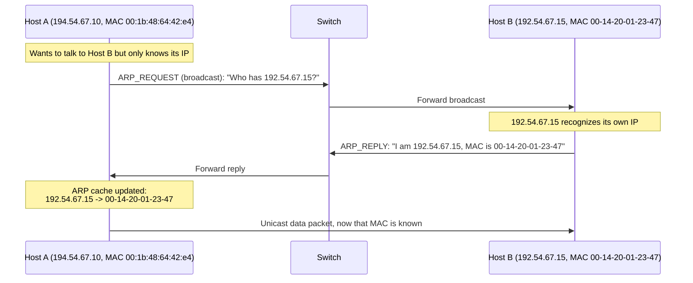
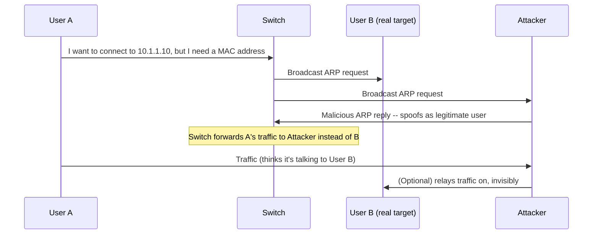
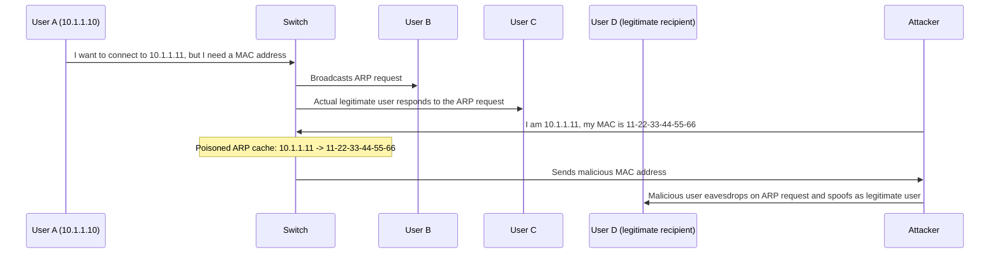
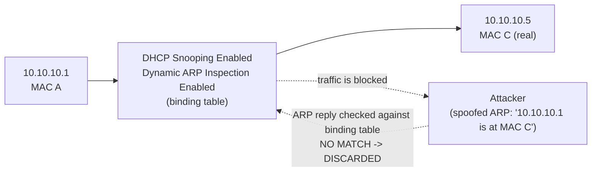

# 04 — ARP Poisoning

## Table of Contents
- [What Is ARP](#what-is-arp)
- [How ARP Spoofing Works](#how-arp-spoofing-works)
- [Threats of ARP Poisoning](#threats-of-arp-poisoning)
- [ARP Spoofing / Poisoning Tools](#arp-spoofing--poisoning-tools)
- [ARP Spoofing Detection Tools](#arp-spoofing-detection-tools)
- [Defending Against ARP Poisoning](#defending-against-arp-poisoning)

---

## What Is ARP

**Address Resolution Protocol (ARP)** is a stateless TCP/IP protocol responsible for mapping a known IP address to its corresponding MAC (hardware) address at the data-link layer. Any host can obtain the MAC address of any other device on the network simply by using ARP — the host sending a packet must include the destination MAC address in the frame, so it first has to look that address up. The OS maintains an **ARP table** (built from responses to ARP requests) that maps IP addresses to their corresponding MAC addresses.

### The ARP resolution process



**Step by step:**
1. The source machine generates an ARP request packet containing its own source MAC, source IP, and the destination IP, and sends it to the switch.
2. Every device on the network receives the broadcast ARP request and compares the destination IP in the packet against its own IP.
3. Only the system whose IP matches replies with an ARP reply packet.
4. The switch reads the reply's MAC address, adds the entry to its own MAC (CAM) table, and forwards the reply back to the requester.
5. The requesting machine updates its ARP cache with the target's IP-to-MAC mapping, and the two hosts can now communicate directly.

**Example ARP cache** (after resolution):

| Interface | Internet Address | Physical Address | Type |
|---|---|---|---|
| 10.10.1.11 | 10.10.1.2 | 02-15-5d-42-11-89 | dynamic |
| | 10.10.1.13 | 02-15-5d-42-11-89 | dynamic |
| | 10.10.1.255 | ff-ff-ff-ff-ff-ff | static |
| | 224.0.0.251 | 01-00-5e-00-00-fb | static |
| | 224.0.0.252 | 01-00-5e-00-00-fc | static |

(`arp -a` on Windows displays exactly this table.)

---

## How ARP Spoofing Works

**ARP is stateless and unauthenticated by design** — a machine can send an unsolicited ARP reply at any time, and the receiving host will accept and cache it *even if it never sent a corresponding request*. This single design flaw is the entire basis of ARP spoofing: no system verifies that a responding host is actually who it claims to be.

**ARP spoofing** constructs a large number of forged ARP request and reply packets to overload a switch. When an attacker exploits this to create malformed ARP replies containing spoofed MAC and IP addresses, the victim's computer blindly accepts the spoofed entry into its ARP table. Once the ARP table is flooded with spoofed replies, the switch is set to *forwarding mode*, and the attacker can intercept all data flowing from the victim's machine without the victim ever noticing. Flooding a target computer's ARP cache with forged entries this way is also called **ARP poisoning**, and it acts as an intermediary for further attacks — DoS, MITM, and session hijacking.

**In an Ethernet LAN**, when a legitimate user initiates a session with another user on the same Layer-2 broadcast domain, the switch broadcasts a request for the recipient's IP address while the sender waits for a reply with the recipient's MAC address. An attacker eavesdropping on this unprotected Layer-2 domain can respond to the broadcast ARP request themselves — spoofing the intended recipient's IP.



**Threats this enables** (as an MITM position):

| Threat | Description |
|---|---|
| **Manipulating Data** | ARP spoofing allows attackers to capture and modify data, or stop the flow of traffic entirely |
| **Man-in-the-Middle Attack** | Attacker performs an MITM attack by sitting between the victim and the server |
| **Data Interception** | Intercepts IP addresses, MAC addresses, and VLANs connected to the switch in a network |
| **Connection Hijacking** | Network hardware addresses are supposed to be unique and fixed, but a host may move when its hostname changes and use another protocol — an attacker can manipulate a client's connection to take complete control |
| **Connection Resetting** | Wrong routing information could be transmitted due to a hardware/software error; if a host fails to initiate a connection, that host should inform the Address Resolution module to delete its information. Received data from that host will reset a connection timeout in the ARP entry used to transmit data to that host — this entry is deleted if the host does not send any information for a certain period |
| **Stealing Passwords** | An attacker uses forged ARP replies and tricks target hosts into sending sensitive information such as usernames and passwords |
| **DoS Attack** | Links multiple IP addresses to a single MAC address of the target host that is intended for different IP addresses, which will be overloaded with a huge amount of traffic |

ARP spoofing succeeds by changing the IP address of the attacker's computer to that of the target computer's IP in the ARP cache. A forged ARP request and reply can find a place in the target's ARP cache in this process — as the ARP reply has been forged, the destination computer (target) sends frames to the attacker's computer, where the attacker can modify the frames before sending them to the source machine (User A) in an MITM attack. The attacker can also launch a DoS attack by associating a non-existent MAC address with the IP of the gateway; alternatively, the attacker may sniff the traffic passively and then forward it to the target destination.



---

## Threats of ARP Poisoning

With the help of ARP poisoning, an attacker can use fake ARP messages to divert all communications between two machines so that all traffic redirects via the attacker's PC. The threats of ARP poisoning include:

- **Packet Sniffing** — Sniffs traffic over a network or a part of the network.
- **Session Hijacking** — Steals valid session information and uses it to gain unauthorized access to an application.
- **VoIP Call Tapping** — Uses port mirroring, which allows the VoIP call tapping unit to monitor all network traffic and pick only the VoIP traffic to record, by MAC address.

---

## ARP Spoofing / Poisoning Tools

### `arpspoof`
- **Source:** [linux.die.net](https://linux.die.net) (part of the `dsniff` suite)
- **Function:** Redirects packets from a target host (or all hosts) on the LAN that are intended for another host on the LAN, by forging ARP replies. This is an extremely effective way of sniffing traffic on a switch.

**Syntax:**
```bash
arpspoof -i [Interface] -t [Target Host]
```

**Example from the lab — poisoning one direction:**
```bash
arpspoof -i eth0 -t 10.10.1.2 10.10.1.11
```
Output (each line is a forged ARP reply telling `10.10.1.2` that `10.10.1.11` lives at the attacker's MAC):
```
[root@parrot]-[/home/attacker]
#arpspoof -i eth0 -t 10.10.1.2 10.10.1.11
2:15:5d:42:11:89 2:15:5d:42:11:87 0806 42: arp reply 10.10.1.11 is-at 2:15:5d:42:11:89
2:15:5d:42:11:89 2:15:5d:42:11:87 0806 42: arp reply 10.10.1.11 is-at 2:15:5d:42:11:89
2:15:5d:42:11:89 2:15:5d:42:11:87 0806 42: arp reply 10.10.1.11 is-at 2:15:5d:42:11:89
```
The victim's obtained ARP cache/MAC address for `10.10.1.11` is now replaced with that of the attacker's system.

**Reverse the command to intercept both directions** (so the attacker can relay/see replies both ways — the classic full MITM setup):
```bash
arpspoof -i eth0 -t 10.10.1.11 10.10.1.2
```
```
2:15:5d:42:11:89 0:15:5d:1:80:0 0806 42: arp reply 10.10.1.2 is-at 2:15:5d:42:11:89
2:15:5d:42:11:89 0:15:5d:1:80:0 0806 42: arp reply 10.10.1.2 is-at 2:15:5d:42:11:89
```

> In practice you run **both commands simultaneously** (typically in two terminals, or via `-t` targeting both hosts / using `ettercap`'s built-in bidirectional ARP poisoning) so that traffic flows victim → attacker → gateway → attacker → victim, with the attacker relaying packets in both directions while sniffing them.

### Habu
- **Source:** [github.com](https://github.com)
- A hacking toolkit providing commands for a wide range of attacks:
  - ARP poisoning and sniffing
  - DHCP discovery and starvation
  - Subdomain identification
  - Certificate cloning
  - TCP analysis (ISN, flags)
  - Username check on social networks
  - Web technology identification

**Example command:**
```bash
habu.arp.poison 10.10.1.11 10.10.1.13
```
Output:
```
[attacker@parrot]-[~]
$sudo su
[sudo] password for attacker:
[root@parrot]-[/home/attacker]
#habu.arp.poison 10.10.1.11 10.10.1.13
Ether / ARP is at 02:15:5d:64:8e:61 says 10.10.1.13
Ether / ARP is at 00:00:00:00:00:00 says 10.10.1.11
Ether / ARP is at 02:15:5d:64:8e:61 says 10.10.1.13
Ether / ARP is at 00:00:00:00:00:00 says 10.10.1.11
```

### Other ARP poisoning tools

| Tool | Source |
|---|---|
| bettercap | [github.com](https://github.com) |
| Ettercap | [ettercap-project.org](https://www.ettercap-project.org) |
| RITM | [github.com](https://github.com) |
| ARP Spoofer | [github.com](https://github.com) |
| larp | [github.com](https://github.com) |

---

## ARP Spoofing Detection Tools

| Tool | Source |
|---|---|
| **Capsa Portable Network Analyzer** | [colasoft.com](https://www.colasoft.com) |
| Wireshark | [wireshark.org](https://www.wireshark.org) |
| OpUtils | [manageengine.com](https://www.manageengine.com) |
| netspionage | [github.com](https://github.com) |
| NetProbe | [github.com](https://github.com) |
| ARP-GUARD | [arp-guard.com](https://arp-guard.com) |

**Capsa Portable Network Analyzer** is a portable network performance analysis and diagnostics tool with packet capture/analysis capability and an easy-to-use interface, purpose-built to help security professionals quickly detect ARP poisoning and ARP flooding attacks and locate the source of the attack.

---

## Defending Against ARP Poisoning

### Dynamic ARP Inspection (DAI)

**DAI** is a Cisco security feature that validates ARP packets on a VLAN. When DAI activates on a VLAN, **all ports on the VLAN are considered untrusted by default**. DAI validates ARP packets using a **DHCP snooping binding table** — a table of MAC addresses, IP addresses, and VLAN/interfaces built by listening to DHCP message exchanges. This means **DHCP snooping must be enabled *before* DAI can be enabled**; otherwise, establishing a legitimate connection between VLAN devices based on ARP is not possible, and a self-imposed DoS may result on any device in that VLAN.

To validate an ARP packet, DAI checks the packet's IP-address-to-MAC-address binding against the stored DHCP snooping binding table before forwarding it to its destination. If any invalid IP address binds a MAC address, DAI will discard the ARP packet — eliminating the risk of MITM attacks. DAI ensures the relay of only valid ARP requests and responses.

> If your hosts use **static** IP addresses, DHCP snooping won't be possible (there's nothing to snoop), and dynamic ARP inspection cannot run either — in that case, you must configure **static IP-to-MAC mappings/ACLs** to prevent an ARP poisoning attack instead.



### Full Cisco IOS walkthrough: DHCP Snooping + Dynamic ARP Inspection

**1. Enable DHCP snooping in global configuration mode:**
```cisco
Switch(config)# ip dhcp snooping
```

**2. Enable DHCP snooping for a specific VLAN:**
```cisco
Switch(config)# ip dhcp snooping vlan 10
Switch(config)# ^Z
```

**3. View DHCP snooping status:**
```cisco
Switch# show ip dhcp snooping
Switch DHCP snooping is enabled
DHCP snooping is configured on following VLANs: 10
DHCP snooping is operational on following VLANs: 10
DHCP snooping is configured on the following L3 Interfaces:
```

DHCP snooping trust/rate is configured on the following interfaces:
```
Interface        Trusted    Rate limit (pps)
---------------   -------    -------
```

> If the switch is functioning only at Layer 2, apply `ip dhcp snooping trust` to the layer-2 interfaces designated as uplink/trusted interfaces, so the switch knows DHCP responses on those ports are legitimate.

**4. View the DHCP snooping binding table** (the trusted DHCP clients and their respective IP addresses):
```cisco
Switch# show ip dhcp snooping binding
```
Example output:
```
MacAddress          IpAddress    Lease(sec)  Type            VLAN  Interface
-----------------   -----------  ----------  --------------  ----  --------------
1a:12:3b:2f:df:1c    10.10.10.8   125864      dhcp-snooping   4     FastEthernet0/3
Total number of bindings: 1
```

**5. After establishing the binding table, configure ARP inspection for a VLAN:**
```cisco
Switch(config)# ip arp inspection vlan 10
Switch(config)# ^Z
```

**Configure ARP inspection for a range of VLANs** (two equivalent syntaxes):
```cisco
Switch(config)# ip arp inspection vlan 10, 11, 12, 13
```
or
```cisco
Switch(config)# ip arp inspection vlan 10-13
```

**6. View ARP inspection status:**
```cisco
Switch# show ip arp inspection
Source Mac Validation      : Disabled
Destination Mac Validation : Disabled
IP Address Validation      : Disabled

Vlan    Configuration    Operation    ACL Match    Static ACL
----    -------------    ---------    ---------    ----------
10      Enabled          Active

Vlan    ACL Logging    DHCP Logging    Probe Logging
----    -----------    ------------    -------------
10      Deny           Off

Vlan    Forwarded    Dropped    DHCP Drops    ACL Drops
----    ---------    -------    ----------    ---------
10      0            0          0             0

Vlan    DHCP Permits    ACL Permits    Probe Permits    Source MAC Failures
----    ------------    -----------    -------------    --------------------
10      0               0              0                0

Vlan    Dest MAC Failures    IP Validation Failures    Invalid Protocol Data
----    -----------------    -----------------------    ----------------------
10      0                    0                          0
```

For extra security, add address-type validation with:
```cisco
Switch(config)# ip arp inspection validate {src-mac | dst-mac | ip}
```

### Real attack scenario walked through the DAI log

Assume an attacker with source IP `192.168.10.1` connects to VLAN 10 on interface `FastEthernet0/5` and sends ARP replies pretending to be the default router, attempting an MITM attack. The switch with DAI enabled inspects these reply packets by comparing them against the DHCP snooping binding table. It tries to find an entry for source IP `192.168.10.1` on port `FastEthernet0/5`. If there is no entry, **the switch discards these packets** and logs:

```
%SW_DAI-4-DHCP_SNOOPING_DENY: 1 Invalid ARPs (Res) on Fa0/5, vlan 10.
([0013.6050.acf4/192.168.10.1/ffff.ffff.ffff/192.168.10.1/05:37:31 UTC Tue Apr 16 2024])
```

If discarding starts, the drop count increases — visible immediately in `show ip arp inspection` output:
```cisco
Switch(config)# show ip arp inspection
Source Mac Validation      : Disabled
Destination Mac Validation : Disabled
IP Address Validation      : Disabled

Vlan    Configuration    Operation    ACL Match    Static ACL
----    -------------    ---------    ---------    ----------
10      Enabled          Active

Vlan    ACL Logging    DHCP Logging    Probe Logging
----    -----------    ------------    -------------
10      Deny           Off

Vlan    Forwarded    Dropped    DHCP Drops    ACL Drops
----    ---------    -------    ----------    ---------
10      30           5          5             0

Vlan    DHCP Permits    ACL Permits    Probe Permits    Source MAC Failures
----    ------------    -----------    -------------    --------------------
10      30              0              0                0

Vlan    Dest MAC Failures    IP Validation Failures    Invalid Protocol Data
----    -----------------    -----------------------    ----------------------
10      0                    0                          0
```

---

**Previous:** [← 03 — DHCP Attacks](03-dhcp-attacks.md) · **Next:** [05 — Spoofing Attacks →](05-spoofing-attacks.md)
