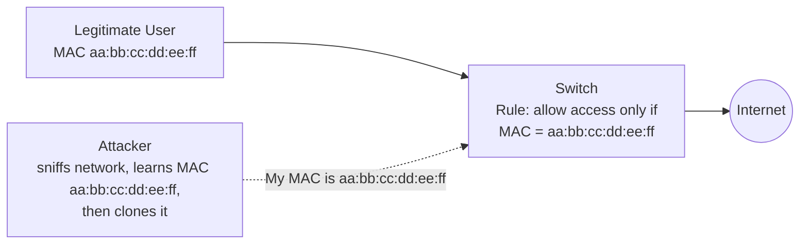
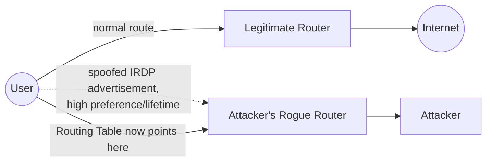
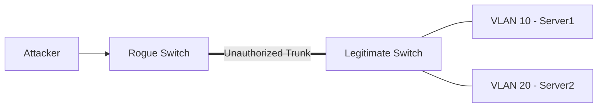
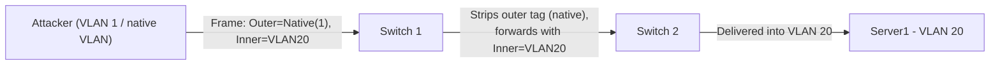
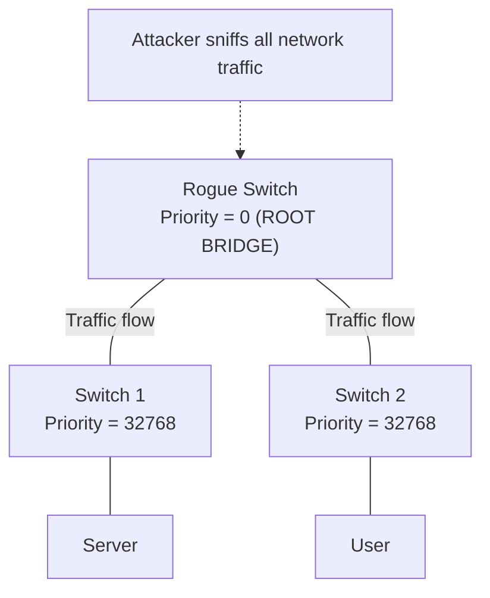
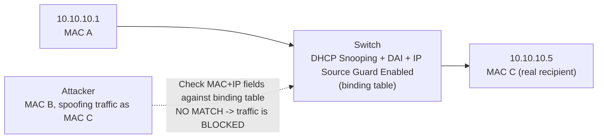

# 05 — Spoofing Attacks

## Table of Contents
- [MAC Spoofing / Duplicating](#mac-spoofing--duplicating)
- [MAC Spoofing on Windows 11](#mac-spoofing-on-windows-11)
- [MAC Spoofing Tools](#mac-spoofing-tools)
- [IRDP Spoofing](#irdp-spoofing)
- [VLAN Hopping](#vlan-hopping)
- [STP Attack](#stp-attack)
- [Defending Against MAC Spoofing](#defending-against-mac-spoofing)

Besides ARP spoofing, an attacker can use MAC spoofing, IRDP spoofing, VLAN hopping, and STP attacks to sniff the traffic of a target network. This section explains each technique and how to defend against it.

---

## MAC Spoofing / Duplicating

**MAC duplicating** refers to spoofing a MAC address with the MAC address of a legitimate user on the network. The attack involves sniffing a network for the MAC addresses of clients who are actively associated with a switch port, then re-using one of those addresses. By listening to the network, a malicious user can intercept and use a legitimate user's MAC address to receive all the traffic destined for that user — allowing an attacker to gain access to the network and take over someone's identity on it.



> **Note:** This technique can be used to bypass wireless access points' MAC filtering.

---

## MAC Spoofing on Windows 11

### Method 1 — NIC's built-in "clone MAC address" feature (if supported)

1. Click **Start**, search for **Control Panel** and open it, then navigate to **Network and Internet → Network and Sharing Center**.
2. Click **Ethernet**, then click **Properties** in the Ethernet Status window.
3. In the Ethernet Properties window, click the **Configure** button, then open the **Advanced** tab.
4. Under the **Property** section, browse to **Network Address** and click on it.
5. On the right-hand side, under **Value**, type the new MAC address you'd like to assign and click **OK**.
   > **Note:** Enter the MAC address without any `:` characters between octets.
6. Type `ipconfig /all` or `net config rdr` in the command prompt to verify the change took effect.
7. If the change is visible, **reboot** the system — otherwise, fall back to Method 2 (registry edit).

### Method 2 — Registry edit (if the NIC has no "Network Address" property)

1. Press **Win + R**, type `regedit` to open the Registry Editor.
2. Navigate to:
   ```
   HKEY_LOCAL_MACHINE\SYSTEM\CurrentControlSet\Control\Class\{4d36e972-e325-11ce-bfc1-08002be10318}
   ```
   and double-click to expand the tree.
3. Four-digit sub-keys representing individual network adapters will be listed (starting with `0000`, `0001`, `0002`, etc.).
4. Search for the correct sub-key by checking each one's `DriverDesc` value until you find the interface you want.
5. Right-click the appropriate sub-key and add a new string value named `NetworkAddress` (type `REG_SZ`) to hold the new MAC address.
6. Right-click the `NetworkAddress` string value on the right side and select **Modify…**
7. In the **Edit String** dialog, enter the new MAC address in the **Value data** field, and click **OK**.
8. **Disable and then re-enable** the network interface you changed, or reboot the system, for the change to take effect.

---

## MAC Spoofing Tools

| Tool | Source |
|---|---|
| Technitium MAC Address Changer (TMAC) | [technitium.com](https://technitium.com) |
| MAC Address Changer | [appsvoid.com](https://appsvoid.com) — lightweight app to change/spoof a network adapter's MAC address while sniffing; generates a randomized MAC and can restore the original if required |
| SMAC | [smac-tool.com](https://smac-tool.com) |
| Change MAC Address | [lizardsystems.com](https://lizardsystems.com) |
| Mac Changer | [github.com](https://github.com) |
| AMC (Automatic Media Access Control [MAC] Address Spoofing Tool) | [github.com](https://github.com) |

---

## IRDP Spoofing

**ICMP Router Discovery Protocol (IRDP)** is a routing protocol that lets a host discover the IP addresses of active routers on its subnet by listening for router advertisement and solicitation messages. The attacker sends a spoofed router advertisement message to the host on the subnet, causing it to change its default router to whatever machine the attacker chooses. Since **IRDP does not require any authentication**, the target host will prefer the attacker-supplied default route over the one the DHCP server actually provided — accomplished by setting the preference level and lifetime of the route at high values so target hosts choose it as the preferred route.

This attack succeeds when the attacker launching it is on the **same network** as the victim. If a Windows system configured as a DHCP client sees only one router advertisement, it checks whether the IP source address is within its subnet; if so, it adds the default route entry — otherwise it ignores the advertisement.



**What this enables:**

| Capability | Description |
|---|---|
| **Passive Sniffing** | In a switched network, the attacker spoofs IRDP traffic to re-route the outbound traffic of target hosts through the attacker's own machine |
| **MITM** | Once sniffing starts, the attacker acts as a proxy between the victim and destination, and can modify the traffic in transit |
| **DoS** | IRDP spoofing allows remote attackers to add wrong route entries into the victim's routing table, causing a denial of service |

**Defense:** Prevent IRDP spoofing attacks by disabling IRDP on hosts, if the operating system permits it.

---

## VLAN Hopping

**VLAN hopping** is a network attack method used to gain unauthorized access to resources on a virtual LAN — the main goal is to reach traffic flowing in other VLANs present on the same physical network, which would otherwise be inaccessible. Networks with poor VLAN implementations or misconfigurations allow attackers to bypass network-segmentation controls. Once inside another VLAN, an attacker can steal sensitive information such as passwords, modify/corrupt/delete data, install malicious code, or spread malware throughout the network.

There are two primary methods of VLAN hopping:

### 1. Switch Spoofing

The attacker connects a **rogue switch** into the network and tricks a legitimate switch into forming a trunk link with it. Once a trunk link is established, traffic from multiple VLANs flows through the rogue switch, letting the attacker sniff and view the content of every VLAN carried on that trunk. This attack only succeeds if the legitimate switch is configured to negotiate a trunk connection, or if the interface is set to `dynamic auto`, `dynamic desirable`, or `trunk` mode.



### 2. Double Tagging

The attacker adds and modifies **two 802.1Q VLAN tags** in a single Ethernet frame: an **inner** tag (the VLAN the attacker actually wants to reach) and an **outer** tag matching the trunk's native VLAN. When the first switch receives the frame, it strips off the outer tag (because it matches the native VLAN and native-VLAN traffic isn't re-tagged on egress) and forwards the frame — which still carries the *inner* tag — onto its trunk interfaces. The next switch in the path reads the *remaining* inner tag and delivers the frame into that VLAN. This lets the attacker jump from their own (native) VLAN into a victim VLAN in one direction only, and is possible only if the switch ports involved are configured to use the **native VLAN**.



---

## STP Attack

In a **Spanning Tree Protocol (STP) attack**, the attacker connects a rogue switch into the network specifically to manipulate STP's normal operation and sniff all the traffic flowing through it. STP is used in LAN-switched networks to remove potential loops while ensuring traffic follows an optimized path.

During STP operation, one switch in the network is elected the **root bridge**; every other switch connects to it via a selected root port (the port closest to the root bridge). The root bridge is elected using **Bridge Protocol Data Units (BPDUs)** — each BPDU carries a Bridge Identifier (BID), consisting of a **Bridge Priority** and the switch's MAC address. By default, the Bridge Priority is **32769**, and **the switch with the lowest BID wins the root-bridge election**.

If an attacker introduces a rogue switch configured with a **priority lower than any other switch on the network (e.g., priority 0)**, the rogue switch wins the root-bridge election, making it the new root bridge — and, because all traffic now flows through the root bridge by STP's own design, the attacker can sniff all traffic flowing through the network.



---

## Defending Against VLAN Hopping

### Defend Against Switch Spoofing
```cisco
switchport mode access
switchport mode nonegotiate
```
Explicitly configure ports as access ports and ensure that all access ports are configured to not negotiate trunks.

```cisco
switchport mode trunk
switchport mode nonegotiate
```
Ensure that all trunk ports are also configured to not negotiate trunks.

### Defend Against Double Tagging
```cisco
switchport access vlan 2
```
Specify a default VLAN, used if the interface stops trunking.

```cisco
switchport trunk native vlan 999
```
Ensure the native VLAN on all trunk ports is changed to an unused VLAN ID.

```cisco
vlan dot1q tag native
```
Ensure the native VLANs on all trunk ports are explicitly tagged.

### Additional VLAN hardening measures
- **Use Private VLANs** — configure private VLANs to isolate ports from each other on the same VLAN.
- **Regularly Audit and Monitor VLAN Configurations** — perform regular audits of VLAN and switch configurations to ensure compliance with security policies.

---

## Defending Against STP Attacks

Implement the following security features:

### BPDU Guard
Must be enabled on ports that should never receive a BPDU from their connected devices — this prevents transmission of BPDUs on PortFast-enabled ports. If BPDU guard is enabled on a port and an unauthorized switch connects to it, an authorized switch will be set to **errdisable** mode when a BPDU is received. Errdisable mode shuts the port down and disables it from sending or receiving any traffic.
```cisco
configure terminal
interface gigabitethernet slot/port
spanning-tree portfast bpduguard
```

### Root Guard
Root guard protects the root bridge and ensures that it remains the root in the STP topology. It forces interfaces to become **designated ports** (forwarding) to prevent the neighboring switches from becoming root switches. If a port enabled with root guard receives a superior BPDU, it's converted into a loop-inconsistent state (not errdisabled), protecting an STP topology change. This port remains inactive only for that specific switch/switches attempting to change the STP topology; the port stays down until the issue is resolved.
```cisco
configure terminal
interface gigabitethernet slot/port
spanning-tree guard root
```

### Loop Guard
Loop guard improves network stability by preventing it from bridging loops. It's generally used to protect against a malfunctioned switch.
```cisco
configure terminal
interface gigabitethernet slot/port
spanning-tree guard loop
```

### UDLD (Unidirectional Link Detection)
UDLD enables devices to detect the existence of unidirectional links, and further disables the affected interfaces in the network — these unidirectional links can otherwise cause STP topology loops.
```cisco
configure terminal
interface gigabitethernet slot/port
udld { enable | disable | aggressive }
```

**Additional recommendations:**
- **Deploy PortFast** on all access ports, to reduce the time spent in listening and learning STP states — but ensure BPDU Guard is enabled together with it, to mitigate the added risk.
- **Regularly update and patch network devices** to protect against known vulnerabilities.
- **Restrict physical access** to network ports and devices to prevent unauthorized STP configuration changes.
- **Network segmentation** — limit the scope of STP attacks by dividing larger broadcast domains into smaller, manageable segments.

---

## Defending Against MAC Spoofing

Detecting MAC spoofing starts with knowing all the legitimate MAC addresses on the network. The best way to defend against MAC address spoofing is to place the server behind the router, because routers depend only on IP addresses for communication in a network, whereas switches depend on MAC addresses for port-security interface configuration — a switch is another way to prevent MAC spoofing attacks. Once you enable the port-security command, you can specify the MAC address of the system connected to a specific port, and specify the action to be taken if a port-security violation occurs.

| Technique | Description |
|---|---|
| **DHCP Snooping Binding Table** | The DHCP snooping process filters untrusted DHCP messages and builds/binds a DHCP binding table containing the MAC address, IP address, lease time, binding type, VLAN number, and interface corresponding to untrusted interfaces of a switch. It acts as a firewall between untrusted hosts and DHCP servers, and differentiates between trusted and untrusted interfaces. |
| **Dynamic ARP Inspection** | Checks the IP–MAC address binding for each ARP packet in the network. While performing DAI, the system automatically drops invalid IP–MAC address bindings. |
| **IP Source Guard** | A security feature in switches that restricts IP traffic on untrusted Layer 2 ports by filtering traffic based on the DHCP snooping binding database. Prevents spoofing attacks when the attacker tries to spoof or use the IP address of another host. |
| **Encryption** | Encrypt communication between the access point and computer to prevent MAC spoofing by intercepting and manipulating traffic as legitimate devices — e.g., secure encryption protocols such as WPA3. |
| **Retrieval of MAC Address** | Always retrieve the MAC address directly from the NIC instead of retrieving it from the OS. |
| **Implementation of IEEE 802.1X Suites** | A network protocol for port-based Network Access Control (PNAC); its main purpose is to enforce access control at the point where a user joins the network. |
| **AAA (Authentication, Authorization, and Accounting)** | Use an AAA server mechanism to filter MAC addresses subsequently. |
| **Network Access Control (NAC)** | Use NAC systems to enforce security policies on devices attempting to access the network; can check for signs of MAC spoofing to prevent unauthorized access based on a wide range of criteria. |
| **Rate Limiting and Traffic Analysis** | Implement rate limiting on network devices to help mitigate the effects of MAC flooding attacks. |
| **Regular Network Audits and Security Assessments** | Regularly audit networks for unexpected devices, unexpected traffic patterns, and compliance with security policies to identify potential vulnerabilities and mitigate them before they are exploited. |
| **Port Security** | Configure port security on switches to limit the number of MAC addresses allowed on a single port, and specify the MAC addresses that can be permitted. |



---

**Previous:** [← 04 — ARP Poisoning](04-arp-poisoning.md) · **Next:** [06 — DNS Poisoning →](06-dns-poisoning.md)
