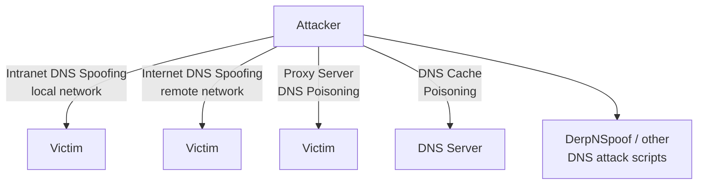
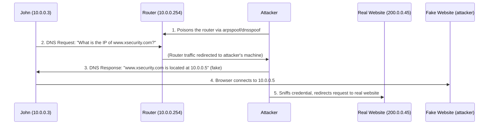
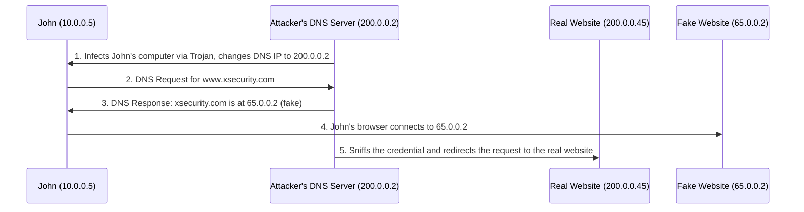
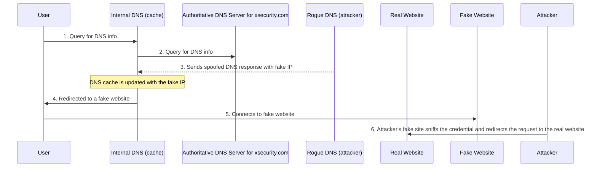

# 06 — DNS Poisoning

## Table of Contents
- [DNS Poisoning Techniques Overview](#dns-poisoning-techniques-overview)
- [Intranet DNS Spoofing](#intranet-dns-spoofing)
- [Internet DNS Spoofing](#internet-dns-spoofing)
- [Proxy Server DNS Poisoning](#proxy-server-dns-poisoning)
- [DNS Cache Poisoning](#dns-cache-poisoning)
- [SAD DNS Attack](#sad-dns-attack)
- [DNS Poisoning Tools](#dns-poisoning-tools)
- [Defending Against DNS Spoofing](#defending-against-dns-spoofing)

---

## DNS Poisoning Techniques Overview

**DNS** is the protocol that translates a human-readable domain name (e.g., `www.eccouncil.org`) into its numeric IP address (e.g., `208.66.172.56`), using distributed DNS tables that map names to addresses.

**DNS poisoning** — also known as **DNS spoofing** — is a technique that tricks a DNS server into believing it has received authentic information when, in reality, it has not. The attacker manipulates DNS table entries so that legitimate web addresses are converted into the numeric IP address **of a server the attacker controls**, instead of the real destination.

When a victim tries to access a website, the manipulated DNS entry redirects the victim's system to the attacker's server. The attacker can create fake DNS entries for the target site with the same name as the legitimate one, pointing at a malicious server containing attacker content. The victim connects to the attacker's server without realizing it, and once connected, the attacker can compromise the victim's system and steal data.

DNS poisoning is possible using the following techniques:

1. **Intranet DNS Spoofing** (local network)
2. **Internet DNS Spoofing** (remote network)
3. **Proxy Server DNS Poisoning**
4. **DNS Cache Poisoning**



---

## Intranet DNS Spoofing

In this technique, the attacker's system must be connected to the **local area network (LAN)** and able to sniff packets — it works against switches with **ARP poison routing**. To perform this attack, the attacker must be connected to the LAN and able to sniff the traffic/packets. An attacker who succeeds in sniffing the transaction ID of a DNS request from a client on the intranet can send a malicious reply to the sender *before the actual DNS server responds*.



In the diagram: the attacker poisons the router by running `arpspoof`/`dnsspoof` to redirect DNS requests of clients toward the attacker's machine. When a client (John) sends a DNS request, the poisoned router sends the DNS request packet to the attacker's machine instead. Upon receiving the DNS request, the attacker sends a **fake DNS response** that redirects the client to a fake website the attacker set up. The attacker owns the fake website and can see all the information the client submits to it — enabling the attacker to sniff sensitive data such as passwords. The attacker then retrieves what they need and redirects the client on to the *real* website, so the victim doesn't notice anything is wrong.

---

## Internet DNS Spoofing

Internet DNS spoofing is also known as **remote DNS poisoning**. Attackers can perform DNS spoofing attacks on a single victim or multiple victims anywhere in the world. To perform this attack, the attacker sets up a rogue DNS server with a static IP address.

Attackers perform Internet DNS spoofing with the help of **Trojans** — when the victim's system connects to the internet, the Trojan changes the primary DNS entries of the victim's computer to a fake IP address that resolves to the attacker's system. This is an MITM attack that replaces the victim's DNS entries. Once this happens, the victim's traffic redirects to the attacker's system, letting the attacker easily sniff the victim's confidential data.



The attacker infects John's machine with a Trojan that changes its DNS IP address to that of the attacker's own DNS server. At that point, the attacker can easily sniff the victim's confidential information.

---

## Proxy Server DNS Poisoning

In this technique, the attacker sends a Trojan to the victim's machine that changes the victim's **proxy server settings** in the browser (e.g., Internet Explorer) to point at the attacker's own proxy server. The attacker also configures a fraudulent DNS server and makes its IP address the primary DNS entry in that proxy server. The proxy serves as a proxy between a PC and redirects the victim's traffic to a fake website, where the attacker can sniff the victim's confidential information before redirecting the request on to the real website.

```mermaid
sequenceDiagram
    participant John
    participant ProxyServer as Attacker's Proxy Server (200.0.0.2)
    participant FakeSite as Fake Website (65.0.0.2)
    participant RealSite as Real Website (200.0.0.45)

    ProxyServer->>John: 1. Infects John's computer, changes IE proxy settings to 200.0.0.2
    John->>ProxyServer: 2. All of John's web requests go through attacker's machine
    ProxyServer->>FakeSite: 3. Sends John's request to the fake website
    ProxyServer->>John: 4. Attacker's fake website is redirected; credential sniffed, request forwarded to real site
```

---

## DNS Cache Poisoning

**DNS cache poisoning** refers to altering or adding forged records into a DNS resolver's cache, so that a DNS query is redirected to a malicious site. The DNS system uses **cache memory** to hold recently resolved domain names and their corresponding IP addresses. When a user request is received, the DNS resolver first checks its cache; if the system finds the domain name that's requested in the cache, the resolver will quickly send its respective IP address — reducing the traffic and time needed for repeated DNS resolution.

Attackers target and change or add entries to this DNS cache. **If the DNS resolver cannot validate that the DNS responses came from an authoritative source, it will cache the incorrect entries locally and serve them to any user who makes the same request.** The attacker replaces the user-requested IP address with a fake IP; when the user next requests that domain name, the DNS resolver checks the entry in its cache, finds the matched (poisoned) entry, and redirects the victim to the attacker's fake server instead of the intended real server.



---

## SAD DNS Attack

**SAD DNS** is a newer variant of DNS cache poisoning, in which an attacker injects harmful DNS records into a DNS cache to divert all traffic toward their own servers. With this technique, attackers attempt to mislead client browsers toward fake websites infected with malicious files instead of the legitimate website. Attackers exploit **side channels** — flaws such as `dnsmasq`, `unbound`, and `BIND` in the latest OSes and obsolete DNS software used to resolve DNS queries — to perform SAD DNS attacks.

---

## DNS Poisoning Tools

### DerpNSpoof
- **Source:** [github.com](https://github.com)
- A DNS poisoning tool that assists in spoofing the DNS query packet of a certain IP address or a group of hosts on the network. Using this tool, attackers can create a list of fake DNS records and load it while running the tool, redirecting the victim to another website.

**Example usage (from the courseware terminal capture):**
```bash
python3 DerpNSpoof.py -requirements.txt
```
```
[+] Options to use:
  -ip     - Spoof the DNS query packets of a certain IP address
  -all    - Spoof the DNS query packets of all hosts
[+] Examples:
  # python3 DerpNSpoof.py 192.168.1.20 myfile.txt
  # python3 DerpNSpoof.py all myfile.txt
[+] Usage: <victim_ip> <records_file>
```

### Additional DNS poisoning tools

| Tool | Source |
|---|---|
| deserter | [github.com](https://github.com) |
| PolarDNS | [github.com](https://github.com) |
| Ettercap | [ettercap-project.org](https://www.ettercap-project.org) |
| Evilgrade | [github.com](https://github.com) |
| DNS Goisoner | [github.com](https://github.com) |

---

## Defending Against DNS Spoofing

Major DNS implementations have reported spoofing attacks, and this vulnerability continues to affect a large number of organizations — often due to a lack of care/awareness when performing DNS queries, which allows attackers to spoof DNS responses. The following is a comprehensive list of countermeasures:

1. Implement **Domain Name System Security Extensions (DNSSEC)**.
2. Use **Secure Socket Layer (SSL)** for securing the traffic.
3. Resolve all DNS queries to a local DNS server.
4. Block DNS requests to external servers.
5. Configure a firewall to restrict external DNS lookup.
6. Implement an **intrusion detection system (IDS)** and deploy it correctly.
7. Configure the DNS resolver to use a new random source port for each outgoing query.
8. Restrict the DNS recursing service, full or partial, to authorized users only.
9. Use **DNS Non-Existent Domain (NXDOMAIN)** rate limiting.
10. Secure internal machines.
11. Use static ARP and IP tables.
12. Use Secure Shell (SSH) encryption.
13. Do not allow outgoing traffic to use UDP port 53 as a default source port.
14. Audit the DNS server regularly to remove vulnerabilities.
15. Use sniffing detection tools.
16. Do not open suspicious files.
17. Always use trusted proxy sites.
18. If a company handles its own resolver, it should be kept private and well protected.
19. Randomize source and destination IP addresses.
20. Randomize query IDs.
21. Randomize the case in name requests (0x20 encoding — see below).
22. Use Public Key Infrastructure (PKI) to protect the server.
23. Maintain a single or specific range of IP addresses to log into systems.
24. Implement packet filtering for both inbound and outbound traffic.
25. Restrict DNS zone transfers to a limited set of IP addresses.
26. Employ **DNS Cookie (RFC 7873)** or deactivate departing ICMP packets to prevent SAD DNS attacks.
27. Use 0x20 encoding and DNS cookies as additional message security.
28. Reduce the timeout period for outstanding queries to prevent SAD DNS attacks.
29. Update DNS servers to the latest patches to prevent breaches.
30. Use **Remote Name Daemon Control (RNDC)** keys if responses are to be made on port 53.
31. Ensure that "Hosts" file resolution is disabled on the clients and servers.
32. Configure STUB zones for frequently accessed domains.
33. Implement robust password policies for users managing DNS records.
34. Use DNS resolvers that support security features such as **DNS-over-HTTPS (DoH)** or **DNS-over-TLS (DoT)**, which encrypt DNS queries and prevent eavesdropping/manipulation.
35. Regularly update the DNS server software to protect against known vulnerabilities that could be exploited to conduct spoofing attacks.
36. Configure ACLs on DNS servers to allow queries only from trusted sources.
37. Ensure that the DNS software uses secure random number generation for transaction IDs.
38. Implement a DNS firewall solution or subscribe to a protective DNS service to filter traffic.

---

**Previous:** [← 05 — Spoofing Attacks](05-spoofing-attacks.md) · **Next:** [07 — Sniffing Tools →](07-sniffing-tools.md)
