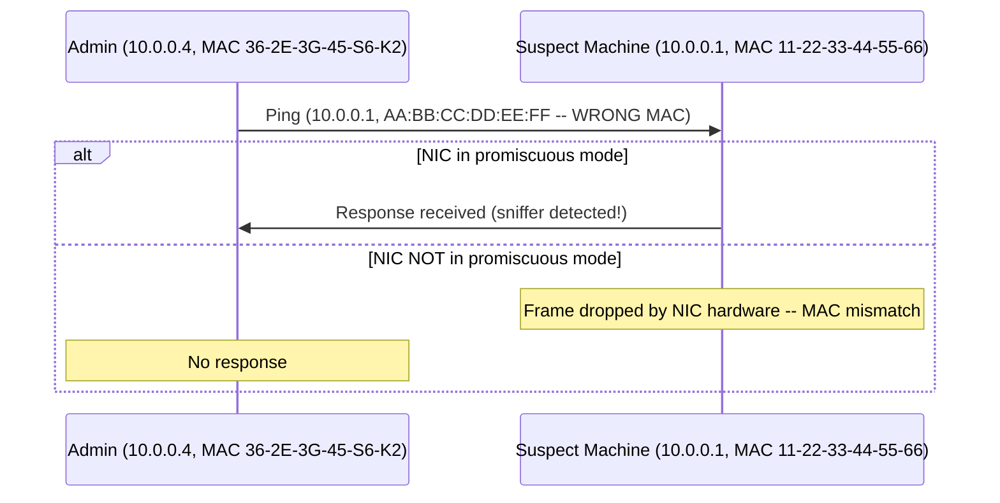
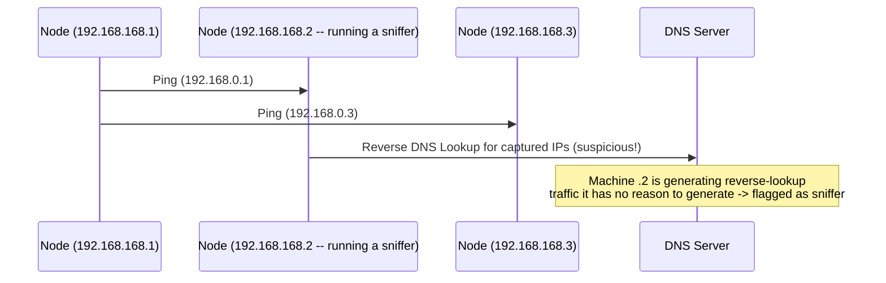
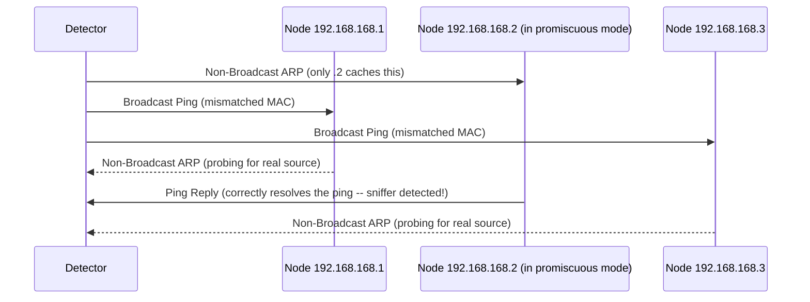

# 08 — Sniffing Countermeasures & Detection

## Table of Contents
- [General Sniffing Countermeasures](#general-sniffing-countermeasures)
- [How to Detect Sniffing](#how-to-detect-sniffing)
- [Sniffer Detection: Ping Method](#sniffer-detection-ping-method)
- [Sniffer Detection: DNS Method](#sniffer-detection-dns-method)
- [Sniffer Detection: ARP Method](#sniffer-detection-arp-method)
- [Promiscuous Detection Tools](#promiscuous-detection-tools)
- [Module Summary](#module-summary)

It's very difficult to detect a passive sniffer, especially one running on a shared Ethernet connection with no active footprint. This chapter covers the defensive posture as a whole — hardening measures to prevent sniffing from working in the first place, and detection techniques to catch an active sniffer that's already on the network.

---

## General Sniffing Countermeasures

1. Restrict physical access to network media, to ensure a packet sniffer cannot be installed.
2. Use end-to-end encryption to protect confidential information.
3. Permanently add the MAC address of the gateway to the ARP cache.
4. Use static IP addresses and static ARP tables to prevent attackers from adding spoofed ARP entries for machines in the network.
5. Turn off network identification broadcasts and, if possible, restrict the network to authorized users only, to protect the network from being discovered with sniffing tools.
6. Use IPv6 instead of IPv4, as IPsec implementation is optional in IPv4 but mandatory in IPv6.
7. Use encrypted sessions such as SSH instead of Telnet, Secure Copy (SCP) instead of FTP, and SSL for email connections, to protect wireless network users against sniffing attacks.
8. Use HTTPS instead of HTTP to protect usernames and passwords.
9. Use a switch instead of a hub, as a switch delivers data only to the intended recipient.
10. Use Secure File Transfer Protocol (SFTP) instead of FTP for the secure transfer of files.
11. Use PGP and S/MIME, VPN, IPsec, SSL/TLS, SSH, and One-Time Passwords (OTPs).
12. Use POP2 or POP3 instead of POP to download emails from mail servers.
13. Use SNMPv3 instead of SNMPv1 or SNMPv2 to manage networked devices.
14. Always encrypt wireless traffic with a strong encryption protocol such as WPA2 or WPA3.
15. Retrieve MAC addresses directly from NICs instead of from the OS — this prevents MAC address spoofing.
16. Use tools to determine if any NICs are running in promiscuous mode.
17. Use access-control lists (ACLs) to allow access only to a fixed range of trusted IP addresses in a network.
18. Change default passwords to complex passwords.
19. Avoid broadcasting session set identifiers (SSIDs).
20. Implement a MAC filtering mechanism on the router.
21. Implement network scanning and monitoring tools to detect malicious intrusions, rogue devices, and sniffers connected to the network.
22. Avoid accessing unsecured networks and open Wi-Fi networks.
23. Use VLANs and other network-segmentation techniques to divide the network into smaller, secure segments — this limits the scope of where sniffers can operate effectively.
24. Regularly monitor and audit network traffic for unusual patterns that may indicate sniffing activities.
25. Use VPNs to create a secure tunnel for data transmission over public networks — this helps protect sensitive data from potential sniffers.
26. Use IDS/IPS to detect and possibly prevent activities that could indicate sniffing or other malicious activities.
27. Regularly audit network traffic logs for unusual activities; ensure logging is enabled and comprehensive.

---

## How to Detect Sniffing

Promiscuous mode allows a network device to intercept and read every packet that arrives in its entirety — it is not easy to detect a sniffer on the network because it only captures data and does not transmit anything, so it leaves no trace on the wire. **Standalone sniffers are especially difficult to detect** precisely because they never transmit data.

Three broad detection strategies:

| Strategy | How It Helps |
|---|---|
| **Check the devices running in promiscuous mode** | You need to check which machines are running in promiscuous mode, since that's the mode that allows a device to intercept and read every network packet that arrives in its entirety |
| **Run IDS** | Run IDS and see if the MAC address of any of the machines has changed (example: a router's MAC address changing unexpectedly); an IDS can alert the administrator about suspicious activities, such as sniffing or MAC spoofing |
| **Run network tools** | Network tools such as Capsa Portable Network Analyzer monitor the network for strange packets. Enables you to collect, consolidate, centralize, and analyze traffic data across different network resources and technologies |

The **reverse DNS lookup method** helps detect non-standalone sniffers. There are many tools available, such as **Nmap**, to use for detecting promiscuous mode.

---

## Sniffer Detection: Ping Method

To detect a sniffer on a network, identify the system on the network that's running in promiscuous mode — the ping method is useful for detecting a system running in promiscuous mode, which in turn helps detect sniffers installed on the network.

**Mechanism:** send a ping request to the suspected machine, using its correct IP address but an **incorrect MAC address**. A normal (non-promiscuous) NIC will reject this frame at the hardware level, because the MAC doesn't match — so the machine never even sees the ping, and doesn't respond. A NIC in **promiscuous mode**, however, doesn't perform that MAC filtering, so it will accept and respond to the ping regardless of the (wrong) destination MAC. **This response is what identifies the sniffer.**



---

## Sniffer Detection: DNS Method

The **DNS method** is essentially the reverse of the ping method — sniffers using reverse DNS lookups actually *increase* network traffic, and that increase is the tell. Most sniffers perform **reverse DNS lookups** to identify the machine from its captured IP addresses; a machine generating reverse DNS lookup traffic that it has no legitimate reason to generate is very likely running a sniffer.

**Mechanism:** send an ICMP request to a non-existing IP address (locally or remotely) while monitoring the organization's DNS server for incoming reverse DNS lookups. The computer performing the reverse DNS lookup on that made-up address is thereby identified as hosting a sniffer.



For local detection, configure the detector in promiscuous mode and send an ICMP request to a non-existing IP address; if the system receives a response, you can identify the responding machine as performing reverse DNS lookups on the local machine — i.e., running a sniffer.

---

## Sniffer Detection: ARP Method

This technique sends a **non-broadcast ARP** to all nodes on the network. Since the ARP is not broadcast, only the node running in promiscuous mode will cache the local ARP information (source IP + MAC) from it. That node will then broadcast a ping message on the network — using the correct local IP address but a *different* MAC address than the one it just cached. The only machine that has the correct information about who's actually sending these ping requests (because it cached the earlier non-broadcast ARP) is the machine in promiscuous mode, so **only it** will be able to correctly respond to your broadcast ping. All the remaining machines will send out an ARP probe to identify the source of the ping request instead of answering directly, since they never received/cached the earlier non-broadcast ARP.



---

## Promiscuous Detection Tools

### Nmap
- **Source:** [nmap.org](https://nmap.org)
- Nmap's **NSE (Nmap Scripting Engine)** script lets you check whether a system on the local Ethernet segment has its NIC running in promiscuous mode.

**Command to detect NIC promiscuous mode:**
```bash
nmap --script=sniffer-detect [Target IP Address/Range of IP addresses]
```

**Example (from the courseware, Zenmap GUI wrapping the same NSE script):**
```bash
nmap --script=sniffer-detect 10.10.1.19
```
```
Starting Nmap 7.94 ( https://nmap.org ) at 2024-04-07 08:21 Pacific Daylight Time
Nmap scan report for WIN-A2S5DPHM3EM (10.10.1.19)
Host is up (0.000010s latency).

PORT      STATE SERVICE
80/tcp    open  http
110/tcp   open  pop3
135/tcp   open  msrpc
139/tcp   open  netbios-ssn
143/tcp   open  imap
443/tcp   open  https
445/tcp   open  microsoft-ds
993/tcp   open  imaps
995/tcp   open  pop3s
3389/tcp  open  ms-wbt-server
MAC Address: 00:15:5D:00:04:14 (Unknown)

Host script results:
|_sniffer-detect: Likely in promiscuous mode (tests: "1111111")

Nmap done: 1 IP address (1 host up) scanned in 5.94 seconds
```

### NetScanTools Pro
- **Source:** [netscantools.com](https://www.netscantools.com)
- Includes a **Promiscuous Mode Scanner** tool that scans a subnet for network interfaces listening to all Ethernet packets in promiscuous mode. Security professionals use NetScanTools Pro to scan a subnet with modified ARP packets and identify devices that respond to each type of ARP packet.

---

## Module Summary

In this module, we discussed sniffing concepts, including sniffing at the data-link layer of the OSI model. We also covered the major sniffing techniques — MAC attacks, DHCP attacks, ARP poisoning, spoofing attacks, and DNS poisoning — along with their respective countermeasures. We covered a range of sniffing tools (Wireshark and equivalents) and the countermeasures that should be employed to prevent sniffing attacks, closing with a detailed discussion of sniffing-detection techniques (ping, DNS, and ARP methods, plus dedicated promiscuous-detection tooling).

---

**Previous:** [← 07 — Sniffing Tools](07-sniffing-tools.md) · **Back to:** [README](README.md)
