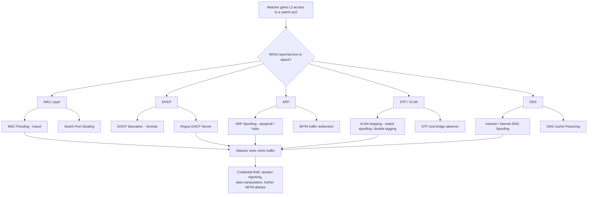

# CEH v13 — Module 08: Network Sniffing

A complete, hands-on reference guide to Module 08 of the CEH v13 curriculum (Exam 312-50), covering how network sniffing attacks work at every layer of a LAN — from CAM table exhaustion to DNS cache poisoning — along with the exact tools, commands, and defensive configurations used in practice.

This repo is written as a **study + lab reference**, not a slide transcript. Every attack technique is paired with the real commands/tools used to perform it and the real switch/router configuration used to stop it, so you can go from "what is MAC flooding" to "here's the `macof` command and here's the Cisco config that blocks it" without switching sources.

> ⚠️ **Ethical use only.** Every technique, tool, and command in this repo is for authorized penetration testing, CTF practice, lab environments you own or have written permission to test, and CEH/security certification study. Running any of this against networks or systems you do not own or have explicit authorization to test is illegal in most jurisdictions. Use isolated lab VMs (e.g., Parrot OS / Kali attacker VM + victim VMs on a host-only virtual switch).

---

## 📚 Table of Contents

| # | File | Covers |
|---|------|--------|
| 01 | [Sniffing Concepts](01-sniffing-concepts.md) | Passive vs. active sniffing, how sniffers work, the sniffing attack methodology, protocols vulnerable to sniffing, OSI data-link-layer sniffing, hardware protocol analyzers, SPAN ports, wiretapping & lawful interception |
| 02 | [MAC Attacks](02-mac-attacks.md) | MAC address structure, CAM table mechanics, MAC flooding, `macof`, switch port stealing, Cisco port-security defenses |
| 03 | [DHCP Attacks](03-dhcp-attacks.md) | DORA process, DHCP packet format, DHCP starvation, rogue DHCP servers, DHCP snooping (Cisco + Juniper), DHCP filtering |
| 04 | [ARP Poisoning](04-arp-poisoning.md) | ARP protocol internals, ARP spoofing mechanics, `arpspoof`, `habu`, detection tools, Dynamic ARP Inspection (DAI) |
| 05 | [Spoofing Attacks](05-spoofing-attacks.md) | MAC spoofing (Windows GUI + registry methods), IRDP spoofing, VLAN hopping (switch spoofing + double tagging), STP attacks |
| 06 | [DNS Poisoning](06-dns-poisoning.md) | Intranet DNS spoofing, Internet DNS spoofing, proxy server DNS poisoning, DNS cache poisoning, SAD DNS, poisoning tools & defenses |
| 07 | [Sniffing Tools](07-sniffing-tools.md) | Wireshark (capture, Follow TCP Stream, display filters), Capsa, OmniPeek, RITA, and other packet analyzers |
| 08 | [Countermeasures & Detection](08-countermeasures-and-detection.md) | General anti-sniffing hardening, promiscuous-mode detection (ping/DNS/ARP methods), detection tooling (Nmap NSE, NetScanTools Pro) |

**Quick references:**

| File | Purpose |
|------|---------|
| [cheatsheets/wireshark-display-filters.md](cheatsheets/wireshark-display-filters.md) | Every Wireshark display filter in this module, in one table |
| [cheatsheets/cisco-ios-defense-commands.md](cheatsheets/cisco-ios-defense-commands.md) | Every Cisco IOS hardening command (port security, DHCP snooping, DAI, STP guards, VLAN hardening) in one place |

---

## 🎯 Learning Objectives

By the end of this module you should be able to:

- Explain how packet sniffers work at the data-link layer, and why switched networks are *not* immune to sniffing
- Describe and perform MAC, DHCP, ARP, MAC-spoofing, and DNS-poisoning attacks
- Use industry sniffing tools (Wireshark and equivalents) to capture and analyze traffic
- Apply concrete countermeasures (port security, DHCP snooping, Dynamic ARP Inspection, STP guards, DNSSEC, etc.) to defend a network
- Detect an active sniffer on a network using the ping, DNS, and ARP detection methods

---

## 🗺️ Attack Surface at a Glance

---

## 🧪 Suggested Lab Setup

A minimal lab to practice everything in this repo:

1. **Hypervisor**: VirtualBox / VMware Workstation with a **Host-Only** or **Internal** virtual network (never bridge these labs to your real LAN or the internet-facing adapter).
2. **Attacker VM**: Parrot Security OS or Kali Linux (ships with `arpspoof`, `macof`, `ettercap`, `dsniff` suite, Wireshark, `nmap`, Yersinia).
3. **Victim VM(s)**: Any Windows 10/11 or Linux desktop image, ideally 2+ so you can observe MITM traffic between them.
4. **A simulated switch/router**: GNS3 or EVE-NG with a Cisco IOS/IOSv image if you want to practice the port-security / DHCP snooping / DAI CLI commands against a real Cisco control plane, since a Layer 2 software bridge (e.g., Open vSwitch) won't replicate CAM-table or DAI behavior faithfully.

---

## 📎 Source

Notes derived from EC-Council CEH v13 official courseware, **Module 08 — Sniffing** (Exam 312-50), restructured, cross-referenced, and expanded with additional command detail, Mermaid diagrams, and consolidated cheat sheets for practical lab use.
