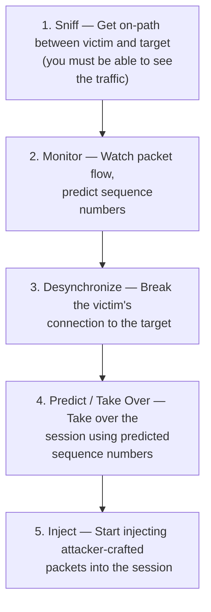

# 01 — Session Hijacking Concepts

## Table of Contents
- [What Is Session Hijacking?](#what-is-session-hijacking)
- [Why Session Hijacking Succeeds](#why-session-hijacking-succeeds)
- [The Session Hijacking Process](#the-session-hijacking-process)
- [Packet Analysis of a Local Session Hijack](#packet-analysis-of-a-local-session-hijack)
- [Types of Session Hijacking: Active vs. Passive](#types-of-session-hijacking-active-vs-passive)
- [Session Hijacking in the OSI Model](#session-hijacking-in-the-osi-model)
- [Spoofing vs. Hijacking](#spoofing-vs-hijacking)

---

## What Is Session Hijacking?

When you log into a web application, the server doesn't re-check your username and password on every single click. Instead, after a successful login it hands your browser a **session token** (also called a session ID or session key) — a piece of state, usually stored in a cookie, URL parameter, or hidden form field, that says "the bearer of this token is an already-authenticated user."

**Session hijacking** is the class of attacks in which an attacker takes over that already-authenticated session — either at the network layer (a live TCP/UDP connection) or the application layer (the HTTP session token itself) — instead of attacking the login process directly.

This matters because of one structural weakness in how most authentication works:

> **Authentication typically happens once, at the start of a session. Everything after that is authorized purely by possession of a token.**

If an attacker can obtain, guess, or forcibly insert themselves into that token/connection, they inherit everything the real user's session was authorized to do — no password required.

Once an attacker has hijacked a session, they can:
- Sniff all further traffic on that connection (identity theft, credential theft, data theft)
- Perform fraudulent actions as the victim (transactions, purchases, data changes)
- Pivot into a man-in-the-middle position for follow-on attacks
- Use the session as a foothold for privilege escalation

## Why Session Hijacking Succeeds

Session hijacking isn't a single exploit — it's a category of attack that works because of several **structural weaknesses** that are common across web applications and TCP/IP itself:

| # | Weakness | Why It Matters |
|---|----------|-----------------|
| 1 | **No account lockout on invalid session IDs** | If a server doesn't rate-limit or lock out repeated failed session-ID attempts, an attacker can brute-force session IDs the same way they'd brute-force a password — silently, with no warning shown to anyone. |
| 2 | **Weak session-ID generation / short IDs** | Many applications generate IDs using predictable inputs like time, incrementing counters, or client IP. A short ID also shrinks the keyspace an attacker has to search. |
| 3 | **Insecure handling of session IDs** | If a session ID can be leaked via DNS poisoning, XSS, or a browser bug, the attacker doesn't need to guess anything — it's handed to them. |
| 4 | **Indefinite session timeout** | "Remember me" cookies and sessions with no expiry give an attacker unlimited time to brute-force or steal a valid ID, and make stolen cookies useful indefinitely. |
| 5 | **TCP/IP's inherent design** | Every machine running TCP/IP is theoretically susceptible, because TCP was not designed with cryptographic session integrity in mind — sequence numbers, not secrets, are what "authenticate" packets within a session. |
| 6 | **Countermeasures that assume encryption but don't enforce it** | Even a site that uses SSL/TLS for the login page can still leak an unencrypted, sniffable session cookie later if it isn't marked `Secure` and used consistently over HTTPS. |

## The Session Hijacking Process

Regardless of which specific technique is used, most session hijacking attacks — especially network-level ones — follow the same five-stage escalation:

This is easier for an attacker than breaking into a system directly, because sneaking in *as* an already-trusted, already-authenticated user avoids the friction of the login process entirely. Once hijacked, the attacker can stay connected for hours without raising suspicion — and while that connection is live, **all traffic intended for the victim's IP is effectively going to the attacker instead**, giving them room to plant backdoors or expand access.

### The Three Broad Phases (in more depth)

**Phase 1 — Tracking the connection**

The attacker uses a network sniffer (or a scanning tool like Nmap) to find a target machine and a TCP session with an easy-to-predict sequence number. Once a victim is identified, the attacker captures the current sequence and acknowledgment numbers — because TCP checks these on every packet, and the attacker will need to forge packets that pass that check.

**Phase 2 — Desynchronizing the connection**

A connection is "desynchronized" when the server's sequence number no longer matches what the client's acknowledgment number expects, or vice versa — the two sides have drifted out of sync with each other. There are a few ways to force this:

- **Null-data method**: The attacker monitors the session, then sends a large amount of null data to the server. This advances the server's ACK number without the real client ever seeing it, desynchronizing server and client while leaving everything else on the surface unaffected.
- **Early-reset method**: The attacker waits for a SYN/ACK packet from server to host. On seeing it, the attacker immediately fires off both an RST and a new SYN (same port, different sequence number) to the server. The server closes the original connection and opens a new one on the same port with a *different* sequence number. When the server sends its new SYN/ACK, the attacker (without intercepting it) sends an ACK to the server — pushing the server into the ESTABLISHED state. The goal throughout is to keep the real target responsive and get it to switch to the established state upon receiving that first SYN/ACK — so **both sides end up desynchronized, but each individually believes it's in a normal, established connection.**
- **FIN-flag method (flawed)**: An attacker could also try using a FIN flag, but this reveals the attack — the server responds to an unexpected/out-of-window packet with an ACK carrying the expected sequence number, and this "unacceptable packet" behavior generates an infinite loop of ACKs (an **ACK storm**) for every subsequent data packet, because both sides keep trying to resynchronize by re-announcing the sequence number they each expect. Because these ACK-only packets carry no data, no retransmission occurs if one is lost — but since TCP rides on IP, losing even a single one of these packets ends the runaway conversation. The ACK storm is loud and detectable, which is exactly why real attackers prefer the null-data or early-reset methods.

**Phase 3 — Injecting the attacker's packet**

Once the server and target are desynchronized, the attacker can either inject data directly into the connection, or sit as an active man-in-the-middle, relaying (and altering) data between target and server while reading everything that passes through.

## Packet Analysis of a Local Session Hijack

TCP relies on a three-way handshake to establish a session and agree on how data will be transmitted. Session hijacking exploits this handshake to seize control of an already-negotiated session. To do this, an attacker performs three activities:

1. **Tracking** a session (via sniffing)
2. **Desynchronizing** the session
3. **Injecting** commands during the session

The hard part is always the sequence number. There are two ways an attacker can get it:

- **Sniff for it directly** — find an ACK packet on the wire and read off the Next Sequence Number (NSN) from it. This is reliable and is what's called **local session hijacking** — the attacker has network access and can sniff the live TCP session.
- **Guess it** — transmit data with a guessed sequence number. This is far less reliable and is really only viable against very old or badly-implemented TCP stacks with predictable ISN generation.

## Types of Session Hijacking: Active vs. Passive

The core distinction is the attacker's degree of involvement:

| | Passive Hijacking | Active Hijacking |
|---|---|---|
| **What happens** | Attacker only observes and records traffic during the session | Attacker takes over the session, either by breaking one side's connection or by actively participating (MITM) |
| **Primary tool** | Network sniffers | Same as passive, plus sequence-number prediction/injection |
| **What it gets you** | User IDs and passwords, harvested from raw traffic | Full session takeover — arbitrary actions as the victim |
| **What defeats it** | Identification schemes like one-time-password systems (S/KEY), ticketing systems like Kerberos | Only encryption and/or digital signatures on the data — OTP/Kerberos alone don't stop an *active* attacker if the underlying data is unencrypted |
| **Modern difficulty** | Straightforward if traffic is unencrypted and reachable | Modern OSes randomize initial sequence numbers (see [RFC 6528](https://www.rfc-editor.org/rfc/rfc6528)), which makes blind sequence-number prediction across a network largely impractical today — active hijacking now depends much more heavily on being on-path (sniffing) than on guessing |

## Session Hijacking in the OSI Model

There are two levels at which session hijacking happens, and in practice they're often chained together — a successful network-level hijack often hands the attacker exactly what they need to pull off an application-level hijack next.

| | Network-Level Hijacking | Application-Level Hijacking |
|---|---|---|
| **Definition** | Interception of packets during transmission between a client and server in a TCP or UDP session | Gaining control over the HTTP user session by obtaining the session ID(s) |
| **What it targets** | The transport/internet-layer protocols underneath the application | The application's own session-management logic |
| **Why attackers like it** | Doesn't require per-application tailoring — one technique (e.g., ARP spoofing) works against the data flow of *any* web app on that network | Requires no special network position in many cases (e.g., a phishing link is enough) |
| **Typical prerequisite** | Being on the same network segment, or otherwise able to route/see the traffic | Being able to reach the application at all (often just needs the victim to click something) |

## Spoofing vs. Hijacking

These two terms get used interchangeably in casual conversation, but they describe different attacks with different requirements:

| | Spoofing | Hijacking |
|---|---|---|
| **What the attacker does** | Pretends to be another user or machine | Seizes control of an *existing, active* session |
| **New session or existing?** | Initiates a brand-new session using the victim's stolen credentials | Takes over a session the *victim* already authenticated |
| **What's needed** | Stolen credentials, and (to forge raw packets) root/admin access on the attack machine | The ability to predict/guess sequence numbers and either spoof a MAC/IP or otherwise get on-path |
| **Difficulty** | Comparatively simple | Comparatively difficult — requires far more real-time knowledge of and control over the target session |
| **Can the attacker see responses?** | Yes — it's the attacker's own new session | Depends — **blind** hijacking cannot see the response; a **MITM** position can |

### Blind Hijacking

In blind hijacking, the attacker predicts the sequence numbers a victim host sends in order to create a connection that appears to originate from that host — without ever seeing the replies. This matters because TCP sequence numbers are unique per byte within a session and provide flow control and data integrity; each side states its Initial Sequence Number (ISN) during the handshake, and bytes are numbered sequentially from there.

An attacker on a **different** network can't spoof a trusted host and then observe the reply packets, because there's no route for those replies to come back to the attacker's real address — and they can't fall back on ARP cache poisoning either, because routers don't broadcast ARP across the internet. So a remote, blind attacker has to:
1. Anticipate what the victim's responses will be, and
2. Prevent the real host from sending a TCP RST that would kill the spoofed connection.

This technique is most useful for exploiting **trust relationships** between machines (e.g., `.rhosts`-style trust, or an application that authenticates purely by source IP) rather than for reading response data.

### Source Routing: How Traffic Can Return to a Remote Attacker

Normally, IP spoofing without an active session hijack doesn't require guessing a sequence number at all, because there's no existing open session to fit into. But *with* a session hijack, traffic only returns to the attacker if **source routing** is used — a technique where the sender specifies the exact route an IP packet should take to its destination. The attacker performs source routing and then sniffs the traffic as it passes through their own system on its way to the real destination.

This is also why **encryption defeats both spoofing and hijacking together**: if a session is protected by SSL or PPTP, the attacker can't participate in the key exchange, so knowing the sequence number gets them nothing — they can't decrypt or meaningfully modify what's inside the stream. Similarly, if a server does **per-packet integrity checking**, spoofed/hijacked packets simply fail validation regardless of sequence-number accuracy.

### Putting It Together: Requirements for Non-Encrypted TCP Hijacking

Successfully hijacking an unencrypted TCP communication requires **all** of the following:

1. Non-encrypted, session-oriented traffic to hijack
2. The ability to recognize TCP sequence numbers well enough to predict the Next Sequence Number (NSN)
3. The ability to spoof a host's MAC address or IP address, so that responses meant for someone else are received by the attacker instead

If the attacker is on the local network segment, they can sniff traffic directly, predict `ISN + 1`, and route return traffic to themselves simply by **poisoning the ARP caches** of both legitimate hosts in the session — no source routing or blind guessing required. This is, in practice, the far more common real-world scenario, and it's covered in depth in [`03-network-level-session-hijacking.md`](03-network-level-session-hijacking.md).

---
**Next:** [`02-application-level-session-hijacking.md`](02-application-level-session-hijacking.md) — how attackers compromise the HTTP session token directly.
