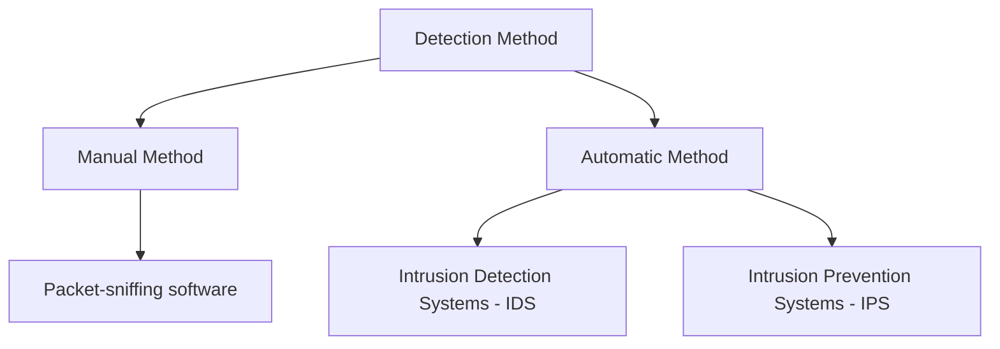

# 05 — Session Hijacking Detection Methods & Tools

## Table of Contents
- [Why Detection Is Hard](#why-detection-is-hard)
- [Manual Detection](#manual-detection)
- [Automatic Detection](#automatic-detection)
- [Detection Tools](#detection-tools)
- [Useful Wireshark Filters](#useful-wireshark-filters)
- [Blue-Team Investigation Playbook](#blue-team-investigation-playbook-added-for-depth)

---

## Why Detection Is Hard

Session hijacking attacks are exceptionally difficult to detect, and in most cases they go completely unnoticed until the attacker causes damage severe enough to be noticed some other way (fraud, data loss, an angry customer). That said, there are two general symptoms worth watching for:

- **A burst of network activity** for some period, which measurably decreases system performance.
- **Unusually busy servers**, resulting from requests being sent by *both* the legitimate client and the hijacker simultaneously.



## Manual Detection

The manual method involves packet-sniffing software — **Wireshark** and **SteelCentral Packet Analyzer** are the tools named in the official curriculum — to directly monitor for session hijacking activity. The sniffer captures packets in transit across the network, which are then analyzed with various filtering tools (see [Useful Wireshark Filters](#useful-wireshark-filters) below).

### Forced ARP Entry

A **forced ARP entry** replaces the MAC address of a compromised machine in the server's ARP cache with a different, known-good one, in order to restrict network traffic away from the compromised machine.

Perform a forced ARP entry when you observe any of the following:
- Repeated/unusually frequent ARP updates
- Frames sent between client and server carrying **different MAC addresses** than expected
- **ACK storms** (a telltale sign of a failed/detected FIN-based desynchronization attempt — see [`01-session-hijacking-concepts.md`](01-session-hijacking-concepts.md#the-session-hijacking-process))

## Automatic Detection

The automatic method uses **Intrusion Detection Systems (IDS)** and **Intrusion Prevention Systems (IPS)** to monitor incoming traffic continuously. If a packet matches a signature in the internal attack-signature database, the IDS generates an alert; the IPS goes a step further and actively blocks the matching traffic from entering the network at all.

### Illustrative Detection Signature Concepts (for defenders)

These are conceptual/illustrative examples of the *kinds* of signatures a defensive IDS might use to flag session-hijacking-adjacent activity — written in generic pseudo-Snort style for teaching purposes, not as a drop-in ruleset:

```text
# Excessive ARP replies from a single source in a short window
# (classic ARP-spoofing / MITM setup indicator)
alert arp any any -> any any (msg:"Possible ARP spoofing - high reply rate";
  threshold: type threshold, track by_src, count 10, seconds 5;)

# TCP RST immediately following a data packet with an unexpected ACK
# (possible RST-hijack attempt)
alert tcp any any -> any any (flags: R; msg:"Suspicious RST - possible session reset attack";)

# Repeated retransmissions / duplicate ACKs on the same stream
# (possible desynchronization in progress)
alert tcp any any -> any any (msg:"TCP desync indicator - duplicate ACK storm";
  threshold: type threshold, track by_src, count 20, seconds 2;)
```

## Detection Tools

### USM Anywhere
- **Source:** https://cybersecurity.att.com
- Delivers threat detection, incident response, and compliance management across cloud, on-premises, and hybrid environments. Security professionals can use it for asset discovery, intrusion detection, SIEM and log management, endpoint detection and response, threat intelligence, and vulnerability assessment — all of which contribute to spotting session-hijacking attempts.

### Wireshark
- **Source:** https://www.wireshark.org
- Captures and interactively browses live network traffic. It uses **Winpcap/Npcap** to capture packets, so it can only see traffic on networks those libraries support — but that covers Ethernet, IEEE 802.11, PPP/HDLC, ATM, Bluetooth, USB, Token Ring, and FDDI.

### Additional Detection Tools (Official List)
- **Quantum Intrusion Prevention System (IPS)** — https://www.checkpoint.com
- **SolarWinds Security Event Manager** — https://www.solarwinds.com
- **IBM Security Network Intrusion Prevention System** — https://www.ibm.com
- **LogRhythm** — https://logrhythm.com

## Useful Wireshark Filters

Real, runnable Wireshark **display filters** for spotting session-hijacking-adjacent activity in a capture:

```text
# Duplicate/unexpected ARP replies — classic ARP-spoofing indicator
arp.opcode == 2

# ARP request flood — reconnaissance ahead of an ARP-spoofing attack
arp.opcode == 1

# TCP connection resets — could indicate RST hijacking / connection killing
tcp.flags.reset == 1

# TCP retransmissions — a symptom of a desynchronized connection
tcp.analysis.retransmission

# Duplicate ACKs — another desynchronization / ACK-storm symptom
tcp.analysis.duplicate_ack

# Find HTTP requests carrying session cookies in cleartext
http.cookie and not tcp.port == 443

# Spot Set-Cookie headers missing the Secure or HttpOnly attribute
# (requires manual eyeballing, but this narrows the candidate list)
http.set_cookie
```

## Blue-Team Investigation Playbook (added for depth)

A practical checklist for investigating a *suspected* session hijack, tying the detection signals above into concrete next steps:

1. **Correlate the alert.** Pull the triggering IDS/IPS alert and identify the exact source/destination IPs, MACs, and timestamps involved.
2. **Pull the relevant packet capture.** If full-packet capture is available (or Wireshark/SteelCentral was already running), export the window around the alert for offline analysis.
3. **Check for duplicate MAC/IP mappings.** Compare the ARP table state before and after the alert — a poisoned ARP cache is one of the most reliable network-level signals.
4. **Check application/server logs for concurrent-session anomalies.** Look for the same session ID or account being used from two different source IPs, unusual geographic jumps, or a sudden change in User-Agent mid-session.
5. **Force a session/key rotation.** Invalidate the suspected session server-side (don't just wait for client-side expiry), and rotate any credentials or tokens that may have been exposed.
6. **Patch the root cause.** If the vector was ARP spoofing, consider port security / Dynamic ARP Inspection on switches. If it was a predictable/short session ID, fix the token-generation scheme (see [`06-countermeasures-and-best-practices.md`](06-countermeasures-and-best-practices.md)).
7. **Preserve evidence.** Keep the pcap, logs, and IDS alert together for incident review — especially important if the incident may involve regulatory reporting obligations.

---
**Next:** [`06-countermeasures-and-best-practices.md`](06-countermeasures-and-best-practices.md) — the full set of preventive controls, organized by category.
