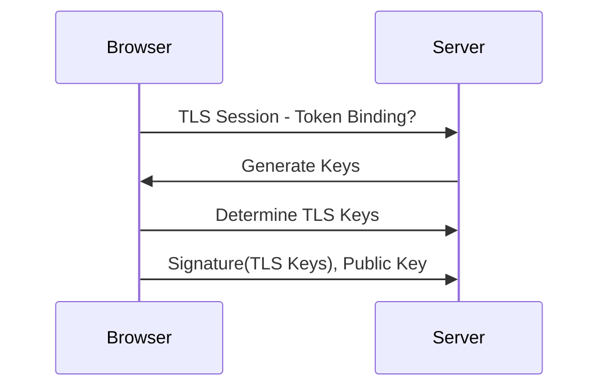

# 07 - IPsec & Advanced Protections

## Tablle of Contents
- [HTTP Strict Transport Security (HSTS)](#http-strict-transport-security-hsts)
- [Token Binding (and Its Deprecation)](#token-binding-and-its-deprecation)
- [Approaches to Prevent MITM Attacks](#approaches-to-prevent-mitm-attacks)
- [IPsec, in Depth](#ipsec-in-depts)

---

## HTTP Strict Transport Security (HSTS)

**HSTS** is a web security policy that protects HTTPS websites against MITM attacks by letting a server force browsers to interact with it only onver secure HTTPS - automatically upgrading any insecure HTTP connection attempt to HTTPS. This ensures that all communication between browser and server is encrypted, and that every response received genuinely originates from the authenticated server.

**How it works;**
1. Client sends a plain HTTP request.
2. Server responds with an 'HSTS' header instructing the browser to only every use HTTPS for this domain going forward.
3. Every subsequent request from that client goes out as HTTPS directly - the browser never even attempts plain HTTP again for the lifetime of the policy.

Real HSTS response header:

```http
Strict-Transport-Security: max-age=31536000; includeSubDomains; preload
```

- 'max-age=31536000' - remember this policy for one year (in seconds)
- 'includeSubDomains' - apply the policy to every subdomain too
- 'preload' - opt into browser-vendor HSTS preload lists, so even the *very first* connection (before any header has every been seen) is forced to HTTPS

## Token Binding (and Its Deprecation)

When a user logs into a web application, a cookie carrying a session ID - a **token** - is generated. Token Binding is a proposed defense in which the client creates a fresh **public/private key pair for every connection to a remote server**. On connecting, the client generates a signature using its private key and sends that signature, along with the public key, to the server. The server verifies the signature using the client's public key, which proves the message genuinely came from that specific client - because only that client holds the private key. Even if an attacker captures the signature itself, they can't regenerate it or reuse it for a different connection, since a new key pair is generated per connection.



> **Current status (added for accuracy):** Token Binding was standardized as an IETF RFC in 2018, but **Google removed support from Chrome around version 70/71 (late 2018)**, citing low real-world adoption, and Microsoft Edge (having rebased on Chromium) has since been phasing out its own legacy support as well. Firefox and Safari never implemented it. In practice, Token Binding today should be treated as a **largely deprecated/historical mechanism** rather than a control you should plan a new architecture around - Chrome's team has since explored a successor concept called **Device Bound Session Credentials (DBSC)** for simular goals. It's still worth understanding conceptually, since the underlying idea (cryptographically bindin a session token to a specific client so a stolen token alone is useless) reappears in other forms, oncluding mTLS client cartificates and DBSC.

## Approaches to Prevent MITM Attacks

MITM attacks
