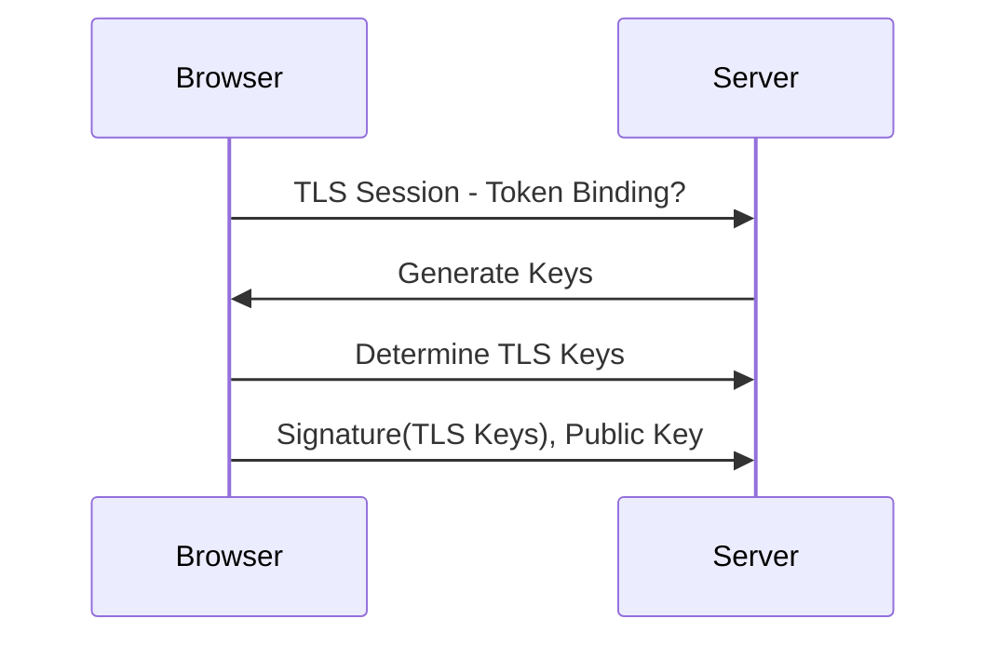
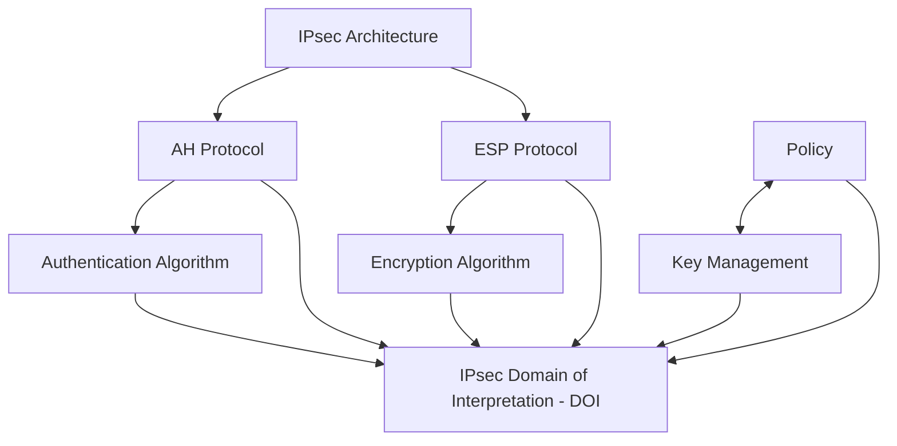

# 07 — IPsec & Advanced Protections

## Table of Contents
- [HTTP Strict Transport Security (HSTS)](#http-strict-transport-security-hsts)
- [Token Binding (and Its Deprecation)](#token-binding-and-its-deprecation)
- [Approaches to Prevent MITM Attacks](#approaches-to-prevent-mitm-attacks)
- [IPsec, in Depth](#ipsec-in-depth)

---

## HTTP Strict Transport Security (HSTS)

**HSTS** is a web security policy that protects HTTPS websites against MITM attacks by letting a server force browsers to interact with it only over secure HTTPS — automatically upgrading any insecure HTTP connection attempt to HTTPS. This ensures that all communication between browser and server is encrypted, and that every response received genuinely originates from the authenticated server.

**How it works:**
1. Client sends a plain HTTP request.
2. Server responds with an `HSTS` header instructing the browser to only ever use HTTPS for this domain going forward.
3. Every subsequent request from that client goes out as HTTPS directly — the browser never even attempts plain HTTP again for the lifetime of the policy.

Real HSTS response header:

```http
Strict-Transport-Security: max-age=31536000; includeSubDomains; preload
```

- `max-age=31536000` — remember this policy for one year (in seconds)
- `includeSubDomains` — apply the policy to every subdomain too
- `preload` — opt into browser-vendor HSTS preload lists, so even the *very first* connection (before any header has ever been seen) is forced to HTTPS

## Token Binding (and Its Deprecation)

When a user logs into a web application, a cookie carrying a session ID — a **token** — is generated. Token Binding is a proposed defense in which the client creates a fresh **public/private key pair for every connection to a remote server**. On connecting, the client generates a signature using its private key and sends that signature, along with the public key, to the server. The server verifies the signature using the client's public key, which proves the message genuinely came from that specific client — because only that client holds the private key. Even if an attacker captures the signature itself, they can't regenerate it or reuse it for a different connection, since a new key pair is generated per connection.



> **Current status (added for accuracy):** Token Binding was standardized as an IETF RFC in 2018, but **Google removed support from Chrome around version 70/71 (late 2018)**, citing low real-world adoption, and Microsoft Edge (having rebased on Chromium) has since been phasing out its own legacy support as well. Firefox and Safari never implemented it. In practice, Token Binding today should be treated as a **largely deprecated/historical mechanism** rather than a control you should plan a new architecture around — Chrome's team has since explored a successor concept called **Device Bound Session Credentials (DBSC)** for similar goals. It's still worth understanding conceptually, since the underlying idea (cryptographically binding a session token to a specific client so a stolen token alone is useless) reappears in other forms, including mTLS client certificates and DBSC.

## Approaches to Prevent MITM Attacks

MITM attacks are among the most common attack types precisely because they're largely passive and hard to detect from the victim's side — so, much like session hijacking generally, prevention leans heavily on layered defenses rather than any single silver bullet.

### DNS over HTTPS (DoH)

DoH is an enhanced version of the DNS protocol that prevents snooping on a user's web activity or DNS queries during the lookup process, by sending DNS queries and responses through an **encrypted HTTPS tunnel over port 443** instead of plaintext DNS over port 53. Because the traffic is hidden within normal HTTPS traffic, it becomes effectively undetectable to on-path attackers or even ISPs monitoring DNS traffic patterns. Unlike a traditional lookup, DoH also sends only the necessary segment of a domain name to fetch results, rather than the complete name the user entered — improving privacy further. Chrome, Mozilla Firefox, and Microsoft Edge have all implemented this protocol, and Mozilla made it the default for US-based clients starting in 2020.

```bash
# Illustrative DoH query using curl against Cloudflare's public resolver
curl -s -H 'accept: application/dns-json' \
  'https://cloudflare-dns.com/dns-query?name=example.com&type=A'
```

### WPA3 Encryption

**Wireless Protected Access 3 (WPA3)** is the current wireless security protocol, intended to protect traffic sent and received over a wireless network. Implementing it helps prevent unauthorized users from connecting to the network at all. A weak (or older, e.g. WPA2/WEP) encryption mechanism enables attackers to brute-force credentials and gain a foothold from which to run MITM attacks against everyone else on the network.

### VPN

A VPN creates a safe, encrypted tunnel over a public network for sending and receiving sensitive information. It effectively builds a private subnet using key-based encryption between endpoints. Implementing a VPN across a network prevents attackers from decrypting the data flowing between those endpoints, even if they can see the traffic at all.

### Two-Factor Authentication

2FA provides an additional layer of protection beyond a password alone. Implementing it can prevent attackers from successfully performing session hijacking or brute forcing their way into a compromised account, because possessing just the password (or even just a stolen token, in some MFA-integrated designs) is no longer sufficient.

### Password Manager

A password manager is an application or tool used to protect and manage individual credentials, and can also generate unique, complex passwords for each web application. Stored passwords are kept in a secure, encrypted location under a master key — helping prevent the kind of credential reuse and weak-password conditions that make MITM and hijacking attacks more damaging.

### Zero-Trust Principles

Zero-trust principles are a set of standardized user pre-verification procedures requiring **all** users — inside or outside the traditional network perimeter — to be authenticated before being granted access to any resource. These principles are grounded in the phrase **"trust but verify"**: even a request originating from inside the internal network goes through the same authentication process as one from an outsider.

### Public Key Infrastructure (PKI)

PKI is a framework that manages, distributes, and validates digital certificates for secure communication, ensuring the entities involved in a communication really are who they claim to be. Certificates are issued by trusted **Certificate Authorities (CAs)**, and any attempt to present a false or forged certificate can be detected.

### Network Segmentation

Network segmentation is the practice of dividing a computer network into smaller sub-networks or segments to enhance security. It helps prevent MITM attacks by restricting an attacker's ability to intercept and manipulate communication between devices, move laterally within the network, and reach sensitive information beyond their initial foothold.

## IPsec, in Depth

**Internet Protocol Security (IPsec)** is a protocol suite developed by the IETF for securing IP communications by authenticating and encrypting each IP packet of a communication session. It's deployed widely to implement VPNs and for remote user access over dial-up connections into private networks. It provides interoperable, cryptographically based security for both IPv4 and IPv6.

### IPsec Authentication and Confidentiality

IPsec uses two different security services for authentication and confidentiality:

| Protocol | Provides |
|---|---|
| **Authentication Header (AH)** | Data authentication of the sender only — **no encryption/confidentiality** |
| **Encapsulating Security Payload (ESP)** | **Both** data authentication *and* encryption (confidentiality) of the sender's data |

### Full List of IPsec Security Services

- Rejection of replayed packets (a form of partial sequence integrity)
- Data confidentiality (encryption)
- Access control
- Connectionless integrity
- Data origin authentication
- Data integrity
- Limited traffic-flow confidentiality
- Network-level peer authentication
- Replay protection

At the IP layer, IPsec provides all of the above for IP itself and for upper-layer protocols riding on top of it — including TCP, UDP, ICMP, and BGP.

### Components of IPsec

| Component | Role |
|---|---|
| **IPsec driver** | Software performing the protocol-level functions required to encrypt and decrypt packets |
| **Internet Key Exchange (IKE)** | Protocol that produces the security keys used by IPsec and other protocols |
| **Internet Security Association and Key Management Protocol (ISAKMP)** | Software that lets two computers communicate by encrypting the data exchanged between them |
| **Oakley** | Protocol using the Diffie–Hellman algorithm to create a master key and a key specific to each session in IPsec data transfer |
| **IPsec Policy Agent** | A Windows OS service that enforces IPsec policies for all network communications initiated from that system |

IPsec policies can be assigned through the Group Policy configuration of Active Directory domains, organizational units, and IPsec deployment policies at the domain, site, or organizational-unit level.

### The IPsec Negotiation Process

1. A consumer sends a message to a service provider.
2. The consumer's IPsec driver checks the outgoing packet's address/type against its configured IP filter.
3. The IPsec driver notifies **ISAKMP** to initiate security negotiations with the service provider.
4. The service provider's ISAKMP receives the security-negotiation request.
5. Both sides initiate a key exchange, establishing an **ISAKMP Security Association (SA)** and a shared secret key.
6. Both sides discuss the required security level for the exchange, establishing both **IPsec SAs** and keys.
7. The consumer's IPsec driver transfers packets over the appropriate connection type to the service provider.
8. The provider receives the packets and passes them to its own IPsec driver.
9. The provider's IPsec checks the digital signature using the inbound SA and key, and begins decryption.
10. The provider's IPsec driver hands the decrypted packets up to the OSI transport layer for further processing.

### Modes of IPsec

IPsec supports two modes, associated with the AH and ESP protocols; which to use depends on the specific requirements and deployment.

#### Transport Mode

Encrypts only the **payload** of the IP packet — the IP header itself is left untouched, so it remains routable exactly as before. This mode is used for **end-to-end communication between two hosts**, and because the header is untouched, it's compatible with **Network Address Translation (NAT)**, making it usable for VPN services on NAT'd networks.

```
┌───────────┬──────────────┬────────────────────────┬───────────────────────┐
│ IP header │ IPsec header │ Transport data          │ IPsec trailer         │
│           │              │ (TCP, UDP, etc.)         │ (ESP only)            │
└───────────┴──────────────┴────────────────────────┴───────────────────────┘
             └──────────────────── encrypted ─────────────────────┘
             └───────────────────────── authenticated ─────────────────────────┘
```

#### Tunnel Mode

Encapsulates the **entire original IP packet** — both payload and IP header — and encrypts the whole thing. That encapsulated packet then becomes the payload of a brand-new IP packet with a new IP header. This gives tunnel mode **higher security** than transport mode, since even the original header details are hidden. Tunnel mode is used to build VPNs over the internet for network-to-network communication (e.g., site-to-site, router-to-router), host-to-network communication (e.g., remote user access), and host-to-host communication (e.g., private chat) — and it's compatible with NAT traversal.

```
┌──────────┬──────────────┬─────────┬────────────┬───────────────────────┐
│ Outer IP │ IPsec header │ Inner IP│ IP payload │ IPsec trailer         │
│ header   │              │ header  │            │ (ESP only)            │
└──────────┴──────────────┴─────────┴────────────┴───────────────────────┘
            └────────────────────── encrypted ───────────────────────┘
            └──────────────────────── authenticated ──────────────────────────┘
```

In tunnel mode, **ESP** encrypts (and optionally authenticates) the entire inner IP packet, while **AH** authenticates the entire inner packet plus selected fields of the outer IP header. Tunnel mode is typically used between two gateways, or between a host and a gateway.

### IPsec Architecture



- **Authentication Header (AH):** Offers integrity and data-origin authentication, with optional anti-replay protection. Provides connectionless integrity and data-origin authentication for IP datagrams, plus anti-replay protection for the data payload and some portions of the IP header of each packet — but **no confidentiality** (no encryption). A receiver can optionally select replay protection when establishing a Security Association.
- **Encapsulating Security Payload (ESP):** Offers all the services AH offers, **plus confidentiality**. Unlike AH, ESP does not provide integrity and authentication for the *entire* IP packet in transport mode — by default it protects only the IP data payload; in tunnel mode it protects both payload and header. ESP can be used alone, alongside AH, or in a nested fashion.
- **IPsec Domain of Interpretation (DOI):** Defines payload formats, exchange types, and naming conventions for security information such as cryptographic algorithms or security policies. The DOI instantiates ISAKMP for use with IP whenever IP uses ISAKMP to negotiate security associations.
- **Internet Security Association and Key Management Protocol (ISAKMP):** A key protocol in the IPsec architecture, establishing the required security for various communications over the internet — government, private, and commercial — by combining authentication, key management, and security-association concepts.
- **Policy:** IPsec policies define when and how to secure data, and which security methods to use at different levels of the network. Policies can be configured to meet the requirements of a system, domain, site, or organizational unit.

### Configuring IPsec on Windows

IPsec policy on a Windows host is configured via **Local Security Policy → IP Security Policies on Local Computer**, using the **IP Security Policy Wizard** to create and name a new policy before defining its rules (filters, filter actions, and authentication methods).

---
**Next:** [`08-prevention-tools.md`](08-prevention-tools.md) — vulnerability-scanning and debugging tools that help prevent session hijacking before deployment.
