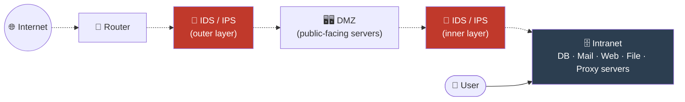
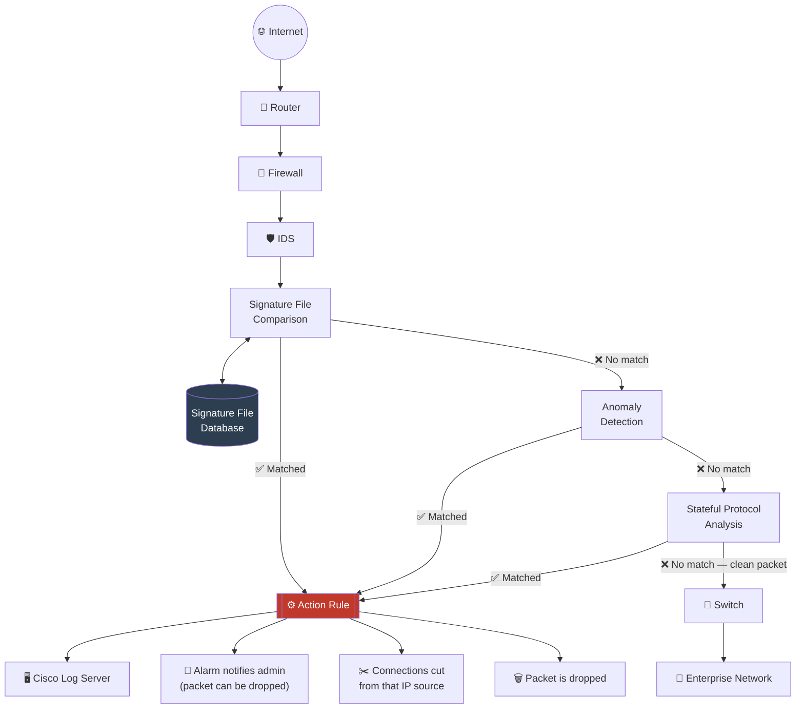
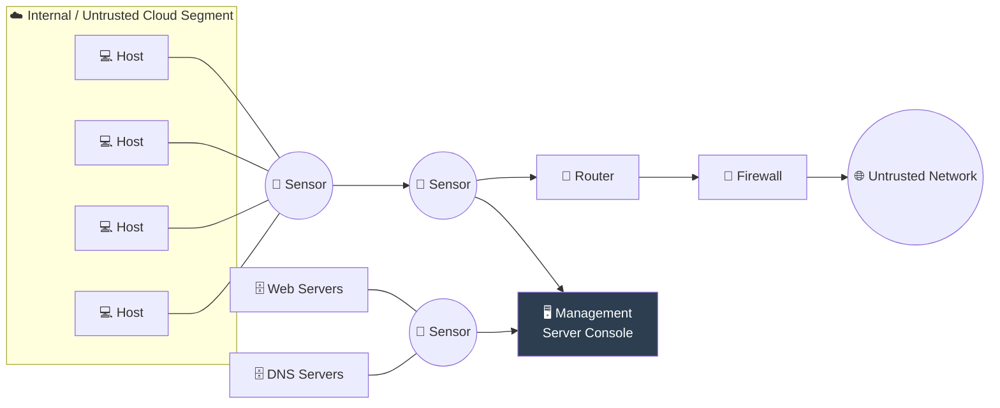
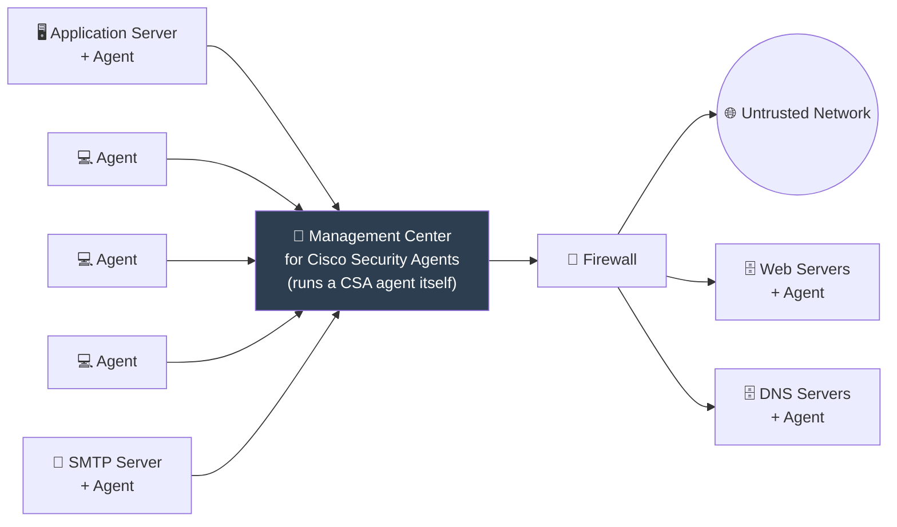

# 01 — Intrusion Detection System (IDS)

[⬅ Back to main index](../README.md)

## Table of Contents
- [What is an IDS?](#what-is-an-ids)
- [Main functions of an IDS](#main-functions-of-an-ids)
- [Where IDS resides in the network](#where-ids-resides-in-the-network)
- [How an IDS Works](#how-an-ids-works)
- [How an IDS Detects an Intrusion](#how-an-ids-detects-an-intrusion)
  - [Signature Recognition](#1-signature-recognition-misuse-detection)
  - [Anomaly Detection](#2-anomaly-detection-not-use-detection)
  - [Protocol Anomaly Detection](#3-protocol-anomaly-detection)
- [General Indications of Intrusion](#general-indications-of-intrusion)
- [Types of Intrusion Detection Systems](#types-of-intrusion-detection-systems)
  - [Network-Based IDS (NIDS)](#network-based-intrusion-detection-systems-nids)
  - [Host-Based IDS (HIDS)](#host-based-intrusion-detection-systems-hids)
  - [NIDS vs HIDS comparison](#nids-vs-hids--quick-comparison)
- [Types of IDS Alerts](#types-of-ids-alerts)
- [Extra: Real-world IDS tools](#extra-real-world-ids-tools)
- [Extra: Snort quick-start lab](#extra-snort-quick-start-lab)

---

## What is an IDS?

An **Intrusion Detection System (IDS)** is a security software or hardware device used to **monitor, detect, and protect** networks or systems from malicious activities. It alerts security personnel immediately upon detecting an intrusion.

Think of it as a **burglar alarm for a network**: it doesn't stop the burglar physically (that's a firewall's or IPS's job), it just watches everything happening and screams the moment something looks wrong.

Key properties:
- Continuously monitors **inbound and outbound** network traffic.
- Checks traffic for **signatures** that match known intrusion patterns.
- **Raises an alarm** the moment a match is found.
- Can be **passive** (detect only) or **active** (detect *and* react) — an active IDS is effectively an **IPS** (see [02-intrusion-prevention-system](../02-intrusion-prevention-system/README.md)).

| | Passive IDS | Active IDS (≈ IPS) |
|---|---|---|
| Detects intrusions | ✅ | ✅ |
| Prevents/blocks intrusions | ❌ | ✅ |
| Sits in traffic path (inline) | ❌ (usually out-of-band, via a SPAN/mirror port) | ✅ |
| Risk if it fails | Traffic keeps flowing (fail-open) | Can block legitimate traffic if misconfigured |

## Main functions of an IDS

- Gathers and analyzes information from within a computer or network to identify possible **violations of security policy** — including unauthorized access and misuse.
- Also called a **"packet sniffer"** — it intercepts packets traveling across communication media/protocols (usually TCP/IP).
- Packets are **analyzed after capture** (not necessarily in real time at the wire-speed decision point — analysis happens on copies of traffic).
- Evaluates traffic for suspected intrusions and **raises an alarm** when one is detected.

## Where IDS resides in the network

One of the most common places to deploy an IDS is **near the firewall**. Depending on what traffic needs to be watched:

- Placed **outside** the firewall → sees raw, unfiltered Internet traffic (catches everything aimed at you, including stuff the firewall would've blocked anyway — useful for threat visibility).
- Placed **inside** the firewall → sees only what got past the firewall (catches what your perimeter defense missed, and traffic originating from inside).
- **Best practice**: layered defense — **one IDS in front of the firewall, another behind it.** If placed inside, it's ideal to have it near the DMZ.

Before deploying:
1. Analyze the network topology.
2. Understand how traffic flows to/from resources an attacker could exploit.
3. Identify critical components that are likely attack targets.
4. Position + configure the IDS to maximize protective effect.

### Diagram — Placement of IDS (Fig 12.1)




---

## How an IDS Works

The primary purpose of an IDS is **real-time monitoring and detection** of intrusions. A *reactive* IDS (or an IPS) can additionally intercept, respond to, or prevent intrusions.

Step-by-step process:

1. **Sensors** on the IDS detect malicious signatures in data packets. Advanced IDS also include **behavioral activity detection** — so even if a packet's signature doesn't perfectly match anything in the database, unusual behavior can still trigger an admin alert.
2. **If the signature matches** → the IDS performs a predefined action: terminate the connection, block the source IP, drop the packet, and/or raise an alarm.
3. **If the signature does NOT match** → the packet moves on to **anomaly detection** (signature matching is checked first; anomaly detection is essentially the fallback check).
4. **If the packet passes all checks** → the IDS forwards it into the network as legitimate traffic.

### Diagram — Working of IDS / IDS-IPS Preprocessor pipeline (Fig 12.2)




**What each stage of the preprocessor actually does:**

| Stage | What it checks | On match |
|---|---|---|
| Signature File Comparison | Byte patterns / strings against a known-attack signature database | Fires the Action Rule immediately |
| Anomaly Detection | Statistical deviation from "normal" traffic baseline | Fires the Action Rule |
| Stateful Protocol Analysis | Whether the packet obeys the expected state machine of its protocol (e.g., a TCP ACK arriving without a prior SYN/SYN-ACK) | Fires the Action Rule |
| (all three clean) | — | Packet is forwarded to the switch → enterprise network |

The **Action Rule** is the enforcement layer: it can simultaneously log to a central server (e.g., a Cisco log server), alert an administrator, sever the offending connection at the IP level, and/or silently drop the single offending packet.

---

## How an IDS Detects an Intrusion

An IDS generally uses **three detection methods**:

### 1. Signature Recognition (Misuse Detection)

Tries to identify events that indicate abuse of a system/network by **comparing incoming/outgoing packets against known-attack binary signatures**, using pattern matching.

- Built on models of *known* intrusions — the model must catch attacks **without** flagging normal traffic.
- Compares packets against signatures for things like specific **TCP flag** combinations.

**Pros:**
- Reliably detects **known** attacks.

**Cons / trade-offs:**
- Other harmless packets can accidentally match a signature → **false positive**.
- Detecting a wide range of misuse requires a **huge number of signatures**. More signatures = better coverage, but also more chances of accidental matches and **degraded performance**.
- Large signature databases need more **bandwidth/processing** to compare against — too many signatures can cause the IDS to start **dropping packets** under load.
- Polymorphic/variant malware (the courseware cites **URSNIF** and **VIRLOCK** as examples) needs **multiple signatures per single attack family**, since flipping even a single bit can invalidate an existing signature.
- Despite all this, signature-based IDS remain **popular and effective** when properly configured and actively monitored.

### 2. Anomaly Detection ("Not-Use" Detection)

Instead of matching known-bad patterns, this method builds a model of **normal behavior** and flags anything that deviates from it.

- Maintains a database of "known-normal" behavioral baselines.
- Anything falling **outside the tolerance threshold** of that baseline = potential attack.
- **Hardest part:** building an accurate model of "normal" use in the first place.

**Trade-offs:**
- Real network traffic is inherently unpredictable — lots of statistical variance makes these models **imprecise**, leading to irregular (but harmless) activity being flagged as anomalous.
- A generic "normal" model rarely transfers well — these models really need to be **tuned per network**.

### 3. Protocol Anomaly Detection

Analyzes traffic to detect deviations from **established protocol standards/expected behavior**, on the assumption that protocols have well-defined rules, structures, and behavior — and malicious or misconfigured traffic tends to violate them.

**How a protocol anomaly detector works:**

| Step | Description |
|---|---|
| **Baseline behavior** | Learn the expected structure, sequence, timing, and content of "normal" protocol traffic |
| **Anomaly identification** | Watch live traffic for deviations — odd packet structures, out-of-order sequences, abnormal response times, protocol violations |
| **Detection rules** | Formal rules (derived from protocol specs + observed normal behavior) that define exactly what counts as an anomaly |

---

## General Indications of Intrusion

Even without an IDS shouting an alert, there are tell-tale signs a system/network/file-system has been compromised.

### File System Intrusions

- New, unknown files or programs appearing on the system.
- Privilege escalation attempts — attacker tries to move from limited access to **administrator/root**.
- Changed file permissions (e.g., a file quietly flipped from read-only to write).
- Unexplained changes in file **size, ownership, or access permissions**.
- Rogue **SUID/SGID** files on Linux that don't match your master list.
- Unfamiliar filenames — especially executables with strange or **double extensions** (`invoice.pdf.exe`).
- **Missing files.**
- Unexplained disk-space usage or sudden storage depletion.
- Abnormal system behavior — slow performance, frequent crashes.
- Reduced available **bandwidth** due to resource consumption by an intruder.

### Network Intrusions

- Sudden spike in **bandwidth consumption**.
- Repeated probes of available services on your machines.
- Connection attempts from IPs **outside your normal address range**.
- Repeated **login attempts** from remote hosts.
- Sudden influx of log data — could indicate DoS/DDoS or bandwidth-consumption attempts.
- Unexpected changes to **network configuration or firewall rules**.
- Unexpected system crashes / performance degradation from increased network load.
- Unusual outbound connections or traffic toward known-malicious domains.

### System Intrusions

- Sudden changes in logs — short, incomplete, or **missing logs**, or logs with wrong permissions/ownership.
- Unusually slow system performance.
- Modifications to system software / configuration files.
- Unusual graphic displays or text messages.
- Gaps in system accounting.
- System crashes or unexpected reboots.
- Unfamiliar running processes.
- Alerts from IDS or antivirus software.
- Installation of unauthorized software/applications.
- Presence of artifacts — shell history files, temp files, leftover attacker tooling.

---

## Types of Intrusion Detection Systems

There are two fundamental types: **Network-Based (NIDS)** and **Host-Based (HIDS)**.

### Network-Based Intrusion Detection Systems (NIDS)

- Checks **every packet** entering the network for anomalies/incorrect data.
- Runs in **promiscuous mode** — a "black box" placed on the network, listening to *all* traffic that crosses it, not just traffic addressed to it.
- Detects things like **DoS attacks, port scans**, and attempts to break into hosts by watching traffic patterns.
- Generates alerts at the **IP or application level** based on packet content.
- **More distributed** than HIDS — identifies anomalies at both router and host level.
- Logs malicious-packet info and assigns each risk a **threat level**, helping the security team prioritize.

#### Diagram — Network-based IDS (Fig 12.4)




### Host-Based Intrusion Detection Systems (HIDS)

- Analyzes each **individual system's** behavior — can run on anything from a desktop to a server.
- **More versatile** than NIDS in terms of *what* it can see (local file changes, local process behavior).
- Excellent at detecting **unauthorized insider activity** and **unauthorized file modification**.
- Focuses on the **changing aspects of local systems**.
- More **platform-centric** — historically Windows-focused, though Unix/Linux HIDS options exist too.
- Works by **auditing events on a specific host** — because it has to watch every system event on every host, it's **less common** than NIDS (higher overhead, more agents to manage).

#### Diagram — Host-based IDS (Fig 12.5)




### NIDS vs HIDS — quick comparison

| | NIDS | HIDS |
|---|---|---|
| Scope | Entire network segment | Single host |
| Visibility | All traffic crossing the wire (promiscuous mode) | Local file system, processes, logs on that host |
| Deployment | Sensors at network chokepoints | Agent installed on every monitored host |
| Detects | Port scans, DoS, network-level intrusion attempts | Unauthorized file modification, insider misuse, local privilege escalation |
| Overhead | Lower per-host overhead, but needs dedicated sensor hardware | Higher — an agent + monitoring load on *every single host* |
| Encrypted traffic | Blind to payload inside encrypted sessions | Can see decrypted, in-memory / on-disk activity |
| Common examples | Snort, Suricata, Zeek | OSSEC, Wazuh, Tripwire, Windows Sysmon |

---

## Types of IDS Alerts

Every IDS decision falls into one of four buckets — this is essentially a **confusion matrix** for intrusion detection:

| | Attack actually happening | No attack happening |
|---|---|---|
| **Alert raised** | ✅ **True Positive** — correct detection | ⚠️ **False Positive** — false alarm |
| **No alert raised** | 🚨 **False Negative** — attack missed (worst case) | ✅ **True Negative** — correctly stayed quiet |

- **True Positive (Attack → Alert):** An event triggers an alarm and the IDS reacts as if a real attack is happening — because it either genuinely is one, or it's a sanctioned security drill/pen-test.
- **False Positive (No attack → Alert):** The IDS treats normal, legitimate activity as an attack. Chronic false positives make admins **alert-fatigued** and more likely to ignore or dismiss real alerts later — this is also deliberately used by admins during IDS tuning, to see if the system can tell false positives apart from real attacks.
- **False Negative (Attack → No Alert):** The IDS fails to react to a *real* attack. **This is the most dangerous outcome**, since the entire purpose of an IDS is to catch exactly this.
- **True Negative (No attack → No Alert):** Normal behavior correctly identified as normal — the "boring but correct" outcome, and exactly what you want 99% of the time.

> 🎯 **Tuning goal:** maximize True Positives + True Negatives, while minimizing False Negatives (highest priority to eliminate) and False Positives (second priority — they erode trust in the system).

---

## Extra: Real-world IDS tools

These aren't in the original slides, but are the tools you'd actually reach for to implement everything above:

| Tool | Type | Notes |
|---|---|---|
| **Snort** | NIDS (signature-based) | Free, open-source, industry-standard. Rules-based engine, huge community rule sets. |
| **Suricata** | NIDS/NIPS | Multi-threaded (faster than Snort on multi-core boxes), also does IPS + file extraction + TLS fingerprinting. |
| **Zeek** (formerly Bro) | NIDS (behavioral/protocol analysis) | More of a network *analysis* framework than a signature matcher — great for anomaly + protocol-level detection. |
| **OSSEC / Wazuh** | HIDS | Log analysis, file integrity monitoring (FIM), rootkit detection, active response. |
| **Tripwire** | HIDS (file integrity) | Classic file-integrity monitoring tool. |
| **Security Onion** | NIDS+HIDS+SIEM bundle | A whole Linux distro that bundles Suricata, Zeek, Wazuh, and a SIEM (Elastic stack) together. |

## Extra: Snort quick-start lab

A minimal, safe way to see signature-based detection in action on a test VM (e.g., Ubuntu):

```bash
# 1. Install Snort
sudo apt update
sudo apt install -y snort

# During install, you'll be asked for your local network range, e.g.:
#   192.168.1.0/24

# 2. Verify install and see interfaces
snort -V
ip a

# 3. Run Snort in basic "sniffer" mode (just print packet headers to console)
sudo snort -i eth0 -v

# 4. Run in "packet logger" mode (write full packets to disk for later analysis)
sudo mkdir -p /var/log/snort
sudo snort -i eth0 -l /var/log/snort -K ascii

# 5. Run in full NIDS mode using the default rule set + config file
sudo snort -i eth0 -c /etc/snort/snort.conf -A console
```

**Writing a simple custom rule** (add to `/etc/snort/rules/local.rules`):

```
# Alert on any ICMP (ping) traffic hitting the monitored network
alert icmp any any -> $HOME_NET any (msg:"ICMP Ping Detected"; sid:1000001; rev:1;)

# Alert on inbound traffic to TCP port 23 (Telnet — insecure, shouldn't be in use)
alert tcp any any -> $HOME_NET 23 (msg:"Telnet Connection Attempt"; sid:1000002; rev:1;)
```

Rule anatomy: `action protocol src_ip src_port -> dst_ip dst_port (options)`
- **action**: `alert`, `log`, `pass`, `drop` (IPS mode), `reject`
- **msg**: human-readable alert text
- **sid**: unique rule ID (custom rules should use `sid` ≥ 1,000,000 to avoid clashing with official rule sets)
- **rev**: revision number of the rule

Then reload/test:

```bash
sudo snort -T -c /etc/snort/snort.conf     # -T = test configuration only, don't run
sudo snort -i eth0 -c /etc/snort/snort.conf -A console -q
```

From another machine on the same LAN, trigger the rule:

```bash
ping <snort-host-ip>          # should trigger the ICMP rule
```

> 💡 This is purely for **learning detection concepts on your own lab network** — never scan or probe systems you don't own or have explicit written permission to test.

---

[⬅ Back to main index](../README.md) · [➡ Next: Intrusion Prevention System (IPS)](../02-intrusion-prevention-system/README.md)
