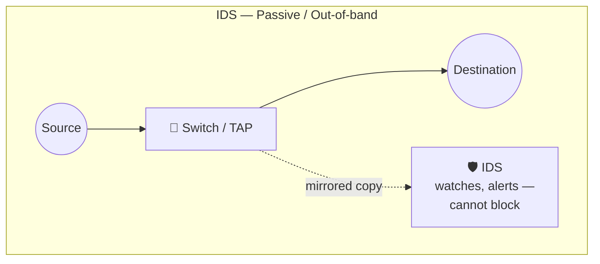
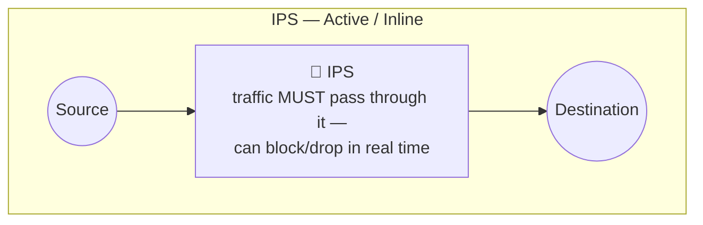
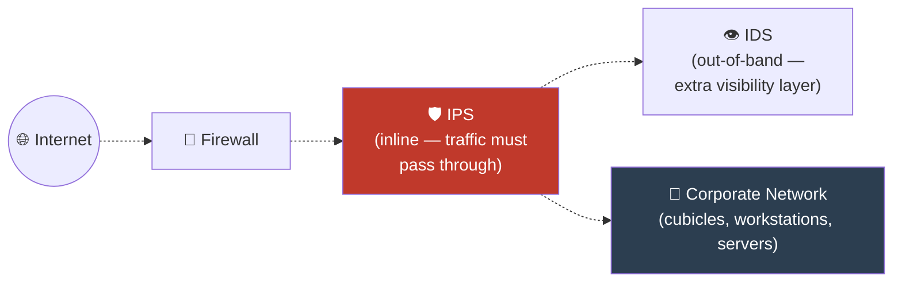

# 02 — Intrusion Prevention System (IPS)

[⬅ Back to main index](../README.md)

## Table of Contents
- [What is an IPS?](#what-is-an-ips)
- [IDS vs IPS — the key architectural difference](#ids-vs-ips--the-key-architectural-difference)
- [Where IPS sits in the network](#where-ips-sits-in-the-network)
- [What an IPS actually does](#what-an-ips-actually-does)
- [Classification of IPS](#classification-of-ips)
- [Advantages of IPS over IDS](#advantages-of-ips-over-ids)
- [Extra: Real-world IPS tools & inline setup](#extra-real-world-ips-tools--inline-setup)

---

## What is an IPS?

An **Intrusion Prevention System (IPS)** is considered an **active IDS** — it doesn't just detect intrusions, it **prevents** them. IPS are continuous monitoring systems that typically sit **behind the firewall** as an additional layer of protection.

The single most important distinction from IDS:

> **IDS is passive (out-of-band, watches a copy of traffic). IPS is inline (in-band, sits directly in the path between source and destination) and can actively block traffic in real time.**

## IDS vs IPS — the key architectural difference





| | IDS | IPS |
|---|---|---|
| Position | Out-of-band (mirror/SPAN port) | **Inline**, directly in the traffic path |
| Can block traffic? | ❌ No — only alerts | ✅ Yes — drops, resets, or blocks in real time |
| Performance impact | Minimal (not in critical path) | Adds latency (it *is* the critical path) |
| Failure mode risk | Fail-open — a crashed IDS just stops seeing traffic; traffic keeps flowing | Fail-closed risk — a crashed/misconfigured inline IPS can take the network down or block legitimate traffic |
| Best for | Visibility, forensics, tuning | Active blocking of known-bad traffic |

## Where IPS sits in the network

### Diagram — Example of an IPS placement (Fig 12.3)




Note how the IPS sits **inline, directly after the firewall**, while an IDS can additionally hang off to the side for pure visibility/logging — combining both gives you active blocking *and* passive forensic visibility.

## What an IPS actually does

An IPS actively analyzes network traffic and makes automated decisions about what enters the network. Core actions:

- **Generates alerts** if abnormal traffic is detected.
- **Continuously records real-time logs** of network activity.
- **Blocks and filters malicious traffic** — not just alerts on it.
- **Detects and eliminates threats quickly**, since it sits inline in the live traffic path.
- **Identifies threats accurately without generating false positives** (a design *goal* — false positives on an inline IPS are especially costly, since they can block legitimate business traffic).

An IPS acts based on **rules and policies** configured into it — it can identify, log, and **prevent** intrusions/attacks. It's also used to catch critical corporate-security-policy issues like insider threats and malicious network guests.

## Classification of IPS

Just like IDS, IPS comes in two flavors:

- **Host-based IPS (HIPS)** — runs as an agent on the individual host, blocking malicious activity at the OS/application level (e.g., blocking a process from writing to a protected registry key or memory region).
- **Network-based IPS (NIPS)** — a dedicated inline appliance/device that inspects and blocks traffic at the network level, for an entire segment.

## Advantages of IPS over IDS

- **Can block *and* drop illegal packets** in the network (IDS can only alert).
- Can be used to **monitor activities within a single organization** with active enforcement.
- **Prevents direct attacks** from ever reaching their target, by controlling the volume/type of traffic allowed through in the first place.

---

## Extra: Real-world IPS tools & inline setup

| Tool | Notes |
|---|---|
| **Snort (inline mode / AFPACKET or NFQ)** | Snort 3 supports inline blocking natively; Snort 2.9+ can run inline via `afpacket` or Linux `NFQUEUE`. |
| **Suricata (IPS mode)** | Native support for inline IPS via `NFQUEUE` (Linux) or `AF_PACKET` with `IPS` mode. |
| **Cisco Firepower / NGIPS** | Commercial, enterprise-grade inline IPS appliance. |
| **Palo Alto Threat Prevention** | Commercial NGFW with integrated IPS engine. |
| **pfSense + Snort/Suricata package** | Turns a pfSense firewall box into a combined firewall + inline IPS. |

### Example: Suricata in IPS mode using Linux `NFQUEUE`

This routes traffic through the kernel's `NFQUEUE`, hands it to Suricata for inspection, and lets Suricata tell the kernel to `ACCEPT` or `DROP` each packet — a textbook example of turning a passive-capable engine into a true inline IPS.

```bash
# 1. Install Suricata
sudo apt update
sudo apt install -y suricata

# 2. Redirect traffic into an NFQUEUE via iptables so Suricata can inspect it inline
sudo iptables -I FORWARD -j NFQUEUE --queue-num 0
sudo iptables -I INPUT   -j NFQUEUE --queue-num 0
sudo iptables -I OUTPUT  -j NFQUEUE --queue-num 0

# 3. Run Suricata in IPS/NFQ mode, listening on that queue
sudo suricata -c /etc/suricata/suricata.yaml -q 0

# 4. Set a rule action to "drop" (instead of "alert") in a custom rule file
#    to make Suricata actually BLOCK matching traffic instead of just logging it:
#    e.g. in /etc/suricata/rules/local.rules
#    drop tcp any any -> $HOME_NET 23 (msg:"Blocked inbound Telnet"; sid:2000001; rev:1;)
```

> ⚠️ Test this only in an isolated lab (VMs on a host-only/NAT network). Getting the `iptables`/queue rules wrong on a live interface can lock you out of the box.

### Example: Snort 3 inline mode (conceptual)

```bash
# Snort 3 example — run inline using AF_PACKET on a bridged pair of interfaces (eth0 <-> eth1)
sudo snort -c /usr/local/etc/snort/snort.lua \
  --daq afpacket \
  -i eth0:eth1 \
  -A alert_fast \
  -q
```

In this mode, Snort sits **between two interfaces** acting as a transparent bridge — every packet must pass through Snort to get from `eth0` to `eth1`, which is exactly what "inline" means architecturally.

---

[⬅ Back: Intrusion Detection System (IDS)](../01-intrusion-detection-system/README.md) · [Back to main index](../README.md) · [➡ Next: Firewalls](../03-firewalls/README.md)
