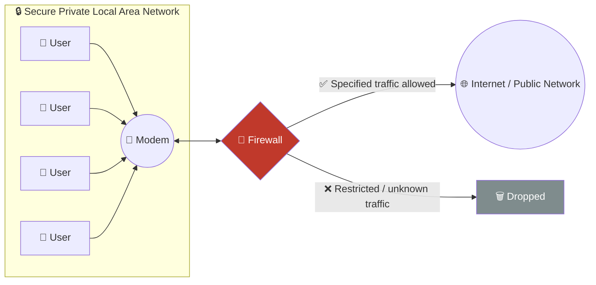
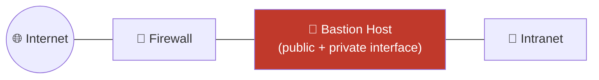
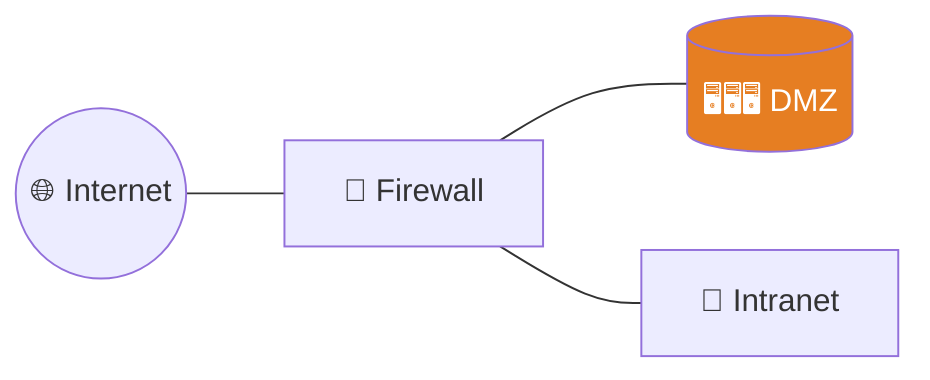
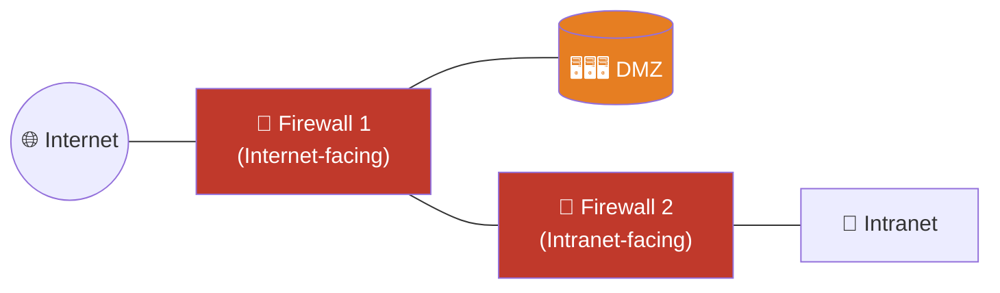
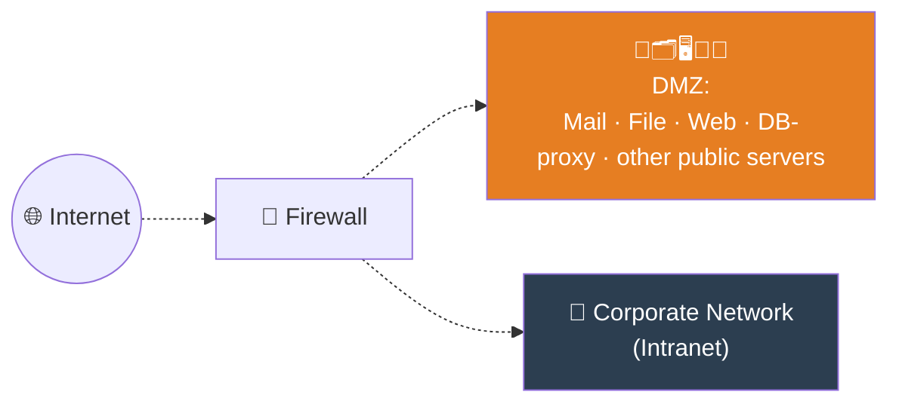
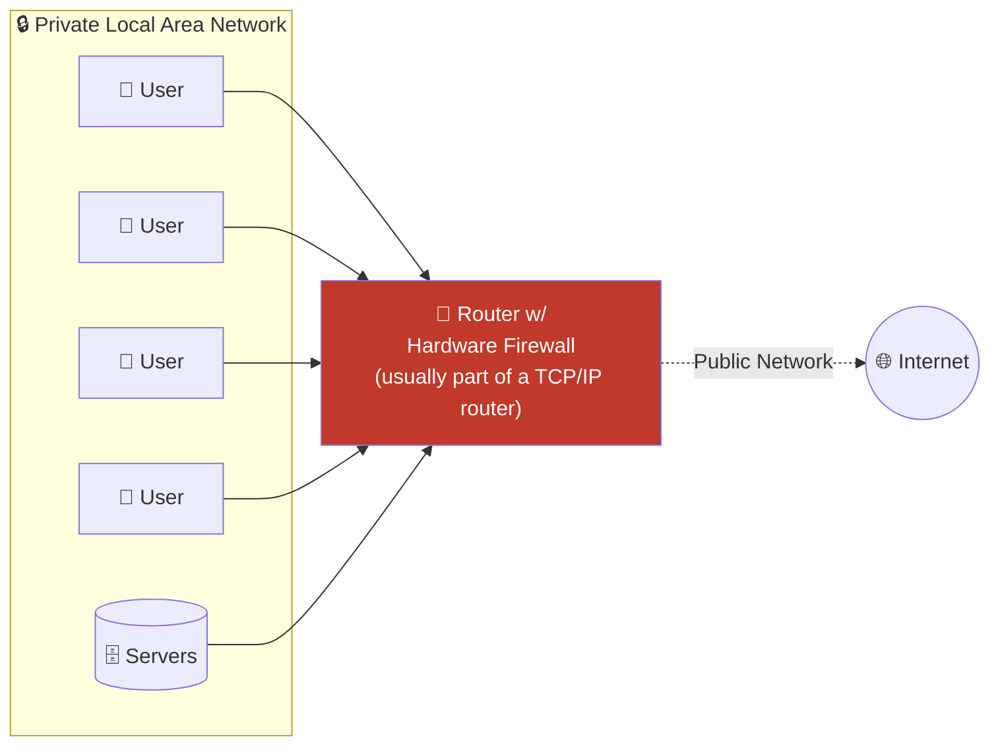
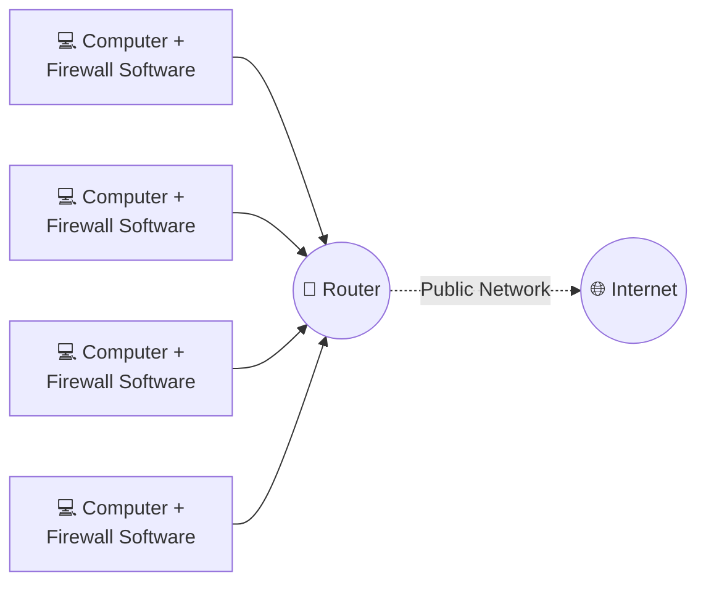
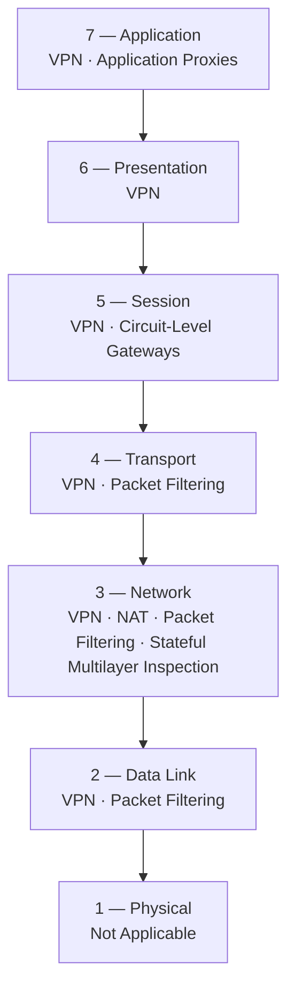
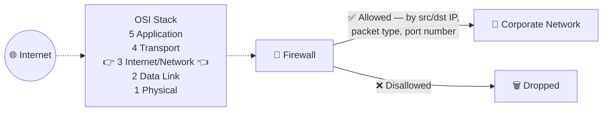
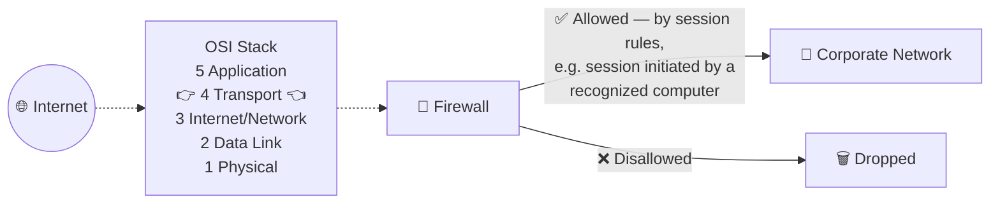

# 03 — Firewalls

[⬅ Back to main index](../README.md)

## Table of Contents
- [What is a Firewall?](#what-is-a-firewall)
- [What firewalls actually let you do](#what-firewalls-actually-let-you-do)
- [Firewall Architecture](#firewall-architecture)
  - [1. Bastion Host](#1-bastion-host)
  - [2. Screened Subnet (DMZ)](#2-screened-subnet-dmz)
  - [3. Multi-homed Firewall](#3-multi-homed-firewall)
- [Demilitarized Zone (DMZ)](#demilitarized-zone-dmz)
- [Types of Firewalls Based on Configuration](#types-of-firewalls-based-on-configuration)
  - [Network-based Firewalls](#network-based-firewalls)
  - [Host-based Firewalls](#host-based-firewalls)
- [OSI Layer ↔ Firewall Technology Mapping](#osi-layer--firewall-technology-mapping)
- [Types of Firewalls Based on Working Mechanism](#types-of-firewalls-based-on-working-mechanism)
  - [1. Packet Filtering Firewall](#1-packet-filtering-firewall)
  - [2. Circuit-Level Gateway Firewall](#2-circuit-level-gateway-firewall)
  - [3. Application-Level Firewall](#3-application-level-firewall)
  - [4. Stateful Multilayer Inspection](#4-stateful-multilayer-inspection)
  - [5. Application Proxies](#5-application-proxies)
  - [6. Network Address Translation (NAT)](#6-network-address-translation-nat)
  - [7. Virtual Private Network (VPN)](#7-virtual-private-network-vpn)
- [Extra: Practical firewall configuration](#extra-practical-firewall-configuration)

---

## What is a Firewall?

A **firewall** is a software- or hardware-based system located at the **network gateway** that protects a private network's resources from unauthorized access by users on other networks.

- Placed at the **junction/gateway between two networks** — typically a private network and a public one like the Internet.
- **Examines every message** entering or leaving the intranet and **blocks anything that doesn't meet the specified security criteria**.
- May filter based on **traffic type**, or on **source/destination address and port**.
- Works closely with the router at the network level — filters packets to decide whether to forward them toward their destination.
- **Rule of thumb:** always install a firewall *away* from the rest of the network, so incoming requests can never gain direct access to a private network resource.

### Diagram — Example of a Firewall (Fig 12.6)




## What firewalls actually let you do

- A firewall is essentially an **intrusion-defense mechanism shaped by an organization's security policy** — its rule set can be changed at any time to adapt its behavior.
- Can **restrict incoming traffic to POP/SMTP** only, so email access still works while other protocols are blocked. Some firewalls block specific email services outright to cut down on spam.
- Can act as a **checkpoint** — inbound traffic is checked at this point and a security audit performed there.
- Can act like an active **"phone tap"** — identifying an intruder's attempts to dial into modems inside a secured network (a very 1990s-flavored example, but conceptually equivalent to catching unauthorized inbound connection attempts today).
- **Firewall logs** record every attempt to access services, giving admins a full audit trail.
- Verifies inbound/outbound traffic against its rule set and effectively acts as a **router**, moving data between the two networks it separates — allowing or denying access from one side to services on the other.
- Can **embed an alarm** that triggers on unauthorized login attempts, for auditing purposes.
- Filters by:
  - **Address filtering** — recognizes source & destination addresses + port numbers.
  - **Protocol filtering** — identifies the *type* of network traffic.
  - Can also inspect the **state and attributes** of data packets (see [Stateful Multilayer Inspection](#4-stateful-multilayer-inspection)).

---

## Firewall Architecture

There are three classic firewall architecture patterns:

### 1. Bastion Host

A **bastion host** is a computer system specifically designed and hardened to defend the network against attacks — it acts as a **mediator** between the inside and outside networks.

- All traffic entering or leaving the network passes **through it**.
- It has **two interfaces**:
  - A **public interface** directly connected to the Internet.
  - A **private interface** connected to the intranet.

#### Diagram — Bastion Host Firewall (Fig 12.7)




### 2. Screened Subnet (DMZ)

A **screened subnet** — commonly just called the **DMZ** — is a protected network created by a two- or three-homed firewall sitting behind a screening firewall.

- With a **three-homed firewall**: interface #1 → Internet, interface #2 → DMZ, interface #3 → intranet.
- The DMZ **responds to public requests** and has **no hosts accessed by the private network**.
- Internet users **cannot reach the private zone** directly.

**Advantage:** public requests get answered without ever letting that traffic reach the intranet.
**Disadvantage:** with a single three-homed firewall, if *that one box* is compromised, **both** the DMZ and the intranet are exposed. The safer pattern is **multiple firewalls** — one separating the Internet from the DMZ, another separating the DMZ from the intranet (this is exactly the [Multi-homed Firewall](#3-multi-homed-firewall) pattern below).

#### Diagram — Screened Subnet Firewall (Fig 12.8)




### 3. Multi-homed Firewall

A **multi-homed firewall** is a node with **multiple NICs** connecting to two or more networks, with each interface logically and physically tied to a separate network segment.

- Increases the **efficiency and reliability** of an IP network.
- Has **more than three interfaces**, allowing further subdivision of systems based on the organization's specific security objectives.
- The architecture that gives the **deepest protection** is the **back-to-back firewall** setup — two separate firewalls, DMZ sandwiched in between, so a single compromised device never exposes the whole chain.

#### Diagram — Multi-homed Firewall (Fig 12.9)




---

## Demilitarized Zone (DMZ)

In computer networking, the **DMZ** is an area hosting a computer, or small sub-network, placed as a **neutral buffer zone** between a company's internal network and an untrusted external network (the Internet), to prevent outsider access to private data.

- Acts as a **buffer** between the secure internal network and the insecure Internet — adds a layer of security to the corporate LAN by preventing direct access to the rest of the network.
- Created using a firewall with **three or more interfaces**, each assigned a specific role: internal trusted network, DMZ network, external untrusted network (Internet).
- **Any public-facing service** (email, web, FTP) that needs to be reachable by external users belongs in the DMZ.
- **Exception:** web servers that talk to backend **database servers** should *not* live in the DMZ — doing so could hand outside users a direct path to sensitive data.
- Can be configured in many different ways depending on topology and requirements.

### Diagram — Demilitarized Zone (Fig 12.10)




---

## Types of Firewalls Based on Configuration

### Network-based Firewalls

A **dedicated firewall device** placed at the perimeter of the network — either a standalone appliance or built into a broadband router. Uses **packet filtering**: reads a packet's header for source/destination info and compares it against predefined/user-created rules to decide forward-or-drop. Protects the **entire** private LAN through a single interface/chokepoint.

**Examples:** Cisco ASA, FortiGate.

| Advantages | Disadvantages |
|---|---|
| **Security** — a dedicated OS + hardware reduces risk and increases control | **More expensive** than host-based firewalls |
| **Speed** — faster responses, handles more traffic | **Difficult to implement/configure** |
| **Minimal interference** — a separate network component, so it can be reconfigured/moved/shut down without disrupting other systems | **Consumes more space**, needs dedicated cabling |

#### Diagram — Network-based Firewall (Fig 12.11)




### Host-based Firewalls

Sits **between a regular application and the OS's networking components**, like a filter for a single machine. Best suited for individual home users and mobile users needing digital security while working **outside** the corporate network. Easy to install on a single PC, laptop, or workgroup server. Protects against outside unauthorized access, everyday Trojans, and email worms; typically includes privacy controls and web filtering.

**Examples:** Norton, McAfee, Kaspersky (personal firewall components).

| Advantages | Disadvantages |
|---|---|
| **Less expensive** than network-based firewalls | **Consumes system resources** on the host |
| **Ideal for personal/home use** | **Difficult to uninstall** in some cases |
| **Easier to configure/reconfigure** | **Not appropriate** for environments needing very fast response times |

#### Diagram — Host-based Firewall (Fig 12.12)




---

## OSI Layer ↔ Firewall Technology Mapping

Firewall technologies aren't tied to a single OSI layer — most map to *multiple* layers, and technologies are frequently **combined** (the courseware specifically notes NAT is fundamentally a routing technology, but becomes a "firewall technology" once combined with firewall functionality).

### Table 12.1 — Firewall Technologies

| OSI Layer | Firewall Technology |
|---|---|
| **Application** | Virtual Private Network (VPN) · Application Proxies |
| **Presentation** | Virtual Private Network (VPN) |
| **Session** | Virtual Private Network (VPN) · Circuit-Level Gateways |
| **Transport** | Virtual Private Network (VPN) · Packet Filtering |
| **Network** | Virtual Private Network (VPN) · Network Address Translation (NAT) · Packet Filtering · Stateful Multilayer Inspection |
| **Data Link** | Virtual Private Network (VPN) · Packet Filtering |
| **Physical** | Not Applicable |




> **Why this matters:** the higher up the stack a firewall technology operates, the more *context* it has about the traffic (e.g., an application-layer proxy can understand "this is an HTTP POST with a suspicious payload"), but the more processing overhead it incurs. The lower down the stack, the faster/cheaper the decision, but the less context available (a packet-filter only sees IP/port, not what's inside the payload).

---

## Types of Firewalls Based on Working Mechanism

### 1. Packet Filtering Firewall

Compares **each packet** against a set of criteria before forwarding it. Depending on the match, it can drop the packet silently, transmit it, or send a rejection message back to the sender.

- Works at the **Internet layer (TCP/IP)** / **Network layer (OSI)**.
- Rules typically cover: source IP, destination IP, source port, destination port, and protocol.

**Traditional decision criteria:**

| Criterion | What it checks |
|---|---|
| **Source IP address** | Is the packet coming from a valid/expected source? (from the IP header) |
| **Destination IP address** | Is it going to the correct destination, and does that destination accept this type of packet? |
| **Source TCP/UDP port** | Which port did it originate from? |
| **Destination TCP/UDP port** | Which service is it targeting — is that service allowed or denied? |
| **TCP flag bits** | Does it have SYN, ACK, or other flags set in a way consistent with a legitimate connection? |
| **Protocol in use** | Should traffic of this protocol type be allowed at all? |
| **Direction** | Is the packet entering or leaving the private network? |
| **Interface** | Is it arriving from a trusted or an untrusted zone? |

#### Diagram — Example of Packet Filtering Firewall (Fig 12.13)




### 2. Circuit-Level Gateway Firewall

Operates at the **Session layer (OSI)** / **Transport layer (TCP/IP)**. Forwards data between networks **without verifying content** — it blocks incoming packets from a host but lets pre-approved traffic pass straight through.

- Traffic that passes through appears to have **originated from the gateway itself**, since the outgoing packets carry the proxy's (gateway's) IP address, not the original client's.
- Monitors **session-creation requests** and decides whether to allow the session — by checking the **TCP three-way handshake** between endpoints, not the payload of every packet.
- Allows or blocks entire **data streams**, not individual packets.
- Relatively **inexpensive** and effectively **hides internal network details** from outsiders.

#### Diagram — Example of Circuit-Level Gateway Firewall (Fig 12.14)




### 3. Application-Level Firewall

Focuses on the **Application layer** rather than raw packets — filters at the level of actual application commands (e.g., `HTTP GET`/`POST`), not just IP/port headers.

- Also called **application-level gateways / proxies**.
- Restricts traffic to only the **services supported by the proxy**; everything else is denied outright.
- Needed because huge volumes of voice/video/collaboration traffic at the lower layers can otherwise be used to sneak past traditional firewalls for unauthorized access.
- Can prohibit specific protocols (FTP, gopher, telnet, etc.) when configured as a web proxy.
- Inspects and filters **application-specific commands** — traditional (lower-layer) firewalls can't do this.
- Can catch malicious traffic riding inside **legitimate protocols** (e.g., worms hiding malicious code inside otherwise-valid HTTP) — something a plain stateful firewall would miss, since it only inspects headers. **Deep packet inspection (DPI)** firewalls extend this further with signature-aware payload inspection.

**Features:**
- Analyzes application-level info to decide whether to permit traffic.
- Being proxy-based, can permit/deny based on the **authenticity of the user or process** involved.
- A **content-caching proxy** improves performance by caching frequently-requested content instead of re-fetching it from origin every time.

**Two operating modes:**

| Mode | Behavior |
|---|---|
| **Active** | Examines *every* incoming request — including the full message — against known vulnerabilities (SQL injection, parameter/cookie tampering, XSS). Only requests deemed genuine are allowed through. |
| **Passive** | Behaves like an IDS: checks requests against known vulnerabilities too, but does **not** actively reject/deny a request even if a potential attack is discovered — it just observes and reports. |

### 4. Stateful Multilayer Inspection

Combines the speed of packet filtering with deeper awareness of **connection state**. Rather than evaluating each packet in isolation, it keeps a **state table** of active connections (source/dest IP+port, sequence numbers, TCP flags, connection state) and only allows packets that are legitimate continuations of an already-established, permitted session.

- Operates primarily at the **Network layer**, but inspects some transport/session-level context too — hence "multilayer."
- Far more resistant to spoofed packets than plain packet filtering, since an attacker can't simply craft a packet with the "right" IP/port — it also has to fit an existing, tracked connection state.
- This is the model used by most modern firewalls, including Linux's `iptables`/`nftables` **connection tracking** (`conntrack`) system — see the hands-on example below.

### 5. Application Proxies

A proxy that sits between clients and servers at the application layer, terminating the client's connection and originating a brand-new connection to the real destination on the client's behalf.

- The internal client never talks directly to the external server (and vice versa) — the proxy is a full intermediary.
- Because it fully terminates and re-establishes each connection, it can deeply inspect, log, cache, and filter application-layer content.
- Trade-off: needs a dedicated proxy implementation **per protocol/application** (an HTTP proxy can't proxy SMTP, etc.), and adds processing overhead.

### 6. Network Address Translation (NAT)

Fundamentally a **routing** technology — but when combined with a firewall it becomes a firewall technology in its own right, because it inherently **hides internal IP addressing** from the outside world.

- Translates **private internal IP addresses** into a **public IP address** (or a small pool of them) before traffic leaves the network, and reverses the translation for return traffic.
- Because outside hosts only ever see the translated public address, internal network topology stays hidden — an attacker outside can't directly address an internal host that hasn't been explicitly exposed.
- Common flavors: **Static NAT** (1:1 mapping), **Dynamic NAT** (pool of public IPs shared dynamically), **PAT / NAT overload** (many internal hosts share one public IP, differentiated by port — what most home routers do).

### 7. Virtual Private Network (VPN)

Appears at **every layer** in Table 12.1 because a VPN is fundamentally about **encrypting and tunneling** traffic — it can be implemented at multiple points in the stack (e.g., IPsec at the network layer, TLS-based VPNs at higher layers).

- Creates an encrypted tunnel between two endpoints across an untrusted network (like the Internet), making the connection behave as if the two endpoints were on the same private network.
- When combined with firewall/gateway functionality, a VPN endpoint device also enforces **which traffic is allowed** to enter/leave the tunnel — hence its classification as a firewall technology, not just a routing/encryption tool.

---

## Extra: Practical firewall configuration

### Linux — `iptables` (packet filtering + stateful inspection)

```bash
# View current rules
sudo iptables -L -n -v --line-numbers

# Default policy: drop everything unless explicitly allowed (deny-by-default posture)
sudo iptables -P INPUT DROP
sudo iptables -P FORWARD DROP
sudo iptables -P OUTPUT ACCEPT

# Allow loopback traffic (always needed)
sudo iptables -A INPUT -i lo -j ACCEPT

# Allow established/related connections back in — this IS stateful multilayer inspection
sudo iptables -A INPUT -m state --state ESTABLISHED,RELATED -j ACCEPT

# Allow inbound SSH (port 22) only from a specific management subnet
sudo iptables -A INPUT -p tcp -s 192.168.1.0/24 --dport 22 -j ACCEPT

# Allow inbound HTTP/HTTPS to a public web server
sudo iptables -A INPUT -p tcp --dport 80  -j ACCEPT
sudo iptables -A INPUT -p tcp --dport 443 -j ACCEPT

# Block a specific malicious IP outright
sudo iptables -A INPUT -s 203.0.113.66 -j DROP

# NAT — turn this box into a router that masquerades internal LAN traffic (PAT/NAT overload)
sudo iptables -t nat -A POSTROUTING -o eth0 -j MASQUERADE

# Persist rules across reboot (Debian/Ubuntu)
sudo apt install -y iptables-persistent
sudo netfilter-persistent save
```

### Linux — `firewalld` (zone-based, common on RHEL/CentOS/Fedora)

```bash
# Check current zone & status
sudo firewall-cmd --state
sudo firewall-cmd --get-active-zones

# Permanently allow a service and reload
sudo firewall-cmd --zone=public --add-service=https --permanent
sudo firewall-cmd --zone=public --add-port=8443/tcp --permanent
sudo firewall-cmd --reload

# Rich rule: allow SSH only from one subnet
sudo firewall-cmd --permanent --zone=public \
  --add-rich-rule='rule family="ipv4" source address="192.168.1.0/24" port protocol="tcp" port="22" accept'
sudo firewall-cmd --reload

# Enable NAT / masquerading for a "router" style box
sudo firewall-cmd --zone=public --add-masquerade --permanent
sudo firewall-cmd --reload
```

### Windows — `netsh advfirewall` / PowerShell

```powershell
# Check firewall status for all profiles
netsh advfirewall show allprofiles

# Block inbound Telnet (port 23) — classic insecure protocol
netsh advfirewall firewall add rule name="Block Telnet In" dir=in action=block protocol=TCP localport=23

# Allow inbound RDP only from a specific remote subnet
netsh advfirewall firewall add rule name="Allow RDP - Mgmt Subnet" dir=in action=allow protocol=TCP localport=3389 remoteip=192.168.1.0/24

# PowerShell equivalent (more modern, scriptable)
New-NetFirewallRule -DisplayName "Allow HTTPS In" -Direction Inbound -Protocol TCP -LocalPort 443 -Action Allow
New-NetFirewallRule -DisplayName "Block Outbound SMB" -Direction Outbound -Protocol TCP -RemotePort 445 -Action Block
```

### Setting up a full firewall appliance in a lab — pfSense / OPNsense

1. Download the pfSense (or OPNsense) ISO and create a new VM with **at least 2 virtual NICs**:
   - `WAN` → bridged/NAT to your "Internet" (e.g., your host's real network or a simulated ISP VM).
   - `LAN` → an internal-only virtual switch that your "protected" client VMs connect to.
2. Boot the ISO, run the installer, and let it install to the VM's virtual disk.
3. On first boot, assign interfaces (`WAN` = the outward-facing NIC, `LAN` = the internal NIC).
4. From a client VM on the LAN segment, browse to the LAN IP (default often `192.168.1.1`) to reach the **web GUI**.
5. Run through the setup wizard: hostname, DNS, timezone, WAN configuration (DHCP/static), LAN IP/subnet, admin password.
6. Under **Firewall → Rules → LAN/WAN**, define allow/deny rules — this is a GUI-driven equivalent of the `iptables` commands above.
7. Optionally install the **Snort** or **Suricata** package (`System → Package Manager`) to turn this box into a combined **firewall + IDS/IPS** — directly mirroring the [Fig 12.3 IPS placement diagram](../02-intrusion-prevention-system/README.md#where-ips-sits-in-the-network) from the IPS module.

---

[⬅ Back: Intrusion Prevention System (IPS)](../02-intrusion-prevention-system/README.md) · [Back to main index](../README.md) · [➡ Next: Tools, Commands & Labs](../04-tools-commands-and-labs/README.md)

---

## Next-Generation Firewalls (NGFW)

Traditional firewalls inspect traffic based on port, protocol, and IP address. **Next-Generation Firewalls (NGFWs)** go further by adding application awareness, user identity tracking, and integrated threat intelligence — all in a single inline device.

Key capabilities that distinguish an NGFW from a classic firewall:

| Capability | Classic Firewall | NGFW |
|---|---|---|
| Packet filtering (IP/port/protocol) | ✅ | ✅ |
| Stateful inspection | ✅ | ✅ |
| Application identification (Layer 7) | ❌ | ✅ |
| User identity awareness | ❌ | ✅ |
| Integrated IPS | ❌ | ✅ |
| SSL/TLS deep inspection | ❌ | ✅ |
| Threat intelligence / URL filtering | ❌ | ✅ |

**Examples:** Palo Alto PA-Series, Cisco Firepower, Fortinet FortiGate, Check Point NGFW.

---

## Firewall Limitations

Even a correctly configured firewall has inherent blind spots that attackers actively exploit:

- **Cannot stop insider threats** — traffic that originates from *inside* the trusted network bypasses perimeter firewalls entirely.
- **Encrypted traffic is opaque** — without SSL/TLS inspection (which itself has privacy and performance trade-offs), a firewall cannot inspect the payload of HTTPS, SSH, or VPN traffic.
- **Application-layer attacks inside allowed ports** — a firewall that permits TCP/80 cannot, without deep packet inspection, distinguish legitimate HTTP from malicious HTTP payloads (SQL injection, XSS, etc.).
- **Cannot protect against misconfigured rules** — a rule that is too permissive is effectively no rule at all. Firewalls implement exactly what they are told.
- **IP spoofing** — packet-filtering firewalls that rely solely on source IP can be fooled by spoofed source addresses.
- **Tunneling** — attackers can tunnel blocked protocols (FTP, IRC, etc.) inside permitted ones (HTTP port 80, DNS port 53, SSH port 22).
- **Social engineering / client-side attacks** — a user clicking a malicious email attachment or link generates outbound traffic that most firewalls allow by default.

> These limitations are exactly what [Section 06 — Evasion Techniques](../06-evasion-and-bypass-techniques/) documents and explains in detail.

---

## IDS/IPS/Firewall Solutions — Real Tools

### YARA Rules

YARA is a pattern-matching language used to write rules that identify malware families or suspicious artifacts — used by IDS engines, antivirus, and threat-hunting platforms.

```yara
rule SuspiciousExecutable {
    meta:
        description = "Detects executables with suspicious PE characteristics"
        author      = "Security Team"
    strings:
        $mz    = { 4D 5A }             // MZ header — marks a Windows PE file
        $str1  = "cmd.exe" nocase
        $str2  = "powershell" nocase
    condition:
        $mz at 0 and any of ($str1, $str2)
}
```

Run a YARA scan:
```bash
# Scan a single file
yara rule.yar suspicious_file.exe

# Scan a directory recursively
yara -r rule.yar /path/to/scan/

# Compile rules first for performance on large scans
yarac rule.yar compiled_rules.bin
yara compiled_rules.bin target_dir/
```

### Snort Rules — deeper reference

Full rule anatomy (expanding on the [IDS module](../01-intrusion-detection-system/README.md#extra-snort-quick-start-lab)):

```
alert tcp $EXTERNAL_NET any -> $HOME_NET 445 (
    msg:"ET EXPLOIT MS17-010 EternalBlue SMB RCE Attempt";
    flow:to_server,established;
    content:"|FF|SMB|73|";
    content:"|00 00 00 00 00 00 00 00|"; distance:0;
    reference:cve,2017-0144;
    classtype:attempted-admin;
    sid:2024217;
    rev:5;
)
```

| Rule option | Meaning |
|---|---|
| `flow:to_server,established` | Only match packets going TO the server on an established TCP session |
| `content:"\|FF\|SMB\|73\|"` | Match these exact hex bytes in the payload |
| `distance:0` | The next content match must start immediately after the previous one |
| `reference:cve,2017-0144` | Links the rule to the CVE entry for EternalBlue |
| `classtype:attempted-admin` | Priority classification — attempted admin-level access |
| `sid` | Snort rule ID (must be unique) |
| `rev` | Revision number |

Useful Snort operational commands:
```bash
# List all loaded rules and their count
sudo snort -c /etc/snort/snort.conf --list-rules 2>&1 | tail -5

# Run in daemon mode, log to unified2 format (for SIEM ingestion)
sudo snort -i eth0 -c /etc/snort/snort.conf -A unified2 -D

# Read a pcap and alert on it offline (great for testing rules without live traffic)
sudo snort -c /etc/snort/snort.conf -r capture.pcap -A console -q
```

[⬅ Back: Intrusion Prevention System](../02-intrusion-prevention-system/README.md) · [Back to main index](../README.md) · [➡ Next: Tools & Labs](../04-tools-commands-and-labs/README.md)
