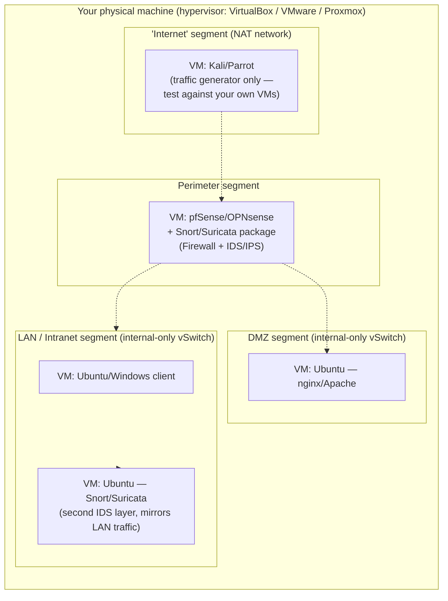

# 04 — Tools, Commands & Hands-On Labs

[⬅ Back to main index](../README.md)

> This folder is **not** from the original slides — it's the practical companion to everything explained in `01`, `02`, and `03`: real tools, real commands, and a suggested lab topology so you can actually *see* IDS/IPS/firewall concepts in action instead of just reading about them.

## Table of Contents
- [Suggested lab topology](#suggested-lab-topology)
- [Traffic capture & analysis — Wireshark / tcpdump](#traffic-capture--analysis--wireshark--tcpdump)
- [NIDS/NIPS — Snort](#nidsnips--snort)
- [NIDS/NIPS — Suricata](#nidsnips--suricata)
- [Network analysis framework — Zeek](#network-analysis-framework--zeek)
- [HIDS — OSSEC / Wazuh](#hids--ossec--wazuh)
- [All-in-one — Security Onion](#all-in-one--security-onion)
- [Firewalls — quick command reference](#firewalls--quick-command-reference)
- [Validating your defenses — safe testing tools](#validating-your-defenses--safe-testing-tools)
- [Suggested learning exercises](#suggested-learning-exercises)

---

## Suggested lab topology

A minimal setup that lets you reproduce every diagram in this repo using free tools:



This single topology maps directly onto: [Fig 12.1 (IDS placement)](../01-intrusion-detection-system/README.md#where-ids-resides-in-the-network), [Fig 12.3 (IPS placement)](../02-intrusion-prevention-system/README.md#where-ips-sits-in-the-network), and [Fig 12.10 (DMZ)](../03-firewalls/README.md#demilitarized-zone-dmz).

> ⚠️ **Always keep this lab isolated** (NAT/host-only virtual networks) and only test tools against machines you own. Never point scanning/exploitation tools at systems or networks you don't have explicit written authorization to test.

---

## Traffic capture & analysis — Wireshark / tcpdump

```bash
# tcpdump — capture on an interface, write to a pcap file
sudo tcpdump -i eth0 -w capture.pcap

# Capture only traffic to/from a specific host
sudo tcpdump -i eth0 host 192.168.1.50 -w host_capture.pcap

# Capture only a specific port (e.g., HTTP)
sudo tcpdump -i eth0 port 80 -w http_capture.pcap

# Read back a capture with human-readable output
tcpdump -r capture.pcap -nn
```

- **Wireshark** = the GUI equivalent, ideal for visually walking through the TCP handshake, or verifying whether a circuit-level gateway ([see Firewalls §2](../03-firewalls/README.md#2-circuit-level-gateway-firewall)) is correctly validating the three-way handshake before permitting a session.
- Use `File → Open` on any `.pcap` captured above, or capture live with `Capture → Start`.

---

## NIDS/NIPS — Snort

```bash
# Install
sudo apt update && sudo apt install -y snort

# Sniffer mode — just print packets
sudo snort -i eth0 -v

# Packet logger mode
sudo mkdir -p /var/log/snort
sudo snort -i eth0 -l /var/log/snort -K ascii

# Full NIDS mode with rules engine
sudo snort -i eth0 -c /etc/snort/snort.conf -A console

# Test a config file for syntax errors before deploying
sudo snort -T -c /etc/snort/snort.conf
```

Custom rule (`/etc/snort/rules/local.rules`):
```
alert tcp any any -> $HOME_NET 3389 (msg:"Inbound RDP attempt"; sid:1000010; rev:1;)
```

More detail + rule anatomy: [`01-intrusion-detection-system/README.md#extra-snort-quick-start-lab`](../01-intrusion-detection-system/README.md#extra-snort-quick-start-lab)

---

## NIDS/NIPS — Suricata

```bash
# Install
sudo apt update && sudo apt install -y suricata

# Run against a live interface, IDS mode (alert only)
sudo suricata -c /etc/suricata/suricata.yaml -i eth0

# Run against a saved pcap file for offline analysis
sudo suricata -c /etc/suricata/suricata.yaml -r capture.pcap -l /var/log/suricata/

# Update rule sets (via suricata-update)
sudo suricata-update
sudo suricata-update list-sources

# Check alerts
tail -f /var/log/suricata/fast.log
```

Inline **IPS mode** setup (blocking, not just alerting) is covered in [`02-intrusion-prevention-system/README.md`](../02-intrusion-prevention-system/README.md#example-suricata-in-ips-mode-using-linux-nfqueue).

---

## Network analysis framework — Zeek

Zeek doesn't do classic signature matching by default — it's better suited to the **anomaly / protocol-analysis** detection method described in [`01-intrusion-detection-system`](../01-intrusion-detection-system/README.md#3-protocol-anomaly-detection).

```bash
# Install (Ubuntu/Debian via Zeek's official repo — see docs.zeek.org for current repo setup)
sudo apt update && sudo apt install -y zeek

# Run live on an interface
sudo zeek -i eth0

# Analyze an existing pcap
zeek -r capture.pcap

# Inspect generated logs (conn.log, dns.log, http.log, etc.)
cat conn.log | zeek-cut id.orig_h id.resp_h id.resp_p proto service
```

---

## HIDS — OSSEC / Wazuh

Wazuh is the actively-maintained fork of OSSEC and is the more common choice today — used to demonstrate everything in the [HIDS section](../01-intrusion-detection-system/README.md#host-based-intrusion-detection-systems-hids).

```bash
# Quick-start install (single-node, via the official install script — always verify the
# script URL against Wazuh's current official documentation before running)
curl -sO https://packages.wazuh.com/4.x/wazuh-install.sh
sudo bash ./wazuh-install.sh -a

# On an agent (monitored host), install and register the agent
sudo apt install -y wazuh-agent
sudo systemctl enable wazuh-agent
sudo systemctl start wazuh-agent

# View file-integrity-monitoring config
sudo nano /var/ossec/etc/ossec.conf
```

Key HIDS capabilities to look for once running: **file integrity monitoring (FIM)**, **log analysis**, **rootkit detection**, and **active response** — directly matching the "auditing events on a specific host" description from the module text.

---

## All-in-one — Security Onion

A free Linux distro bundling **Suricata + Zeek + Wazuh + an Elastic-based SIEM** into one deployable image — the fastest way to stand up a NIDS + HIDS + log-analysis stack that mirrors an enterprise SOC setup.

```bash
# High level workflow (see securityonion.net docs for the current ISO + install guide):
# 1. Download the Security Onion ISO
# 2. Boot it in a VM with a "monitor" NIC (promiscuous mode, connected to a SPAN/mirror port
#    or a virtual switch that mirrors your lab's inter-VM traffic)
# 3. Run `sudo sosetup` and choose an install type:
#      - Standalone  (single VM, all components — best for a lab)
#      - Import      (analyze existing pcaps only)
# 4. Once installed, access the web console (Kibana-based) to view Suricata/Zeek alerts
```

---

## Firewalls — quick command reference

Full explanations and more examples: [`03-firewalls/README.md#extra-practical-firewall-configuration`](../03-firewalls/README.md#extra-practical-firewall-configuration)

| Platform | List rules | Allow example | Block example |
|---|---|---|---|
| Linux `iptables` | `iptables -L -n -v` | `iptables -A INPUT -p tcp --dport 443 -j ACCEPT` | `iptables -A INPUT -s <ip> -j DROP` |
| Linux `firewalld` | `firewall-cmd --list-all` | `firewall-cmd --add-service=https --permanent` | `firewall-cmd --add-rich-rule='rule family="ipv4" source address="<ip>" reject' --permanent` |
| Windows | `netsh advfirewall show allprofiles` | `netsh advfirewall firewall add rule name="Allow443" dir=in action=allow protocol=TCP localport=443` | `netsh advfirewall firewall add rule name="BlockTelnet" dir=in action=block protocol=TCP localport=23` |
| macOS (`pf`) | `sudo pfctl -s rules` | add rule to `/etc/pf.conf`: `pass in proto tcp to any port 443` | `block in proto tcp to any port 23` |

---

## Validating your defenses — safe testing tools

These are standard **blue-team validation tools** — used to confirm your own IDS/IPS/firewall actually reacts the way you expect, on infrastructure you own.

```bash
# nmap — port scan your own lab firewall/IDS to confirm expected ports are open/closed,
# and that a scan actually triggers your IDS's port-scan detection rule
nmap -sS -p 1-1000 192.168.1.1

# nmap service/version detection
nmap -sV 192.168.1.1

# hping3 — craft custom TCP/ICMP packets to test specific firewall rules
sudo hping3 -S -p 23 192.168.1.1        # SYN packet to port 23 — should be blocked/logged
sudo hping3 --icmp 192.168.1.1           # ICMP ping — tests your ICMP rule (see Snort example)

# curl — confirm an application-layer/proxy firewall correctly allows/blocks specific requests
curl -v http://192.168.1.10/admin
```

> These same tools are, of course, also used offensively — the difference is entirely about **authorization and scope**. Only ever run these against systems and networks you own or have explicit written permission to test.

---

## Suggested learning exercises

1. **Reproduce Fig 12.2** — stand up Snort with the default rule set, generate a `ping` from another VM, and watch the `Signature File Comparison → Action Rule → Alarm/Log` pipeline fire in the console output.
2. **Reproduce Fig 12.6** — configure `iptables` with a default-drop policy, then add one `ACCEPT` rule at a time, testing with `curl`/`ping` after each change to see traffic go from ❌ to ✅.
3. **Reproduce the NIDS vs HIDS distinction** — run Suricata on your "perimeter" VM (NIDS) *and* Wazuh agent on a LAN client (HIDS) simultaneously; delete/modify a file on the client and confirm only the HIDS (not the NIDS) reports it.
4. **Reproduce Fig 12.3 (inline IPS)** — set the same Suricata rule to `alert` vs `drop` and confirm that only `drop` actually stops the traffic from reaching its destination.
5. **Generate a false positive on purpose** — write an overly broad Snort rule (e.g., alert on *any* TCP traffic) and observe how quickly the console gets flooded — a hands-on illustration of the [False Positive alert-fatigue problem](../01-intrusion-detection-system/README.md#types-of-ids-alerts).

---

[⬅ Back: Firewalls](../03-firewalls/README.md) · [Back to main index](../README.md) · [➡ Next: Honeypots (stub)](../05-honeypots/README.md)
