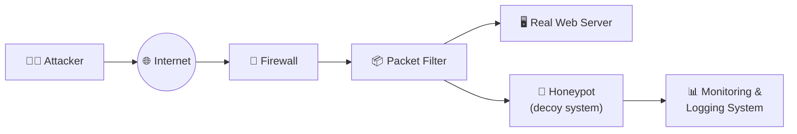

# 05 — Honeypots

[⬅ Back to main index](../README.md)

## Table of Contents
- [What is a Honeypot?](#what-is-a-honeypot)
- [Types of Honeypots — by Design / Interaction Level](#types-of-honeypots--by-design--interaction-level)
- [Types of Honeypots — by Deployment Strategy](#types-of-honeypots--by-deployment-strategy)
- [Types of Honeypots — by Deception Technology](#types-of-honeypots--by-deception-technology)
- [Honeypot Tools](#honeypot-tools)
- [Detecting Honeypots](#detecting-honeypots)
- [Detecting and Defeating Specific Honeypot Types](#detecting-and-defeating-specific-honeypot-types)
- [Honeypot Detection Tools](#honeypot-detection-tools)
- [Extra: Setting up a Honeypot Lab](#extra-setting-up-a-honeypot-lab)

---

## What is a Honeypot?

A **honeypot** is a computer system on the Internet intentionally designed to attract and trap attackers who attempt unauthorized access to an organization's network. Think of it as a decoy — it looks like a real, valuable target but is actually a closely monitored trap.



**Key properties:**
- Has **no authorized activity** and **no production value** — any traffic touching it is almost certainly malicious (probe, scan, or attack).
- **Logs all activity** — every connection, keystroke, and payload is recorded for analysis.
- **Cannot be fully compromised** in the dangerous sense — it's isolated from production systems.
- Provides **early warning** of attacks before they reach real systems.
- **Highly flexible** — can be deployed for prevention, detection, intelligence gathering, or research.
- Requires **significant ongoing effort** to maintain properly.

---

## Types of Honeypots — by Design / Interaction Level

### Low-Interaction Honeypots

Emulate only a **limited number of services** and applications. If an attacker does something the emulation doesn't expect, it simply returns an error. Capture limited (mainly transactional) data — great for catching automated worms and port scanners, but not sophisticated human attackers.

**Cannot be fully compromised.** Primarily used to capture data on network probes and automated worm activity.

| Tool | Description |
|---|---|
| **KFSensor** | Windows-based low-interaction honeypot. Emulates vulnerable services and Trojans. Monitors all TCP, UDP, and ICMP ports. Raises alerts for port scanning and DoS attempts. |
| **tiny-ssh-honeypot** | Minimal SSH honeypot — logs connection attempts and credentials without providing real shell access. |
| **Honeytrap** | Runs as a daemon, dynamically starts server processes on requested ports. Logs attack strings (concatenated payload data) to a database. Supports FTP/TFTP protocols and logs HTTP_URIs. |

### Medium-Interaction Honeypots

Simulate a **real OS, applications, and services** more convincingly than low-interaction honeypots — giving attackers more to interact with, and capturing richer data as a result. Can only respond to pre-configured commands. Risk of intrusion is higher. Attacker may eventually notice the behavior is abnormal.

| Tool | Description |
|---|---|
| **Cowrie** | Medium-to-high interaction SSH and Telnet honeypot. In medium mode (shell): emulates a UNIX system using Python. In high-interaction mode (proxy): acts as an SSH/Telnet proxy forwarding to a real honeypot system, recording all attacker activity. Great for studying brute-force campaigns and post-login behavior. |
| **Honeygrove** | Multi-service medium-interaction honeypot. |
| **Kippo** | Predecessor to Cowrie — SSH honeypot for recording brute-force and shell interactions. |

### High-Interaction Honeypots

**Do not emulate anything** — they run actual vulnerable software on real OS instances. Can be **fully compromised** by an attacker — giving complete access in a controlled, monitored environment. Capture the full picture: attack techniques, tools, TTPs, intent.

**Risk:** a compromised high-interaction honeypot could become a launchpad for attacks on other systems if containment fails. Requires a **honeywall** or similar containment mechanism.

**Prime example: Honeynets**
- Not a product — an **architecture**: an entire monitored network of real computers running real software.
- Attackers find, attack, and break into systems through their own initiative — unaware they're in a honeynet.
- All activity (including encrypted SSH sessions, file uploads, email) is captured via kernel modules.
- A **honeywall gateway** allows inbound traffic freely but controls/limits outbound using IPS technology — the attacker can interact freely with the honeypot systems but cannot use them to attack other networks.

### Pure Honeypots

Emulate the **real production network** of an organization — the highest-fidelity decoy. Forces attackers to spend time and resources attacking what they think are critical production systems, triggering alerts and giving defenders maximum warning time.

---

## Types of Honeypots — by Deployment Strategy

### Production Honeypots
- Deployed **inside** the production network alongside real servers.
- Catch both external and **internal** threats/attackers.
- Fall under the low-interaction category — limited data capture.
- Used extensively by large organizations and corporations.

### Research Honeypots
- High-interaction honeypots deployed by **research institutes, governments, or military**.
- Goal: deep intelligence about attacker TTPs — how attacks are performed, which vulnerabilities are exploited, what tools are used.
- **Do not directly improve the security** of the deploying organization's production infrastructure.
- Feed threat intelligence back to the security community.

---

## Types of Honeypots — by Deception Technology

| Type | Purpose | How it works |
|---|---|---|
| **Malware Honeypots** | Trap malware campaigns | Simulated with known vulnerabilities (outdated APIs, SMBv1) to attract and capture malware samples for signature extraction |
| **Database Honeypots** | Detect SQL injection / DB enumeration | Fake databases appearing to contain sensitive data (credit cards, employee records) — all fake, all monitored |
| **Spam Honeypots** | Catch spammers abusing open relays | Mail servers that deliberately accept email from any source — capture spammer infrastructure details |
| **Email Honeypots (Email Traps)** | Attract malicious email senders | Fake email addresses seeded across the internet/dark web — any email arriving is almost certainly malicious |
| **Spider Honeypots (Spider Traps)** | Catch malicious web crawlers | Fake websites luring web crawlers/spiders; threat actors attempting web crawling are identified and blacklisted |
| **Honeynets** | Full-spectrum attacker intelligence | Networks of honeypots in isolated virtual environments — records complete attack TTPs across an entire simulated network |

---

## Honeypot Tools

### HoneyBOT
A medium-interaction honeypot for Windows. Creates a safe environment to capture and interact with unsolicited network traffic. Easy to use — ideal for network security research or as an early-warning IDS component.

### Additional Honeypot Tools

| Tool | URL | Notes |
|---|---|---|
| **Blumira Honeypot** | https://www.blumira.com | Cloud-integrated honeypot with SIEM integration |
| **NeroSwarm Honeypot** | https://neroswarm.com | Distributed honeypot network |
| **Valhala Honeypot** | https://sourceforge.net | Lightweight Windows honeypot |
| **Cowrie** | https://github.com/cowrie/cowrie | SSH/Telnet medium-to-high interaction |
| **StingBox** | https://www.stingbox.com | Hardware honeypot device |
| **Honeyd** | https://github.com/provos/honeyd | Creates thousands of virtual honeypots; simulates entire networks |
| **T-Pot** | https://github.com/telekom-security/tpotce | All-in-one honeypot platform running multiple honeypot daemons + ELK visualization |

**Setting up Cowrie (quick lab):**
```bash
# Install dependencies
sudo apt update && sudo apt install -y python3-virtualenv libssl-dev libffi-dev build-essential python3-dev

# Create cowrie user
sudo adduser --disabled-password cowrie
sudo su - cowrie

# Clone and setup
git clone https://github.com/cowrie/cowrie
cd cowrie
virtualenv cowrie-env
source cowrie-env/bin/activate
pip install -r requirements.txt
cp etc/cowrie.cfg.dist etc/cowrie.cfg

# Edit cowrie.cfg: set listen_port (default 2222) and hostname

# Redirect real SSH to another port and let cowrie listen on 22
sudo iptables -t nat -A PREROUTING -p tcp --dport 22 -j REDIRECT --to-port 2222

# Start cowrie
bin/cowrie start

# Watch live logs
tail -f var/log/cowrie/cowrie.log
```

---

## Detecting Honeypots

As an attacker, identifying a honeypot before interacting deeply with it avoids leaving forensic evidence and getting traced. Here are the detection methods covered in the courseware:

### 1. Fingerprinting the Running Service

Honeypots often emulate services imperfectly — claiming to be one version but behaving like another, or missing expected features.

```bash
# Nmap service/version fingerprinting
nmap -sV -p 80 <target_ip>
nmap -sV -p 22,80,443,3389 <target_ip>

# Aggressive fingerprinting (OS detection + version + script scanning)
nmap -A <target_ip>

# Compare claimed version against expected behavior:
# A service claiming to be "Apache 2.4.51" but missing expected HTTP headers
# or responding incorrectly to specific requests → likely honeypot emulation
```

**Indicators:** claimed service version doesn't match actual behavioral characteristics; expected features (e.g., specific HTTP methods, SSL handshake details) are absent or wrong.

### 2. Analyzing Response Time

Honeypots add processing overhead (logging everything, running emulation layers, sending alerts) — this shows up as higher-than-normal latency.

```bash
# Measure round-trip times for HTTP service
nmap -p 80 --scan-delay 1s --max-retries 5 <target_ip>

# Continuous ping to measure latency variance
ping -c 100 <target_ip>

# Traceroute with timing info
traceroute -q 5 <target_ip>
```

**Indicators:** consistently high response times; high variance in response times (honeypot processing load varies based on what it's logging); latency much higher than network geography would suggest.

### 3. Analyzing MAC Address

Each network interface has a MAC address with an OUI (Organizationally Unique Identifier) prefix identifying the manufacturer. Honeypots running in VMs have MAC addresses from virtualization vendors.

```bash
# Enumerate MAC addresses on local network
arp-scan --interface=eth0 --localnet
arp -a

# Look up OUI prefixes:
# 00:50:56 = VMware
# 08:00:27 = VirtualBox
# 00:15:5D = Hyper-V
# These OUIs on a "server" strongly suggest a virtual/honeypot environment
```

**Indicators:** MAC address OUI doesn't match any known physical NIC manufacturer; VMware/VirtualBox/Hyper-V OUIs on what's supposed to be a production server.

### 4. Enumerating Unexpected Open Ports

Honeypots often have many open ports (to emulate multiple services) or ports that don't make sense for the claimed server role.

```bash
# Scan ALL 65,535 ports
nmap -p- <target_ip>

# Fast scan + service detection on all ports
nmap -p- -sV --min-rate 5000 <target_ip>
```

**Indicators:** a "web server" with ports 22, 21, 23, 3389, and 8080 all open simultaneously; high-numbered ports open with no clear purpose; ports open that would never be on a production machine.

### 5. Analyzing System Configuration and Metadata

Examine system banners, HTTP headers, SSH welcome messages, and metadata for inconsistencies — honeypots often use default configurations and generic banners.

```bash
# Grab SSH banner
nc -v <target_ip> 22

# Grab HTTP headers (reveals server software, version, custom headers)
curl -I http://<target_ip>
curl -I https://<target_ip>

# Check for default/generic error pages
curl http://<target_ip>/nonexistent_page_12345

# SSL certificate details (self-signed or generic cert = suspicious)
openssl s_client -connect <target_ip>:443 </dev/null 2>/dev/null | openssl x509 -noout -text
```

**Indicators:** default Apache/nginx "welcome" pages; generic SSL certificates (e.g., "CommonName: localhost" or "CommonName: honeypot"); inconsistent OS version in banner vs actual TCP/IP stack behavior.

---

## Detecting and Defeating Specific Honeypot Types

### Layer 7 Tar Pits (SMTP)
Respond very slowly to incoming SMTP commands — designed to waste spammers' time.
**Detection:** measure the latency of SMTP command responses — tar pits deliberately slow down each response by several seconds.

### Layer 4 Tar Pits (TCP)
Manipulate the TCP/IP stack to slow worm spreading. Accept TCP connections but immediately advertise a **zero window size** — preventing any data from being sent.
**Detection:** analyze the TCP window size in captured packets:
```bash
tcpdump -i eth0 'tcp[14:2] = 0'  # capture packets with window size = 0
# A connection that keeps ACKing but never opens its window = Layer 4 tar pit
```

### Layer 2 Tar Pits (ARP)
Used to block network penetration from within the same subnet. Respond to ARP requests with the unique MAC address `0:0:f:ff:ff:ff` — a "black hole" address.
**Detection:** inspect ARP responses for this specific MAC address:
```bash
arp-scan --interface=eth0 --localnet
# Any response from MAC 00:00:0f:ff:ff:ff = Layer 2 tar pit
```

### VMware-Based Honeypots
**Detection:** examine MAC address OUI prefix:
```bash
arp -a  # look for 00:50:56 (VMware), 08:00:27 (VirtualBox), 00:15:5D (Hyper-V)
```
IEEE maintains the current range of OUIs assigned to VMware Inc. — any server with one of these MAC prefixes is running in a VM and is potentially a honeypot.

### Honeyd Honeypot
Honeyd responds to remote SMTP `HELO` commands with fake responses that differ subtly from real SMTP servers.
**Detection via TCP fingerprinting:**
```
Normal machine SYN/ACK response:    immediate, standard TCP timing
Honeyd SYN/ACK response:            slightly delayed (SYN proxy behavior)

Test: send a manual SYN, measure time to SYN/ACK, look for consistent delay
```
```bash
hping3 -S -p 25 -c 10 <target_ip>  # send 10 SYN packets to SMTP port, examine RTT
```

### User-Mode Linux (UML) Honeypots
UML is an open-source tool for running virtual Linux instances, frequently used to deploy honeypots.
**Detection:** examine specific proc filesystem files that contain UML-specific strings:
```bash
# Connect to the system and check:
cat /proc/mounts    # UML will show "hostfs" or "ubd" entries
cat /proc/interrupts  # UML-specific interrupt names
cat /proc/cmdline   # UML boot parameters often visible here
```

### Snort_inline Honeypots
Snort_inline is a modified Snort that can rewrite packets (used in Gen-II honeynets to block attacker bouncing while keeping the attacker in the honeypot).
**Detection:** capture outgoing packets and compare them against what you sent — if any packets appear modified or dropped asymmetrically:
```bash
# Set up a second host to capture traffic from the honeypot's perspective
tcpdump -i eth0 -w capture.pcap host <honeypot_ip>
# Compare sent vs received packets — differences indicate Snort_inline modification
```

### Fake Access Points (Fake AP)
Fake APs create many 802.11b beacon frames with randomly generated ESSID/BSSID values. They send beacon frames only — no actual traffic.
**Detection:** monitor WiFi traffic and look for APs that send beacon frames but never produce any data/probe/association frames:
```bash
airodump-ng wlan0mon  # list all APs and their traffic
# Any AP with 0 data frames and 0 clients = likely fake AP
```

### Bait-and-Switch Honeypots
These redirect malicious traffic to a honeypot after detecting an intrusion attempt — the attacker's connection is transparently moved to the decoy.
**Detection:** analyze specific TCP/IP parameters for inconsistencies that reveal a behind-the-scenes redirect:
```bash
# Measure RTT before and after the "redirect" moment
# Check TTL values — a redirect adds hops, increasing latency and changing TTL
ping -c 20 <target_ip> | grep ttl
traceroute <target_ip>
# Also check TCP timestamp values for jumps/discontinuities
```

---

## Honeypot Detection Tools

### Send-Safe Honeypot Hunter
Specifically designed to check proxy lists for honeypot proxies. Tests HTTPS, SOCKS4, and SOCKS5 proxies and identifies which are honeypots masquerading as open proxies.

**Features:**
- Checks HTTPS, SOCKS4, and SOCKS5 proxies on any port
- Checks multiple local or remote proxy lists simultaneously
- Can upload results to FTP ("Valid proxies" and "All except honeypots" files)
- Processes proxy lists automatically at specified intervals
- Can also be used for general proxy list validation

---

## Extra: Setting up a Honeypot Lab

A simple honeypot deployment using T-Pot (the most feature-complete free option):

```bash
# Requirements: VM with 2 NICs (one external-facing, one management)
# Minimum: 4 vCPUs, 8GB RAM, 128GB disk

# 1. Download Debian ISO and install T-Pot
# https://github.com/telekom-security/tpotce

# 2. During T-Pot install, choose edition:
#    - HIVE (full stack, includes all honeypots + ELK visualization)
#    - STANDARD (most common honeypots)
#    - NEXTGEN (includes AI-based honeypot)

# 3. After install, access the web UI at:
#    https://<management_ip>:64297   (Kibana/T-Pot dashboard)
#    https://<management_ip>:64294   (Cyberchef)
#    https://<management_ip>:64295   (Elasticvue)

# 4. Expose the external NIC to the internet (or your test network)
# T-Pot runs ~30 honeypot daemons covering SSH, Telnet, HTTP, FTP,
# SMTP, RDP, VNC, ICS/SCADA protocols, and more

# 5. Watch attacks in real time on the Kibana dashboard:
#    - World map of attack origins
#    - Top attacked ports and protocols
#    - CVE references for exploit attempts
#    - Full captured credential lists from brute-force attempts
```

---

[⬅ Back: Tools & Labs](../04-tools-commands-and-labs/README.md) · [Back to main index](../README.md) · [➡ Next: Evasion Techniques](../06-evasion-and-bypass-techniques/README.md)
